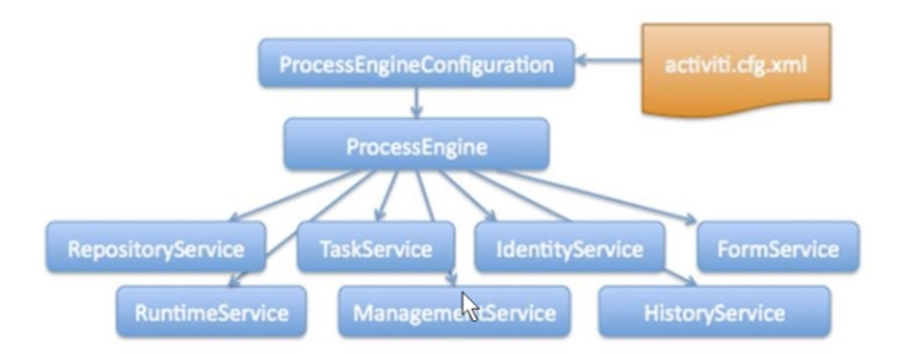
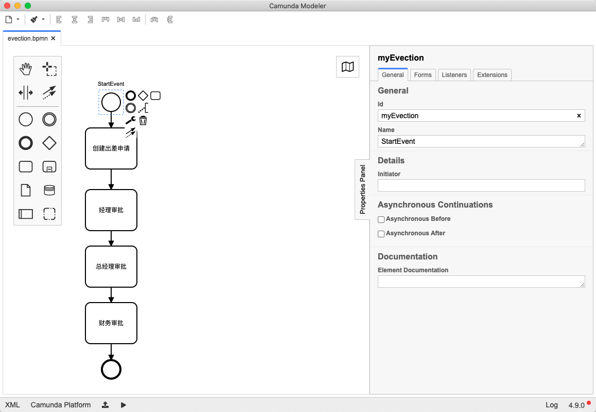

## 一、工作流的使用步骤

### 1、部署和使用Activiti

Activiti工作流引擎，业务系统访问activiti的接口，就可以方便的操作流程相关数据，这样就可以把工作流环境与业务环境集成在一起。

1. **流程定义：**使用activiti流程建模工具（Activiti-designer）定义业务流程(.bpmn文件)；可以通过XML解释此文件
2. **流程定义部署：**使用activiti提供的API把流程定义内容存储起来，在Activiti执行过程中可以查询定义的内容，Activity执行把流程定义内容存储在数据库中
3.  **启动一个流程实例：**流程实例也叫：processInstance；启动1个流程实例表示开始一次业务流程运行。在员工请假流程定义部署完成后，如果张三要请假就可以启动1个流程实例，；是李四请假，也启动一个流程实例。
4. **用户办理任务：**用户查询待办任务后，就可以办理某个任务
5. **流程结束：**当任务办理完成没有下个任务结点了，这个流程实现就完成。 

### 2、Activiti的环境

```xml
<!-- https://mvnrepository.com/artifact/org.activiti.dependencies/activiti-dependencies -->
<dependency>
    <groupId>org.activiti.dependencies</groupId>
    <artifactId>activiti-dependencies</artifactId>
    <version>7.0.0.Beta5</version>
    <type>pom</type>
</dependency>
```

- activiti运行需要数据库支持，支持的数据库有：h2,mysql,oracle,postgres,mssql,db2

我本地使用的是mysql，这里我创建一个叫：`activiti_demo` 的数据库

### 3、创建activiti_demo工程

使用idea创建`activiti_demo`工程，在工程中引入上述依赖。因为activiti需要用到数据库操作，所以还需要mysql和mybatis的包，另外还要包含一些日志操作的包如log4j和连接池等，配置如下:

```xml
 <dependencies>

        <!-- activiti核心包 -->
        <dependency>
            <groupId>org.activiti</groupId>
            <artifactId>activiti-engine</artifactId>
            <version>${activiti.version}</version>
        </dependency>

        <!-- activiti和spring和包，其实包含spring的核心依赖；相当于引入spring -->
        <dependency>
            <groupId>org.activiti</groupId>
            <artifactId>activiti-spring</artifactId>
            <version>${activiti.version}</version>
        </dependency>

        <!-- activiti 模型处理包 -->
        <dependency>
            <groupId>org.activiti</groupId>
            <artifactId>activiti-bpmn-model</artifactId>
            <version>${activiti.version}</version>
        </dependency>

        <!-- activiti 模型转换 -->
        <dependency>
            <groupId>org.activiti</groupId>
            <artifactId>activiti-bpmn-converter</artifactId>
            <version>${activiti.version}</version>
        </dependency>

        <!-- activiti bpmn 的 json 数据转换 -->
        <dependency>
            <groupId>org.activiti</groupId>
            <artifactId>activiti-json-converter</artifactId>
            <version>${activiti.version}</version>
        </dependency>

        <!-- activiti bpmn的布局 -->
        <dependency>
            <groupId>org.activiti</groupId>
            <artifactId>activiti-bpmn-layout</artifactId>
            <version>${activiti.version}</version>
        </dependency>

        <!-- activiti 云支持 -->
        <dependency>
            <groupId>org.activiti.cloud</groupId>
            <artifactId>activiti-cloud-services-api</artifactId>
            <version>${activiti.version}</version>
        </dependency>

        <!-- 数据库相关 -->
        <dependency>
            <groupId>mysql</groupId>
            <artifactId>mysql-connector-java</artifactId>
            <version>5.1.47</version>
        </dependency>

        <dependency>
            <groupId>org.mybatis</groupId>
            <artifactId>mybatis</artifactId>
            <version>3.4.5</version>
        </dependency>

        <!-- 日志相关 -->
        <dependency>
            <groupId>commons-dbcp</groupId>
            <artifactId>commons-dbcp</artifactId>
            <version>1.4</version>
        </dependency>

        <dependency>
            <groupId>log4j</groupId>
            <artifactId>log4j</artifactId>
            <version>${log4j.version}</version>
        </dependency>

        <dependency>
            <groupId>org.slf4j</groupId>
            <artifactId>slf4j-api</artifactId>
            <version>${slf4j.version}</version>
        </dependency>
				<!-- 单元测试 -->
        <dependency>
            <groupId>junit</groupId>
            <artifactId>junit</artifactId>
            <version>4.12</version>
            <scope>test</scope>
        </dependency>
    </dependencies>
```

### 4、配置activiti.cfg.xml

如果我使用默认activiti提供的方式来创建mysql的表。那么需要在resource目录下创建`activiti.cfg.xml`配置文件，注意，文档名称不能修改。

```xml
<?xml version="1.0" encoding="UTF-8" ?>
<beans xmlns="http://www.springframework.org/schema/beans"
       xmlns:xsi="http://www.w3.org/2001/XMLSchema-instance"
       xsi:schemaLocation="http://www.springframework.org/schema/beans http://www.springframework.org/schema/beans/spring-beans.xsd">

    <!--在默认方式下bean的ID必需叫"processEngineConfiguration"-->
    <bean id="processEngineConfiguration" class="org.activiti.engine.impl.cfg.StandaloneProcessEngineConfiguration">

        <!--配置数据库存相关信息-->
        <property name="jdbcDriver" value="com.mysql.jdbc.Driver" />
        <property name="jdbcUrl" value="jdbc:mysql:///activiti_demo" />
        <property name="jdbcUsername" value="root" />
        <property name="jdbcPassword" value="root" />

        <!--
            配activiti生成表的策略
            true: 如果数据库中已存在表就使用，不存在就创建
        -->
        <property name="databaseSchemaUpdate" value="true" />

    </bean>

</beans>
```

### 5、创建一个测试类，生成表

```java
package top.aoae.activiti_demo.activiti01;

import org.activiti.engine.ProcessEngine;
import org.activiti.engine.ProcessEngines;
import org.junit.Test;

public class TestCreate {

    /**
     * 使用activiti默认的方式来创建mysql的表
     * - 使用activiti提供的工具类ProcessEngines
     */
    @Test
    public void testCreateDbTable() {
        // 使用ProcessEngines的静态方法生成一个ProcessEngine对象
        // 它会从resource目录下读取名字为activiti.cfg.xml的文件
        ProcessEngine defaultProcessEngine = 
          ProcessEngines.getDefaultProcessEngine();
        // 上面操作完成后，就会创建mysql的表
        System.out.println(defaultProcessEngine);
    }
}
```

- 运行上面测试类的代码，就会读到activiti.cfg.xml文件，并生成表(25张)

```shell
mysql> show tables;
+-------------------------+
| Tables_in_activiti_demo |
+-------------------------+
| ACT_EVT_LOG             |
| ACT_GE_BYTEARRAY        |
| ACT_GE_PROPERTY         |
| ACT_HI_ACTINST          |
| ACT_HI_ATTACHMENT       |
| ACT_HI_COMMENT          |
| ACT_HI_DETAIL           |
| ACT_HI_IDENTITYLINK     |
| ACT_HI_PROCINST         |
| ACT_HI_TASKINST         |
| ACT_HI_VARINST          |
| ACT_PROCDEF_INFO        |
| ACT_RE_DEPLOYMENT       |
| ACT_RE_MODEL            |
| ACT_RE_PROCDEF          |
| ACT_RU_DEADLETTER_JOB   |
| ACT_RU_EVENT_SUBSCR     |
| ACT_RU_EXECUTION        |
| ACT_RU_IDENTITYLINK     |
| ACT_RU_INTEGRATION      |
| ACT_RU_JOB              |
| ACT_RU_SUSPENDED_JOB    |
| ACT_RU_TASK             |
| ACT_RU_TIMER_JOB        |
| ACT_RU_VARIABLE         |
+-------------------------+
```

### 6、activiti表结构

基本表解释:

| 表前缀  | 描述                                                         |
| ------- | ------------------------------------------------------------ |
| act_ge_ | 保存能用类型数据                                             |
| act_hi_ | 保存历史数据                                                 |
| act_re  | 保存流程定义的内容和它所需要的静态资源                       |
| act_ru  | 是activiti在运行时保存的流程实例或变量的数据，流程结束后会删除里面的数据，这样运行的速度就比较快 |

部分重要的表解释:

| 表分类         | 表名                  | 解释                                               |
| -------------- | --------------------- | -------------------------------------------------- |
| **一般数据**   |                       |                                                    |
|                | ACT_GE_BYTEARRAY      | 通用的流程定义和流程资源                           |
|                | ACT_GE_PROPERTY       | 系统相关属性                                       |
| **流程历史**   |                       |                                                    |
|                | ACT_HI_ACTINST        | 历史的流程实例                                     |
|                | ACT_HI_ATTACHMENT     | 历史的流程附件                                     |
|                | ACT_HI_COMMENT        | 历史的说明性信息                                   |
|                | ACT_HI_DETAIL         | 历史的流程运行中的细节信息                         |
|                | ACT_HI_IDENTITYLINK   | 历史的流程运行过程中用户关系                       |
|                | ACT_HI_PROCINST       | 历史的流程实例                                     |
|                | ACT_HI_TASKINST       | 历史的任务实例                                     |
|                | ACT_HI_VARINST        | 历史的流程运行中的变量信息                         |
| **流程定义表** |                       |                                                    |
|                | ACT_RE_DEPLOYMENT     | 部署单元信息                                       |
|                | ACT_RE_MODEL          | 模型信息                                           |
|                | ACT_RE_PROCDEF        | 已部署的流程定义                                   |
| **运行实例表** |                       |                                                    |
|                | ACT_RU_DEADLETTER_JOB |                                                    |
|                | ACT_RU_EVENT_SUBSCR   | 运行时的事件                                       |
|                | ACT_RU_EXECUTION      | 运行时流程执行的实例                               |
|                | ACT_RU_IDENTITYLINK   | 运行时用户关系信息，存储任务节点与参与者的相关信息 |
|                | ACT_RU_INTEGRATION    |                                                    |
|                | ACT_RU_JOB            | 运行时作业                                         |
|                | ACT_RU_SUSPENDED_JOB  |                                                    |
|                | ACT_RU_TASK           | 运行时任务                                         |
|                | ACT_RU_TIMER_JOB      |                                                    |
|                | ACT_RU_VARIABLE       | 运行时变量表                                       |

## 二、Activiti的核心类

Activity类关系图:



查看新版的activiti可以发现IdentityService和FormService这两个Service已经被删除。

### 1、流程引擎配置类

在activiti.cfg.xml文件中有定义了`processEngineConfiguration`的Bean，通过它可以创建工作流引擎的`ProceccEngine`实例，常用的两种方法：

#### 1) StandaloneProcessEngineConfiguration

使用StandaloneProcessEngineConfigurationActiviti可以单独运行，来创建`ProceccEngine`，Activiti会自己处理事务。

在activiti.cfg.xml文件中配置如下： 

```xml
<?xml version="1.0" encoding="UTF-8" ?>
<beans xmlns="http://www.springframework.org/schema/beans"
       xmlns:xsi="http://www.w3.org/2001/XMLSchema-instance"
       xsi:schemaLocation="http://www.springframework.org/schema/beans http://www.springframework.org/schema/beans/spring-beans.xsd">

    <!--在默认方式下bean的ID必需叫"processEngineConfiguration"-->
    <bean id="processEngineConfiguration" class="org.activiti.engine.impl.cfg.StandaloneProcessEngineConfiguration">

        <!--配置数据库存相关信息-->
        <property name="jdbcDriver" value="com.mysql.jdbc.Driver" />
        <property name="jdbcUrl" value="jdbc:mysql:///activiti_demo" />
        <property name="jdbcUsername" value="root" />
        <property name="jdbcPassword" value="root" />

        <!--
            配activiti生成表的策略
            true: 如果数据库中已存在表就使用，不存在就创建
        -->
        <property name="databaseSchemaUpdate" value="true" />

    </bean>
</beans>
```

- 这和前面的配置一样

也可以使用连接池的方式进行配置，如下:

```xml
<?xml version="1.0" encoding="UTF-8" ?>
<beans xmlns="http://www.springframework.org/schema/beans"
       xmlns:xsi="http://www.w3.org/2001/XMLSchema-instance"
       xsi:schemaLocation="http://www.springframework.org/schema/beans http://www.springframework.org/schema/beans/spring-beans.xsd">

    <!-- 配置连接池 -->
    <bean id="dataSource" class="org.apache.commons.dbcp.BasicDataSource">
        <property name="driverClassName" value="com.mysql.jdbc.Driver"/>
        <property name="url" value="jdbc:mysql:///activiti_demo"/>
        <property name="username" value="root"/>
        <property name="password" value="root"/>
        <property name="maxActive" value="3"/>
        <property name="maxIdle" value="1"/>
    </bean>

    <!--在默认方式下bean的ID必需叫"processEngineConfiguration"-->
    <bean id="processEngineConfiguration" class="org.activiti.engine.impl.cfg.StandaloneProcessEngineConfiguration">

        <!--配置数据库存相关信息 -->
        <property name="dataSource" ref="dataSource" />

        <!--
            配activiti生成表的策略
            true: 如果数据库中已存在表就使用，不存在就创建
        -->
        <property name="databaseSchemaUpdate" value="true" />
    </bean>

</beans>
```

- 使用连接池的配置和之前并没有太大的区别

#### 2) SpringProcessEngineConfiguration

和spring整合配置。

### 2 工作流引擎创建

```java
 @Test
 public void testCreateDbTable() {
        // 使用ProcessEngines的静态方法生成一个ProcessEngine对象
        // 它会从resource目录下读取名字为activiti.cfg.xml的文件
        // ProcessEngine defaultProcessEngine = ProcessEngines.getDefaultProcessEngine();
        // 上面操作完成后，就会创建mysql的表

        /**
         * 通过ProcessEngineConfiguration读配置文件，创建ProcessEngineConfiguration对象
         */
        ProcessEngineConfiguration processEngineConfiguration = ProcessEngineConfiguration.createProcessEngineConfigurationFromResource("activiti.cfg.xml");
        ProcessEngine processEngine = processEngineConfiguration.buildProcessEngine();

        System.out.println(processEngine);
}
```

### 3、Service服务接口

service总览

| service名称       | service作用              |
| ----------------- | ------------------------ |
| RepositoryService | activiti的资源管理类     |
| RuntimeService    | activiti的流程运行管理类 |
| TaskService       | activiti的任务管理类     |
| HistoryService    | activiti的历史管理类     |
| ManagerService    | activiti的引擎管理类     |

#### 1) RepositoryService

是activiti的资源管理类，提供管理和控制流程发布和流程定义的操作。使用工作流建模工具设计的业务流程图需要使用此service将流程定义文件的内容部署到计算机。

除了部署流程定义以外，还可以“查询引擎中的发布包和流程定义”

暂停或激活发布包，对应和特定流程定义。暂停意味着它们不能再执行任何操作了，激活是对应的反向操作。获取多种资源，像是包含在发布包里的文件，或引擎自动生成的流程图。

获取流程定义的pojo版本，可以通过java解释流程。

#### 2) RuntimeService

Activiti的流程运行管理类，可以从这个服务类中获取很多关于流程执行相关的信息

#### 3) TaskService

Activiti的任务管理类，可以从这个类中获取任务的信息

#### 4) HistoryService

Activiti的历史管理类，可以查询历史信息。执行流程时，引擎会保存很多数据，比如流程实例启动时间，任务的参与者，完成任务的时间，每个流程实例的执行路径，等等。这个服务主要通过查询功能来获得这些数据。

#### 5) ManagerService

Activiti的引擎管理类，提供对Activiti流程引擎的管理和维护功能，这些功能不在工作流驱动的应用程序中使用，主要用于Activiti系统日志。

## 三、Activiti的入门

1. 定义流程：按照BPMN的规范，使用流程定义工具创建流程
2. 流程部署：加载`.bpmn`定义的流程
3. 启动流程：使用java的代码操作工作流引擎

### 1、定义流程图

idea对于activiti流程图工具支持较差，使用第3方工具制作，下载地址如下：

https://camunda.com/download/modeler/



通过Camunda Modeler工具定义流程图

### 2、流程定义部署

> 流程部署需要通过ProcessEngine对象获取RepositoryService对象实例进行部署

```java
@Test
public void testDeployment() {
    // 1. 创建ProcessEngine
    ProcessEngine processEngine = ProcessEngines.getDefaultProcessEngine();
    // 2. 获取RepositoryService
    RepositoryService repositoryService = processEngine.getRepositoryService();
    // 3. 使用service进行流程的部署，把bpmn和png部署到数据库中
    Deployment deploy = repositoryService.createDeployment()
            .name("出差申请流程") // 流程名字
            .addClasspathResource("bpmn/evection.bpmn")  // bpmn 资源
            .addClasspathResource("bpmn/evection.png")   // 流程图
            .deploy();// 流程定义的部署
    // 4. 输出部署信息
    System.out.println("流程部署id = " + deploy.getId());
    System.out.println("流程部署name = " + deploy.getName());
}
```

部署成功，`act_re_deployment`和`act_er_procoef`表都会生成记录。

- **act_re_deployment:**每一次部署，都会在这张表下增加一条记录
- **act_er_procoef:**流程定义表，部署一次，就会增加一条记录；其中表里的`KEY_`字段对应着bpmn流程图的`Id`值，`KEY_`也是流程定义的唯一标识

deployment和procoef是一对多的关系。

### 3、启动流程部署的实例

> 通过流程定义的id启动流程<br/>ProcessEngine对象获取RuntimeService对象实例进行启动

```java
/**
* 启动流程实例
*/
@Test
public void  testStartProcess() {
    // 1. 创建ProcessEngine
    ProcessEngine processEngine = ProcessEngines.getDefaultProcessEngine();
    // 2. 获取RuntimeService
    RuntimeService runtimeService = processEngine.getRuntimeService();
    // 3.通过流程定义的id启动流程，查看流程图可知
    ProcessInstance instance = 
      runtimeService.startProcessInstanceByKey("myProcess");
		// 4. 输出启动流程部署的信息
    System.out.println("流程定义的ID:" + instance.getProcessDefinitionId());
    System.out.println("流程实例的ID:" + instance.getId());
    System.out.println("当前活动的ID:" + instance.getActivityId());
}
```

输出结果：

```
流程定义的ID: Process_196ihim:1:4
流程实例的ID: 2501
当前活动的ID: null
```

启动流程部署的实例，分别在数据中操作了`act_ge_bytearray`和`act_ge_properit`这2张表。

- act_ge_bytearray:保存`.bpmn`和`.png`等流程部署使用的资源
- act_ge_properit:

### 4、个人任务查询

如果流程实例已经启动，那么流程的参与者就应该访问到流程实例的资源

- **ACT_HI_ACTINST:**流程实例执行历史
- **ACT_HI_IDENTITYLINK:** 流程参与者的历史
- **ACT_HI_PROCINST:**流程实例的历史信息
- **ACT_HI_TASKINST:**任务的历史信息
- **ACT_RU_EXECUTION:**流程执行的信息
- **ACT_RU_IDENTITYLINK:**流程参与者信息
- **ACT_RU_TASK:** <u style='color:deeppink;'>正在进行的任务</u>信息

```java
/**
     * 获取个人执行的任务
     */
@Test
public void testFindPresonalTaskList() {
        // 1. 创建ProcessEngine
        ProcessEngine processEngine = ProcessEngines.getDefaultProcessEngine();
        // 2. 获取TaskService
        TaskService taskService = processEngine.getTaskService();
        // 3、根据流程key和任务负责人，查询任务
        List<Task> tasks = taskService.createTaskQuery()
                .processDefinitionKey("myProcess")  // 任务的KEY
                .taskAssignee("zhangsan")                 // 查询的负责人
                .list();
        // 4. 输出
        tasks.forEach(task -> {
            System.out.print("流程实例 id = " + task.getProcessInstanceId() + ",\t");
            System.out.print("任务 id = " + task.getId() + ",\t");
            System.out.print("任务负责人= " + task.getAssignee() + ",\t");
            System.out.print("任务名称 = " + task.getName() + "\t");
            System.out.println();
        });
}
```

上面语句实际执行了以下的SQL查询操作：

```sql
select distinct res.* from activiti_demo.act_ru_task res 
inner join activiti_demo.act_re_procdef d on RES.proc_def_id_ = d.id_
where res.assignee_='zhangsan' and d.key_='myProcess'
```

查询到的记录如下：

```
*************************** 1. row ***************************
              ID_: 2505
             REV_: 1
    EXECUTION_ID_: 2502
    PROC_INST_ID_: 2501
     PROC_DEF_ID_: myProcess:1:4
            NAME_: 创建出差申请
  PARENT_TASK_ID_: NULL
     DESCRIPTION_: NULL
    TASK_DEF_KEY_: usertask2
           OWNER_: NULL
        ASSIGNEE_: zhangsan
      DELEGATION_: NULL
        PRIORITY_: 50
     CREATE_TIME_: 2021-09-08 13:41:46.452
        DUE_DATE_: NULL
        CATEGORY_: NULL
SUSPENSION_STATE_: 1
       TENANT_ID_: 
        FORM_KEY_: NULL
      CLAIM_TIME_: NULL
```

完成任务的信息，可以通过`ACT_HI_TASKINST`表来查询

### 5、完成个人任务

```java
@Test
public void testCompleteTask() {
    // 1. 创建ProcessEngine
    ProcessEngine processEngine = ProcessEngines.getDefaultProcessEngine();
    // 2. 获取TaskService
    TaskService taskService = processEngine.getTaskService();
    // 3.通过任务id完成个人任务，任务会去到下一步
    taskService.complete("2505"); // 上一步查询到任务id
}
```

### 6、查询流程定义

```java
/**
     * 查询流程定义
     */
    @Test
    public void queryProcessDefinition() {
        // 1. 创建ProcessEngine
        ProcessEngine processEngine = ProcessEngines.getDefaultProcessEngine();
        // 2. 获取RepositoryService
        RepositoryService repositoryService = processEngine.getRepositoryService();
        // 3. 获取ProcessDefinitionQuery对象
        ProcessDefinitionQuery processDefinitionQuery = repositoryService.createProcessDefinitionQuery();
        // 4. 查询流程定义，同一种流程可能部署多个(有多个版本)
        List<ProcessDefinition> definitions = processDefinitionQuery.processDefinitionKey("myProcess")
                .orderByProcessDefinitionVersion().desc()  //对version_字段进行排序
                .list();
        definitions.forEach(processDefinition -> {
            System.out.println("流程定义ID:" + processDefinition.getId());
            System.out.println("流程定义名称:" + processDefinition.getName());
            System.out.println("流程定义Key:" + processDefinition.getKey());
            System.out.println("流程定义版本:" + processDefinition.getVersion());
        });
    }
```

### 7、删除流程定义

