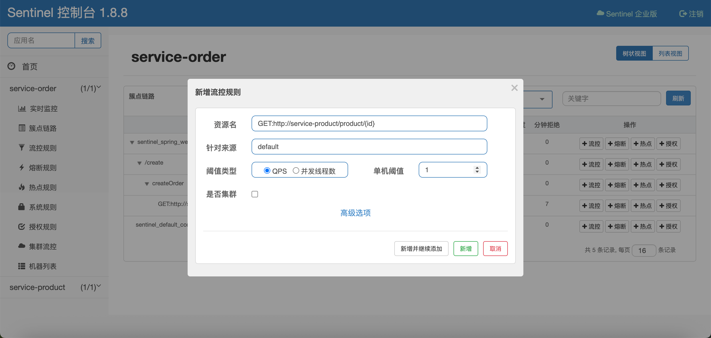
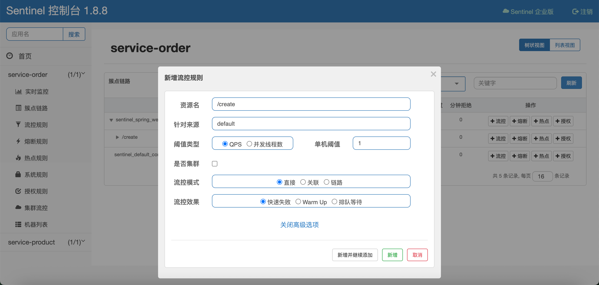
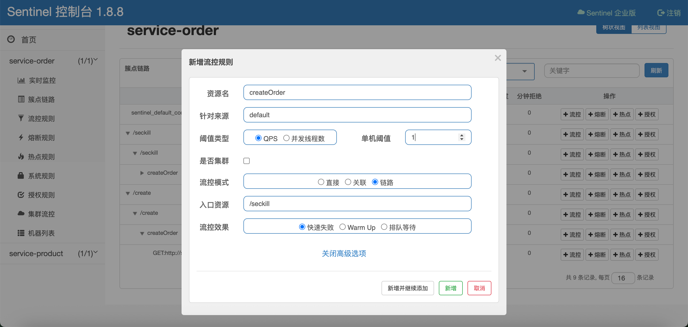
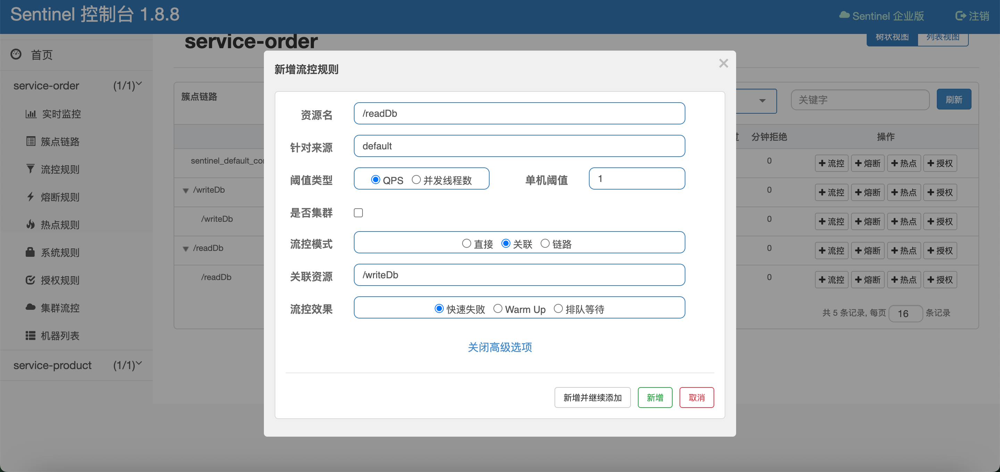
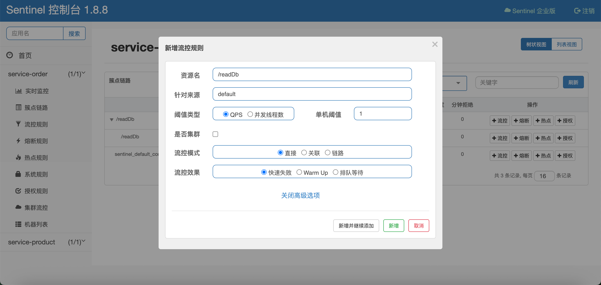
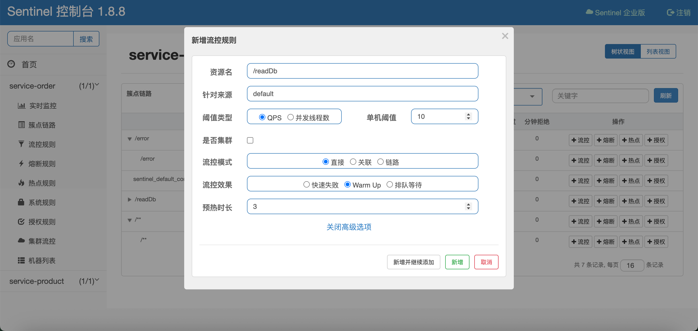
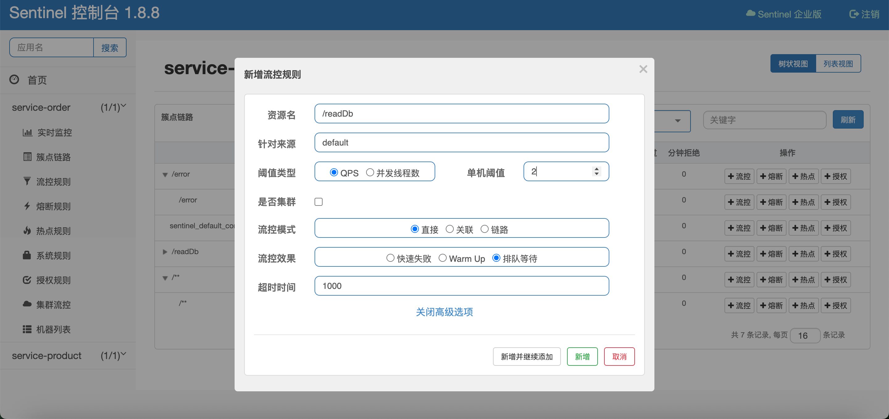
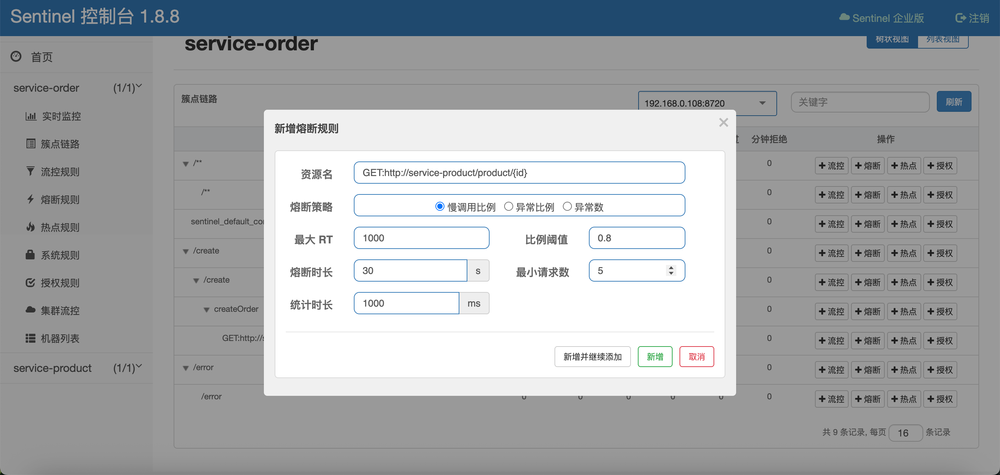
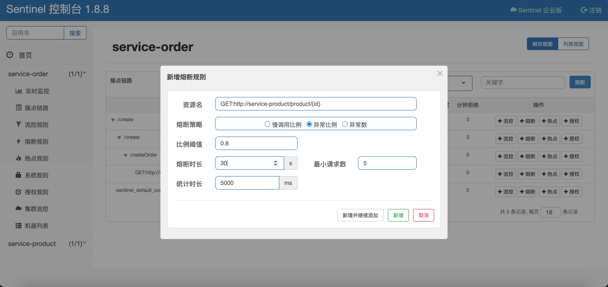
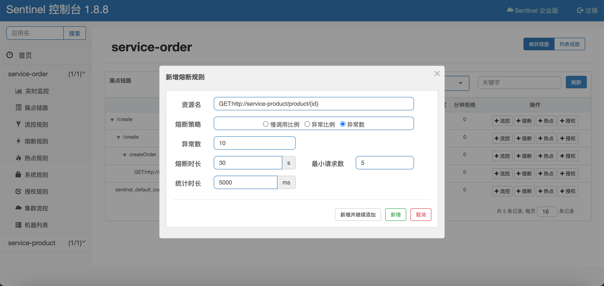

# Spring Cloud Alibaba 入门教程

## 0. 环境准备

| 组件                   | 版本         |
| -------------------- | ---------- |
| Java                 | 17+        |
| Spring Boot          | 3.3.4      |
| Spring Cloud         | 2023.0.3   |
| Spring Cloud Alibaba | 2023.0.3.2 |
| Nacos                | 2.x        |
| Maven                | 3.6+       |

---

## 1. 创建项目

### 1.1 创建 Maven 父工程

首先创建一个 Maven 父工程 `cloud-demo`，用于统一管理项目的依赖版本。

**父工程 `pom.xml`：**

```xml
<?xml version="1.0" encoding="UTF-8"?>
<project xmlns="http://maven.apache.org/POM/4.0.0"
         xmlns:xsi="http://www.w3.org/2001/XMLSchema-instance"
         xsi:schemaLocation="http://maven.apache.org/POM/4.0.0
                             http://maven.apache.org/xsd/maven-4.0.0.xsd">
    <modelVersion>4.0.0</modelVersion>

    <!-- 继承 Spring Boot 父 POM，统一管理 Spring Boot 依赖版本 -->
    <parent>
        <groupId>org.springframework.boot</groupId>
        <artifactId>spring-boot-starter-parent</artifactId>
        <version>3.3.4</version>
    </parent>

    <groupId>org.example</groupId>
    <artifactId>cloud-demo</artifactId>
    <version>1.0-SNAPSHOT</version>
    <packaging>pom</packaging>

    <name>cloud-demo</name>

    <modules>
        <module>services</module>
    </modules>

    <properties>
        <project.build.sourceEncoding>UTF-8</project.build.sourceEncoding>
        <maven.compiler.source>17</maven.compiler.source>
        <maven.compiler.target>17</maven.compiler.target>
        <spring-cloud.version>2023.0.3</spring-cloud.version>
        <spring-cloud-alibaba.version>2023.0.3.2</spring-cloud-alibaba.version>
    </properties>

    <!-- 依赖版本管理：在父工程中统一声明版本，子模块继承后无需再写版本号 -->
    <dependencyManagement>
        <dependencies>
            <!-- Spring Cloud 依赖管理 -->
            <dependency>
                <groupId>org.springframework.cloud</groupId>
                <artifactId>spring-cloud-dependencies</artifactId>
                <version>${spring-cloud.version}</version>
                <type>pom</type>
                <scope>import</scope>
            </dependency>
            <!-- Spring Cloud Alibaba 依赖管理 -->
            <dependency>
                <groupId>com.alibaba.cloud</groupId>
                <artifactId>spring-cloud-alibaba-dependencies</artifactId>
                <version>${spring-cloud-alibaba.version}</version>
                <type>pom</type>
                <scope>import</scope>
            </dependency>
        </dependencies>
    </dependencyManagement>

    <build>
        <plugins>
            <plugin>
                <groupId>org.springframework.boot</groupId>
                <artifactId>spring-boot-maven-plugin</artifactId>
            </plugin>
        </plugins>
    </build>
</project>
```

> **说明**：父工程的 `<packaging>` 设置为 `pom`，表示它是一个聚合工程，不包含实际代码，只用于管理子模块和统一依赖版本。`<dependencyManagement>` 中通过 `<scope>import</scope>` 引入 Spring Cloud 和 Spring Cloud Alibaba 的 BOM（Bill of Materials），实现依赖版本的统一管理。

### 1.2 创建服务聚合模块

在父工程下创建 `services` 聚合模块，将所有微服务放在同一目录下管理。

**`services/pom.xml`：**

```xml
<?xml version="1.0" encoding="UTF-8"?>
<project xmlns="http://maven.apache.org/POM/4.0.0"
         xmlns:xsi="http://www.w3.org/2001/XMLSchema-instance"
         xsi:schemaLocation="http://maven.apache.org/POM/4.0.0
                             http://maven.apache.org/xsd/maven-4.0.0.xsd">
    <modelVersion>4.0.0</modelVersion>

    <parent>
        <groupId>org.example</groupId>
        <artifactId>cloud-demo</artifactId>
        <version>1.0-SNAPSHOT</version>
    </parent>

    <groupId>org.example.services</groupId>
    <artifactId>services</artifactId>
    <packaging>pom</packaging>

    <name>services</name>

    <modules>
        <module>service-product</module>
        <module>service-order</module>
    </modules>

    <!-- 所有子服务共享的公共依赖 -->
    <dependencies>
        <!-- Nacos 服务注册与发现 -->
        <dependency>
            <groupId>com.alibaba.cloud</groupId>
            <artifactId>spring-cloud-starter-alibaba-nacos-discovery</artifactId>
        </dependency>
        <!-- OpenFeign 远程调用 -->
        <dependency>
            <groupId>org.springframework.cloud</groupId>
            <artifactId>spring-cloud-starter-openfeign</artifactId>
        </dependency>
        <!-- lombok -->
          <dependency>
            <groupId>org.projectlombok</groupId>
            <artifactId>lombok</artifactId>
        </dependency>
    </dependencies>
</project>
```

> **说明**：在 `services` 模块中引入 `spring-cloud-starter-alibaba-nacos-discovery` 和 `spring-cloud-starter-openfeign`，所有子模块（service-product、service-order）将自动继承这些依赖，无需重复声明。

### 1.3 创建业务服务模块

创建两个微服务模块：`service-product`（商品服务）和 `service-order`（订单服务）。

**service-product/pom.xml：**

```xml
<?xml version="1.0" encoding="UTF-8"?>
<project xmlns="http://maven.apache.org/POM/4.0.0"
         xmlns:xsi="http://www.w3.org/2001/XMLSchema-instance"
         xsi:schemaLocation="http://maven.apache.org/POM/4.0.0
                             http://maven.apache.org/xsd/maven-4.0.0.xsd">
    <modelVersion>4.0.0</modelVersion>

    <parent>
        <groupId>org.example.services</groupId>
        <artifactId>services</artifactId>
        <version>1.0-SNAPSHOT</version>
    </parent>

    <artifactId>service-product</artifactId>
    <name>service-product</name>

    <dependencies>
        <!-- Spring Boot Web 支持（内嵌 Tomcat） -->
        <dependency>
            <groupId>org.springframework.boot</groupId>
            <artifactId>spring-boot-starter-web</artifactId>
        </dependency>
        <!-- 测试依赖 -->
        <dependency>
            <groupId>org.springframework.boot</groupId>
            <artifactId>spring-boot-starter-test</artifactId>
            <scope>test</scope>
        </dependency>
    </dependencies>
</project>
```

**service-order/pom.xml** 结构同上，将 `artifactId` 改为 `service-order`，`name` 改为 `service-order` 即可。

### 1.4 项目结构总览

```
cloud-demo                          # 父工程
├── pom.xml                         # 父 POM：版本管理
└── services                        # 服务聚合模块
    ├── pom.xml                     # 公共依赖管理（Nacos、OpenFeign）
    ├── service-product             # 商品服务（端口 9000）
    │   ├── pom.xml
    │   └── src/main/
    │       ├── java/.../product/ProductMainApplication.java
    │       └── resources/application.yml
    └── service-order               # 订单服务（端口 8000）
        ├── pom.xml
        └── src/main/
            ├── java/.../order/OrderMainApplication.java
            └── resources/application.yml
```

---

## 2. Nacos

### 2.1 启动 Nacos

Nacos（Dynamic Naming and Configuration Service）是阿里巴巴开源的服务注册中心和配置中心。

#### 2.1.1 下载与安装

1. 访问 [Nacos GitHub Releases](https://github.com/alibaba/nacos/releases) 下载最新稳定版
2. 解压下载的压缩包

#### 2.1.2 启动 Nacos Server

**Linux/Mac：**

```bash
# 进入 Nacos 目录
cd nacos/bin

# 单机模式启动（开发环境推荐）
sh startup.sh -m standalone
```

**Windows：**

```cmd
# 进入 Nacos 目录
cd nacos\bin

# 单机模式启动
startup.cmd -m standalone
```

#### 2.1.3 访问控制台

启动成功后，打开浏览器访问：**http://127.0.0.1:8848/nacos**

| 项目    | 值       |
| ----- | ------- |
| 默认用户名 | `nacos` |
| 默认密码  | `nacos` |

登录后即可看到 Nacos 管理控制台，在"服务管理" → "服务列表"中可以查看所有已注册的服务。

#### 2.1.4 关闭 Nacos

**Linux/Mac：**

```bash
cd nacos/bin
sh shutdown.sh
```

**Windows：**

```cmd
cd nacos\bin
startup.cmd -m standalone
```

---

### 2.2 将服务注册到 Nacos 上

#### 2.2.1 添加 Nacos 依赖

在 `services/pom.xml` 中已经添加了公共依赖，子模块自动继承：

```xml
<dependency>
    <groupId>com.alibaba.cloud</groupId>
    <artifactId>spring-cloud-starter-alibaba-nacos-discovery</artifactId>
</dependency>
```

#### 2.2.2 配置 application.yml

在 `application.yml` 中配置服务名称和 Nacos 服务端地址。

**service-product（商品服务）：**

```yaml
spring:
  application:
    name: service-product        # 服务名称（会在 Nacos 中显示）
  cloud:
    nacos:
      server-addr: 127.0.0.1:8848   # Nacos 服务端地址
server:
  port: 9000                    # 服务端口
```

**service-order（订单服务）：**

```yaml
spring:
  application:
    name: service-order         # 服务名称
  cloud:
    nacos:
      server-addr: 127.0.0.1:8848
server:
  port: 8000
```

> **注意**：`spring.application.name` 的值即为注册到 Nacos 上的服务名，在同一注册中心中必须唯一。

#### 2.2.3 启动类添加 @EnableDiscoveryClient

在启动类上添加 `@EnableDiscoveryClient` 注解，启用服务注册与发现功能。

**ProductMainApplication.java：**

```java
package org.example.services.product;

import org.springframework.boot.SpringApplication;
import org.springframework.boot.autoconfigure.SpringBootApplication;
import org.springframework.cloud.client.discovery.EnableDiscoveryClient;

@EnableDiscoveryClient   // 开启服务注册与发现
@SpringBootApplication
public class ProductMainApplication {
    public static void main(String[] args) {
        SpringApplication.run(ProductMainApplication.class, args);
    }
}
```

**OrderMainApplication.java：**

```java
package org.example.services.order;

import org.springframework.boot.SpringApplication;
import org.springframework.boot.autoconfigure.SpringBootApplication;
import org.springframework.cloud.client.discovery.EnableDiscoveryClient;

@EnableDiscoveryClient   // 开启服务注册与发现
@SpringBootApplication
public class OrderMainApplication {
    public static void main(String[] args) {
        SpringApplication.run(OrderMainApplication.class, args);
    }
}
```

#### 2.2.4 启动服务并验证

依次启动 `ProductMainApplication` 和 `OrderMainApplication`，然后访问 Nacos 控制台 **http://127.0.0.1:8848/nacos**，在"服务管理" → "服务列表"中可以看到两个已注册的服务：

| 服务名             | 端口   | 状态   |
| --------------- | ---- | ---- |
| service-product | 9000 | ✅ 健康 |
| service-order   | 8000 | ✅ 健康 |

> **说明**：`@EnableDiscoveryClient` 是 Spring Cloud 通用的服务注册发现注解。启动后，服务会自动向 Nacos 注册，Nacos 会定期检测服务健康状态。

---

### 2.3 服务发现

必需启用注解：

> @EnableDiscoveryClient

Spring Cloud Alibaba 提供了两种方式进行服务发现：

#### 2.3.1 方式一：使用 Spring Cloud 通用 DiscoveryClient

`DiscoveryClient` 是 Spring Cloud 提供的通用服务发现接口，不绑定任何特定的注册中心。

```java
package org.example.services;

import org.example.services.product.ProductMainApplication;
import org.junit.jupiter.api.Test;
import org.springframework.beans.factory.annotation.Autowired;
import org.springframework.boot.test.context.SpringBootTest;
import org.springframework.cloud.client.ServiceInstance;
import org.springframework.cloud.client.discovery.DiscoveryClient;

import java.util.List;

@SpringBootTest(classes = ProductMainApplication.class)
public class DiscoveryTest {

    @Autowired
    private DiscoveryClient discoveryClient;

    @Test
    public void testDiscoveryClient() {
        // 获取所有注册的服务名列表
        discoveryClient.getServices().forEach(service -> {
            System.out.println("service: " + service);
            // 根据服务名获取该服务的所有实例
            List<ServiceInstance> instances = discoveryClient.getInstances(service);
            instances.forEach(instance -> {
                System.out.println("  instance: " + instance.getHost() + ":" + instance.getPort());
            });
        });
    }
}
```

**输出示例：**

```
service: service-product
  instance: 192.168.1.100:9000
service: service-order
  instance: 192.168.1.100:8000
```

#### 2.3.2 方式二：使用 NacosServiceDiscovery（Nacos 原生 API）

`NacosServiceDiscovery` 是 Nacos 提供的服务发现实现，提供了更丰富的 Nacos 特性支持。

```java
import com.alibaba.cloud.nacos.discovery.NacosServiceDiscovery;
import org.junit.jupiter.api.Test;
import org.springframework.beans.factory.annotation.Autowired;
import org.springframework.boot.test.context.SpringBootTest;
import org.springframework.cloud.client.ServiceInstance;

import java.util.List;

@SpringBootTest(classes = ProductMainApplication.class)
public class DiscoveryTest {

    @Autowired
    private NacosServiceDiscovery nacosServiceDiscovery;

    @Test
    public void testNacosServiceDiscovery() throws Exception {
        // 获取所有注册的服务名
        List<String> services = nacosServiceDiscovery.getServices();
        for (String service : services) {
            System.out.println("service: " + service);
            // 获取服务实例列表
            List<ServiceInstance> instances = nacosServiceDiscovery.getInstances(service);
            instances.forEach(instance -> {
                System.out.println("  instance: " + instance.getHost() + ":" + instance.getPort());
            });
        }
    }
}
```

#### 2.3.3 两种方式的对比

| 特性       | DiscoveryClient | NacosServiceDiscovery |
| -------- | --------------- | --------------------- |
| 所属框架     | Spring Cloud 通用 | Nacos 专属              |
| 可移植性     | ✅ 高（可切换注册中心）    | ❌ 低（绑定 Nacos）         |
| Nacos 特性 | 基本功能            | ✅ 完整支持                |
| 推荐场景     | 通用服务发现          | 需要 Nacos 高级特性         |

> **建议**：一般情况下推荐使用 `DiscoveryClient`，保持代码与注册中心解耦。如果项目确定不会更换注册中心，或有 Nacos 特有功能需求，则可以使用 `NacosServiceDiscovery`。

---

### 2.4 服务调用（RestTemplate + @LoadBalanced）

在微服务架构中，服务间调用是最常见的场景。本节介绍如何使用 `RestTemplate` 结合 `@LoadBalanced` 注解实现基于服务名的远程调用，由 Nacos 自动解析服务名并完成负载均衡。

#### 2.4.1 原理概述

传统的 `RestTemplate` 调用需要指定目标服务的 IP 和端口：

```java
// 传统方式：硬编码 IP 和端口
restTemplate.getForObject("http://192.168.1.100:9000/product/1", Product.class);
```

但在微服务架构中，服务实例的 IP 和端口是动态变化的（扩缩容、故障转移等），硬编码方式无法适应这种变化。

Spring Cloud 提供了 `@LoadBalanced` 注解，配合 `RestTemplate` 使用时，会自动拦截 HTTP 请求，将服务名解析为实际的 IP:Port，并实现客户端负载均衡：

```java
// 负载均衡方式：使用服务名代替 IP:Port
restTemplate.getForObject("http://service-product/product/1", Product.class);
```

其工作流程如下：

```
service-order  ──调用──>  http://service-product/product/1
                              │
                   @LoadBalanced 拦截
                              │
                   从 Nacos 获取 service-product 的实例列表
                              │
                   负载均衡选择一个实例（如 192.168.1.100:9000）
                              │
                   实际请求 → http://192.168.1.100:9000/product/1
```

#### 2.4.2 配置 RestTemplate

在service-order/pom.xml中引入依赖：

```xml
<dependency>
    <groupId>org.springframework.cloud</groupId>
    <artifactId>spring-cloud-starter-loadbalancer</artifactId>
</dependency>
```

在 service-order（调用方）中创建配置类，定义带有 `@LoadBalanced` 注解的 `RestTemplate` Bean：

```java
package org.example.services.order.config;

import org.springframework.boot.web.client.RestTemplateBuilder;
import org.springframework.cloud.client.loadbalancer.LoadBalanced;
import org.springframework.context.annotation.Bean;
import org.springframework.context.annotation.Configuration;
import org.springframework.web.client.RestTemplate;

@Configuration
public class OrderServiceConfig {

    @Bean
    public RestTemplateBuilder restTemplateBuilder() {
        return new RestTemplateBuilder();
    }

    @LoadBalanced   // 开启负载均衡：自动将服务名解析为实际 IP:Port
    @Bean
    public RestTemplate restTemplate(RestTemplateBuilder builder) {
        return builder.build();
    }
}
```

> **关键点**：`@LoadBalanced` 注解会为 `RestTemplate` 添加一个拦截器（`LoadBalancerInterceptor`），该拦截器在发起 HTTP 请求前，从 Nacos 获取目标服务的实例列表，并通过负载均衡算法选择一个实例进行调用。

#### 2.4.3 服务提供方：暴露接口

service-product（被调用方）提供 REST 接口：

```java
package org.example.services.product.controller;

import lombok.extern.slf4j.Slf4j;
import org.example.model.product.Product;
import org.example.services.product.service.ProductService;
import org.springframework.beans.factory.annotation.Autowired;
import org.springframework.web.bind.annotation.GetMapping;
import org.springframework.web.bind.annotation.PathVariable;
import org.springframework.web.bind.annotation.RestController;

@Slf4j
@RestController
public class ProductController {

    @Autowired
    private ProductService productService;

    @GetMapping("/product/{id}")
    public Product getProduct(@PathVariable("id") Long id) {
        log.info("getProduct id: {}", id);
        Product product = productService.getProductById(id);
        return product;
    }
}
```

#### 2.4.4 服务调用方：通过 RestTemplate 发起远程调用

service-order（调用方）注入 `RestTemplate`，使用**服务名**代替 IP:Port 发起调用：

```java
package org.example.services.order.service.impl;

import lombok.extern.slf4j.Slf4j;
import org.example.model.order.Order;
import org.example.model.product.Product;
import org.example.services.order.service.OrderService;
import org.springframework.beans.factory.annotation.Autowired;
import org.springframework.stereotype.Service;
import org.springframework.web.client.RestTemplate;

import java.math.BigDecimal;
import java.util.Arrays;

@Slf4j
@Service
public class OrderServiceImpl implements OrderService {

    @Autowired
    private RestTemplate restTemplate;

    @Override
    public Order createOrder(Long productId, Long userId) {
        // 通过 RestTemplate 远程调用 service-product 服务
        Product product = getProductFromRemote(productId);

        Order order = Order.builder()
                .id(1L)
                .totalAmount(new BigDecimal(100))
                .userId(userId)
                .nickName("张三")
                .address("北京")
                .productList(Arrays.asList(product))
                .build();
        return order;
    }

    /**
     * 远程调用 service-product 服务获取商品信息
     * URL 中使用服务名 "service-product" 而不是 IP:Port
     */
    private Product getProductFromRemote(Long productId) {
        // 注意：这里的 host 是 Nacos 中注册的服务名，不是真实的 IP 地址
        String url = "http://service-product/product/" + productId;
        return restTemplate.getForObject(url, Product.class);
    }
}
```

#### 2.4.5 调用链路总结

```
用户请求: GET /create?productId=1&userId=100
    │
    ▼
OrderController.createOrder(1, 100)
    │
    ▼
OrderServiceImpl.createOrder(1, 100)
    │
    ▼
RestTemplate.getForObject("http://service-product/product/1", Product.class)
    │
    ▼
@LoadBalanced 拦截 → 从 Nacos 获取 service-product 实例列表 → 负载均衡选一个实例
    │
    ▼
ProductController.getProduct(1)  ← 被调用的 service-product 服务
    │
    ▼
返回 Product 对象，组装 Order 返回
```

> **注意**：`RestTemplate` 发出的 HTTP 请求中，URL 的 host 部分必须与目标服务在 Nacos 中注册的 `spring.application.name` 完全一致（本例中为 `service-product`）。`@LoadBalanced` 拦截器会拦截这个请求，将服务名替换为实际的 IP:Port。

### 2.5 配置中心（Nacos Config）

Nacos 除了作为服务注册中心，还提供了配置管理功能。通过 Nacos Config，可以将应用的配置集中管理在 Nacos 服务端，并支持配置的动态刷新，无需重启应用即可使配置生效。

#### 2.5.1 在 Nacos 中创建配置文件

1. 登录 Nacos 控制台 **http://127.0.0.1:8848/nacos**
2. 进入"配置管理" → "配置列表"
3. 点击"+"号新建配置，填写以下信息：

| 配置项       | 值                          |
| --------- | -------------------------- |
| Namespace | Public                     |
| Data ID   | `service-order.properties` |
| Group     | `DEFAULT_GROUP`            |
| 配置格式      | `Properties`               |
| 配置内容      | （见下方）                      |

**配置内容：**

```properties
order.timeout=30
order.auto-confirm=true
```

如图：


4. 点击"发布"完成配置创建

> **命名说明**：Data ID 的命名格式通常为 `${spring.application.name}.properties`，例如 `service-order.properties`。这样 Spring Cloud Alibaba 可以自动根据应用名匹配对应的配置。

#### 2.5.2 引入 Nacos Config 依赖

在 `services/pom.xml` 公共模块中添加 `spring-cloud-starter-alibaba-nacos-config` 依赖：

```xml
<!-- nacos 配置中心 -->
<dependency>
    <groupId>com.alibaba.cloud</groupId>
    <artifactId>spring-cloud-starter-alibaba-nacos-config</artifactId>
</dependency>
```

> **说明**：由于该依赖添加在 `services` 聚合模块中，所有子模块（service-product、service-order）都会自动继承，无需各自重复添加。

#### 2.5.3 配置 application.yml

在需要使用配置中心的服务中，通过 `spring.config.import` 引入 Nacos 中的配置文件。

**service-order 的 application.yml：**

```yaml
spring:
  application:
    name: service-order
  cloud:
    nacos:
      server-addr: 127.0.0.1:8848
  config:
    import: nacos:service-order.properties   # 从 Nacos 导入配置
server:
  port: 8000
```

**配置项说明：**

| 配置                               | 说明                                      |
| -------------------------------- | --------------------------------------- |
| `spring.config.import`           | 指定从 Nacos 导入的配置文件。格式为 `nacos:<Data ID>` |
| `spring.cloud.nacos.server-addr` | Nacos 服务端地址（Config 和 Discovery 共用）      |

> **注意**：`spring.config.import` 是 Spring Boot 标准的配置导入机制。当值为 `nacos:service-order.properties` 时，应用启动时会从 Nacos 拉取 `service-order.properties` 的配置内容，并与本地配置合并。Nacos 中的配置优先级高于本地配置。

#### 2.5.4 代码中使用配置（@RefreshScope + @Value）

在需要动态刷新的 Bean 上添加 `@RefreshScope` 注解，配合 `@Value` 读取配置项：

```java
package org.example.services.order.controller;

import org.example.model.order.Order;
import org.example.services.order.service.OrderService;
import org.springframework.beans.factory.annotation.Autowired;
import org.springframework.beans.factory.annotation.Value;
import org.springframework.cloud.context.config.annotation.RefreshScope;
import org.springframework.web.bind.annotation.GetMapping;
import org.springframework.web.bind.annotation.RequestParam;
import org.springframework.web.bind.annotation.RestController;

@RefreshScope   // 开启配置动态刷新
@RestController
public class OrderController {

    @Autowired
    private OrderService orderService;

    @Value("${order.timeout}")           // 注入 Nacos 配置中的 order.timeout
    private String orderTimeout;

    @Value("${order.auto-confirm}")      // 注入 Nacos 配置中的 order.auto-confirm
    private String orderAutoConfirm;

    @GetMapping("/config")
    public String config() {
        return "timeout: " + orderTimeout + ", auto-confirm: " + orderAutoConfirm;
    }

    @GetMapping("/create")
    public Order createOrder(@RequestParam("productId") Long productId,
                             @RequestParam("userId") Long userId) {
        return orderService.createOrder(productId, userId);
    }
}
```

**关键注解说明：**

| 注解                           | 作用                                                                     |
| ---------------------------- | ---------------------------------------------------------------------- |
| `@RefreshScope`              | 标记当前 Bean 支持配置动态刷新。当 Nacos 中的配置发生变更时，Spring Cloud 会重新创建该 Bean，使新的配置值生效 |
| `@Value("${order.timeout}")` | 从配置中读取 `order.timeout` 的值并注入到字段中。`${}` 中的 key 对应 Nacos 配置文件中的属性名       |

#### 2.5.5 验证动态刷新

1. 启动 service-order 服务

2. 访问 **http://localhost:8000/config**，返回：
   
   ```
   timeout: 30, auto-confirm: true
   ```

3. 在 Nacos 控制台修改 `service-order.properties` 的内容：
   
   ```properties
   order.timeout=60
   order.auto-confirm=false
   ```

4. 发布配置后，再次访问 **http://localhost:8000/config**，返回：
   
   ```
   timeout: 60, auto-confirm: false
   ```

可以看到，无需重启服务，配置修改即时生效。

#### 2.5.6 关闭未引用配置的检查（service-product）

如果某个服务引入了 Nacos Config 依赖，但没有通过 `spring.config.import` 指定导入任何配置文件，Spring Boot 项目启动时默认会抛出错误。可以通过以下配置关闭这个检查：

**service-product 的 application.yml：**

```yaml
spring:
  application:
    name: service-product
  cloud:
    nacos:
      server-addr: 127.0.0.1:8848
      config:
        import-check:
          enabled: false       # 关闭未引用配置文件的检查
server:
  port: 9000
```

> **适用场景**：当项目统一在 `services/pom.xml` 中引入了 Nacos Config 依赖，但某些服务暂时不需要使用配置中心时，需要设置 `import-check.enabled=false`，否则启动会报错。service-product 作为被调用方只需注册到 Nacos 供其他服务发现，因此关闭了配置检查。

---

### 2.6 配置中心进阶（@ConfigurationProperties）

上一节使用 `@Value` 逐个注入配置项，但当配置项较多时，散落的 `@Value` 不利于维护。Spring Boot 提供了 `@ConfigurationProperties` 注解，可以将**一组前缀相同**的配置绑定到一个 Java 对象上，代码更整洁、类型更安全。

#### 2.6.1 对比：@Value vs @ConfigurationProperties

| 方面   | @Value              | @ConfigurationProperties |
| ---- | ------------------- | ------------------------ |
| 注入方式 | 逐字段注入               | 按前缀批量绑定到对象               |
| 类型安全 | ❌ 纯字符串              | ✅ 支持自动类型转换               |
| 动态刷新 | 需配合 `@RefreshScope` | ✅ 天然支持，无需额外注解            |
| 代码风格 | 字段散落在类各处            | 抽取到独立 Properties 类       |
| 适用场景 | 少量配置项               | 一组相关配置项                  |

#### 2.6.2 创建配置属性类

将 `order.timeout` 和 `order.auto-confirm` 两个配置项抽取到独立的 `OrderProperties` 类中：

```java
package org.example.services.order.properties;

import lombok.Data;
import org.springframework.boot.context.properties.ConfigurationProperties;
import org.springframework.stereotype.Component;

@Component
@ConfigurationProperties(prefix = "order")   // 绑定 order.* 开头的配置项
@Data
public class OrderProperties {

    private String timeout;        // 对应 order.timeout

    private String autoConfirm;    // 对应 order.auto-confirm（Spring 自动做松散绑定）
}
```

**注解说明：**

| 注解                                           | 作用                                        |
| -------------------------------------------- | ----------------------------------------- |
| `@ConfigurationProperties(prefix = "order")` | 将 Nacos 配置中以 `order` 为前缀的 key 自动绑定到该类的字段上 |
| `@Component`                                 | 将此类注册为 Spring Bean，供其他组件注入使用              |
| `@Data`                                      | Lombok 注解，自动生成 getter/setter              |

**松散绑定**：`@ConfigurationProperties` 支持 Spring Boot 的松散绑定规则，配置 key `order.auto-confirm`（kebab-case）会自动映射到 Java 字段 `autoConfirm`（camelCase），无需手动指定。

> **重要**：`@ConfigurationProperties` 天然支持配置动态刷新，当 Nacos 中的配置变更时，Spring Cloud 会自动重新绑定属性值到该对象，**无需添加 `@RefreshScope` 注解**。

#### 2.6.3 修改 Controller 使用属性类

替换原来的 `@Value` 注入方式，改为注入 `OrderProperties`：

```java
package org.example.services.order.controller;

import org.example.model.order.Order;
import org.example.services.order.properties.OrderProperties;
import org.example.services.order.service.OrderService;
import org.springframework.beans.factory.annotation.Autowired;
import org.springframework.web.bind.annotation.GetMapping;
import org.springframework.web.bind.annotation.RequestParam;
import org.springframework.web.bind.annotation.RestController;

@RestController
public class OrderController {

    @Autowired
    private OrderService orderService;

    @Autowired
    private OrderProperties orderProperties;   // 注入配置属性对象

    @GetMapping("/config")
    public String config() {
        // 通过 getter 方法读取配置
        return "timeout: " + orderProperties.getTimeout()
                + ", auto-confirm: " + orderProperties.getAutoConfirm();
    }

    @GetMapping("/create")
    public Order createOrder(@RequestParam("productId") Long productId,
                             @RequestParam("userId") Long userId) {
        return orderService.createOrder(productId, userId);
    }
}
```

> **对比**：`OrderController` 中不再有 `@Value` 和 `@RefreshScope` 注解，代码更简洁。配置项的读取通过 `orderProperties.getTimeout()` 完成，享受 IDE 自动补全和编译期类型检查。

#### 2.6.4 修改配置类（另一种启用方式）

除了在 `OrderProperties` 类上加 `@Component` 之外，也可以通过配置类上的 `@EnableConfigurationProperties` 来启用：

```java
package org.example.services.order.config;

import org.example.services.order.properties.OrderProperties;
import org.springframework.boot.context.properties.EnableConfigurationProperties;
import org.springframework.boot.web.client.RestTemplateBuilder;
import org.springframework.cloud.client.loadbalancer.LoadBalanced;
import org.springframework.context.annotation.Bean;
import org.springframework.context.annotation.Configuration;
import org.springframework.web.client.RestTemplate;

@Configuration
@EnableConfigurationProperties(OrderProperties.class)   // 显式启用配置属性绑定
public class OrderServiceConfig {

    @Bean
    public RestTemplateBuilder restTemplateBuilder() {
        return new RestTemplateBuilder();
    }

    @LoadBalanced
    @Bean
    public RestTemplate restTemplate(RestTemplateBuilder builder) {
        return builder.build();
    }
}
```

**两种启用方式对比：**

| 方式                               | 做法                            | 适用场景                                              |
| -------------------------------- | ----------------------------- | ------------------------------------------------- |
| `@Component`                     | 在 Properties 类上加 `@Component` | 简单直接，推荐常规使用                                       |
| `@EnableConfigurationProperties` | 在配置类上声明                       | 需要显式控制注册，或 Properties 类来自第三方 jar 无法加 `@Component` |

两种方式任选其一即可，效果相同，都会将 `OrderProperties` 注册为 Bean 并自动绑定 `order.*` 配置。

#### 2.6.5 验证

1. 确保 Nacos 中 `service-order.properties` 内容为：
   
   ```properties
   order.timeout=30
   order.auto-confirm=true
   ```

2. 访问 **http://localhost:8000/config**，返回：
   
   ```
   timeout: 30, auto-confirm: true
   ```

3. 在 Nacos 控制台修改 `order.timeout=90`，发布后再次访问：
   
   ```
   timeout: 90, auto-confirm: true
   ```

配置动态刷新依然生效，且无需 `@RefreshScope`。

#### 2.6.6 使用建议

- **少量配置（1-2 个）**：使用 `@Value` + `@RefreshScope` 足够简单
- **一组相关配置（3 个以上）**：推荐 `@ConfigurationProperties`，代码更整洁、可维护性更好
- **需要复用的配置**：抽取到 `@ConfigurationProperties` 类中，多个组件共享注入同一个 Properties Bean

---

### 2.7 监听配置变更（ConfigService Listener）

前面两节介绍了通过 `@RefreshScope` 和 `@ConfigurationProperties` 自动获得最新配置值的方式。但有时我们需要在配置变更时执行自定义业务逻辑，比如记录日志、发送通知、触发缓存刷新等。这时可以通过 Nacos 原生的 `ConfigService` API 注册配置监听器来实现。

#### 2.7.1 原理概述

Nacos 提供了 `ConfigService.addListener()` 方法，允许注册一个 `Listener` 监听指定配置文件的内容变化。当 Nacos 服务端检测到配置变更时，会主动推送通知到客户端，触发 `Listener` 的回调方法。

这与 `@RefreshScope` / `@ConfigurationProperties` 的区别在于：

| 机制                                           | 行为                 | 适用场景          |
| -------------------------------------------- | ------------------ | ------------- |
| `@RefreshScope` / `@ConfigurationProperties` | **静默更新** Bean 的属性值 | 透明地使用最新配置     |
| `ConfigService Listener`                     | **主动回调**，执行自定义逻辑   | 配置变更时需要触发额外操作 |

#### 2.7.2 代码实现：在 ApplicationRunner 中注册监听器

`ApplicationRunner` 是 Spring Boot 提供的启动后执行器，在应用启动完成后执行，适合用来注册配置监听。

**OrderMainApplication.java：**

```java
package org.example.services.order;

import com.alibaba.cloud.nacos.NacosConfigManager;
import com.alibaba.nacos.api.config.ConfigService;
import com.alibaba.nacos.api.config.listener.Listener;
import org.springframework.boot.ApplicationRunner;
import org.springframework.boot.SpringApplication;
import org.springframework.boot.autoconfigure.SpringBootApplication;
import org.springframework.cloud.client.discovery.EnableDiscoveryClient;
import org.springframework.context.annotation.Bean;

import java.util.concurrent.Executor;
import java.util.concurrent.Executors;

@EnableDiscoveryClient
@SpringBootApplication
public class OrderMainApplication {

    public static void main(String[] args) {
        SpringApplication.run(OrderMainApplication.class, args);
    }

    /**
     * 监听 Nacos 配置变更
     * ApplicationRunner 在应用启动完成后自动执行
     */
    @Bean
    public ApplicationRunner applicationRunner(NacosConfigManager nacosConfigManager) {
        return args -> {
            // 1. 获取 Nacos 原生配置服务 API
            ConfigService configService = nacosConfigManager.getConfigService();

            // 2. 为指定配置文件注册监听器
            configService.addListener("service-order.properties",  // Data ID
                                       "DEFAULT_GROUP",             // Group
                                       new Listener() {

                // 3. 指定回调方法的执行线程池
                @Override
                public Executor getExecutor() {
                    return Executors.newFixedThreadPool(4);
                }

                // 4. 配置变更时触发此方法，configInfo 为最新的配置内容
                @Override
                public void receiveConfigInfo(String configInfo) {
                    System.out.println("变化的配置信息：" + configInfo);
                    System.out.println("nacos配置服务：" + configService.getServerStatus());

                    // 在这里可以执行自定义业务逻辑，例如：
                    // - 刷新本地缓存
                    // - 发送变更通知
                    // - 记录审计日志
                }
            });
        };
    }
}
```

#### 2.7.3 核心 API 说明

| API / 组件                                             | 说明                                                           |
| ---------------------------------------------------- | ------------------------------------------------------------ |
| `NacosConfigManager`                                 | Spring Cloud Alibaba 封装的 Nacos 配置管理器，通过它获取原生 `ConfigService` |
| `configService.getConfigService()`                   | 获取 Nacos 原生配置服务客户端                                           |
| `configService.addListener(dataId, group, listener)` | 注册监听器，监听指定 Data ID 和 Group 的配置文件                             |
| `Listener.getExecutor()`                             | 返回一个线程池，`receiveConfigInfo` 回调将在这个线程池中执行                     |
| `Listener.receiveConfigInfo(configInfo)`             | 配置变更时的回调方法，`configInfo` 是变更后的**完整配置内容**（字符串）                 |

> **注意**：`getExecutor()` 返回的线程池用于执行回调逻辑。建议使用固定大小的线程池（如 `Executors.newFixedThreadPool(4)`），避免每次回调都创建新线程。

#### 2.7.4 与前面方案的配合使用

三种配置刷新机制可以配合使用，互不冲突：

```
配置变更通知
    │
    ├── @ConfigurationProperties  → 自动更新属性对象（无感知）
    │
    ├── @RefreshScope + @Value    → 重新创建 Bean（下次调用时生效）
    │
    └── ConfigService Listener    → 主动回调 receiveConfigInfo()（执行自定义逻辑）
```

一个典型的组合使用场景：

- `@ConfigurationProperties` 负责自动刷新业务配置（如超时时间、开关等）
- `ConfigService Listener` 负责在配置变更时发送通知或记录审计日志

#### 2.7.5 验证

1. 启动 service-order 服务，控制台无特殊输出（监听器已静默注册）

2. 在 Nacos 控制台修改 `service-order.properties` 内容并发布

3. 查看应用控制台，输出：
   
   ```
   变化的配置信息：order.timeout=60
   order.auto-confirm=false
   nacos配置服务：UP
   ```

> `receiveConfigInfo` 收到的 `configInfo` 是配置文件的**完整内容**（Properties 格式的字符串），而非仅变更的部分。如果需要解析具体变更项，可以自行解析该字符串。

---

### 2.8 配置优先级

当同一个配置项出现在多个配置源中时，高优先级的配置会**覆盖**低优先级中同名的配置项。

#### 2.8.1 优先级顺序（从高到低）

```
┌──────────────────────────────────────────────────────────┐
│  ① 命令行参数              --server.port=8080              │
│  ② 系统属性 / 环境变量       JAVA_HOME                     │
│  ③ 本地 application.yml     jar 外部 config/ 目录          │
│  ④ 本地 application.yml     classpath                     │
│  ⑤ Nacos 远程配置            spring.config.import 导入      │
│  ⑥ 默认属性                  Spring Boot 内置默认值          │
└──────────────────────────────────────────────────────────┘
```

> **记忆口诀**：命令行 > 环境变量 > 本地 > 远程

#### 2.8.2 关键结论

**本地 application.yml 优先级高于 Nacos 远程配置**。这意味着：

- 如果本地 `application.yml` 中定义了 `order.timeout=30`，Nacos 中定义了 `order.timeout=60`，最终生效的是 `30`
- 想让 Nacos 远程配置生效，本地 `application.yml` 中**不要定义同名配置项**
- **最佳实践**：本地只放 `server.port`、`spring.application.name`、`nacos.server-addr` 等框架级配置，业务配置全部交给 Nacos 管理

#### 2.8.3 Nacos 内部配置优先级

如果使用了多个 Nacos 配置文件，Nacos 内部也有优先级：

```
主配置（spring.config.import） > extension-configs > shared-configs
```

```yaml
spring:
  cloud:
    nacos:
      config:
        extension-configs:           # 扩展配置
          - data-id: redis.properties
        shared-configs:              # 共享配置（优先级最低）
          - data-id: base.properties
```

> **习惯用法**：公共基础配置放 `shared-configs`，环境相关配置放 `extension-configs`，服务专属配置放主配置中。

---

### 2.9 配置中心的多环境隔离

实际项目中通常有开发（dev）、测试（test）、生产（prod）多套环境。Nacos 通过 **命名空间（namespace）** 实现不同环境的配置隔离，配合 Spring 的 `profiles` 机制可以灵活切换。

#### 2.9.1 在 Nacos 中创建命名空间

1. 登录 Nacos 控制台，进入"命名空间"页面
2. 分别创建三个命名空间：

| 命名空间名称 | 命名空间 ID                                |
| ------ | -------------------------------------- |
| dev    | `a7313725-c7e9-4c68-a739-0b05b9aaf9c`  |
| test   | `4823e914-2434-4986-a539-8d3da71e39c5` |
| prod   | `8504ebcf-2885-4fdb-9d1a-75385b90a48a` |

> 命名空间 ID 由 Nacos 自动生成，创建后复制保存，后续配置中需要使用。

#### 2.9.2 在各环境创建配置

切换到对应命名空间，分别创建以下配置：

**dev 环境（3 份配置）：**

| Data ID               | Group     | 配置内容                                            |
| --------------------- | --------- | ----------------------------------------------- |
| `common.properties`   | `order`   | `order.timeout=1min`<br>`order.auto-confirm=1h` |
| `database.properties` | `order`   | `order.db-url=order_dev`                        |
| `common.properties`   | `product` | `title.font-size=12px`                          |

**test 环境（3 份配置）：**

| Data ID               | Group     | 配置内容                                            |
| --------------------- | --------- | ----------------------------------------------- |
| `common.properties`   | `order`   | `order.timeout=2min`<br>`order.auto-confirm=2h` |
| `database.properties` | `order`   | `order.db-url=order_test`                       |
| `common.properties`   | `product` | `title.font-size=24px`                          |

**prod 环境（3 份配置）：**

| Data ID               | Group     | 配置内容                                            |
| --------------------- | --------- | ----------------------------------------------- |
| `common.properties`   | `order`   | `order.timeout=5min`<br>`order.auto-confirm=4h` |
| `database.properties` | `order`   | `order.db-url=order_prod`                       |
| `common.properties`   | `product` | `title.font-size=24px`                          |

> **注意**：`common.properties` 同时存在于 `order` 组和 `product` 组中，它们是不同的配置。通过 Group 可以将不同服务的同名 Data ID 隔离开。

#### 2.9.3 修改 application.yml 实现多环境切换

使用 Spring 的 `profiles` + 多文档 YAML，不同环境指向不同的 namespace：

```yaml
server:
  port: 8000
spring:
  profiles:
    active: dev                      # 当前激活的环境
  application:
    name: service-order
  cloud:
    nacos:
      server-addr: 127.0.0.1:8848

---
# 开发环境
spring:
  cloud:
    nacos:
      config:
        namespace: a7313725-c7e9-4c68-a739-0b05b9aaf9c   # dev 命名空间
  config:
    import:
      - nacos:common.properties?group=order
      - nacos:database.properties?group=order
    activate:
      on-profile: dev

---
# 测试环境
spring:
  cloud:
    nacos:
      config:
        namespace: 4823e914-2434-4986-a539-8d3da71e39c5   # test 命名空间
  config:
    import:
      - nacos:common.properties?group=order
      - nacos:database.properties?group=order
    activate:
      on-profile: test

---
# 生产环境
spring:
  cloud:
    nacos:
      config:
        namespace: 8504ebcf-2885-4fdb-9d1a-75385b90a48a   # prod 命名空间
  config:
    import:
      - nacos:common.properties?group=order
      - nacos:database.properties?group=order
    activate:
      on-profile: prod
```

**切换环境**：只需将 `spring.profiles.active` 改为 `dev` / `test` / `prod`，应用就会自动从对应命名空间拉取配置。

#### 2.9.4 修改 OrderController 验证多环境配置

在 `OrderProperties` 中新增 `dbUrl` 字段，在 Controller 中一并输出：

**OrderProperties：**

```java
@Component
@ConfigurationProperties(prefix = "order")
@Data
public class OrderProperties {
    private String timeout;
    private String autoConfirm;
    private String dbUrl;       // 对应 order.db-url（来自 database.properties）
}
```

**OrderController：**

```java
@RestController
public class OrderController {

    @Autowired
    private OrderService orderService;

    @Autowired
    private OrderProperties orderProperties;

    @GetMapping("/config")
    public String config() {
        return "timeout: " + orderProperties.getTimeout()
                + ", auto-confirm: " + orderProperties.getAutoConfirm()
                + ", db-url: " + orderProperties.getDbUrl();
    }

    @GetMapping("/create")
    public Order createOrder(@RequestParam("productId") Long productId,
                             @RequestParam("userId") Long userId) {
        return orderService.createOrder(productId, userId);
    }
}
```

#### 2.9.5 验证多环境效果

修改 `spring.profiles.active` 并分别启动，访问 `/config` 得到不同结果：

| 激活环境   | `/config` 输出                                          |
| ------ | ----------------------------------------------------- |
| `dev`  | `timeout: 1min, auto-confirm: 1h, db-url: order_dev`  |
| `test` | `timeout: 2min, auto-confirm: 2h, db-url: order_test` |
| `prod` | `timeout: 5min, auto-confirm: 4h, db-url: order_prod` |

#### 2.9.6 多环境隔离原理总结

```
┌─────────────────────────────────────────────────────────┐
│                    Nacos 服务端                           │
│                                                         │
│  ┌─ dev 命名空间 ──────────────────────────────┐         │
│  │  common.properties (group=order)             │         │
│  │  database.properties (group=order)           │         │
│  │  common.properties (group=product)           │         │
│  └─────────────────────────────────────────────┘         │
│                                                         │
│  ┌─ test 命名空间 ─────────────────────────────┐         │
│  │  common.properties (group=order)             │         │
│  │  database.properties (group=order)           │         │
│  │  common.properties (group=product)           │         │
│  └─────────────────────────────────────────────┘         │
│                                                         │
│  ┌─ prod 命名空间 ─────────────────────────────┐         │
│  │  common.properties (group=order)             │         │
│  │  database.properties (group=order)           │         │
│  │  common.properties (group=product)           │         │
│  └─────────────────────────────────────────────┘         │
└─────────────────────────────────────────────────────────┘
                          │
          spring.profiles.active 决定连哪个命名空间
                          │
┌─────────────────────────────────────────────────────────┐
│              service-order 应用                           │
│  profiles.active: dev → 拉取 dev 命名空间中的配置           │
│  profiles.active: test → 拉取 test 命名空间中的配置          │
│  profiles.active: prod → 拉取 prod 命名空间中的配置          │
└─────────────────────────────────────────────────────────┘
```

> **要点**：同一份代码、同一个镜像，只需要改变 `spring.profiles.active` 即可在不同环境之间切换，配置完全隔离、互不影响。

## 3. OpenFeign

### 3.1 OpenFeign 基础使用

在 2.4 节中我们使用 `RestTemplate` 实现了服务间调用，但这种方式需要手动拼接 URL、处理响应类型，代码比较繁琐。OpenFeign 是 Spring Cloud 提供的声明式 HTTP 客户端，只需定义接口并加上注解，即可像调用本地方法一样调用远程服务。

#### 3.1.1 原理概述

OpenFeign 通过动态代理，将标注了 `@FeignClient` 的接口自动生成实现类。调用接口方法时，底层自动完成：服务名 → 实际地址解析（Nacos）、HTTP 请求构造、响应反序列化。

```
OrderServiceImpl
    │
    ├── productFeignClient.getProductById(1L)    ← 像调用本地方法
    │
    ▼
ProductFeignClient (接口 + @FeignClient)
    │
    ├── 动态代理生成实现类
    │
    ▼
Nacos 服务发现 → service-product → 192.168.1.100:9000
    │
    ▼
HTTP GET http://service-product/product/1 → Product JSON → Product 对象
```

#### 3.1.2 引入依赖

```xml
<dependency>
    <groupId>org.springframework.cloud</groupId>
    <artifactId>spring-cloud-starter-openfeign</artifactId>
</dependency>
```

本项目已在 `services/pom.xml` 公共模块中引入，所有子模块自动继承。

#### 3.1.3 启动类添加 @EnableFeignClients

在 service-order 启动类上添加 `@EnableFeignClients` 注解，开启 Feign 客户端扫描：

```java
package org.example.services.order;

import com.alibaba.cloud.nacos.NacosConfigManager;
import com.alibaba.nacos.api.config.ConfigService;
import com.alibaba.nacos.api.config.listener.Listener;
import org.springframework.boot.ApplicationRunner;
import org.springframework.boot.SpringApplication;
import org.springframework.boot.autoconfigure.SpringBootApplication;
import org.springframework.cloud.client.discovery.EnableDiscoveryClient;
import org.springframework.cloud.openfeign.EnableFeignClients;
import org.springframework.context.annotation.Bean;

import java.util.concurrent.Executor;
import java.util.concurrent.Executors;

@EnableFeignClients    // 开启 Feign 客户端
@EnableDiscoveryClient
@SpringBootApplication
public class OrderMainApplication {

    public static void main(String[] args) {
        SpringApplication.run(OrderMainApplication.class, args);
    }

    @Bean
    public ApplicationRunner applicationRunner(NacosConfigManager nacosConfigManager) {
        return args -> {
            ConfigService configService = nacosConfigManager.getConfigService();
            configService.addListener("service-order.properties", "DEFAULT_GROUP", new Listener() {
                @Override
                public Executor getExecutor() {
                    return Executors.newFixedThreadPool(4);
                }

                @Override
                public void receiveConfigInfo(String s) {
                    System.out.println("变化的配置信息：" + s);
                    System.out.println("nacos配置服务：" + configService.getServerStatus());
                }
            });
        };
    }
}
```

#### 3.1.4 编写 Feign 客户端接口

创建 `ProductFeignClient` 接口，使用 `@FeignClient` 声明要调用的目标服务：

```java
package org.example.services.order.feign;

import org.example.model.product.Product;
import org.springframework.cloud.openfeign.FeignClient;
import org.springframework.web.bind.annotation.GetMapping;
import org.springframework.web.bind.annotation.PathVariable;

@FeignClient(value = "service-product")    // 目标服务名（Nacos 中注册的名称）
public interface ProductFeignClient {

    @GetMapping("/product/{id}")           // 对应 service-product 的接口路径
    Product getProductById(@PathVariable("id") Long id);
}
```

**关键注解说明：**

| 注解                                        | 作用                                           |
| ----------------------------------------- | -------------------------------------------- |
| `@FeignClient(value = "service-product")` | 声明这是一个 Feign 客户端，`value` 指定目标服务在 Nacos 中的服务名 |
| `@GetMapping("/product/{id}")`            | 与目标服务的 Controller 接口路径保持一致                   |
| `@PathVariable("id")`                     | 路径参数，与目标接口的参数声明一致                            |

> **要点**：Feign 接口的方法签名（路径、参数、返回类型）需要与目标服务的 Controller 保持一致。底层通过 Nacos 将 `service-product` 解析为实际的 IP:Port，并自动负载均衡。

#### 3.1.5 使用 Feign 客户端发送请求

在 `OrderServiceImpl` 中注入 `ProductFeignClient`，替换原来的 `RestTemplate`：

```java
package org.example.services.order.service.impl;

import lombok.extern.slf4j.Slf4j;
import org.example.model.order.Order;
import org.example.model.product.Product;
import org.example.services.order.feign.ProductFeignClient;
import org.example.services.order.service.OrderService;
import org.springframework.beans.factory.annotation.Autowired;
import org.springframework.stereotype.Service;

import java.math.BigDecimal;
import java.util.Arrays;

@Slf4j
@Service
public class OrderServiceImpl implements OrderService {

    @Autowired
    private ProductFeignClient productFeignClient;   // 注入 Feign 客户端

    @Override
    public Order createOrder(Long productId, Long userId) {
        // 像调用本地方法一样调用远程服务
        Product product = productFeignClient.getProductById(productId);

        Order order = Order.builder()
                .id(1L)
                .totalAmount(new BigDecimal(100))
                .userId(userId)
                .nickName("张三")
                .address("北京")
                .productList(Arrays.asList(product))
                .build();
        return order;
    }
}
```

#### 3.1.6 RestTemplate vs OpenFeign 对比

| 方面   | RestTemplate      | OpenFeign    |
| ---- | ----------------- | ------------ |
| 代码量  | 需手动拼接 URL、处理响应    | 只定义接口 + 注解   |
| 可读性  | URL 字符串，不易维护      | 接口方法声明，清晰直观  |
| 类型安全 | 运行时强转             | 编译期检查        |
| 负载均衡 | 需 `@LoadBalanced` | 内置，无需额外配置    |
| 学习成本 | 低                 | 中（需了解注解）     |
| 适用场景 | 简单调用、动态 URL       | 服务间 RPC 风格调用 |

> **建议**：微服务间调用优先使用 OpenFeign；少量简单调用或需要动态构造 URL 的场景可以使用 RestTemplate。

### 3.2 OpenFeign 调用第三方 API

OpenFeign 不仅可以调用 Nacos 注册的微服务，也可以直接调用第三方 HTTP API。只需要在 `@FeignClient` 中指定 `url` 参数，绕过服务发现，直接向外部地址发起请求。

#### 3.2.1 与微服务调用的区别

|                | 微服务调用（3.1 节）                | 第三方 API 调用（本节）                                      |
| -------------- | --------------------------- | --------------------------------------------------- |
| `@FeignClient` | `value = "service-product"` | `name = "weather-client", url = "https://uapis.cn"` |
| 地址解析           | Nacos 服务发现（动态）              | 固定 URL（静态）                                          |
| 负载均衡           | ✅ 内置                        | ❌ 不需要                                               |
| 返回值            | 对象（自动反序列化）                  | 字符串 / 对象                                            |

> **关键区别**：指定了 `url` 后，Feign 直接向该地址发送请求，不再经过 Nacos 服务发现。

#### 3.2.2 编写 WeatherFeignClient

以天气 API（`https://uapis.cn/api/v1/misc/weather`）为例：

```java
package org.example.services.order.feign;

import org.springframework.cloud.openfeign.FeignClient;
import org.springframework.web.bind.annotation.GetMapping;
import org.springframework.web.bind.annotation.RequestParam;

/**
 * 天气服务客户端 — 调用第三方天气 API
 */
@FeignClient(name = "weather-client", url = "https://uapis.cn")
public interface WeatherFeignClient {

    /**
     * 获取天气信息
     * @param city 城市名，如 "上海"
     * @param lang 语言，如 "zh"
     * @return JSON 格式的天气信息字符串
     */
    @GetMapping("/api/v1/misc/weather")
    String getWeather(@RequestParam("city") String city,
                      @RequestParam("lang") String lang);
}
```

**参数说明：**

| 注解参数                       | 说明                             |
| -------------------------- | ------------------------------ |
| `name = "weather-client"`  | 客户端名称（必填，用于生成 Bean 名称和监控标识）    |
| `url = "https://uapis.cn"` | 第三方 API 的根地址，指定后不再走 Nacos 服务发现 |
| `@RequestParam`            | 查询参数，会自动拼接为 `?city=上海&lang=zh` |

> **注意**：`url` 只写域名部分（如 `https://uapis.cn`），具体路径写在方法注解上（如 `@GetMapping("/api/v1/misc/weather")`），两部分会自动拼接。

#### 3.2.3 编写测试类

```java
package org.example.services;

import org.example.services.order.OrderMainApplication;
import org.example.services.order.feign.WeatherFeignClient;
import org.junit.jupiter.api.Test;
import org.springframework.beans.factory.annotation.Autowired;
import org.springframework.boot.test.context.SpringBootTest;

/**
 * 天气接口测试
 */
@SpringBootTest(classes = OrderMainApplication.class)
public class WeatherTest {

    @Autowired
    private WeatherFeignClient weatherFeignClient;

    @Test
    public void test() {
        // 调用第三方 API，传入城市和语言参数
        String weather = weatherFeignClient.getWeather("上海", "zh");
        System.out.println(weather);
    }
}
```

#### 3.2.4 运行时差异总结

```
微服务调用:
  FeignClient(value="service-product")  →  Nacos 解析  →  http://192.168.1.100:9000

第三方 API 调用:
  FeignClient(name="xxx", url="https://uapis.cn")  →  直接请求  →  https://uapis.cn/api/...
```

> **适用场景**：`url` 方式适合调用外部第三方 API（如天气预报、短信服务、地图 API 等），或内部遗留的非微服务 HTTP 接口。

### 3.3 OpenFeign 日志配置

在开发调试阶段，能够看到 Feign 发出的完整 HTTP 请求和响应非常有用。OpenFeign 提供了灵活的日志机制，可以记录请求 URL、请求头、请求体、响应状态码等信息。

#### 3.3.1 日志级别

OpenFeign 定义了四种日志级别：

| 级别        | 说明          | 输出内容                |
| --------- | ----------- | ------------------- |
| `NONE`    | 不记录日志（默认）   | 无                   |
| `BASIC`   | 基础信息        | 请求方法 + URL、响应状态码、耗时 |
| `HEADERS` | 基础 + 请求/响应头 | BASIC + 请求头 + 响应头   |
| `FULL`    | 完整信息        | HEADERS + 请求体 + 响应体 |

#### 3.3.2 配置 Feign 日志级别

在 `OrderServiceConfig` 配置类中添加 `Logger.Level` Bean，设为 `FULL` 级别：

```java
package org.example.services.order.config;

import feign.Logger;
import org.springframework.boot.web.client.RestTemplateBuilder;
import org.springframework.cloud.client.loadbalancer.LoadBalanced;
import org.springframework.context.annotation.Bean;
import org.springframework.context.annotation.Configuration;
import org.springframework.web.client.RestTemplate;

@Configuration
public class OrderServiceConfig {

    @Bean
    public RestTemplateBuilder restTemplateBuilder() {
        return new RestTemplateBuilder();
    }

    @LoadBalanced
    @Bean
    public RestTemplate restTemplate(RestTemplateBuilder builder) {
        return builder.build();
    }

    @Bean
    public Logger.Level feignLoggerLevel() {
        return Logger.Level.FULL;   // 输出完整请求/响应信息
    }
}
```

#### 3.3.3 配置 application.yml 日志输出

Feign 日志的 Logger 名称格式为 `包名.FeignClient接口名`，需要在 `application.yml` 中将对应包的日志级别设为 `debug`：

```yaml
logging:
  level:
    org.example.services.order.feign: debug    # Feign 客户端所在的包
```

> **注意**：Feign 日志默认使用 `DEBUG` 级别输出，所以必须将对应包的日志级别设为 `debug`，否则不会打印。`Logger.Level` 控制日志的**详细程度**，`logging.level` 控制日志的**开关**。

#### 3.3.4 日志输出示例

配置完成后启动服务，调用 Feign 接口时会输出类似以下日志：

```
[service-order] [main] o.e.s.o.f.ProductFeignClient  : [ProductFeignClient#getProductById] ---> GET http://service-product/product/1 HTTP/1.1
[service-order] [main] o.e.s.o.f.ProductFeignClient  : [ProductFeignClient#getProductById] ---> END HTTP (0-byte body)
[service-order] [main] o.e.s.o.f.ProductFeignClient  : [ProductFeignClient#getProductById] <--- HTTP/1.1 200 (45ms)
[service-order] [main] o.e.s.o.f.ProductFeignClient  : [ProductFeignClient#getProductById] content-type: application/json
[service-order] [main] o.e.s.o.f.ProductFeignClient  : [ProductFeignClient#getProductById] {"id":1,"price":100,"productName":"商品A","num":10}
[service-order] [main] o.e.s.o.f.ProductFeignClient  : [ProductFeignClient#getProductById] <--- END HTTP (78-byte body)
```

#### 3.3.5 完整配置总结

开启 Feign 日志需要**同时配置两项**，缺一不可：

| 配置项                    | 位置                           | 作用                                |
| ---------------------- | ---------------------------- | --------------------------------- |
| `Logger.Level.FULL`    | `OrderServiceConfig` 中的 Bean | 控制日志详细程度（NONE/BASIC/HEADERS/FULL） |
| `logging.level: debug` | `application.yml`            | 控制日志是否输出（必须设为 debug）              |

> **建议**：开发环境使用 `FULL` 级别方便调试，生产环境改为 `NONE` 或 `BASIC` 避免日志量过大。可以通过 Nacos 配置动态控制日志级别，无需重启。

### 3.4 OpenFeign 超时配置

服务间调用时，如果目标服务响应慢或不可用，长时间等待会导致调用方资源耗尽。合理配置超时时间可以快速失败，防止级联雪崩。

#### 3.4.1 默认超时时间

OpenFeign 底层使用 `URLConnection`（默认 HTTP 客户端），其内置超时如下：

| 参数               | 默认值  | 说明             |
| ---------------- | ---- | -------------- |
| `connectTimeout` | 10 秒 | 建立 TCP 连接的超时时间 |
| `readTimeout`    | 60 秒 | 等待响应的超时时间      |

> 在生产环境中，60 秒的读取超时往往过长，建议根据业务场景调低。

#### 3.4.2 创建 application-feign.yml

将 Feign 相关配置抽取到独立的 `application-feign.yml` 文件中，再通过 `spring.profiles.include` 引入，实现配置职责分离：

**application.yml** 中引入：

```yaml
spring:
  profiles:
    include: feign    # 加载 application-feign.yml
```

**application-feign.yml**：

```yaml
spring:
  cloud:
    openfeign:
      client:
        config:
          # 默认配置 — 对所有 FeignClient 生效
          default:
            connectTimeout: 1000       # 连接超时：1 秒
            readTimeout: 2000           # 读取超时：2 秒
          # 针对 service-product（ProductFeignClient）的专属配置
          service-product:
            logger-level: full
            connectTimeout: 5000       # 连接超时：5 秒
            readTimeout: 5000           # 读取超时：5 秒
```

#### 3.4.3 配置规则说明

| 配置层级              | key 值                               | 作用范围                       |
| ----------------- | ----------------------------------- | -------------------------- |
| `default`         | 固定关键字                               | 全局默认，所有 FeignClient 共用     |
| `service-product` | `@FeignClient` 的 `value` / `name` 值 | 仅对 `ProductFeignClient` 生效 |

**优先级**：具体服务配置 > 默认配置。即 `service-product` 下的配置会覆盖 `default` 中的同名项。

> **命名规则**：`config` 下的 key 必须与 `@FeignClient(value = "service-product")` 中的值完全一致。

#### 3.4.4 配置对比

| FeignClient                           | connectTimeout | readTimeout | 来源                     |
| ------------------------------------- | -------------- | ----------- | ---------------------- |
| `ProductFeignClient`（service-product） | 5000ms         | 5000ms      | `service-product` 专属配置 |
| `WeatherFeignClient`（weather-client）  | 1000ms         | 2000ms      | 继承 `default` 全局配置      |

### 3.5 OpenFeign 超时重试

即使配置了合理的超时时间，网络抖动、服务短暂不可用等问题仍可能导致调用失败。OpenFeign 内置了重试机制，在请求失败或超时后自动重试，提高调用成功率。

#### 3.5.1 默认重试策略

OpenFeign 的 `Retryer.Default` 默认参数如下：

| 参数            | 默认值        | 说明             |
| ------------- | ---------- | -------------- |
| `period`      | 100ms      | 首次重试的间隔时间      |
| `maxPeriod`   | 1000ms（1s） | 最大重试间隔         |
| `maxAttempts` | 5          | 最大重试次数（包含首次调用） |

重试间隔的计算方式：每次重试后间隔时间翻倍（100ms → 200ms → 400ms → 800ms → 1000ms），但不超过 `maxPeriod`。

> **注意**：`maxAttempts = 5` 表示最多发起 5 次请求（1 次原始 + 4 次重试）。

#### 3.5.2 配置 Retryer

在 `OrderServiceConfig` 中注册 `Retryer` Bean：

```java
package org.example.services.order.config;

import feign.Logger;
import feign.Retryer;
import org.springframework.boot.web.client.RestTemplateBuilder;
import org.springframework.cloud.client.loadbalancer.LoadBalanced;
import org.springframework.context.annotation.Bean;
import org.springframework.context.annotation.Configuration;
import org.springframework.web.client.RestTemplate;

@Configuration
public class OrderServiceConfig {

    @Bean
    public RestTemplateBuilder restTemplateBuilder() {
        return new RestTemplateBuilder();
    }

    @LoadBalanced
    @Bean
    public RestTemplate restTemplate(RestTemplateBuilder builder) {
        return builder.build();
    }

    @Bean
    public Logger.Level feignLoggerLevel() {
        return Logger.Level.FULL;
    }

    @Bean
    Retryer retryer() {
        return new Retryer.Default();   // 使用默认重试策略
    }
}
```

#### 3.5.3 自定义重试参数

通过 `Retryer` 构造函数传入自定义参数：

```java
@Bean
Retryer retryer() {
    // 参数：period=200ms, maxPeriod=2000ms, maxAttempts=3
    return new Retryer.Default(200, 2000, 3);
}
```

这样设定后：最多重试 3 次，间隔 200ms → 400ms → 800ms（不超过 2000ms）。

#### 3.5.4 重试触发条件

Feign 的 `Retryer` 仅在以下条件**同时满足**时触发：

1. 抛出了 `IOException`（网络异常、连接超时、读取超时等）
2. 重试次数未超过 `maxAttempts`

> **不会触发重试**的情况：HTTP 状态码错误（如 404、500），这些属于业务异常，Feign 不会自动重试。如需对 5xx 等状态码重试，可配合 Spring Retry 或 Sentinel 等组件实现。

#### 3.5.5 与超时配置的关系

重试与超时是相互配合的：

```
第 1 次请求 → 超时 5s → 失败（IOException）
    │
重试 1（间隔 100ms） → 超时 5s → 失败
    │
重试 2（间隔 200ms） → 超时 5s → 成功
    │
返回结果（总耗时 ≈ 5s + 0.1s + 5s + 0.2s + 5s ≈ 15.3s）
```

> **建议**：重试次数不宜过多，否则会放大响应延迟。一般设置为 3 次，配合合理的超时时间使用。

### 3.6 OpenFeign 拦截器

OpenFeign 提供了 `RequestInterceptor`（请求拦截器）和自定义的响应处理机制，可以在请求发送前和响应返回后插入通用逻辑，例如统一添加认证头、链路追踪 ID、日志记录等。

#### 3.6.1 请求拦截器：统一添加请求头

在微服务架构中，经常需要在下游请求中传递认证 Token 或链路追踪 ID。通过实现 `RequestInterceptor` 接口，可以对**所有** Feign 请求统一添加请求头。

**XTokenRequestInterceptor：**

```java
package org.example.services.order.interceptor;

import feign.RequestInterceptor;
import feign.RequestTemplate;
import org.springframework.stereotype.Component;

import java.util.UUID;

/**
 * OpenFeign 请求拦截器
 * 在每次 Feign 请求发出前，统一在请求头中添加 X-Token
 */
@Component
public class XTokenRequestInterceptor implements RequestInterceptor {
    @Override
    public void apply(RequestTemplate template) {
        // 为每个请求生成唯一的 Token
        template.header("X-Token", UUID.randomUUID().toString());
    }
}
```

> **关键**：该类添加了 `@Component` 注解并实现了 `RequestInterceptor` 接口，会被 Feign 自动发现并应用到所有 Feign 请求中。`apply()` 方法在**每次请求发出前**被调用。

#### 3.6.2 服务端验证：读取请求头

service-product 端在 Controller 中通过 `HttpServletRequest` 读取 Feign 传递的 `X-Token`：

```java
package org.example.services.product.controller;

import jakarta.servlet.http.HttpServletRequest;
import lombok.extern.slf4j.Slf4j;
import org.example.model.product.Product;
import org.example.services.product.service.ProductService;
import org.springframework.beans.factory.annotation.Autowired;
import org.springframework.web.bind.annotation.GetMapping;
import org.springframework.web.bind.annotation.PathVariable;
import org.springframework.web.bind.annotation.RestController;

@Slf4j
@RestController
public class ProductController {

    @Autowired
    private ProductService productService;

    @GetMapping("/product/{id}")
    public Product getProduct(@PathVariable("id") Long id, HttpServletRequest request) {
        String header = request.getHeader("X-Token");    // 读取请求头
        log.info("请求头X-Token: {}", header);             // 打印到日志中验证
        log.info("getProduct id: {}", id);
        Product product = productService.getProductById(id);
        return product;
    }
}
```

#### 3.6.3 响应拦截器示例

Feign 没有内置的 `ResponseInterceptor` 接口，但可以通过实现 `feign.codec.Decoder` 或使用 Spring 的 AOP 来拦截响应。以下是一个通过自定义 `Decoder` 包装来实现响应拦截的示例：

```java
package org.example.services.order.interceptor;

import feign.FeignException;
import feign.Response;
import feign.codec.Decoder;
import lombok.extern.slf4j.Slf4j;

import java.io.IOException;
import java.lang.reflect.Type;

/**
 * 响应拦截器 — 包装 Spring 默认的 Decoder，在解码响应前后插入逻辑
 */
@Slf4j
public class FeignResponseInterceptor implements Decoder {

    private final Decoder delegate;

    public FeignResponseInterceptor(Decoder delegate) {
        this.delegate = delegate;
    }

    @Override
    public Object decode(Response response, Type type) throws IOException, FeignException {
        // 响应前：记录响应状态和耗时
        log.info("响应状态: {}, 请求地址: {}", response.status(), response.request().url());

        // 调用原始解码器
        Object result = delegate.decode(response, type);

        // 响应后：记录响应体
        log.info("响应内容: {}", result);
        return result;
    }
}
```

#### 3.6.4 拦截器执行流程

```
service-order（调用方）
    │
    ├── XTokenRequestInterceptor.apply()
    │       → 在请求头中添加 X-Token: <UUID>
    │       → 所有 Feign 请求自动生效，无需在每个 Client 中重复添加
    │
    ▼
HTTP 请求 → service-product
    │
    ├── ProductController.getProduct()
    │       → request.getHeader("X-Token") 读取请求头
    │       → log.info() 打印验证
    │
    ▼
HTTP 响应 → service-order
    │
    ├── FeignResponseInterceptor.decode()
    │       → 记录响应状态和内容
    │
    ▼
返回 Product 对象
```

> **典型用途**：请求拦截器常用于认证 Token 传递、全链路追踪 ID（TraceId）、灰度标记等场景，避免在每个 FeignClient 方法中手动添加参数。

### 3.7 OpenFeign Fallback（服务降级）

当被调用服务不可用、超时或抛出异常时，服务调用方不能一直等待或直接报错，而是应该有一个"兜底"方案返回默认值，保证主流程不会因依赖服务故障而崩溃。这就是 **Fallback（服务降级）**。

OpenFeign 本身不提供降级能力，需要配合 **Sentinel**（Spring Cloud Alibaba 的流量治理组件）来实现。

#### 3.7.1 引入 Sentinel 依赖

在 `services/pom.xml` 中添加 Sentinel 依赖：

```xml
<dependency>
    <groupId>com.alibaba.cloud</groupId>
    <artifactId>spring-cloud-starter-alibaba-sentinel</artifactId>
</dependency>
```

#### 3.7.2 启用 Feign 的 Sentinel 支持

在 `application-feign.yml` 中配置：

```yaml
feign:
  sentinel:
    enabled: true    # 开启 Sentinel 对 Feign 的整合
```

> **说明**：开启后，Sentinel 会为每个 `@FeignClient` 生成的代理对象包裹一层断路器，当调用失败时自动触发 fallback 逻辑。

#### 3.7.3 创建 Fallback 类

创建 `ProductFeignClientFallback`，实现 `ProductFeignClient` 接口，提供降级时的默认返回值：

```java
package org.example.services.order.feign.fallback;

import org.example.model.product.Product;
import org.example.services.order.feign.ProductFeignClient;
import org.springframework.stereotype.Component;

import java.math.BigDecimal;

/**
 * ProductFeignClient 的 Fallback 实现
 * 当 service-product 服务不可用时，返回兜底数据
 */
@Component
public class ProductFeignClientFallback implements ProductFeignClient {

    @Override
    public Product getProductById(Long id) {
        return getProduct(id);
    }

    @Override
    public Product getProduct(Long id) {
        // 降级逻辑：返回一个默认的 Product 对象
        return Product.builder()
                .id(0L)
                .price(new BigDecimal(100))
                .productName("无:" + id)     // 标记为降级数据
                .num(100)
                .build();
    }
}
```

> **注**：`@Component` 会将 Fallback 类注册为 Spring Bean，Sentinel 通过它来创建降级实例。Fallback 类必须实现原 FeignClient 接口，每个方法的返回值即为降级时的兜底数据。

#### 3.7.4 在 @FeignClient 中配置 fallback

修改 `ProductFeignClient`，通过 `fallback` 属性指定降级类：

```java
package org.example.services.order.feign;

import org.example.model.product.Product;
import org.example.services.order.feign.fallback.ProductFeignClientFallback;
import org.springframework.cloud.openfeign.FeignClient;
import org.springframework.web.bind.annotation.GetMapping;
import org.springframework.web.bind.annotation.PathVariable;

@FeignClient(value = "service-product", fallback = ProductFeignClientFallback.class)
public interface ProductFeignClient {

    @GetMapping("/product/{id}")
    Product getProductById(@PathVariable("id") Long id);

    @GetMapping("/product/{id}")
    Product getProduct(@PathVariable("id") Long id);
}
```

| 属性                                            | 说明                  |
| --------------------------------------------- | ------------------- |
| `value = "service-product"`                   | 目标服务名               |
| `fallback = ProductFeignClientFallback.class` | 降级处理类，服务不可用时调用该类的方法 |

#### 3.7.5 完整工作流程

```
service-order 调用 productFeignClient.getProductById(1L)
    │
    ▼
Sentinel 断路器包裹的 Feign 代理
    │
    ├── service-product 可用？
    │       │
    │       YES ──→ 正常调用 http://service-product/product/1
    │       │              │
    │       │              └── 返回 Product{id=1, productName="iPhone", ...}
    │       │
    │       NO（超时/异常/熔断）
    │              │
    │              └── 触发 Fallback
    │                     │
    │                     └── ProductFeignClientFallback.getProductById(1L)
    │                            │
    │                            └── 返回 Product{id=0, productName="无:1", ...}
    │
    ▼
返回 Product 对象（正常数据 或 兜底数据）
```

#### 3.7.6 验证降级效果

1. **正常情况**：启动 service-product 和 service-order，访问 `/create?productId=1&userId=100`，返回正常商品信息

2. **降级情况**：停止 service-product 服务，再次访问，返回降级数据：
   
   ```json
   {
     "id": 0,
     "price": 100,
     "productName": "无:1",
     "num": 100
   }
   ```

> **与重试的区别**：重试（Retryer）是请求失败后**再次尝试**同一条请求；Fallback 是重试仍然失败或直接失败后，**放弃原请求并返回兜底值**，保证调用方能继续执行后续逻辑。两者可以配合使用。

## 4. Sentinel

Sentinel 是阿里巴巴开源的流量治理组件，提供流量控制、熔断降级、系统负载保护等功能。前面 3.7 节中我们使用了 Sentinel 为 OpenFeign 提供 Fallback 能力，本节进一步介绍 Sentinel 的独立使用方式。

### 4.1 Sentinel 基础使用

#### 4.1.1 下载并启动 Sentinel 控制台

Sentinel 控制台是一个可视化的流量治理面板，可以实时监控和管理流控规则。

1. 从 [Sentinel GitHub Releases](https://github.com/alibaba/Sentinel/releases) 下载 `sentinel-dashboard.jar`
2. 启动控制台：

```bash
java -jar sentinel-dashboard-1.8.8.jar
```

3. 访问 **http://127.0.0.1:8080**，默认用户名/密码均为 `sentinel`

#### 4.1.2 引入 Sentinel 依赖

在 `services/pom.xml` 中已添加的依赖（3.7 节已引入）：

```xml
<dependency>
    <groupId>com.alibaba.cloud</groupId>
    <artifactId>spring-cloud-starter-alibaba-sentinel</artifactId>
</dependency>
```

#### 4.1.3 配置 Sentinel 连接

在 `application-feign.yml`（或 `application.yml`）中配置 Sentinel 控制台地址：

```yaml
spring:
  cloud:
    sentinel:
      transport:
        dashboard: localhost:8080    # Sentinel 控制台地址
      eager: true                    # 启动时立即注册到控制台
```

**配置说明：**

| 配置项                                         | 说明                                                          |
| ------------------------------------------- | ----------------------------------------------------------- |
| `spring.cloud.sentinel.transport.dashboard` | Sentinel 控制台地址，应用会向该地址上报心跳和请求数据                             |
| `spring.cloud.sentinel.eager: true`         | 是否在应用启动时立刻注册到控制台。默认 `false` 为懒加载（首次调用后才注册），设为 `true` 则启动即注册 |

> service-product 也需要添加同样的 Sentinel 配置，以便 Sentinel 能监控两个服务的请求链路。

#### 4.1.4 使用 @SentinelResource 注解

`@SentinelResource` 是 Sentinel 提供的核心注解，用于将一个方法标记为 Sentinel 管理的资源，之后可以在控制台对该资源配置流控、降级等规则。

在 `OrderServiceImpl.createOrder()` 方法上添加该注解：

```java
@Slf4j
@Service
public class OrderServiceImpl implements OrderService {

    @Autowired
    private ProductFeignClient productFeignClient;

    @SentinelResource("createOrder")   // 将该方法注册为 Sentinel 资源，资源名为 createOrder
    @Override
    public Order createOrder(Long productId, Long userId) {
        Product product = productFeignClient.getProductById(productId);
        Order order = Order.builder()
                .id(1L)
                .totalAmount(new BigDecimal(100))
                .userId(userId)
                .nickName("张三")
                .address("北京")
                .productList(Arrays.asList(product))
                .build();
        return order;
    }
}
```

> **资源名**：`@SentinelResource` 的 `value` 值（`"createOrder"`）即为 Sentinel 中的资源名称，后续在控制台配置规则时以此名称定位资源。

启动服务后访问一次 `http://localhost:8000/create?productId=10&userId=19`，接口正常返回 JSON 数据。此时 Sentinel 控制台即可看到 `service-order` 服务和 `createOrder` 资源。

#### 4.1.5 在 Sentinel 控制台配置流控规则


1. 登录 Sentinel 控制台 **http://127.0.0.1:8080**
2. 在左侧菜单找到 `service-order` → "簇点链路"
3. 找到资源 `createOrder`，点击"+流控"按钮
4. 配置规则：

| 参数   | 值             | 说明                              |
| ---- | ------------- | ------------------------------- |
| 资源名  | `createOrder` | 自动关联到 `@SentinelResource` 标注的方法 |
| 阈值类型 | QPS           | 每秒请求数                           |
| 单机阈值 | `1`           | 每秒最多通过 1 个请求                    |

5. 点击"新增"保存规则

快速连续访问 `http://localhost:8000/create?productId=10&userId=19`，第一次正常返回，后续请求被 Sentinel 拦截，浏览器返回：

```
Blocked by Sentinel (flow limiting)
```

> **原理**：Sentinel 实时统计 `createOrder` 方法的 QPS，当超过阈值（1 QPS）时立即拒绝额外请求，保护服务不被冲垮。

### 4.2 异常处理

Sentinel 拦截请求时，默认返回的是一个简单的 HTML 文本页面：

```
Blocked by Sentinel (flow limiting)
```

在前后端分离的项目中，前端期望的是统一的 JSON 格式响应。本节介绍如何自定义 Sentinel 的拦截响应。

#### 4.2.1 处理 Spring MVC 接口异常请求

Sentinel 提供了 `BlockExceptionHandler` 接口，通过实现该接口可以将默认的 HTML 响应替换为自定义的 JSON 格式。

**问题分析**：Sentinel 拦截 Spring MVC 接口请求后，默认走 `DefaultBlockExceptionHandler`，直接 `response.getWriter().write("Blocked by Sentinel (flow limiting)")` 返回纯文本。前端收到非 JSON 响应后无法统一解析，体验很差。

**MyBlockExceptionHandler：**

```java
package org.example.services.order.exception;

import com.alibaba.csp.sentinel.adapter.spring.webmvc_v6x.callback.BlockExceptionHandler;
import com.alibaba.csp.sentinel.slots.block.BlockException;
import com.fasterxml.jackson.databind.ObjectMapper;
import jakarta.servlet.http.HttpServletRequest;
import jakarta.servlet.http.HttpServletResponse;
import org.example.model.common.R;
import org.springframework.stereotype.Component;

import java.io.PrintWriter;

@Component
public class MyBlockExceptionHandler implements BlockExceptionHandler {

    private ObjectMapper objectMapper = new ObjectMapper();

    @Override
    public void handle(HttpServletRequest httpServletRequest,
                       HttpServletResponse httpServletResponse,
                       String resourceName,
                       BlockException e) throws Exception {
        // 设置响应类型为 JSON，编码为 UTF-8
        httpServletResponse.setContentType("application/json;charset=utf-8");

        // 构造统一错误响应
        PrintWriter writer = httpServletResponse.getWriter();
        String json = objectMapper.writeValueAsString(
                R.error(500, "被Sentinel限制了，原因：" + e.getClass())
        );
        writer.print(json);
        writer.flush();
        writer.close();
    }
}
```

**关键点说明：**

| 要点                                                          | 说明                                     |
| ----------------------------------------------------------- | -------------------------------------- |
| `implements BlockExceptionHandler`                          | 实现 Sentinel 提供的拦截异常处理接口                |
| `@Component`                                                | 注册为 Spring Bean，Sentinel 会自动发现并替换默认处理器 |
| `response.setContentType("application/json;charset=utf-8")` | 将响应类型从默认的 text/plain 改为 JSON           |
| `BlockException`                                            | Sentinel 所有流控异常的父类，可据此判断具体类型           |
| `R.error(500, msg)`                                         | 统一响应格式，与项目其他接口保持一致                     |

**效果对比**：

|      | 默认处理                                  | 自定义处理                                      |
| ---- | ------------------------------------- | ------------------------------------------ |
| 响应格式 | 纯文本                                   | JSON                                       |
| 响应内容 | `Blocked by Sentinel (flow limiting)` | `{"code":500,"msg":"被Sentinel限制了，原因：..."}` |
| 前端兼容 | ❌ 需特殊处理                               | ✅ 统一解析                                     |

> **注意**：Sentinel 的 `BlockException` 有多种子类，如 `FlowException`（流控）、`DegradeException`（降级）、`ParamFlowException`（热点参数限流）等。可以通过 `e.getClass()` 识别具体类型，返回不同的提示信息。

#### 4.2.2 @SentinelResource 的 blockHandler 配置

4.2.1 节中的 `BlockExceptionHandler` 是**全局**处理，对所有被 Sentinel 拦截的 Spring MVC 请求生效。但有时需要对某个特定资源的被限流/降级请求返回业务数据（而不是错误提示），这就需要用 `blockHandler` 做**方法级**的兜底处理。

**修改 OrderServiceImpl：**

```java
package org.example.services.order.service.impl;

import com.alibaba.csp.sentinel.annotation.SentinelResource;
import com.alibaba.csp.sentinel.slots.block.BlockException;
import lombok.extern.slf4j.Slf4j;
import org.example.model.order.Order;
import org.example.model.product.Product;
import org.example.services.order.feign.ProductFeignClient;
import org.example.services.order.service.OrderService;
import org.springframework.beans.factory.annotation.Autowired;
import org.springframework.stereotype.Service;

import java.math.BigDecimal;
import java.util.Arrays;

@Slf4j
@Service
public class OrderServiceImpl implements OrderService {

    @Autowired
    private ProductFeignClient productFeignClient;

    @SentinelResource(value = "createOrder", blockHandler = "crateOrderFallback")
    @Override
    public Order createOrder(Long productId, Long userId) {
        Product product = productFeignClient.getProductById(productId);
        Order order = Order.builder()
                .id(1L)
                .totalAmount(new BigDecimal(100))
                .userId(userId)
                .nickName("张三")
                .address("北京")
                .productList(Arrays.asList(product))
                .build();
        return order;
    }

    /**
     * 兜底回调 — 当 createOrder 被 Sentinel 限流/降级时调用
     * 方法签名必须与原方法一致，并在最后增加 BlockException 参数
     */
    public Order crateOrderFallback(Long productId, Long userId, BlockException e) {
        log.error("createOrder 被 Sentinel 限制: {}", e.getMessage());
        // 返回兜底数据，而非抛出异常
        return Order.builder()
                .id(0L)
                .totalAmount(new BigDecimal(0))
                .userId(userId)
                .nickName("未知用户")
                .address("没有地址" + e.getClass())
                .build();
    }
}
```

**关键规则：**

| 要点                                    | 说明                                                       |
| ------------------------------------- | -------------------------------------------------------- |
| `blockHandler = "crateOrderFallback"` | 指定兜底方法的方法名                                               |
| 方法签名一致                                | 兜底方法的参数列表和返回值必须与原方法**完全一致**，并在最后增加一个 `BlockException` 参数 |
| 必须在同一个类中                              | 默认情况下，`blockHandler` 指定的方法必须与原方法在**同一个类**中               |
| `BlockException` 不为 null              | 被 Sentinel 拦截时，该参数携带具体异常信息                               |

**全局处理 vs 方法级处理对比**

|      | BlockExceptionHandler（4.2.1） | blockHandler（4.2.2） |
| ---- | ---------------------------- | ------------------- |
| 作用范围 | 全局，所有 Spring MVC 接口          | 单个方法                |
| 处理内容 | 返回 JSON 错误提示                 | 返回业务兜底数据            |
| 适用场景 | 统一拦截响应格式                     | 方法级降级，返回有意义的默认数据    |
| 返回值  | 固定错误 JSON                    | 与原方法同类型的业务对象        |

> **区别理解**：`BlockExceptionHandler` 告诉用户"请求被拦截了"；`blockHandler` 在被拦截时默默返回兜底数据，调用方无感知。在实际项目中，两者常常配合使用。

**Sentinel 控制台配置流控规则**


* 这里配置的资源为createOrder

#### 4.2.3 @FeignClient的fallback

配置了fallback,则使用fallback=ProductFeignClientFallback

```java
@FeignClient(value = "service-product", fallback = ProductFeignClientFallback.class)
public interface ProductFeignClient {

    @GetMapping("/product/{id}")
    Product getProductById(@PathVariable("id") Long id);


    @GetMapping("/product/{id}")
    public Product getProduct(@PathVariable("id") Long id);
}
```

配置资源：GET:http://service-product/product/{id}



#### 4.2.4 try..catch

```java
try {
    SphU.entry("资源名称");
    // 业务代码
} catch (BlockException e) {
    // 兜底回调
}
```

### 4.3 流控规则

#### 4.3.1 三种流控模式

##### 4.3.1.1 直接

* 这是默认模式，和之前的操作一样



##### 4.3.1.2 链路

**场景**：`/create` 和 `/seckill` 两个接口都调用了同一个 `createOrder` 方法，我们希望只限制 `/seckill` 的流量，而不影响 `/create`。

```
/create（正常下单）  ──→  OrderServiceImpl.createOrder  ←──  /seckill（秒杀，需要限流）
                              │
                         同一个资源 "createOrder"
                              │
                   直接模式：两个接口都被限制 ❌
                   链路模式：只限制 /seckill → createOrder 这条链路 ✅
```

###### 步骤一：关闭上下文收敛

在 `application-feign.yml` 中增加配置：

```yaml
spring:
  cloud:
    sentinel:
      web-context-unify: false    # 关闭链路收敛，默认 true
```

| 配置值        | 行为                                  |
| ---------- | ----------------------------------- |
| `true`（默认） | 所有入口都收敛到同一个 context，链路模式不生效         |
| `false`    | 不同入口（URL）保留独立的 context，链路模式可以区分不同入口 |

> **为什么要关**：Sentinel 默认将所有 web 请求收敛到 `sentinel_web_servlet_context` 根链路下，链路模式无法区分 `/create` 和 `/seckill`。关闭后每个 URL 都作为独立的入口链路。

###### 步骤二：新增秒杀接口

在 `OrderController` 中增加 `/seckill` 接口，复用同一个 `createOrder` 方法：

```java
@RestController
public class OrderController {

    @Autowired
    private OrderService orderService;

    @Autowired
    private OrderProperties orderProperties;

    @GetMapping("/config")
    public String config() { ... }

    @GetMapping("/create")
    public Order createOrder(@RequestParam("productId") Long productId,
                             @RequestParam("userId") Long userId) {
        return orderService.createOrder(productId, userId);
    }

    @GetMapping("/seckill")
    public Order seckill(@RequestParam("productId") Long productId,
                         @RequestParam("userId") Long userId) {
        Order o = orderService.createOrder(productId, userId);  // 复用同一方法
        o.setId(Long.MAX_VALUE);
        return o;
    }
}
```

###### 步骤三：配置链路流控规则

1. 登录 Sentinel 控制台，进入 `service-order` → "簇点链路"
2. 找到资源 `createOrder`，点击"+流控"
3. 规则配置：

| 参数   | 值             | 说明                    |
| ---- | ------------- | --------------------- |
| 资源名  | `createOrder` | 目标资源                  |
| 流控模式 | **链路**        | 只限制指定的入口链路            |
| 入口资源 | `/seckill`    | 仅限制从 `/seckill` 进来的请求 |
| 阈值类型 | QPS           | 每秒请求数                 |
| 单机阈值 | `1`           | 每秒最多 1 个请求            |

4. 点击"新增"

**效果验证**：

| 接口                                    | 行为                 |
| ------------------------------------- | ------------------ |
| `GET /create?productId=1&userId=100`  | 正常返回，不受限制          |
| `GET /seckill?productId=1&userId=100` | 第 1 次正常，连续刷新后返回被拦截 |

> **原理**：链路模式下，Sentinel 对资源 `createOrder` 做限流时，只统计入口资源为 `/seckill` 的调用，从 `/create` 进来的请求不受影响。这样就实现了对秒杀接口的精准限流。



##### 4.3.1.3 关联

**场景**：数据库的写操作（`/writeDb`）和读操作（`/readDb`）共享同一资源。当写入流量突增时，为了保证数据库不至于被写操作打满，需要牺牲一部分读操作来保护数据库。

```
/writeDb（写数据库）           /readDb（读数据库）
      │                            │
      │  写入压力过大时              │  自动限流
      │ ────────────────────────────→
      │         关联触发                │
```

> **核心思想**：当关联资源达到阈值时，限流当前资源。牺牲次要接口，保护核心资源。

###### 步骤一：创建读写接口

在 `OrderController` 中添加两个简单接口：

```java
@GetMapping("/writeDb")
public String writeDb() {
    return "write db";
}

@GetMapping("/readDb")
public String readDb() {
    return "read db";
}
```

###### 步骤二：配置关联流控规则

1. 登录 Sentinel 控制台，进入 `service-order` → "簇点链路"
2. 找到资源 `/readDb`，点击"+流控"
3. 规则配置：

| 参数   | 值          | 说明                                      |
| ---- | ---------- | --------------------------------------- |
| 资源名  | `/readDb`  | 被限流的资源                                  |
| 流控模式 | **关联**     | 当关联资源达到阈值时，限流当前资源                       |
| 关联资源 | `/writeDb` | 监控的资源                                   |
| 阈值类型 | QPS        | 每秒请求数                                   |
| 单机阈值 | `1`        | 当 `/writeDb` 的 QPS 超过 1 时，`/readDb` 被限流 |

4. 点击"新增"



**效果验证**：

| 操作                               | 行为                   |
| -------------------------------- | -------------------- |
| 只访问 `/readDb`                    | 正常返回 `read db`       |
| 快速连续访问 `/writeDb`，同时访问 `/readDb` | `/readDb` 被限流，返回拦截信息 |
| 停止访问 `/writeDb` 后，再访问 `/readDb`  | 恢复正常                 |

> **原理**：Sentinel 实时监控关联资源 `/writeDb` 的 QPS，一旦超过阈值（1），即便 `/readDb` 本身请求很少，也会触发限流。这是一种**牺牲策略**：写操作优先级高于读操作时，写压力大就暂停读服务。

**三种流控模式对比**

| 模式  | 限流依据                   | 典型场景          |
| --- | ---------------------- | ------------- |
| 直接  | 当前资源自身的 QPS/线程数        | 保护单个接口        |
| 链路  | 当前资源 + 指定入口            | 同一资源不同入口差异化限流 |
| 关联  | **关联资源**的 QPS 触发当前资源限流 | 读写分离、优先级控制    |

#### 4.3.2 三种流控效果

流控效果是指当 QPS 超过阈值时，Sentinel 如何处理超额的请求。

##### 4.3.2.1 快速失败

**快速失败**是默认的流控效果。当 QPS 超过阈值时，新的请求直接拒绝，抛出 `FlowException`，返回流控拦截信息。

```
时间轴 ──────────────────────────────────────→
请求:  R1  R2  R3  R4  R5  R6  ...
        │   │   │   │   │   │
阈值=3  通过 通过 通过 拒绝 拒绝 拒绝
```

- **适用场景**：对实时性要求高、无法忍受排队延迟的接口
- **特点**：响应最快，但成功率会下降



##### 4.3.2.2 Warm Up

**Warm Up**（预热模式）用于防止突发流量压垮刚启动或尚未完全初始化的系统。阈值会从一个较低的初始值逐渐增加到设定的阈值，给系统一个"热身"时间。

```
QPS 阈值
  ^
  │           ╱──────────────  设定阈值 (100)
  │         ╱
  │       ╱  ← 阈值逐步爬升
  │    ╱         冷启动阶段
  │ ╱               (预热时长)
  └─────────────────────────→ 时间
```

| 配置项 | 说明 |
|--------|------|
| 阈值 | 最终期望的 QPS 上限 |
| 预热时长 | 从 1/3 阈值上升到满阈值所需的秒数 |

- **适用场景**：系统刚启动，缓存未预热，数据库连接池未填满
- **特点**：允许系统逐步适应负载，避免瞬间高流量导致的冷启动崩溃



##### 4.3.2.3 排队等待

**排队等待**模式让请求以**匀速**通过，超过阈值的请求排队等待，而不是直接拒绝。通过设置一个超时时间，超过等待时间的请求才会被拒绝。  

```
请求:  R1    R2    R3    R4    R5    R6
        │     │     │     │     │     │
        ▼     ▼     ▼     ▼     ▼     ▼
    ═══╦═════╦═════╦═════╦═════╦═════╦═══
       ║ 排队 ║ ... ║ ... ║ ... ║ ... ║
    ═══╩═════╩═════╩═════╩═════╩═════╩═══
                    │
                    ▼
            匀速通过（如每 200ms 一个）
```

| 配置项 | 说明 |
|--------|------|
| 阈值类型 | QPS |
| 超时时间（ms） | 请求在队列中的最大等待时间，超时则拒绝 |

- **适用场景**：异步处理、消息队列、可容忍一定延迟但对吞吐量有要求的接口
- **特点**：请求均匀通过，不会出现流量突刺，但会增加响应延迟



**三种流控效果对比**：

| 效果 | 超额请求处理 | 响应延迟 | 适用场景 |
|------|------------|---------|---------|
| 快速失败 | 直接拒绝 | 最低 | 对响应速度敏感的接口 |
| Warm Up | 预热期拒绝超额 | 低 | 系统冷启动、缓存预热阶段 |
| 排队等待 | 排队等待（配备超时） | 增加 | 可容忍排队、需要削峰填谷 |

### 4.4 熔断规则

熔断（Circuit Breaking）是防止级联故障的核心机制。当某个服务不再可用或响应过慢时，Sentinel 自动熔断该服务的调用，快速失败并执行降级逻辑，避免调用方资源被耗尽。

熔断状态如下：

```
       ┌──────────────────────┐
       │     CLOSED（关闭）     │  ← 正常调用
       └──────────┬───────────┘
                  │ 触发熔断条件
                  ▼
       ┌──────────────────────┐
       │      OPEN（打开）      │  ← 拒绝请求，走降级逻辑
       └──────────┬───────────┘
                  │ 熔断时长过后
                  ▼
       ┌──────────────────────┐
       │    HALF-OPEN（半开）   │  ← 放行少量探活请求
       └──────────┬───────────┘
                  │
     ┌────────────┴────────────┐
     │ 探活成功                  │ 探活失败
     ▼                         ▼
  CLOSED                     OPEN（继续熔断）
```

| 状态 | 行为 |
|------|------|
| CLOSED | 正常调用，持续统计指标 |
| OPEN | 拒绝请求，直接抛出 `DegradeException` |
| HALF-OPEN | 放行少量请求探测服务是否恢复 |

#### 4.4.1 慢调用比例

**慢调用比例**是指：当统计时长内请求数超过最小请求数，且慢调用比例（超过最大 RT 的请求占比）超过阈值时，触发熔断。

| 配置项 | 说明 |
|--------|------|
| 最大 RT | 响应慢的判断阈值（ms），超过此值视为慢调用 |
| 比例阈值 | 慢调用占比超过此比例则熔断（0.0 ~ 1.0） |
| 熔断时长 | OPEN 状态持续多久后进入 HALF-OPEN（s） |
| 最小请求数 | 统计时长内请求数需超过此值才做判断 |
| 统计时长 | 滑动窗口的统计时长（s） |

**示例**：最大 RT = 200ms，比例阈值 = 0.5，熔断时长 = 10s，最小请求数 = 5，统计时长 = 1s。

→ 1 秒内有 10 个请求，其中 6 个响应时间超过 200ms（慢调用比例 = 60% > 50%），触发熔断，接下来 10 秒内请求直接返回降级数据。

- **适用场景**：调用第三方接口或数据库查询，响应变慢时需要快速熔断止损



#### 4.4.2 异常比例

**异常比例**是指：当统计时长内请求数超过最小请求数，且异常比例超过阈值时，触发熔断。

| 配置项 | 说明 |
|--------|------|
| 比例阈值 | 异常占比超过此比例则熔断（0.0 ~ 1.0） |
| 熔断时长 | OPEN 状态持续多久后进入 HALF-OPEN（s） |
| 最小请求数 | 统计时长内请求数需超过此值才做判断 |
| 统计时长 | 滑动窗口的统计时长（s） |

**示例**：比例阈值 = 0.3，熔断时长 = 10s，最小请求数 = 5。

→ 1 秒内有 10 个请求，其中 4 个抛异常（异常比例 = 40% > 30%），触发熔断。

- **适用场景**：下游服务频繁返回 500 错误，需要立即熔断停止调用

> 与慢调用比例的区别：一个衡量**响应时间**，一个衡量**异常次数**。



#### 4.4.3 异常数

**异常数**是指：当统计时长内异常数量超过阈值时，触发熔断。与异常比例不同，异常数是**绝对值**。

| 配置项 | 说明 |
|--------|------|
| 异常数 | 异常次数超过此值则熔断 |
| 熔断时长 | OPEN 状态持续多久后进入 HALF-OPEN（s） |
| 最小请求数 | 统计时长内请求数需超过此值才做判断 |
| 统计时长 | 滑动窗口的统计时长（s） |

**示例**：异常数 = 5，熔断时长 = 10s。

→ 1 秒内出现 5 次异常，触发熔断。

- **适用场景**：对错误绝对数量敏感的接口，请求量小但错误率高时也能及时熔断

**三种熔断策略对比**：

| 策略 | 触发条件 | 指标类型 | 适用场景 |
|------|---------|---------|---------|
| 慢调用比例 | 慢调用占比 > 阈值 | 相对值 | 响应变慢，但未报错 |
| 异常比例 | 异常占比 > 阈值 | 相对值 | 高流量接口，少量异常不影响 |
| 异常数 | 异常个数 > 阈值 | 绝对值 | 低流量接口，即使全错请求量也不大 |



### 4.5 热点规则

热点规则（热点参数限流）可以针对**某个参数的具体值**进行精细化限流。比如秒杀场景中，限制某个热门商品 ID 的访问频率，而不影响其他普通商品。

#### 4.5.1 场景分析

`/seckill` 接口需要做秒杀下单，需求如下：

- 默认限制：每人（userId）每秒只能请求 1 次秒杀
- 特殊情况：userId = 777 是 VIP 用户，每秒允许请求 5 次

```
/seckill?productId=1&userId=100   → QPS > 1 → 被拦截
/seckill?productId=1&userId=777   → QPS > 5 → 被拦截（VIP 更高阈值）
/seckill?productId=1&userId=200   → QPS > 1 → 被拦截
```

> **核心思想**：对同一个接口，依据某个参数的值（如 userId）进行差异化的限流控制。

#### 4.5.2 标记资源与 fallback

在 Controller 方法上使用 `@SentinelResource` 标记资源，并指定 fallback：

```java
@Slf4j
@RestController
public class OrderController {

    @Autowired
    private OrderService orderService;

    @GetMapping("/seckill")
    @SentinelResource(value = "seckill-order", fallback = "seckillFallback")
    public Order seckill(@RequestParam(value = "productId", defaultValue = "1") Long productId,
                         @RequestParam(value = "userId", defaultValue = "777") Long userId) {
        Order o = orderService.createOrder(productId, userId);
        o.setId(Long.MAX_VALUE);
        return o;
    }

    /** 热点限流后的兜底处理 */
    public Order seckillFallback(Long productId, Long userId, BlockException exception) {
        System.out.println("seckill-order fallback");
        Order o = new Order();
        o.setId(-1L);
        o.setUserId(userId);
        o.setAddress("异常信息：" + exception.getClass());
        return o;
    }
}
```

| 注解参数 | 说明 |
|---------|------|
| `value = "seckill-order"` | Sentinel 资源名，控制台中配置规则时使用 |
| `fallback = "seckillFallback"` | 兜底方法，被限流/熔断时调用 |

> **注意**：热点规则的 fallback 中，`BlockException` 实际为 `ParamFlowException` 类型。

#### 4.5.3 配置热点规则

1. 登录 Sentinel 控制台，进入 `service-order` → "簇点链路"
2. 找到资源 `seckill-order`，点击"+热点"按钮
3. 配置规则：

| 参数 | 值 | 说明 |
|------|----|------|
| 资源名 | `seckill-order` | 对应 `@SentinelResource` 的 value |
| 参数索引 | `1` | 第几个请求参数参与限流（从 0 开始，userId 是第 1 个） |
| 单机阈值 | `1` | 默认每秒最多 1 个请求 |
| 统计窗口时长 | `1` | 统计时长（s） |

4. 点击"高级选项"，为特定值配置例外规则：

| 参数类型 | 参数值 | 限流阈值 |
|---------|--------|---------|
| `long` | `777` | `5` |

5. 点击"新增"

#### 4.5.4 效果验证

| 请求 | 行为 |
|------|------|
| `/seckill?productId=1&userId=100`（1 QPS） | 正常返回 |
| `/seckill?productId=1&userId=100`（连续刷新） | 超过 1 QPS，返回 `id=-1` 的降级数据 |
| `/seckill?productId=1&userId=777`（5 QPS） | VIP，5 QPS 内正常返回 |
| `/seckill?productId=1&userId=777`（6 QPS） | 超 VIP 阈值，触发降级 |

#### 4.5.5 热点规则 vs 普通流控规则

| | 普通流控 | 热点规则 |
|------|---------|---------|
| 限流维度 | 整个接口/资源 | 某个参数 + 参数值 |
| 粒度 | 粗 | 细（可到具体用户 ID、商品 ID） |
| 典型场景 | 保护接口整体 | 秒杀热门商品、限制高频用户 |
| 例外配置 | 不支持 | ✅ 支持为特定参数值设置不同阈值 |

## 5 网关

在微服务架构中，API 网关是系统的**统一入口**，位于客户端与后端服务之间，承担着流量治理和横切关注点的集中处理职责。

```
客户端（浏览器 / App）
    │
    ▼
┌───────────────┐
│   API 网关     │  ← 统一入口，唯一对外暴露的端点
└───────┬───────┘
        │ 路由转发
        ▼
┌───────────────────────────────┐
│  service-order   service-product  │
└───────────────────────────────┘
```

**网关的核心作用：**

| 功能 | 说明 |
|------|------|
| **统一入口** | 客户端只需知道网关地址，无需感知后端服务的数量、地址和端口，降低客户端复杂度 |
| **请求路由** | 根据请求路径、Header 等条件，将请求转发到对应的后端服务，支持动态路由 |
| **负载均衡** | 多实例场景下，将请求均衡分发到不同服务实例，配合 Nacos 实现动态负载 |
| **流量控制** | 在网关层对请求进行统一的限流、熔断和降级，比每个服务各自配置更高效 |
| **身份认证** | 在网关层统一校验 Token、Session、JWT 等，避免认证逻辑散落在每个服务 |
| **协议转换** | 支持 HTTP → Dubbo、HTTP → gRPC 等协议转换，前端无需关心后端通信协议 |
| **系统监控** | 统一采集请求日志、调用量、响应时间等指标，便于全链路追踪（如整合 SkyWalking） |
| **安全防护** | 统一做 CORS 跨域处理、IP 黑白名单、SQL 注入防护、DDoS 防御等安全策略 |

> **核心价值**：将非业务的横切关注点（路由、限流、认证、监控等）从各个微服务中剥离，交给网关统一处理，让业务服务更专注于业务逻辑。

### 5.1 创建网关模块

Spring Cloud Gateway 是 Spring 官方推出的网关组件，基于 WebFlux（响应式编程），天然支持 Nacos 服务发现，可以与当前项目无缝集成。

#### 5.1.1 在父工程中添加 gateway 模块

修改父工程 `pom.xml`，在 `<modules>` 中增加 `gateway`：

```xml
<modules>
    <module>services</module>
    <module>model</module>
    <module>gateway</module>     <!-- 新增网关模块 -->
</modules>
```

#### 5.1.2 gateway 模块 pom.xml

创建 `gateway/pom.xml`，引入网关和服务发现依赖：

```xml
<?xml version="1.0" encoding="UTF-8"?>
<project xmlns="http://maven.apache.org/POM/4.0.0"
         xmlns:xsi="http://www.w3.org/2001/XMLSchema-instance"
         xsi:schemaLocation="http://maven.apache.org/POM/4.0.0
                             http://maven.apache.org/xsd/maven-4.0.0.xsd">
    <modelVersion>4.0.0</modelVersion>

    <parent>
        <groupId>org.example</groupId>
        <artifactId>cloud-demo</artifactId>
        <version>1.0-SNAPSHOT</version>
    </parent>

    <groupId>org.example.gateway</groupId>
    <artifactId>gateway</artifactId>
    <name>gateway</name>

    <dependencies>
        <!-- Nacos 服务发现（网关也需要注册到 Nacos） -->
        <dependency>
            <groupId>com.alibaba.cloud</groupId>
            <artifactId>spring-cloud-starter-alibaba-nacos-discovery</artifactId>
        </dependency>
        <!-- Spring Cloud Gateway（网关核心依赖） -->
        <dependency>
            <groupId>org.springframework.cloud</groupId>
            <artifactId>spring-cloud-starter-gateway</artifactId>
        </dependency>
    </dependencies>
</project>
```

**依赖说明：**

| 依赖 | 作用 |
|------|------|
| `spring-cloud-starter-gateway` | Spring Cloud Gateway 核心，提供路由、过滤、断言等功能 |
| `spring-cloud-starter-alibaba-nacos-discovery` | 将网关注册到 Nacos，同时从 Nacos 获取后端服务列表 |

> **注意**：`spring-cloud-starter-gateway` 基于 WebFlux，与 `spring-boot-starter-web`（基于 Tomcat）**冲突**，所以 gateway 模块不要引入 `spring-boot-starter-web`。

#### 5.1.3 创建启动类

```java
package org.example.gateway;

import org.springframework.boot.SpringApplication;
import org.springframework.boot.autoconfigure.SpringBootApplication;
import org.springframework.cloud.client.discovery.EnableDiscoveryClient;

@EnableDiscoveryClient   // 注册到 Nacos
@SpringBootApplication
public class GatewayMainApplication {
    public static void main(String[] args) {
        SpringApplication.run(GatewayMainApplication.class, args);
    }
}
```

#### 5.1.4 配置 application.yml

```yaml
spring:
  application:
    name: gateway                    # 网关服务名
  cloud:
    nacos:
      server-addr: 127.0.0.1:8848   # Nacos 地址
server:
  port: 80                           # 网关监听 80 端口，浏览器无需写端口号
```

#### 5.1.5 项目结构更新

```
cloud-demo
├── pom.xml
├── gateway                           # ← 新增网关模块
│   ├── pom.xml
│   └── src/main/
│       ├── java/.../gateway/GatewayMainApplication.java
│       └── resources/application.yml
├── services
│   ├── pom.xml
│   ├── service-product               # 商品服务（9000）
│   └── service-order                 # 订单服务（8000）
└── model
```

#### 5.1.6 启动验证

启动 gateway 后，在 Nacos 控制台"服务列表"中可以看到 `gateway` 服务已注册：

| 服务名 | 端口 | 状态 |
|--------|------|------|
| gateway | 80 | ✅ 健康 |
| service-product | 9000 | ✅ 健康 |
| service-order | 8000 | ✅ 健康 |

### 5.2 路由

路由是网关最核心的功能 —— 根据请求路径将流量分发到不同的后端服务。Spring Cloud Gateway 通过 `application-route.yml` 配置文件声明路由规则，配合 Nacos 实现动态的服务名解析和负载均衡。

#### 5.2.1 路由配置方式

本项目采用让 Controller 路径与网关路由前缀**天然对齐**的方式，无需 `StripPrefix`：

```
Gateway 路由                  Controller 路径
/api/order/**  ──────────→  service-order → @RequestMapping("/api/order") + @GetMapping("/readDb")
                                                                          = /api/order/readDb ✅ 直接匹配
```

#### 5.2.2 修改 Controller 路由

**OrderController** 在类上添加 `@RequestMapping("/api/order")` 作为统一前缀：

```java
@Slf4j
@RestController
@RequestMapping("/api/order")      // 类级别路径前缀
public class OrderController {

    @Autowired
    private OrderService orderService;

    @GetMapping("/config")          // 完整路径: /api/order/config
    public String config() { ... }

    @GetMapping("/create")          // 完整路径: /api/order/create
    public Order createOrder(...) { ... }

    @GetMapping("/seckill")         // 完整路径: /api/order/seckill
    public Order seckill(...) { ... }

    @GetMapping("/writeDb")         // 完整路径: /api/order/writeDb
    public String writeDb() { ... }

    @GetMapping("/readDb")          // 完整路径: /api/order/readDb
    public String readDb() { ... }
}
```

**ProductController** 同样加前缀：

```java
@Slf4j
@RestController
@RequestMapping("/api/product")     // 类级别路径前缀
public class ProductController {

    @Autowired
    private ProductService productService;

    @GetMapping("/product/{id}")    // 完整路径: /api/product/product/{id}
    public Product getProduct(@PathVariable("id") Long id, HttpServletRequest request) {
        // ...
    }
}
```

> **加前缀的好处**：通过 URL 第一段路径段即可区分服务归属（`/api/order` → 订单服务，`/api/product` → 商品服务），网关路由配置也直观对应。

#### 5.2.3 gateway 路由配置

创建 `application-route.yml`，并已在 `application.yml` 中通过 `spring.profiles.include: route` 引入：

```yaml
spring:
  cloud:
    gateway:
      routes:
        # 订单服务路由
        - id: order-route                # 路由唯一标识
          uri: lb://service-order        # 目标服务：lb=负载均衡 + Nacos 服务名
          predicates:
            - Path=/api/order/**         # 匹配条件：路径以 /api/order 开头
        # 商品服务路由
        - id: product-route
          uri: lb://service-product
          predicates:
            - Path=/api/product/**       # 匹配条件：路径以 /api/product 开头
```

#### 5.2.4 配置项详解

| 配置项 | 说明 |
|--------|------|
| `id` | 路由的唯一标识，建议按服务命名（如 `order-route`） |
| `uri: lb://service-order` | `lb://` 表示启用客户端负载均衡，`service-order` 是 Nacos 中注册的服务名。网关从 Nacos 获取该服务的实例列表，自动选择一台转发 |
| `predicates: Path=/api/order/**` | 路由断言，匹配以 `/api/order` 开头的请求。`**` 是 Ant 风格通配符，匹配任意层级路径 |

#### 5.2.5 请求转发流程

```
浏览器: http://localhost/api/order/readDb
                │
        ┌───────▼───────┐
        │   Gateway:80   │
        │   路由断言匹配    │
        │   /api/order/** │ ✅
        └───────┬───────┘
                │ 从 Nacos 获取 service-order 实例
                │ 负载均衡选一台：127.0.0.1:8000
                │
                ▼
        转发到 lb://service-order
        完整路径不变: /api/order/readDb
                │
        ┌───────▼───────┐
        │ service-order:8000
        │ @RequestMapping("/api/order")
        │  + @GetMapping("/readDb")
        │  = /api/order/readDb ✅ 匹配!
        └───────┬───────┘
                │
                ▼
         返回 "read db"
```

> **关键点**：Controller 加 `@RequestMapping("/api/order")` 后，路径 `/api/order/readDb` 在网关和 Controller 之间**完全一致**，不需要 `StripPrefix` 等路径改写。网关转发什么路径，Controller 就接收什么路径。

#### 5.2.6 路由测试

| 访问 URL | 转发到 | 结果 |
|---------|--------|------|
| `http://localhost/api/order/readDb` | service-order | `read db` |
| `http://localhost/api/order/create?productId=1&userId=100` | service-order | JSON 订单数据 |
| `http://localhost/api/order/seckill?productId=1&userId=100` | service-order | 秒杀订单数据 |
| `http://localhost/api/product/product/1` | service-product | JSON 商品数据 |

### 5.3 断言

断言（Predicate）决定一个请求是否匹配某条路由。只有满足断言条件的请求，网关才会按该路由的 `uri` 转发。

#### 5.3.1 断言的长写法和短写法

Spring Cloud Gateway 中，每个断言都对应一个 `XXXRoutePredicateFactory` 工厂类。YAML 配置支持两种写法：

**短写法（Short Form）**：`断言名=参数`，适用于单一参数场景。

**长写法（Long Form）**：`name: 断言名` + `args: {...}`，适用于多参数或需要设置额外属性的场景。

当前 `application-route.yml` 中同时展示了两种写法：

```yaml
spring:
  cloud:
    gateway:
      routes:
        - id: order-route
          uri: lb://service-order
          predicates:
            # 长写法 — 可配置 matchTrailingSlash 等额外参数
            - name: Path
              args:
                patterns: /api/order/**
                matchTrailingSlash: true
          order: 2

        - id: product-route
          uri: lb://service-product
          predicates:
            # 短写法 — 简洁直观，常用场景推荐
            - Path=/api/product/**
          order: 1
```

**对比：**

| | 短写法 | 长写法 |
|------|--------|--------|
| 语法 | `- Path=/api/product/**` | `- name: Path` + `args: { patterns: ... }` |
| 适用 | 单一参数 | 多参数、额外属性（如 `matchTrailingSlash`） |
| 可读性 | ⭐⭐⭐ | ⭐⭐，但功能更全 |
| 当前使用 | product-route | order-route |

> **命名规则**：短写法的 key（如 `Path`）源自对应工厂类名去掉 `RoutePredicateFactory` 后缀，即 `PathRoutePredicateFactory` → `Path`。

#### 5.3.2 常用断言类型

Spring Cloud Gateway 内置了 12 种断言工厂：

| 断言 | 短写法示例 | 说明 |
|------|-----------|------|
| **Path** | `- Path=/api/order/**` | 按路径匹配，支持 Ant 风格通配符 `**`（多级）`*`（单级）`?`（单字符） |
| **Method** | `- Method=GET,POST` | 按 HTTP 方法匹配 |
| **Header** | `- Header=X-Request-Id, \d+` | 按请求头匹配，值可选正则校验 |
| **Query** | `- Query=token, .+` | 按查询参数匹配，参数值可选正则 |
| **Cookie** | `- Cookie=sessionId, [a-z]+` | 按 Cookie 匹配 |
| **Host** | `- Host=**.example.com` | 按 Host 头匹配 |
| **RemoteAddr** | `- RemoteAddr=192.168.0.1/24` | 按客户端 IP 网段匹配 |
| **After** | `- After=2025-01-01T00:00:00+08:00[Asia/Shanghai]` | 在指定时间之后生效 |
| **Before** | `- Before=2026-01-01T00:00:00+08:00[Asia/Shanghai]` | 在指定时间之前生效 |
| **Between** | `- Between=2025-01-01T..., 2025-06-30T...` | 在时间区间内生效 |
| **Weight** | `- Weight=group1, 80` | 按权重分发（灰度发布），需配合同 `group` 的多条路由 |
| **XForwardedRemoteAddr** | `- XForwardedRemoteAddr=10.0.0.0/8` | 按反向代理原始 IP 匹配 |

#### 5.3.3 断言组合示例

**示例一：Header + Path 组合（API 版本路由）**

```yaml
predicates:
  - Path=/api/product/**
  - Header=X-API-Version, v2    # 只有带 X-API-Version: v2 头的请求才匹配
```

**示例二：Query + Method 组合（token 校验 + POST）**

```yaml
predicates:
  - Path=/api/order/**
  - Method=POST
  - Query=token, .+             # 要求 URL 必须带 token 参数且值不为空
```

**示例三：Weight 权重（金丝雀发布）**

```yaml
spring:
  cloud:
    gateway:
      routes:
        - id: order-v1
          uri: lb://service-order
          predicates:
            - Path=/api/order/**
            - Weight=v1, 80       # 80% 流量
        - id: order-v2
          uri: lb://service-order-v2
          predicates:
            - Path=/api/order/**
            - Weight=v1, 20       # 20% 流量到灰度服务
```

> **规则**：同一条路由内的多个断言是 **AND** 关系，全部满足才匹配；多条路由之间按 `order` 值从小到大依次匹配，匹配到第一条即停止。

#### 5.3.4 Query 断言实战：反向代理搜索引擎

`Query` 断言用于匹配 URL 中的查询参数（`?` 后面的 key=value）。以下是一个将请求反向代理到必应搜索引擎的例子：

```yaml
spring:
  cloud:
    gateway:
      routes:
        - id: bing-route
          uri: https://cn.bing.com            # 外部 URL，非 Nacos 服务
          predicates:
            - Path=/search                    # 路径必须为 /search
            - Query=q                         # URL 必须带有 q 参数
          order: 10                           # 最低优先级，兜底匹配
```

##### 5.3.4.1 配置解析：

| 配置项 | 含义 |
|--------|------|
| `id: bing-route` | 路由名称 |
| `uri: https://cn.bing.com` | 注意这里不是 `lb://`，而是绝对 URL。外部地址不需要从 Nacos 获取 |
| `Path=/search` | 请求路径必须为 `/search` |
| `Query=q` | URL 中必须包含 `q` 这个查询参数 |
| `order: 10` | 数字越大优先级越低。10 > 2 > 1，所以 bing-route 最后匹配 |

##### 5.3.4.2 访问效果：

| 地址 | 是否匹配 | 说明 |
|------|---------|------|
| `http://localhost/search?q=spring` | ✅ | Path + Query 都满足，跳转到必应搜索 "spring" |
| `http://localhost/search` | ❌ | 缺少 `q` 参数，Query 断言不满足 |
| `http://localhost/search?q=hello&lang=zh` | ✅ | 有 `q` 参数即满足，多余的参数不影响 |

##### 5.3.4.3 Query 断言的三种写法：

```yaml
# 方式一：只检查 key 存在（不管值是什么）
- Query=q

# 方式二：检查 key 存在 + 值匹配正则
- Query=q, \w+              # q 的值必须是非空字母数字

# 方式三：长写法
- name: Query
  args:
    param: q
    regexp: spring.*        # q 的值必须是以 "spring" 开头
```

> **原理**：`Query=q` 只校验参数**存在**，不关心值是什么。`Query=q, spring.*` 则进一步要求值匹配正则表达式。两种形式都常用，前者适合做简单的开关控制，后者适合做参数值的白名单校验。

#### 5.3.5 自定义断言工厂

除了内置的 12 种断言，Spring Cloud Gateway 也支持自定义断言工厂。比如需要判断请求中某个参数值是否为特定用户（VIP 专属路由），就可以写一个自定义断言。

##### 5.3.5.1 步骤一：创建自定义断言工厂类

自定义断言工厂需要满足以下规则：

- 类名必须以 `RoutePredicateFactory` 结尾（Gateway 通过类名反射找到工厂）
- 继承 `AbstractRoutePredicateFactory<C>`，其中 `C` 是内部配置类
- 重写 `apply()` 方法实现断言逻辑
- 重写 `shortcutFieldOrder()` 定义短写法的参数顺序
- 内部 `Config` 类存放可配置的参数

```java
package org.example.gateway.predicate;

import jakarta.validation.constraints.NotEmpty;
import org.springframework.cloud.gateway.handler.predicate.AbstractRoutePredicateFactory;
import org.springframework.cloud.gateway.handler.predicate.GatewayPredicate;
import org.springframework.http.server.reactive.ServerHttpRequest;
import org.springframework.stereotype.Component;
import org.springframework.util.StringUtils;
import org.springframework.validation.annotation.Validated;
import org.springframework.web.server.ServerWebExchange;

import java.util.Arrays;
import java.util.List;
import java.util.function.Predicate;

/**
 * 自定义断言工厂：检查指定查询参数的值是否匹配
 * 类名 VipRoutePredicateFactory → 断言名 Vip
 */
@Component
public class VipRoutePredicateFactory
        extends AbstractRoutePredicateFactory<VipRoutePredicateFactory.Config> {

    public VipRoutePredicateFactory() {
        super(Config.class);
    }

    /** 核心断言逻辑 */
    @Override
    public Predicate<ServerWebExchange> apply(Config config) {
        return new GatewayPredicate() {
            @Override
            public boolean test(ServerWebExchange serverWebExchange) {
                // 规则：URL 中指定参数的值必须等于期望值
                // 例如: /search?q=xxx&user=xiaoming → user 参数值必须为 xiaoming
                ServerHttpRequest request = serverWebExchange.getRequest();
                String first = request.getQueryParams().getFirst(config.param);
                return StringUtils.hasText(first) && first.equals(config.value);
            }
        };
    }

    /** 定义短写法的参数顺序：Vip=param值,value值 */
    @Override
    public List<String> shortcutFieldOrder() {
        return Arrays.asList("param", "value");
    }

    /** 内部配置类：存放断言参数 */
    @Validated
    public static class Config {

        @NotEmpty
        private String param;     // 要检查的查询参数名，如 "user"

        @NotEmpty
        private String value;     // 期望的参数值，如 "xiaoming"

        // getter / setter（必须符合 JavaBean 规范）
        public String getParam() { return param; }
        public Config setParam(String param) {
            this.param = param;
            return this;
        }

        public String getValue() { return value; }
        public Config setValue(String value) {
            this.value = value;
            return this;
        }
    }
}
```

##### 5.3.5.2 步骤二：在路由配置中使用

`application-route.yml` 的 `bing-route` 中追加 `Vip` 断言（长写法）：

```yaml
spring:
  cloud:
    gateway:
      routes:
        - id: bing-route
          uri: https://cn.bing.com
          predicates:
            - Path=/search
            - Query=q
            - name: Vip                  # 断言名 = 类名去掉 "RoutePredicateFactory"
              args:
                param: user              # 检查 user 参数
                value: xiaoming           # 值必须为 xiaoming
          order: 10
```

短写法使用：

```yaml
# 短写：Vip=param值,value值（顺序由 shortcutFieldOrder() 定义）
predicates:
  - Vip=user,xiaoming
```

##### 5.3.5.3 步骤三：验证

| URL | 是否匹配 | 说明 |
|-----|---------|------|
| `http://localhost/search?q=java&user=xiaoming` | ✅ | q 参数存在、user=xiaoming |
| `http://localhost/search?q=java&user=zhangsan` | ❌ | user 值不匹配 |
| `http://localhost/search?q=java` | ❌ | 缺少 user 参数 |

##### 5.3.5.4 自定义断言工厂的关键约定：

| 约定 | 示例 |
|------|------|
| 类名后缀 | `Vip` + `RoutePredicateFactory` → 断言名为 `Vip` |
| 必须加 `@Component` | 让 Spring 扫描并注册到 Gateway |
| 继承 `AbstractRoutePredicateFactory` | 提供配置绑定和短写解析支持 |
| `shortcutFieldOrder()` | 定义短写法的参数顺序，与 Config 字段一一对应 |
| Config 必须用 `@Validated` | 开启参数校验（`@NotEmpty` 等） |

### 5.4 过滤器

过滤器（Filter）是 Gateway 对请求和响应进行**修改**的机制。断言决定"能不能过"，过滤器决定"怎么处理"。

```
请求 → 断言匹配（能不能过） → 过滤器链（修改请求） → 转发 → 过滤器链（修改响应） → 返回
```

Gateway 提供了两种粒度的过滤器：

| 类型 | 范围 | 使用方式 |
|------|------|---------|
| **路由过滤器**（GatewayFilter） | 某一条路由 | 在 `filters:` 下配置 |
| **全局过滤器**（GlobalFilter） | 所有路由 | 自动生效，无需配置 |

#### 5.4.1 常用内置过滤器

##### AddRequestHeader — 添加请求头

向下游服务传递额外的请求头信息：

```yaml
spring:
  cloud:
    gateway:
      routes:
        - id: order-route
          uri: lb://service-order
          predicates:
            - Path=/api/order/**
          filters:
            - AddRequestHeader=X-Color, blue       # 请求头加 X-Color: blue
            - AddRequestHeader=X-Gateway-time, #{new java.util.Date()}  # SpEL 表达式
```

下游 Controller 通过 `request.getHeader("X-Color")` 即可获取。

##### AddRequestParameter — 添加请求参数

在转发前向 URL 追加查询参数：

```yaml
filters:
  - AddRequestParameter=source, gateway    # URL 后追加 ?source=gateway
```

请求 `/api/order/readDb` → 实际转发 `/api/order/readDb?source=gateway`。

##### StripPrefix — 去掉路径前缀

去掉 URL 中的指定段数后再转发：

```yaml
filters:
  - StripPrefix=1     # 去掉第 1 段路径
```

| 原路径 | StripPrefix=1 后 |
|--------|-----------------|
| `/api/order/readDb` | `/order/readDb` |
| `/api/order/create` | `/order/create` |

##### PrefixPath — 添加路径前缀

在转发前给路径加前缀：

```yaml
filters:
  - PrefixPath=/v2     # 路径前加 /v2
```

`/product/1` → 转发为 `/v2/product/1`。

##### RewritePath — 路径重写

通过正则表达式改写路径（功能比 StripPrefix 更灵活）：

```yaml
filters:
  - RewritePath=/api/(?<segment>.*), /$\{segment}    # 去掉 /api/ 前缀
```

`/api/order/readDb` → 转发为 `/order/readDb`。

##### AddResponseHeader — 添加响应头

在返回给客户端的响应中添加 Header：

```yaml
filters:
  - AddResponseHeader=X-Response-Time, #{new java.util.Date()}  # 记录响应时间
```

##### RedirectTo — 重定向

直接返回 302 重定向：

```yaml
filters:
  - RedirectTo=302, https://www.example.com/fallback
```

##### SetStatus — 设置响应状态码

直接修改响应状态码：

```yaml
filters:
  - SetStatus=401     # 所有请求返回 401
```

##### RequestRateLimiter — 请求限流

在网关层对请求进行限流（需配合 Redis）：

```yaml
filters:
  - name: RequestRateLimiter
    args:
      redis-rate-limiter:
        replenishRate: 10     # 每秒令牌生成数
        burstCapacity: 20     # 令牌桶最大容量
```

##### Retry — 重试

当后端服务返回 5xx 或超时时自动重试：

```yaml
filters:
  - name: Retry
    args:
      retries: 3              # 重试次数
      statuses: BAD_GATEWAY, SERVICE_UNAVAILABLE  # 哪些状态码触发重试
      methods: GET             # 哪些方法触发重试
```

##### CircuitBreaker — 熔断

集成 Resilience4j 或 Sentinel 做熔断降级：

```yaml
filters:
  - name: CircuitBreaker
    args:
      name: orderBreaker
      fallbackUri: forward:/fallback/order   # 熔断后跳转到本地兜底接口
```

#### 5.4.2 过滤器总结

| 过滤器 | 作用 | 作用阶段 |
|--------|------|---------|
| `AddRequestHeader` | 添加请求头 | 转发前 |
| `AddRequestParameter` | 添加 URL 查询参数 | 转发前 |
| `StripPrefix` | 去掉指定段数的路径 | 转发前 |
| `PrefixPath` | 添加路径前缀 | 转发前 |
| `RewritePath` | 正则路径重写 | 转发前 |
| `AddResponseHeader` | 添加响应头 | 返回前 |
| `RedirectTo` | 302 重定向 | 不转发 |
| `SetStatus` | 设置状态码 | 返回前 |
| `RequestRateLimiter` | 网关限流 | 转发前 |
| `Retry` | 调用失败后重试 | 转发阶段 |
| `CircuitBreaker` | 熔断降级 | 转发阶段 |

> **断言 vs 过滤器**：断言是"匹配规则"（选哪条路由），过滤器是"修改动作"（怎么处理请求/响应）。断言不满足就直接 404，过滤器是在请求转发链路中插入的额外逻辑。

#### 5.4.3 RewritePath 过滤器

`RewritePath` 是 Gateway 最常用的过滤器之一，它通过**正则表达式**改写请求路径后再转发。与 `StripPrefix`（只能按段数去掉）相比，`RewritePath` 更灵活，可以精确控制路径的重写方式。

##### 场景：网关统一加前缀，后端服务保持干净路径

```
浏览器: /api/order/readDb   →   Gateway RewritePath  →   service-order: /readDb
浏览器: /api/product/product/1 → Gateway RewritePath  →   service-product: /product/1
```

##### 步骤一：去掉 Controller 上的 @RequestMapping 前缀

**OrderController** — 注释掉 `@RequestMapping("/api/order")`：

```java
@Slf4j
@RestController
//@RequestMapping("/api/order")     ← 去掉类级前缀
public class OrderController {

    @GetMapping("/readDb")           // 直接 /readDb，不再需要 /api/order/readDb
    public String readDb() { ... }

    @GetMapping("/create")           // /create
    public Order createOrder(...) { ... }

    @GetMapping("/seckill")          // /seckill
    public Order seckill(...) { ... }
}
```

**ProductController** — 同样去掉：

```java
@Slf4j
@RestController
//@RequestMapping("/api/product")   ← 去掉类级前缀
public class ProductController {

    @GetMapping("/product/{id}")     // 直接 /product/{id}
    public Product getProduct(@PathVariable("id") Long id, ...) { ... }
}
```

##### 步骤二：去掉 Feign 中的 /api/product 前缀

`ProductFeignClient` 的路径对应 Controller 实际路径：

```java
@FeignClient(value = "service-product", fallback = ProductFeignClientFallback.class)
public interface ProductFeignClient {

    @GetMapping("/product/{id}")       // 去掉 /api/product 前缀
    Product getProductById(@PathVariable("id") Long id);

    @GetMapping("/product/{id}")
    Product getProduct(@PathVariable("id") Long id);
}
```

> **注意**：Feign 是服务间直连调用，不经过网关，所以路径必须与 Controller 实际路径一致。

##### 步骤三：配置 RewritePath 过滤器

`application-route.yml` 中为每条路由添加 `RewritePath`：

```yaml
spring:
  cloud:
    gateway:
      routes:
        - id: order-route
          uri: lb://service-order
          predicates:
            - Path=/api/order/**
          filters:
            - RewritePath=/api/order/(?<segment>.*), /${segment}
          order: 2

        - id: product-route
          uri: lb://service-product
          predicates:
            - Path=/api/product/**
          filters:
            - RewritePath=/api/product/(?<segment>.*), /${segment}
          order: 1
```

**RewritePath 语法解析：**

```
RewritePath=/api/order/(?<segment>.*), /${segment}
            ├──── 正则匹配 ────┤  ├─ 替换模板 ─┤
```

| 部分 | 说明 |
|------|------|
| `/api/order/(?<segment>.*)` | 正则：匹配 `/api/order/` 后面的所有内容，捕获到命名组 `segment` |
| `/${segment}` | 替换模板：用捕获到的内容拼出最终路径 |

**路径转换示例：**

| 请求路径 | RewritePath 后 | 转发到 |
|---------|---------------|--------|
| `/api/order/readDb` | `/readDb` | `lb://service-order/readDb` |
| `/api/order/create?productId=10` | `/create?productId=10` | `lb://service-order/create?productId=10` |
| `/api/product/product/1` | `/product/1` | `lb://service-product/product/1` |

##### 步骤四：验证

重启所有服务后，通过网关访问：

| URL | 预期结果 |
|-----|---------|
| `http://localhost/api/order/readDb` | `read db` |
| `http://localhost/api/order/create?productId=10&userId=19` | JSON 订单数据 |
| `http://localhost/api/order/seckill?productId=1&userId=100` | 秒杀订单 |
| `http://localhost/api/product/product/1` | JSON 商品数据 |

##### RewritePath vs StripPrefix 对比

| | StripPrefix | RewritePath |
|------|-------------|-------------|
| 语法 | `StripPrefix=2` | `RewritePath=/api/order/(?<segment>.*), /${segment}` |
| 灵活性 | 低（只能去掉前 N 段） | 高（正则匹配，可任意变换） |
| 场景 | 简单去前缀 | 复杂路径改写（如版本号替换、参数提取） |

#### 5.4.4 AddResponseHeader 过滤器

`AddResponseHeader` 用于在响应返回给客户端之前，向响应头中添加自定义 Header。

**配置：**

```yaml
filters:
  - AddResponseHeader=X-Response-Text, abcde
```

**效果**：每次请求的响应头中都会多出 `X-Response-Text: abcde`。

验证：

```bash
curl -I http://localhost/api/order/readDb
```

```
HTTP/1.1 200 OK
X-Response-Text: abcde
Content-Type: text/plain;charset=UTF-8
...
```

**短写法和长写法：**

```yaml
# 短写法（逗号分隔 name 和 value）
- AddResponseHeader=X-Custom-Header, hello-world

# 长写法
- name: AddResponseHeader
  args:
    name: X-Custom-Header
    value: hello-world
```

> **注意**：如果 value 中包含 YAML 特殊字符（如 `#`、`,`、`{`），需要用引号包裹整行，避免被 YAML 误解析。

#### 5.4.5 默认过滤器

如果需要某个过滤器对**所有路由**生效，逐个路由配置会很繁琐。使用 `default-filters` 可以一次性为全部路由添加过滤器。

**配置：**

```yaml
spring:
  cloud:
    gateway:
      routes:
        - id: order-route
          uri: lb://service-order
          predicates:
            - Path=/api/order/**
          filters:
            - RewritePath=/api/order/(?<segment>.*), /${segment}
        - id: product-route
          uri: lb://service-product
          predicates:
            - Path=/api/product/**
          filters:
            - RewritePath=/api/product/(?<segment>.*), /${segment}
      default-filters:                       # ← 默认过滤器，对所有路由生效
        - AddResponseHeader=X-Response-Text, abcde
```

**效果**：order-route、product-route 和 bing-route 的响应头都会自动带上 `X-Response-Text: abcde`，无需在每条路由中重复配置。

**路由过滤器 vs 默认过滤器：**

| | 路由 filters | default-filters |
|------|------------|----------------|
| 作用范围 | 当前路由 | 所有路由 |
| 配置位置 | `routes[].filters` | `routes` 同级，`default-filters` |
| 优先级 | 先执行 | 后执行 |

> **执行顺序**：Spring Cloud Gateway 先执行路由级 `filters`，再执行 `default-filters`。

#### 5.4.6 全局过滤器

`default-filters` 是配置层面的全局过滤器，而 `GlobalFilter` 是代码层面的全局过滤器，通过实现接口来自定义过滤逻辑。`GlobalFilter` 作用于**所有路由**，无需在 YAML 中配置，只要类上有 `@Component` 即自动生效。

##### GlobalFilter vs GatewayFilter 对比

| | GatewayFilter | GlobalFilter |
|------|-------------|-------------|
| 作用范围 | 特定路由（YAML 配置） | 所有路由（代码控制） |
| 配置方式 | `filters:` / `default-filters:` | `@Component` 自动生效 |
| 灵活性 | 低（只能使用内置或组合已有） | 高（可编写任意 Java 逻辑） |
| 典型场景 | 添加请求头、路径重写 | 请求日志、鉴权、全链路耗时统计 |

##### 代码实现：请求耗时统计过滤器

`RtGlobalFilter` 记录了每个请求的 URL 和耗时，是一个典型的全局过滤器：

```java
package org.example.gateway.filter;

import lombok.extern.slf4j.Slf4j;
import org.springframework.cloud.gateway.filter.GatewayFilterChain;
import org.springframework.cloud.gateway.filter.GlobalFilter;
import org.springframework.core.Ordered;
import org.springframework.http.server.reactive.ServerHttpRequest;
import org.springframework.http.server.reactive.ServerHttpResponse;
import org.springframework.stereotype.Component;
import org.springframework.web.server.ServerWebExchange;
import reactor.core.publisher.Mono;

@Slf4j
@Component
public class RtGlobalFilter implements GlobalFilter, Ordered {

    @Override
    public Mono<Void> filter(ServerWebExchange exchange, GatewayFilterChain chain) {
        ServerHttpRequest request = exchange.getRequest();
        String url = request.getURI().toString();
        long start = System.currentTimeMillis();
        log.info("请求【{}】开始，时间：{}", url, start);

        // ========== 放行前的操作（前置处理） ==========

        // chain.filter() 将请求传递给下一个过滤器（或最终的后端服务）
        Mono<Void> filter = chain.filter(exchange)
                // doFinally：响应结束后回调（后置处理）
                .doFinally(result -> {
                    // ========== 放行后的操作（后置处理） ==========
                    log.info("请求【{}】结束，耗时：{}ms", url, System.currentTimeMillis() - start);
                });

        return filter;
    }

    /**
     * 过滤器优先级，数字越小越先执行
     */
    @Override
    public int getOrder() {
        return 0;     // 最高优先级
    }
}
```

##### 关键接口说明

| 接口/方法 | 作用 |
|---------|------|
| `GlobalFilter` | 标记为全局过滤器，必须实现 `filter()` 方法 |
| `Ordered` | 控制过滤器的执行顺序，数字越小优先级越高 |
| `chain.filter(exchange)` | 将请求交给下一个过滤器或后端服务，返回 `Mono<Void>` |
| `.doFinally(callback)` | 响应结束后回调，无论成功还是失败都会执行 |
| `ServerWebExchange` | 请求/响应上下文，可获取 `request`、`response`、`attributes` 等 |

##### 请求生命周期

```
客户端请求
    │
    ▼
GlobalFilter.filter() ── 前置处理（记录开始时间）
    │
    ▼
default-filters ── 路由级 filters ── 转发到后端服务
    │
    ▼
后端响应
    │
    ▼
.doFinally() ── 后置处理（记录结束时间、耗时）
    │
    ▼
返回客户端
```

##### 日志输出示例

```
INFO  [gateway] RtGlobalFilter : 请求【http://localhost/api/order/readDb】开始，时间：1753165200000
INFO  [gateway] RtGlobalFilter : 请求【http://localhost/api/order/readDb】结束，耗时：23ms
INFO  [gateway] RtGlobalFilter : 请求【http://localhost/api/product/product/1】开始，时间：1753165201234
INFO  [gateway] RtGlobalFilter : 请求【http://localhost/api/product/product/1】结束，耗时：45ms
```

> **关键点**：`chain.filter(exchange)` 之后的内容通过 `.doFinally()` 实现异步回调，不会阻塞请求转发的流程。

#### 5.4.7 自定义过滤器工厂

除了使用内置的 GatewayFilter，也可以像自定义断言一样，编写自己的过滤器工厂。

##### 步骤一：创建 OnceTokenGatewayFilterFactory

```java
package org.example.gateway.filter;

import org.springframework.cloud.gateway.filter.GatewayFilter;
import org.springframework.cloud.gateway.filter.GatewayFilterChain;
import org.springframework.cloud.gateway.filter.factory.AbstractNameValueGatewayFilterFactory;
import org.springframework.http.HttpHeaders;
import org.springframework.http.server.reactive.ServerHttpResponse;
import org.springframework.stereotype.Component;
import org.springframework.web.server.ServerWebExchange;
import reactor.core.publisher.Mono;

import java.util.UUID;

@Component
public class OnceTokenGatewayFilterFactory
        extends AbstractNameValueGatewayFilterFactory {

    @Override
    public GatewayFilter apply(NameValueConfig config) {
        return new GatewayFilter() {
            @Override
            public Mono<Void> filter(ServerWebExchange exchange, GatewayFilterChain chain) {
                // chain.filter(exchange).then() 在响应返回前做后置处理
                return chain.filter(exchange).then(Mono.fromRunnable(() -> {
                    ServerHttpResponse response = exchange.getResponse();
                    HttpHeaders headers = response.getHeaders();
                    String value = config.getValue();
                    // 根据配置生成不同类型的 Token
                    if ("uuid".equalsIgnoreCase(value)) {
                        value = UUID.randomUUID().toString();
                    }
                    if ("jwt".equalsIgnoreCase(value)) {
                        value = "jwt-" + UUID.randomUUID().toString();
                    }
                    // 将生成的 Token 写入响应头
                    headers.add(config.getName(), value);
                }));
            }
        };
    }
}
```

##### 关键点解析

| 要点 | 说明 |
|------|------|
| 类名后缀 `GatewayFilterFactory` | Gateway 通过类名前缀 `OnceToken` 识别过滤器名 |
| `@Component` | 注册到 Spring 容器，Gateway 自动发现 |
| 继承 `AbstractNameValueGatewayFilterFactory` | 父类已内置 `NameValueConfig`（含 `name` 和 `value`），无需自己写 Config 类 |
| `chain.filter(exchange).then(...)` | 先转发请求到后端，等响应返回后执行 `then` 里的回调（后置处理） |
| `config.getName()` | YAML 中 `,` 前面的部分（Header 名） |
| `config.getValue()` | YAML 中 `,` 后面的部分（控制 Token 类型） |

##### 继承体系对比

```
AbstractGatewayFilterFactory
    │
    ├── AbstractNameValueGatewayFilterFactory     ← OnceToken 继承这个（单 name+value）
    │       Config: NameValueConfig { name, value }
    │       短写: OnceToken=name,value
    │
    ├── AbstractChangeRequestUriGatewayFilterFactory
    └── ... 其他抽象工厂
```

##### 步骤二：在路由中使用

`application-route.yml` 的 `order-route` 中添加 `OnceToken` 过滤器：

```yaml
spring:
  cloud:
    gateway:
      routes:
        - id: order-route
          uri: lb://service-order
          predicates:
            - Path=/api/order/**
          filters:
            - RewritePath=/api/order/(?<segment>.*), /${segment}
            - OnceToken=X-Response-Token, jwt      # 短写法
          order: 2
```

**短写法和长写法：**

```yaml
# 短写法：OnceToken=Header名,Token类型
- OnceToken=X-Response-Token, jwt

# 长写法
- name: OnceToken
  args:
    name: X-Response-Token
    value: jwt
```

##### 步骤三：验证

```bash
curl -I http://localhost/api/order/readDb
```

```
HTTP/1.1 200 OK
X-Response-Text: abcde              ← default-filters 添加
X-Response-Token: jwt-a1b2c3d4...   ← OnceToken 过滤器添加
```

**不同参数效果：**

| 配置 | 响应头值示例 |
|------|-----------|
| `OnceToken=X-Token, uuid` | `a1b2c3d4-e5f6-7890-abcd-ef1234567890` |
| `OnceToken=X-Token, jwt` | `jwt-a1b2c3d4-e5f6-7890-abcd-ef1234567890` |
| `OnceToken=X-Token, custom` | `custom`（原样输出，不触发生成逻辑） |

#### 5.4.8 CORS 跨域配置

当前后端分离部署时，前端（`http://localhost:3000`）调用后端（`http://localhost/api/order`）会触发浏览器的同源策略限制。在网关层统一配置 CORS 可以一次性解决所有服务的跨域问题。

**配置：**

```yaml
spring:
  cloud:
    gateway:
      globalcors:
        cors-configurations:
          '[/**]':                          # 匹配所有路径
            allowed-origin-patterns: '*'    # 允许的来源域名（支持通配符）
            allowed-methods: '*'            # 允许的 HTTP 方法
            allowed-headers: '*'            # 允许的请求头
```

##### 配置项详解

| 配置项 | 说明 | 示例值 |
|--------|------|--------|
| `'[/**]'` | 匹配哪些路径，`/**` 匹配所有接口 | `'/api/**'` 只对 API 生效 |
| `allowed-origin-patterns` | 允许的请求来源域名（支持通配符 `*`），与 `allowed-origins` 互斥 | `*`、`https://*.example.com` |
| `allowed-origins` | 允许的请求来源（精确列表），不能与 `allowed-origin-patterns` 同时使用 | `http://localhost:3000, https://app.example.com` |
| `allowed-methods` | 允许的 HTTP 方法 | `GET, POST, PUT, DELETE` |
| `allowed-headers` | 允许的请求头 | `Content-Type, Authorization, X-Token` |
| `exposed-headers` | 允许前端 JS 读取的响应头 | `X-Response-Token` |
| `allow-credentials` | 是否允许携带 Cookie | `true` |
| `max-age` | 预检请求（OPTIONS）缓存时间（秒） | `3600` |

##### 生产环境推荐配置

```yaml
spring:
  cloud:
    gateway:
      globalcors:
        cors-configurations:
          '[/api/**]':
            allowed-origins: https://app.example.com   # 指定具体域名，不用 *
            allowed-methods: GET, POST, PUT, DELETE
            allowed-headers: Content-Type, Authorization
            allow-credentials: true                      # 允许携带 Cookie
            max-age: 3600                                # OPTIONS 缓存 1 小时
```

##### 跨域请求流程

```
前端 (http://localhost:3000)
    │
    │ ① OPTIONS 预检请求
    ▼
Gateway (全局 CORS 配置)
    │
    │ ② 返回 Access-Control-Allow-Origin 等头
    │    浏览器校验通过 → 允许跨域
    ▼
    │ ③ 正式请求（GET/POST）
    ▼
后端服务
```

##### 不能同时使用的配置对

| 配置 A | 配置 B | 原因 |
|--------|--------|------|
| `allowed-origin-patterns: *` | `allowed-origins: https://a.com` | 两者互斥，只能选其一 |
| `allowed-origin-patterns: *` | `allow-credentials: true` | Cookie 在通配符 `*` 下被浏览器禁止 |

> **核心优势**：在网关统一配置 CORS，各微服务无需各自处理跨域，避免遗漏或重复配置。