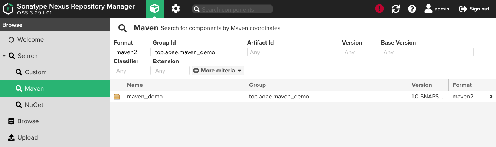

# 一、下载安装

下载地址：https://help.sonatype.com/repomanager3/download/

环境centos7

下载最新版的`nexus`到`/usr/local`目录中解压:

运行：`./bin/nexus start` 

停止：`./bin/nexus stop`

访问：http://192.168.25.7:8081, IP(192.168.25.7)是我虚拟主机的ip，要关闭防火墙才可以访问。

首次登录请查看登录窗口，查找出密码的位置。

# 二、使用

## 1、使用私服下载jar包

### 第一步：在nexus上配置代理仓库，配置阿里源

```
我配置的是maven-central代理仓库
使用的是maven-public组仓库
```

#### 第二步：配置本地仓库里的setting.xml

```xml
<mirrors>
	<!--要关闭原来的国内源-->
	<mirror> 
    	<!--仓库的id-->
	    <id>maven-public</id> 
    	<!--仓库的名称-->
	    <name>maven-public</name> 
    	<!--仓库的url-->
	    <url>http://192.168.25.7:8081/repository/maven-public/</url> 
    	<!--要引入那些仓库，* 表示引入仓库组下的所有仓库-->
	    <mirrorOf>central</mirrorOf> 
	</mirror> 
```

### 第三步：新建项目查询

#### (1) quickstart

```sh
mvn archetype:generate -DgroupId=top.aoae.maven_demo -DartifactId=maven_demo -DarchetypeArtifactId=maven-archetype-quickstart -DinteractiveMode=false
```

#### (2) 运行结果

```sh
# 要清空了本地仓库，可以看出下载的地址已改为 http://192.168.25.7:8081
Downloading from maven-public: http://192.168.25.7:8081/repository/maven-public/org/apache/maven/archetype/maven-archetype-parent/1/maven-archetype-parent-1.pom

[INFO] Scanning for projects...
[INFO] 
[INFO] ------------------< org.apache.maven:standalone-pom >-------------------
[INFO] Building Maven Stub Project (No POM) 1
[INFO] --------------------------------[ pom ]---------------------------------
[INFO] 
[INFO] >>> maven-archetype-plugin:3.2.0:generate (default-cli) > generate-sources @ standalone-pom >>>
[INFO] 
[INFO] <<< maven-archetype-plugin:3.2.0:generate (default-cli) < generate-sources @ standalone-pom <<<
[INFO] 
[INFO] 
[INFO] --- maven-archetype-plugin:3.2.0:generate (default-cli) @ standalone-pom ---
[INFO] Generating project in Batch mode
[WARNING] No archetype found in remote catalog. Defaulting to internal catalog
[INFO] ----------------------------------------------------------------------------
[INFO] Using following parameters for creating project from Old (1.x) Archetype: maven-archetype-quickstart:1.0
[INFO] ----------------------------------------------------------------------------
[INFO] Parameter: basedir, Value: /Users/leyao/Documents/works/java/workspace-spring-tool-suite
[INFO] Parameter: package, Value: top.aoae.maven_demo
[INFO] Parameter: groupId, Value: top.aoae.maven_demo
[INFO] Parameter: artifactId, Value: maven_demo
[INFO] Parameter: packageName, Value: top.aoae.maven_demo
[INFO] Parameter: version, Value: 1.0-SNAPSHOT
[INFO] project created from Old (1.x) Archetype in dir: /Users/leyao/Documents/works/java/workspace-spring-tool-suite/maven_demo
[INFO] ------------------------------------------------------------------------
[INFO] BUILD SUCCESS
[INFO] ------------------------------------------------------------------------
[INFO] Total time:  1.770 s
[INFO] Finished at: 2020-12-30T15:53:34+08:00
[INFO] ------------------------------------------------------------------------
```

## 2、将自己的项目上传到私有仓库

### 第一步：设置本地maven的setting.xml配置文件

```xml
 <servers>
		
   <!-- 下面我配置3个仓库 -->
   
    <server>
      <!--私有仓库名称-->
      <id>maven-public</id>
      <!--私有仓库用户名-->
      <username>admin</username>
      <!--私有仓库密码-->
      <password>admin</password>
    </server>
		
   <!-- 稳定版的仓库 -->
    <server>
      <id>maven-releases</id>
      <username>admin</username>
      <password>admin</password>
    </server>
   
		<!-- 开发版的仓库 -->
    <server>
      <id>maven-snapshots</id>
      <username>admin</username>
      <password>admin</password>
    </server>

  </servers>
```

### 第二步：配置项目的pom.xml文件

```xml
<project xmlns="http://maven.apache.org/POM/4.0.0"
	xmlns:xsi="http://www.w3.org/2001/XMLSchema-instance"
	xsi:schemaLocation="http://maven.apache.org/POM/4.0.0 http://maven.apache.org/maven-v4_0_0.xsd">
	<modelVersion>4.0.0</modelVersion>
	<groupId>top.aoae.maven_demo</groupId>
	<artifactId>maven_demo</artifactId>
	<packaging>jar</packaging>
	<!-- 如果version是包含SNAPSHOT结束的话，那就是开发版 -->
	<version>1.0-SNAPSHOT</version>
	<name>maven_demo</name>
	<url>http://maven.apache.org</url>
	<dependencies>
		<!-- 
			... ...
 		-->
	</dependencies>

  <!-- TODO 最重要的是这里 -->
	<distributionManagement>
		<!-- 上传稳定版或者发行版 -->
		<repository>
			<id>maven-releases</id>
			<url>http://192.168.25.7:8081/repository/maven-releases/</url>
		</repository>
		<!-- 上传开发版，或者不稳定版 -->
		<snapshotRepository>
			<id>maven-snapshots</id>
			<url>http://192.168.25.7:8081/repository/maven-snapshots/</url>
		</snapshotRepository>
	</distributionManagement>
</project>
```

### 第三步：上传

命令如下：

```sh
mvn deploy
```



## 3、使用私有仓库上的项目

个人上传到私有仓库的代码<b style="color:deeppink;">是不能直接通过以下方式拉取</b>的，因为个人上传到私有仓库上的项目是存放在`稳定版仓库`或`开发版仓库`中，不没有存放在`中央仓库`里。

```xml
<!-- 当然，引入依赖的时候还是要加入下面代码 -->
<dependency>
  <groupId>top.aoae.maven_demo</groupId>
  <artifactId>maven_demo</artifactId>
  <version>1.0-SNAPSHOT</version>
</dependency>
```

解决方式是修改maven的settings.xml文件里的<profiles .../> 及 <activeProfiles .../> 标签

### （1）修改 <profiles .../>

```xml
<profile>
      <id>maven-public</id>
      <repositories>
        <repository>
          <id>maven-public</id>
          <name>maven-public</name>
          <!--仓库组的路由-->
          <url>http://192.168.25.7:8081/repository/maven-public/</url>
           <!-- maven-releases 仓库 -->
          <maven-releases>
          	<enabled>true</enabled>
          </maven-releases>
          <!-- maven-snapshots 仓库 -->
          <maven-snapshots>
          	<enabled>true</enabled>
          	<updatePolicy>always</updatePolicy>
          </maven-snapshots>
        </repository>
      </repositories>
    </profile>
```

### （2）修改 <activeProfiles .../>

```xml
<activeProfiles>
  <activeProfile>maven-public</activeProfile>
</activeProfiles>
```

