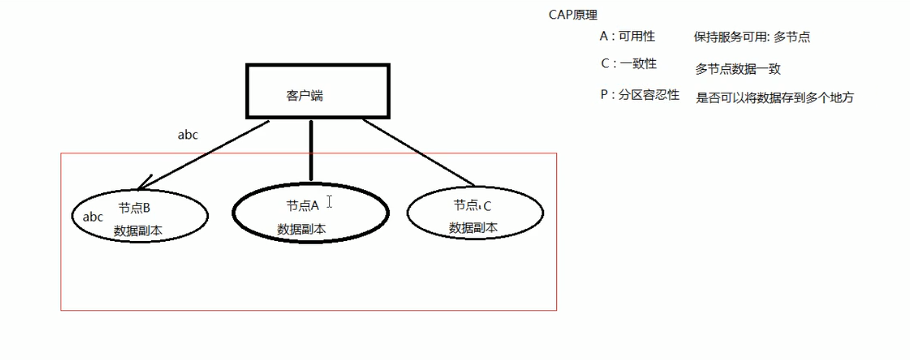
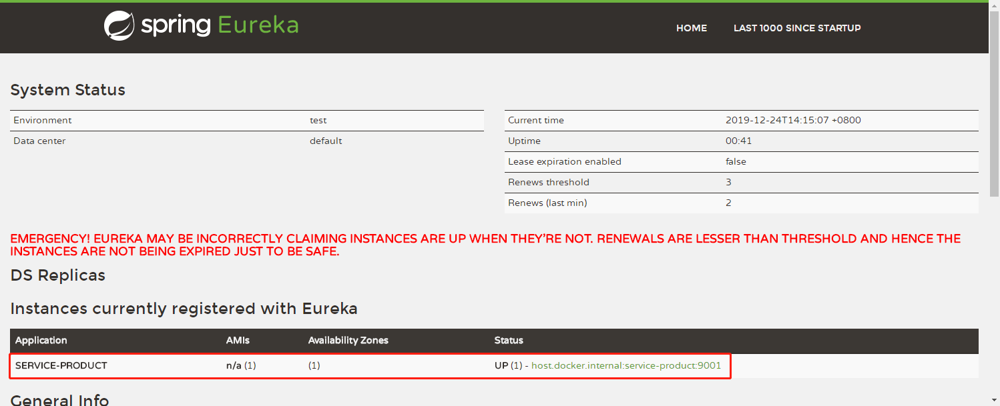
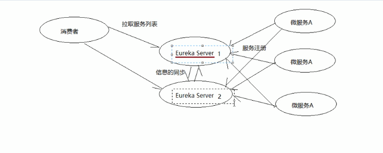
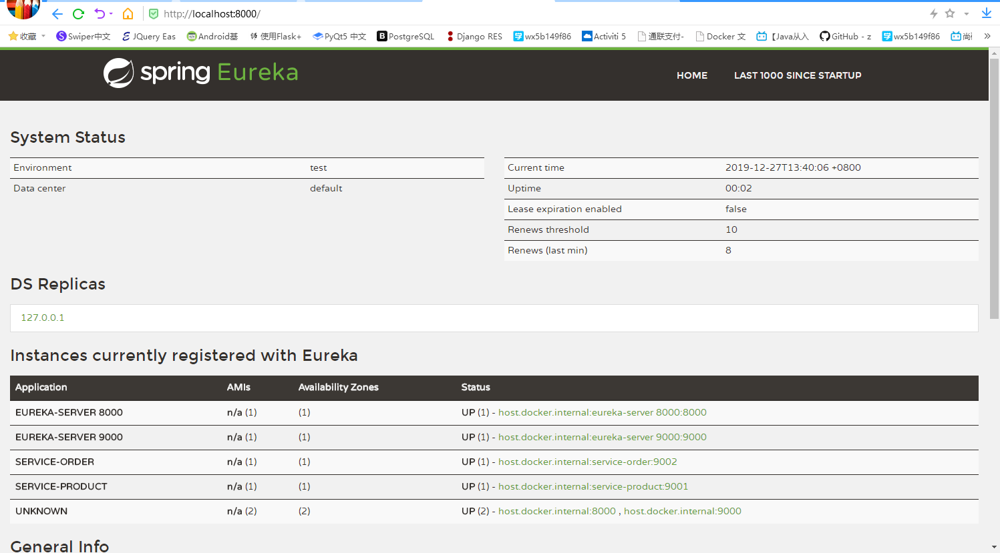
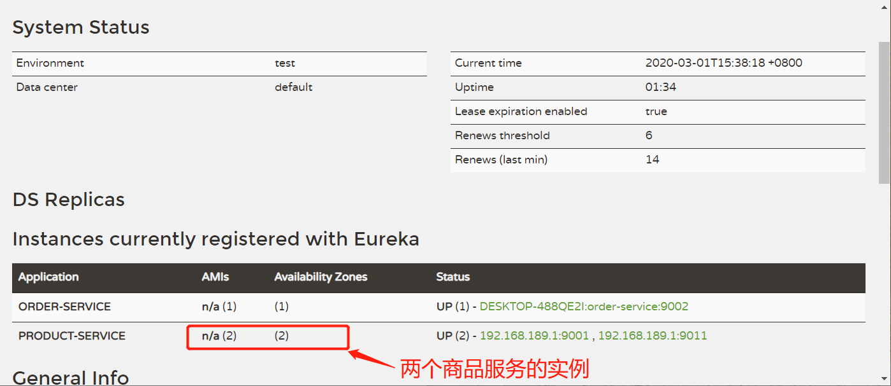

# Spring Cloud 快速入门

* 微服务的基础知识，SpringCloud介绍，注册中心，Ribbon
* Feign组件，hystrix熔断
* 微服务API网关，链路追踪
* 消息中间件处理，分布式配置中心

## 一、系统架构

### 1、单体应用

* 优点：用开发简单，适用于小型应用

* 缺点：不易拓展，维护。代码耦合

### 2、垂直应用架构

优点：

* 解决高并发问题
* 针对不同的模块优化
* 方便水平扩展

缺点：

* 系统间相互独立
* 重复开发工作

### 3、分布式架构

缺点：服务的评估，治理，高度

### 4、SOA框架

SOA全称为Service-Oriented Arthitecture，就是面向服务架构。它可以根据需求通过网络松散耦合的粗粒度应用组件（服务）进行分布式部署，组合和使用。一个服务通常以独立的形式存在于操作系统进程中。

站在功能的角度，把业务逻辑抽象成可复用、可组装的服务，通过服务的编排实现的快速再生，目的：把原先固有的业务功能转变为通用的业务服务，实现业务逻辑的快速复用。

通过上面的描述可以发现SOA有如下几个特点：分布式、可重用、扩展灵活、松耦合

如：ESB，Dubbo等框架

优点：

* 抽取公共的功能为服务，提高开发效率
* 对不同的服务进行集群化部署解决系统压力
* 基于ESB/DUBBO减少系统耦合

缺点：

* 抽取公共的功能为服务，降低开发效率
* 用户提供方与调用方接口耦合度较高

### 5、微服务架构

优点：

* 通过服务的原子化拆分，以及微服务的独立打包、部署和升级，小团队交付周期将缩短，运维成本也将大幅度下降
* 

* 微服务过多，服务治理成本高，不利于系统维护。
* 分布式系统开发的技术成本高(容错、分布式事务)。

| 功能     | SOA                  | 微服务                       |
| -------- | -------------------- | ---------------------------- |
| 组件大小 | 大块业务逻辑         | 单独任务或小块业务逻辑       |
| 耦合     | 通常松耦合           | 总是松耦合                   |
| 公司架构 | 任何类型             | 小型、专注于功能交叉团队     |
| 管理     | 着重中央管理         | 着重分散管理                 |
| 目标     | 确保应用能够交互操作 | 执行新功能、快速拓展开发团队 |
| 调用     | RPC                  | HTTP RestFul Api             |

## 二、系统架构的演变

### 1、远程调用


流行的技术有两种：RPC、HTTP

#### 1）、PRC协议


PRC(Remote Procedure Call)一种进程间通信方式。允许像调用本地服务一样调用远程服务。PRC框架的主要目标就是让远程服务调用更简单、透明。PRC框架负责屏蔽底层的传输方式（TCP或UDP）、序列化方式和通信细节。开发人员在使用的时候只需了解谁在什么位置提供了会什么样的远程服务接口，不需要关心底层通信细节和调用过程。

#### 2）、Http协议

| 比较项   | Restful    | PRC     |
| -------- | ---------- | ------- |
| 通讯协议 | Http       | RPC     |
| 性能     | 略低       | 较高    |
| 灵活度   | 高         | 低      |
| 应用     | 微服务架构 | SOA架构 |

### 2、CAP原理

如今，对于大多数互联网应用，分布式系统正变得越来越重要。分布式系统的最大难点，就是各个节点的状态如何同步。CAP定理是这方面的定量，也是理解分布式系统的起点。

CAP理论由`Eric Brewer`在ACM研讨会上提出，而后CAP被奉为分布式领域的重要理论。分布式系统的CAP理论，首先把分布系统中的本个特性进行如下归纳：



* A: 可用性，保持服务可用，多节点
* C：一致性，多个节点数据一致
* P：分区容忍性，是否可以将数据存到多个地方

## 三、Spring Cloud

<u>Spring Cloud</u>是一系列框架的有序集合。它利用Spring Boot的开发便利性巧妙地简化了分布式系统基础设施的开发，如**服务发现注册、配置中心、消息总线、负载均衡、断路器、数据监控**等，都可以用Spring Boot的开发风格做到一键启动和部署。Spring Cloud并没有重复制造轮子，它只是将目前各家分司比较成熟、经得起实际的服务框架组合起来，通过Spring Boot风格进行再封装屏蔽掉了复杂的配置和实现原理，最终给开发者留出一套简单易懂、易部署和易维护的分布式系统开发工具包。

**Spring Cloud Netflix**组件

| 组件名称 | 作用           |
| -------- | -------------- |
| Eureka   | 服务注册中心   |
| Ribbon   | 客户端负载均衡 |
| Feign    | 声明式服务调用 |
| Hystrix  | 客户端容错保护 |
| Zuul     | API服务网关    |

**Spring Cloud Alibaba组件**

| 组件名称 | 作用           |
| -------- | -------------- |
| Nacos    | 服务注册中心   |
| Sentinel | 客户端容错保护 |

**Spring Cloud原生及其他组件**

| 组件名称      | 作用           |
| ------------- | -------------- |
| Consul        | 服务注册中心   |
| Config        | 分布式配置中心 |
| Gateway       | API服务网关    |
| Sleuth/Zipkin | 分布式链路追踪 |

### 1、注册服务

#### (1)、注册中心的主要作用

##### 1) 服务发现

* 服务注册/反注册
* 服务订阅/取消订阅
* 服务路由(可选)

##### 2) 服务配置

* 配置订阅：服务提供者和服务调用者订阅服务相关配置
* 配置下发：主动将配置推送给服务提供者调用者

##### 3) 服务健康检测

* 检测服务提供者的健康情况

#### (2)、常见注册中心

**Zookeeper**

zookeeper是一个分布式服务框架，是Apache Hadoop的一个子项目，主要用来解决分布式应用中常见问题，如：统一命名服务、状态同步服务，集群管理、分布式应用项目项管理等

**Eureka**

Eureka是在java语言上，基于Restful Api开发的服务注册与发现组件，SpringCloud Netflix的重要组件

**Consul**

是由HashiCorp基于Go语言开发的支持多数据中心分布高可用的服务发布和注册服务软件，采用Raft算法保证服务的一致性，支持健康检查

**Nacos**

Nacos是一个更易构建云原生应用的动态服务发现、配置管理服务管理平台。

| 组件名                                 | 语言 | CAP  | 一致性算法 | 服务健康检查 | 对外暴露接口 |
| -------------------------------------- | ---- | ---- | ---------- | ------------ | ------------ |
| <span style='color:blue'>Eureka</span> | Java | AP   | 无         | 可配支持     | HTTP         |
| <span style='color:blue'>Consul</span> | GO   | CP   | Raft       | 支持         | Http/DNS     |
| Zookeeper                              | Java | CP   | Paxos      | 支持         | 客户端       |
| <span style='color:blue'>Nacos</span>  | Java | CP   | AP         | 支持         | HTTP         |

* 蓝色表示spring cloud常用的注册中心

### 2、Eureka

#### (1) Eureka基础知识

Eureka是Netflix开发的服务发现框架，SpringCloud将它集成在自己的子项目spring-cloud-netflix中，实现Spring Cloud的服务发现功能。

服务提供者(微服务)启动的时候，就会向Eureka Service注册微服务


上图简要描述了Eureka的基本架构，由3个角色组成：

##### 1）、Eureka Server

* 提供服务注册和发现

##### 2）、Service Provider

* 服务提供方
* 将自身服务注册到Eureka，从而使用服务消费方能够找到
* Eureak Provider 每30秒向 Eureak Server 发送心跳，如果断开心跳，就取消注册

##### 3)、Service Consumer

* 服务消息者
* Service Consumer会拉取所有注册的信息，保存到内存中

#### （2）、使用Eureka步骤

##### 第一步 搭建 eureka server

###### A 创建工程

略。

###### B 导入坐标

```xml
<?xml version="1.0" encoding="UTF-8"?>
<project xmlns="http://maven.apache.org/POM/4.0.0"
         xmlns:xsi="http://www.w3.org/2001/XMLSchema-instance"
         xsi:schemaLocation="http://maven.apache.org/POM/4.0.0 http://maven.apache.org/xsd/maven-4.0.0.xsd">
    <parent>
        <artifactId>spring_cloud_demo</artifactId>
        <groupId>cn.itcast</groupId>
        <version>1.0-SNAPSHOT</version>
    </parent>
    <modelVersion>4.0.0</modelVersion>

    <artifactId>eureka_server</artifactId>

    <dependencies>
        <dependency>
            <groupId>org.springframework.cloud</groupId>
            <artifactId>spring-cloud-starter-netflix-eureka-server</artifactId>
        </dependency>
    </dependencies>

</project>
```

**父工程配置，不用太关注**

```xml
<?xml version="1.0" encoding="UTF-8"?>
<project xmlns="http://maven.apache.org/POM/4.0.0"
         xmlns:xsi="http://www.w3.org/2001/XMLSchema-instance"
         xsi:schemaLocation="http://maven.apache.org/POM/4.0.0 http://maven.apache.org/xsd/maven-4.0.0.xsd">
    <modelVersion>4.0.0</modelVersion>

    <groupId>cn.itcast</groupId>
    <artifactId>spring_cloud_demo</artifactId>
    <version>1.0-SNAPSHOT</version>
    <modules>
        <module>product_service</module>
        <module>entity</module>
        <module>order_service</module>
    </modules>
    <packaging>pom</packaging>

    <parent>
        <groupId>org.springframework.boot</groupId>
        <artifactId>spring-boot-starter-parent</artifactId>
        <version>2.1.5.RELEASE</version>
    </parent>

    <properties>
        <project.build.sourceEncoding>UTF-8</project.build.sourceEncoding>
        <project.reporting.outputEncoding>UTF-8</project.reporting.outputEncoding>
        <java.version>1.8</java.version>
    </properties>

    <dependencies>
        <dependency>
            <groupId>org.springframework.boot</groupId>
            <artifactId>spring-boot-starter-web</artifactId>
        </dependency>
        <dependency>
            <groupId>org.springframework.boot</groupId>
            <artifactId>spring-boot-starter-logging</artifactId>
        </dependency>
        <dependency>
            <groupId>org.springframework.boot</groupId>
            <artifactId>spring-boot-starter-test</artifactId>
            <scope>test</scope>
        </dependency>
        <dependency>
            <groupId>mysql</groupId>
            <artifactId>mysql-connector-java</artifactId>
            <version>5.1.48</version>
        </dependency>
    </dependencies>

    <!-- spring cloud -->
    <dependencyManagement>
        <dependencies>
            <dependency>
                <groupId>org.springframework.cloud</groupId>
                <artifactId>spring-cloud-dependencies</artifactId>
                <!--Spring Cloud的版本-->
                <version>Greenwich.RELEASE</version>
                <type>pom</type>
                <scope>import</scope>
            </dependency>
        </dependencies>
    </dependencyManagement>

    <repositories>
        <repository>
            <id>spring-snapshots</id>
            <name>Spring Snapshots</name>
            <url>http://repo.spring.io/libs-snapshot-local</url>
            <snapshots>
                <enabled>true</enabled>
            </snapshots>
        </repository>
        <repository>
            <id>spring-milestones</id>
            <name>Spring Milestones</name>
            <url>http://repo.spring.io/libs-milestone-local</url>
            <snapshots>
                <enabled>false</enabled>
            </snapshots>
        </repository>
    </repositories>
</project>
```

###### C 配置application.yml

```yaml
server:
  port: 9000  # 这里我冲突了，所以改为 10000

# 配置 eureka server
eureka:
  instance:
    hostname: localhost # 主机地址名
  client:
    register-with-eureka: false # 是否将自己注册到注册中心
    fetch-registry: false # 是否要从Eureka中获取注册信息
    # 配置暴露给Eureka Clientr 的请求地址
    service-url:
      defaultZone: http://${eureka.instance.hostname}:${server.port}/eureka/

```

###### D 配置启动类

```java
@SpringBootApplication
@EnableEurekaServer  // 通过这个注解激活 eureak server
public class EurekaApplication {
    public static void main(String[] args) {
        SpringApplication.run(EurekaApplication.class, args);
    }
}
```

##### 第二步 将服务提供者注册到 eureka Server上

###### A 引入EurekaClient的坐标

```xml
<dependencies>
    <!-- TODO 引入 eureka client 坐标 -->
    <dependency>
        <groupId>org.springframework.cloud</groupId>
        <artifactId>spring-cloud-starter-netflix-eureka-client</artifactId>
    </dependency>
```

###### 修改application.yml添加EurekaServer的信息

```yaml
server:
  port: 9001
spring:
  application:
    name: service-product
  datasource:
    driver-class-name: com.mysql.jdbc.Driver
    url: jdbc:mysql://localhost:3306/cloud_show?useUnicode=true&characterEncoding=utf8
    username: root
    password: root
  jpa:
    database: mysql
    show-sql: true
    open-in-view: true

# 配置Eureka
eureka:
  client:
    service-url:
      defaultZone: http://localhost:9000/eureka/
  instance:
    prefer-ip-address: true # 使用ip地址注册
```

###### 修改启动类，添加服务发现的支持

```java
@SpringBootApplication
@EntityScan("cn.itcast.product")
@EnableDiscoveryClient // 激活 eurekaClient
public class ProductApplication {
    public static void main(String[] args) {
        SpringApplication.run(ProductApplication.class, args);
    }
}
```

###### 查看服务



##### 第三步 服务消费者通过注册中心获取服务列表，并调用

###### 获取微服务的调用路径

```java
@RestController
@RequestMapping("/order")
public class OrderController {

    @Autowired
    private RestTemplate restTemplate;
    
    /**
     * spring cloud 提供的获取原数据的工具类
     * 调用方法获取服务的元数据信息
     */
    @Autowired
    private DiscoveryClient discoveryClient;

    @RequestMapping(value = "/buy/{id}", method = {RequestMethod.GET})
    public Product findById(@PathVariable Long id) {
        // 获取 eureka 注册中心的元数据
        List<ServiceInstance> instances = discoveryClient.getInstances("service-product");
        ServiceInstance instance = instances.get(0); // 第一条记录就是 service-product 服务
        Product product = restTemplate.getForObject("http://" + instance.getHost() + ":" + instance.getPort() + "/product/" + id, Product.class);
        return product;
    }

}
```

#### (3) Eureka Server高可用集群



##### 1）准备2个Eureka Server 相互注册

###### Eureka Server 1 号机

```yaml
server: 
	port: 9000
eureka:
	client:
		service-url:
			# 9000端口的eureka注册到了 10000端口下
			defaultZone: http://127.0.0.1:10000/eureka
```

###### Eureka Server 2 号机

```yaml
server: 
	port: 10000
eureka:
	client:
		service-url:
			# 10000端口的eureka注册到了 9000端口下
			defaultZone: http://127.0.0.1:9000/eureka
```

##### 2）将微服务注册到两个Eureka Server上

开发时，只需要注册到一台Eureka Server上就可以，其它Eureka Server会自动读取的微服务的数据。

```yaml
# 配置 eureka client 配置
eureka:
  client:
    service-url:
      # eureka server 请求的路径，多个使用","分隔
      defaultZone: http://localhost:9000/eureka/,http://localhost:9000/eureka/ 
  instance:
    prefer-ip-address: true # 使用ip地址注册
```

如图：



#### （4）设置Eureka心跳时间

默认是30秒

```yaml
server:
  port: 9001  # 微服务的商品
spring:
  application:
    name: service-product  # 微服务名称
  datasource:
    driver-class-name: com.mysql.jdbc.Driver
    url: jdbc:mysql://localhost:3306/cloud_show?useUnicode=true&characterEncoding=utf8
    username: root
    password: root
  jpa:
    database: mysql
    show-sql: true
    open-in-view: true

# 配置 eureka client 配置
eureka:
  client:
    service-url:
      defaultZone: http://localhost:9000/eureka/,http://localhost:8000/eureka/  # eureka server 请求的路径，多个使用","分隔
  instance:
    prefer-ip-address: true # 使用ip地址注册
    instance-id: ${spring.cloud.client.ip-address}:${server.port} # 向注册中心中注册服务id, 不设置显示默认id
    lease-renewal-interval-in-seconds: 5  # TODO 心跳间隔 5 秒
    lease-expiration-duration-in-seconds: 30  # TODO 续约到期时间，心跳停止后续约
```

#### （5）关闭Eureka自我保护机制

在开发的时候，关闭Eureka自我保护机制会，微服务宕机后立刻会发现，不需要等待心跳。

**eureka server的配置：**

```yaml
server:
  port: 10000

spring:
  application:
    name: eureak-server

# 配置 eureka server
eureka:
  instance:
    hostname: localhost
  client:
    register-with-eureka: false # 是否将自己注册到注册中心
    fetch-registry: false  # 是否要从Eureka获取注册信息
    service-url:
      # 暴露给 Eureka Client的请求地址，的配置
      defaultZone: http://${eureka.instance.hostname}:${server.port}/eureka/
  server:
    enable-self-preservation: false  # 关闭自我保护机制
    eviction-interval-timer-in-ms: 4000  # 设置剔除用服务间隔（默认90秒）
```

#### （6）Eureka源码解析

##### 1）SpringBoot中的自动装载

###### ImportSelector

ImportSelector接口是Spring导入外部配置的核心接口，在SpringBoot的自动化配置和@EnableXXXX（功能）中起到了决定性的作用。当在@Configuration标注的Class上使用@Import引入一个ImportSelector实现类后，会把实现类中返回Class名称都都定义为Bean

```java
public interface ImportSelector {
	String[] selectImports(AnnotationMetadata var1);
}
```

**Spring自动加载流程**

```flow
st=>start: 启动类
springboot=>operation: @SpringBootApplication
enableAutoConfigation=>operation: @EnableAutoConfiguration
import=>operation: @Import({AutoConfigurationImportSelector.class})
selectImports=>condition: selectImports
loadMetadata=>operation: AutoConfigurationMetadataLoader.loadMetadata
e=>end: 结束框
st(right)->springboot(right)->enableAutoConfigation->import->selectImports
selectImports(yes)->
selectImports(no)->
```

###### 第一步，定义User的Bean

```java
public class User {
    private String username;
    private Integer age;
	// setting && getting .......
}
```

######  第二步，定义UserConfiguration配置类

```java
/**
 * 没有Spring注解，容器启动的时候不会加载注解
 */
public class UserConfituration {

    @Bean
    public User getUser(){
        User user = new User();
        user.setAge(18);
        user.setUsername("哈哈哈");
        return user;
    }
}
```

###### 第三步，定义UserImportSelector类，继承ImportSelector

```java
/**
 * 暴露给注解类
 */
public class UserImportSelector implements ImportSelector {
    @Override
    public String[] selectImports(AnnotationMetadata annotationMetadata) {
        // 获取配置类的名称,注解类调用
        return new String[]{UserConfituration.class.getName()};
    }
}
```

###### 第四步，定义使用注解

```java
/**
 * 定义注解
 */
@Retention(RetentionPolicy.RUNTIME)
@Documented
@Target(ElementType.TYPE)
@Import(UserImportSelector.class) // 引入了第三步中定义的 ImportSelector
public @interface EnableUserBean {
}
```

###### 第五步，应用注解

```java
/**
 * TODO，通过 ImportSelector接口就可以引入外部的Bean配置
 * EnableUserBean --> UserImportSelector --> UserConfiguration --> User --> IOC容器
 */
@EnableUserBean
public class TestApplication {
    public static void main(String[] args) {
        AnnotationConfigApplicationContext ac = 
            new AnnotationConfigApplicationContext(TestApplication.class);
        User bean = ac.getBean(User.class);
        System.out.println(bean);
    }
}
```

### 3 、Ribbon

Ribbon是etfixfa开发的一个负载均衡器，有助于控制http和tcp客户端行为。在SpringCloud中，**Eureak一般内置Ribbon进行使用**，Ribbon提供了客户端负载均衡的功能，Ribbon利用从Eureka中读取的服务信息，在调用服节点提供的服务时，会合理的进行负载。它的作用主要是以下两个：

* 服务调用
* 负载均衡

#### (1)、服务调用

eureka 内部继承了 Ribbon。

##### 1) 在创建RestTemplate的时候，声明@LoadBalanced

```java
@SpringBootApplication
@EntityScan("cn.itcast.order")
@EnableEurekaClient
public class OrderApplication {

    @LoadBalanced  // 是Ribbon提供的负载均衡的注解
    @Bean
    public RestTemplate getRestTemplate(){
        return new RestTemplate();
    }

    public static void main(String[] args) {
        SpringApplication.run(OrderApplication.class, args);
    }
}
```

##### 2) 使用RestTemplate调用微服务，不需要拼接微服务的URL，使用"服务名"称替换IP地址

使用`服务名`的好处就是不在写ip地址，这样Ribbon就可以自动通过`服务名`来分配不同的节点进行服务调用，实现负载均衡。

```java
/**
     * 基于Ribbon的形式调用远程微服务
     * @param id
     * @return
 */
@RequestMapping(value = "/ribbon/{id}", method = RequestMethod.GET)
public Product ribbonFindById(@PathVariable(name = "id") Long id) {
    // 使用服务名称替换ip地址和端口号，来调用微服务
    Product product = restTemplate
        .getForObject("http://service-product/product/" + id, Product.class);
    return product;
}
```

#### (2) 负载均衡

* 服务端负载均衡：Nginx

* 客户端负载均衡

Ribbon是一个典型的客户端负载均衡，Ribbon会获取服务的所有地址，根据内部负载算法，获取本次请求的有效地址

准备两个商品微服务(9001有9011)，在订单系统中远程以负载均衡的方式调用服务。只需要在创建**RestTemplate**时加入**@LoadBalanced**就可以，不需要做任何操作。



#### (3) 负载均衡策略

* RoundRobinRule: 以轮询的方式进行负载均衡（默认）
* RandomRule: 随机策略
* WeightedResponseTimeRule: 权重策略
* BaseAvailableRule: 最佳策略，过滤掉故障实现，返回请求数最小的实例

其它策略，略...... order-server配置如下

```yaml
server:
  port: 9002  # 微服务的商品
spring:
  application:
    name: service-order  # 微服务名称

# 配置 eureka client 配置
eureka:
  client:
    service-url:
      defaultZone: http://localhost:9000/eureka/ # eureka server 请求的路径
  instance:
    prefer-ip-address: true # 使用ip地址注册
    instance-id: ${spring.cloud.client.ip-address}:${server.port} # 向注册中心中注册服务id, 不设置显示默认id
    lease-renewal-interval-in-seconds: 5  # 心跳间隔 5 秒
    lease-expiration-duration-in-seconds: 10  # 续约到期时间，心跳停止后续约
    
# todo 修改Ribbon的负载均衡策略
service-product:  # 服务名称
  ribbon:  # ribbon
    NFLoadBalancerRuleClassName: com.netflix.loadbalancer.RandomRule  # 使用随机策略
```

#### (4) 请求重试机制

引入 Spring的重试组件，对Ribbon进行重试

```xml
<!-- 在 service-order 的 pom.xml文件中 -->
<!-- spring boot 重试坐标 -->
<dependency>
    <groupId>org.springframework.retry</groupId>
    <artifactId>spring-retry</artifactId>
</dependency>
```

order-server -> application.yml中配置

```yaml
# 修改Ribbon的负载均衡策略
service-product:
  ribbon:
    # NFLoadBalancerRuleClassName: com.netflix.loadbalancer.RandomRule  # 使用随机策略
    ConnectTimeout: 250  # 创建连接的超时时间
    ReadTimeout: 1000    # 读数据时间
    OkToRetryOnAllOperations: true  # 是否对所有的所作都进行重试
    MaxAutoRetriesNextServer: 1  # 切换实例重试次数
    MaxAutoRetries: 1  # 对当前实例的重试次数

logging:
  level:
    root: debug
```

### 4、Consul注册中心

consul三个主要的应用场景：

- 服务发现

- 服务隔离

- 服务配置

**Consul**是HashiCorp公司推出的开源工具，用于实现分布式系统的服务发现与配置。与其它分布式服务注册与发现的方案比较，Consul的方案更“一站式”，<span style="color: #C10066;font-weight:900;">内置了服务注册与发现框架、分布一致性协议实现、健康检查、Key/Value存储、多数据中心方案，不再需要依赖其它工具(比如：Zookeeper等)</span>。使用简单。Consul使用go语言编写，因此天生可移植；安装包仅包含一个可执行文件，方便部署，与docker无缝配合。

Consul强一致性(CP)，不管有多个少节点，每个节点的数据是一致的；但是在节点启动的时候会有偏差。

- 服务注册相比Eureka稍慢。因为Consul的raft协议要求必需过半数的节点写入成功才认为注册成功
- leader挂掉时，重新选举期间整个consul不可使用，保证了强一致性，但牺牲了可用性

Consul不同于Eureak需要单独安装，访问Consul官网下载Consul的最新版本，根据不同的系统选择不同的安装包，Consul支持所有主流系统。

https://www.consul.io/

#### 1）安装&运行

我使用的版本是 1.5.3

下载并解压到一个全英文的目录下。在这个目录里，打开控制台，运行如下 命令：

```sh
consul agent -dev -client=0.0.0.0
#注意：在windows系统不要使用powershell,使用默认的cmd
```

访问：http://localhost:8500，界面如下：


#### 2）Consul的基本使用

Consul支持健康检查，并提供了HTTP/DNS调用API接口完成服务注册，服务发现，以及K/V存储功能

##### （1）测试一下，注册一个服务到 consul

```js
PUT http://localhost:8500/v1/catalog/register
{
    "Datacenter": "dc1",
    "Node": "node01",
    "Address": "127.0.0.1",
    "Service": {
        "ID": "mysql-01",
        "Service": "mysql",
        "tags": ["master","v1"],
        "Address": "127.0.0.1",
        "Port": 3306
    }
}

# 查询注册的节点
GET http://localhost:8500/v1/catalog/nodes
```

#### 3）入门案例

##### （1）服务注册

* 提供一个商品微服务
* 提供一个订单系统

将服务注册到注册中心consul，服务消费者从服务中心。

product_service服务引入jar包

```xml
<!--spring cloud提供对基于consul的服务发现-->
        <dependency>
            <groupId>org.springframework.cloud</groupId>
            <artifactId>spring-cloud-starter-consul-discovery</artifactId>
        </dependency>

        <!--actuator的健康检查-->
        <dependency>
            <groupId>org.springframework.boot</groupId>
            <artifactId>spring-boot-starter-actuator</artifactId>
            <version>2.1.4.RELEASE</version>
        </dependency>
```

product_service的application.yaml文件

```yaml
 # 配置consul服务注册
  cloud:
    consul:
      host: 127.0.0.1
      port: 8500
      discovery:
        # 是否需要注册
        register: true
        # 注册的实例ID(唯一标识)
        instance-id: ${spring.application.name}-1  # 推荐使用ip + 端口
        # 服务的请求端口
        service-name: ${spring.application.name}
        # 服务请求端口
        port: ${server.port}
        # 指定开启ip地址注册
        prefer-ip-address: true
        # 当前服务的请求ip
        ip-address: ${spring.cloud.client.ip-address}

```

开启product service 服务

##### （2）服务调用

引入上一步“服务注册”中的坐标，并且application.yaml也加入“服务注册”中的配置。启动


这时候，打开管理平台，就会看到 order-service和product-service两个服务了。同样，使用Consul作为注册中心，也可以使用 `@LoadBalanced`注解对`RestTemplage`进行注解。

**RestTemplate Bean的注册**

```java
class xxxConfig	
	// 和之前使用Eureka是一样的
	@LoadBalanced
    @Bean(name = "restTemplate")
    public RestTemplate getRestTemplate(){
        return new RestTemplate();
    }
    // ......
```

**使用RestTemplate**

```java
/**
     * 使用RestTemplage来调用服务,它是Spring提供的
     *
     * @param id
     * @return
     */
    @RequestMapping(value = "/buy/{id}", method = RequestMethod.GET)
    public Product findById(Integer id) {
    	// todo 和之前使用Eureka是一样的
        Product product = restTemplate
        	.getForObject("http://product-service/product/1", Product.class);
        return product;
    }
```

#### 4）Consul高可用集群

##### （1）理论

###### （a）consul的节点类型

consul启动命令详解，consul在启动一个守护进程的时候有三种启动方式，分别是 dev，client，server。

```sh
consul agent -dev -client=0.0.0.0
	-dev : 开发者模式，为了方便开发启用的。
		-client=0.0.0.0 客户端的IP地址(0.0.0.0表示不限制)
	-client: 是consul代理，和consul server 进行数据交互
		-- 在部署的时候，通常是一个微服务，一个client节点
	-server: 真正干活的consul服务
		-- 官方推荐的 server集群 3 - 5 台
```

参考下图：


###### （b）Gossip协议（流言协议）

好像流言一的传播放方式一样，如果集群中的其中一个节点感染了，就会随机感染其它节点，被感染的节点也会感染其它节点，从而整个集群的所有数据都一致。

- 所有的consul都会参与到gossip协议中（多节点中数据赋值）

###### （c）Raft协议

- 保证server群集数据一致。

Leader：是server集群中唯一处理客户端请求的，接到到数据会发送到 Follower

Follower：被动接收数据，可以选择其中一个节点为Leader

候选人：可以被选举为leader

##### （2）准备环境

| 服务器IP       | consul类型 | Node节点 | 序号 |
| -------------- | ---------- | -------- | ---- |
| 192.168.74.101 | server     | server-1 | s1   |
| 192.168.74.102 | server     | server-2 | s2   |
| 192.168.74.103 | server     | server-3 | s3   |
| 192.168.71.1   | client     | client-1 | c1   |

###### （a）启动 consul server 节点

```
consul agent -server -bootstrap-expect 3 -data-dir /etc/consul.d -node=server-1 -bind=192.168.74.101 -ui -client 0.0.0.0 &

consul agent -server -bootstrap-expect 2 -data-dir /etc/consul.d -node=server-2 -bind=192.168.74.102 -ui -client 0.0.0.0 &

consul agent -server -bootstrap-expect 2 -data-dir /etc/consul.d -node=server-3 -bind=192.168.74.103 -ui -client 0.0.0.0 &
```

- server: 以server身份启动
- bootstrap-expect：集群要求最小server数量，当低于这个数，集群失效
- data-dir：data存放的目录，更多信息请参阅consul数据同步机制
- node: 节点ID，在同一集群不能重复出现
- bind: 监听的ip地址
- client：客户端的IP地址(0.0.0.0表示不限制)
- &：在后台运行

###### （b）启动 consul client 节点

```
consul agent -client=0.0.0.0 -data-dir /etc/consul.d -bind=192.168.74.1 -node=client-1
```

现在已启动了4个节点了，但是目前4个节点都是相互独立的，并没有形成集群。

###### （c）每个节点加入集群

在 s2、s3 、c1 服务上通过consul join命令加入 s1中的consul集群中

```sh
# 加入到 s1的集群中
consul join 192.168.74.101
```

###### （d）查看集群信息

```sh
consul members
```

也可以访问任意一个点节：http://192.168.74.101:8500, 查看 Node 信息

###### （e）spring boot 里的 application.yml配置

和之前没有变化，绑定自己机器上的就行了

```yaml
spring:
    cloud:
        consul:
            host: 127.0.0.1
            port: 8500
            discovery:
                register: true
                instance-id: ${spring.application.name}-1
                service-name: ${spring.application.name}
                port: ${server.port}
                prefer-ip-address: true
                ip-address: ${spring.cloud.client.ip-address}
```

####  5）Consul常见问题

##### （1）节点和服务注销

当服务或者节点失效，Consul不会对注册的信息进行剔除，仅仅标记状态(并且不可使用)。如果担心失效节点和失效服务过多影响监控。可以通过调用http api的形式进行处理。

节点和服务的注销可以使用HTTP API:

- 注销任意节点和服务： /catalog/deregister
- 注销当前节点的服务：/agent/service/deregister/:service_id

如果某个节点不继续使用，也可以使用consul leave命令，或者在其它节点使用consull force-leave节点id。

##### （2）健康检查与故障转移

在集群环境下，健康检查是由服务注册到Agent来处理的，那么如果这个Agent挂掉了，那么此节点的健康检查就处于无人管理的状态。

从实际应用看，节点上服务可能即要被发现，又要发现别的服务，如果节点挂了，仅提供被发现功能实际服务还是不可用的。当然发现别的服务也可以不使用本机节点，可以通过访问一个Nginx实现若干Consul节点的负载来实现。

## 二、Feign组件、Hystrix组件、Sentinel组件

