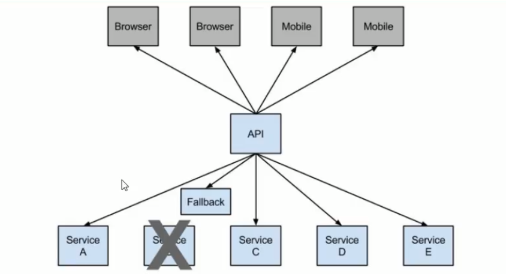
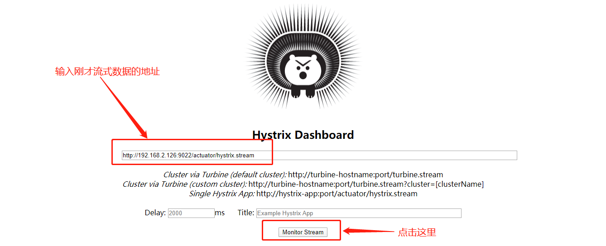
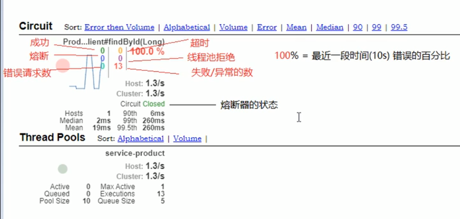
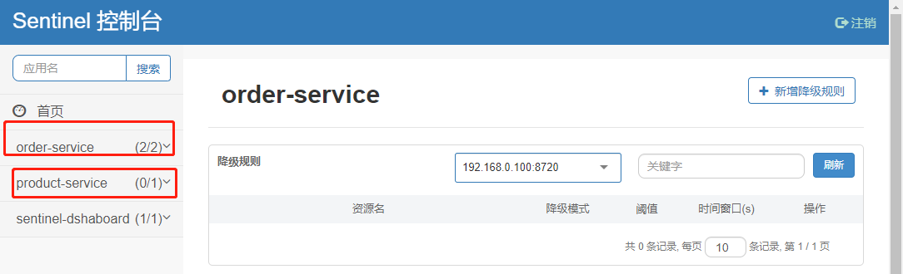
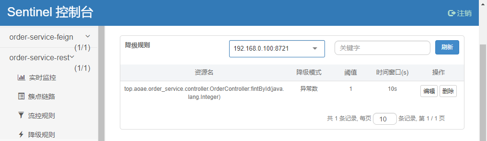
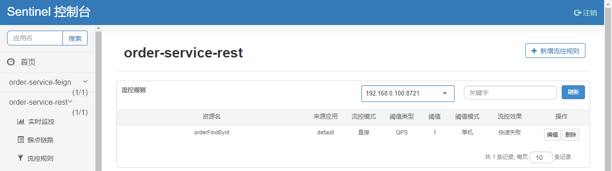

# 一、Feign组件

Feign是netfix开发的声明式，模板化的http客户端，其灵感来自Retrofit,JAXRS-2.0以及WebSocket

- Fegin可帮助我们更加便捷，优雅调用http api。
- 在springCloud中，使用feign非常简单——创建一个接口，并在接口上添加一些注解，代码就完成了
- Feign支持多种注解，例如Feign自带的注解或者JAX-RS注解等
- SpringCloud对Feign进行增加，使用Feign支持了SpringMVC注解，并整合Ribbon和Eureak，从而让Feigen使用更加方法

## 1、Feign使用

### 1）导入依赖

```xml
<dependency>
            <groupId>org.springframework.cloud</groupId>
            <artifactId>spring-cloud-starter-openfeign</artifactId>
</dependency>
```

### 2）配置调用接口

```java
/**
 * 声明需要调用的微服务的名称
 * @FeignClient
 *      * name: 服务提供者的名称
 *      * fallback: 配置熔断发生降级方法的实现类
 */
@FeignClient(name = "PRODUCT-SERVICE")
public interface ProductFeign {

    /**
     * 配置需要调用的微服务接口
     */
    @RequestMapping(value = "/product/{id}", method = RequestMethod.GET)
    public Product findById(@PathVariable(value = "id") Integer id);
}
```

### 3）在启动类上激活Feign

```java
@SpringBootApplication
/**
 * todo 激活 Feign
 */
@EnableFeignClients
public class OrderApplication {
    public static void main(String[] args) {
        SpringApplication.run(OrderApplication.class, args);
    }
}
```

### 4）通过自动的接口调用远程微服务

```java
@RestController
@RequestMapping("/order")
public class OrderController {
	
    /**
    * 直接引入就可以了，
    * 低版本的idea可能会报错，但还是可以正常运行
    */
    @Autowired
    private ProductFeign productFeign;

    @RequestMapping(value = "/buy/{id}", method = RequestMethod.GET)
    public Product findById(@PathVariable("id") Integer id){
        Product product = null;
        // 在这里使用
        product = productFeign.findById(id);
        return product;
    }
}
```

## 2、Feign的负载均衡

feign本身已经集成了Ribbon依赖和自动配置，因些不需要额外引入依赖，也不需要注册`RestTemplate`对象。另外，我们可以像上节课中讲的那样去配置Ribbon，可以通过`ribbon.xx`进行全局配置，也可以通过`服务名.ribbon.xx`来对指定服务的配置：

启动两个`product_server`服务

## 3、数据压缩、日志级别管理

Spring Cloud Feign支持对请求数据进行Gzip压缩，以减少通信过程中的性能损耗，通过下面参数可开启与响应压缩功能。

```yaml
feign:
	compression: 
		request: 
			enabled: true # 对请求数据压缩
		response:
			enabled: true # 对响应数据压缩
```

在开发或运行阶段希望看到Feign请求过程的日志记录，默认情况下Feign的日志是没有开启的。要想用属性配置方式达到日志效果，只需在`application.yml`中添加如下内容即可：

```yaml
# feign日志的输出
# NONE：不输出日志，BASIC：生产环境的日志，FULL：所有日志
feign:
  client:
    config:
      product-server:
        loggerLevel: FULL
```

# 二、性能

## 1、jmeter性能测试工具

Jmeter安装十分简单，解压，双击jmmter.bat就可以了

## 2、问题分析

tomcat会以线程池的形式对所有的请求进行统一管理，对于某个方法可能存在的耗时问题时，随着外面积压的请求越来越多，势必会造成系统的<span style="color:red">崩溃</span>。为了不影响其它接口的正常访问：可以对多个服务之间进行隔离。

- 1、线程池隔离
- 2、信号量隔离
- 3、这种是个人推荐的，使用MQ进行流量削峰

## 3、服务隔离

> 顾名思议，它指将系统按照一定的原则划分为若干个模块，各个模块之间相对独立，无强依赖。当有故障发生时，能将问题和影响隔离在某个模块内，而不扩散风险，不涉及其它模块，不影响整体的系统服务。

## 4、熔断降级



<span style="font-weight:900;color:blue;">熔断</span> 这一概念来源于电子工程断路器(circuit breaker)。在互联网系统中，当下游服务因访问压力过大而响应变慢或失败，上游服务为了保护系统整体的可用性，可以暂时切断下游服务的调用。<span style="color:blue;">这种牺牲局部，保全整体的措施就叫熔断</span>。

<span style="font-weight:900;color:blue;">降级</span>，就是当某个服务熔断后，服务器将不再被调用，此时客户端可以自己准备一个本地的`fallback`回调，返回一个缺省值。也可以理解为兜底。

## 5、服务限流

<span style="font-weight:900;color:blue;">限流</span> 可以认为服务降级的一种，限流就是限制系统的输入和输出的流量，达到保护系统的目的。一般来说系统的吞吐量是可以被测算的，为了保证系统的稳固运行，一旦达到需要限制的阈值，就需要限制流量，并采取少量措施以完成流量的目的。比方：<span style="color:blue;">推迟解决，拒绝解决、或部分拒绝解决的等</span>。

# 三、Hystrix

Hystrix是由Netflix开源的一个延迟和容错库，<u>用于隔离访问远程系统、服务或者第三方库，防止级联失败，从而提升系统的可用性与容错性。</u>Hystrix主要通过以下几点实现延迟和容错。

- **包裹请求：**使用HystrixCommand包裹对依赖的调用逻辑，每个命令在独立线程中执行。这使用了设计模式中的“命令模式”
- **跳闸机制：**当某服务的错误率超过一定的阈值时，Hystrix可以自动或手动跳闸，停止请求该服务一段时间
- **资源隔离：**Hystrix为每个依赖都维护一个小型的线程池(或信号量)。如果应线程池已满，发往该依赖的请求就被立即拒绝，而不是排队等待，从而回事失败判定。
- **监控：**Hystrix可以近乎实时地监控运行指标和配置的变化，例如成功、失败、超时、以及被拒绝的请求等
- **回退机制：**请求求失败，超时，被拒绝，或当断路器打开时，执行回退逻辑。回退由开发人员自行提供，例如返回一个缺省值
- **自我修复：**断路器打开一段时间后，会自动进入“半开”状态

**Hystrix组件**：对RestTemplate的支付，对Feign的支持

## 1、Hystrix对RestTemplate的支持

### 1）案例

#### （1）引入hystrix的依赖

```xml
<dependency>
    <groupId>org.springframework.cloud</groupId>
    <artifactId>spring-cloud-starter-netflix-hystrix</artifactId>
</dependency>
```

#### （2）在启动类中激活Hystrix

```java
@SpringBootApplication
@EnableCircuitBreaker // todo 激活 hystrix
public class OrderServiceApplication {

    @LoadBalanced // Ribbon提供的负载均衡的注解
    @Bean
    public RestTemplate getRestTemplate(){
        return new RestTemplate();
    }

    public static void main(String[] args) {
        SpringApplication.run(OrderServiceApplication.class, args);
    }
}
```

#### （3）配置熔断的触发降级逻辑

设置调用的<u>服务不能访问的时候</u>触发的逻辑

代码参考下一步：

#### （4）在需要收到保护的接口上使用@HystrixCommand配置

```java
@RestController
@RequestMapping("/order")
public class OrderController {

    @Autowired
    private RestTemplate restTemplate;

    /**
     * 使用注解配置熔断保护
     */
    @HystrixCommand(fallbackMethod = "orderFallback")  // 使用，降级逻辑：orderFallback
    @RequestMapping(value = "/buy/{id}", method = RequestMethod.GET)
    public Product fintById(@PathVariable Integer id) {
        System.out.println("xxxyyy...");
        Product product = restTemplate.getForObject("http://PRODUCT-SERVICE/product/" + id, Product.class);
        return product;
    }

    /**
     * 降级逻辑
     *  - 需要保存的方法：public Product fintById(@PathVariable Integer id) {...
     *  - 和需要收到保护的方法的返回值一致
     *  - 和需要收到保护的方法的参数一致
     */
    public Product orderFallback(Integer id)
    {
        Product p = new Product();
        p.setProductName("触发降级逻辑");
        return p;
    }
}
```

当请求`restTemplate.getForObject("http://PRODUCT-SERVICE/product/" + id, Product.class)`超时的时候结果如下：

```json
{
id: null,
productName: "触发降级逻辑",
status: null,
price: null,
productDesc: null,
caption: null,
inventory: null
}
```

**设置超时时间：**

```yaml
# 默认的超时时间是1秒，如果1秒没有响应，就会触发降级逻辑
hystrix:
  command:
    default:
      execution:
        isolation:
          thread:
            timeoutInMilliseconds: 3000  
```

### 2）指定统一的降级方法

对于一个控制器里，可能有多个方法需要用到降级逻辑，这时候可以使用一个统一的降级逻辑方法。

```java
@RestController
@RequestMapping("/order")
/**
 * @@DefaultProperties ：指定此控制器中公共的熔断设置
 *      - 如果在DefaultProperties指定了降级方法，在@HystrixCommand，就不需要要单独指定降级方法
 */
@DefaultProperties(defaultFallback = "defaultFallback")
public class OrderController {

    @Autowired
    private RestTemplate restTemplate;

    /**
     * 使用注解配置熔断保护
     */
    @HystrixCommand
    @RequestMapping(value = "/buy/{id}", method = RequestMethod.GET)
    public Product fintById(@PathVariable Integer id) {
        System.out.println("xxxyyy...");
        Product product = restTemplate.getForObject("http://PRODUCT-SERVICE/product/" + id, Product.class);
        return product;
    }

    /**
     * 统一的降级方法
     *  - 不能有参数
     * 	- 但接口的返回值必需一致
     * @return
     */
    public Product defaultFallback(){
        Product p = new Product();
        p.setProductName("触发降级逻辑");
        return p;
    }

}
```

## 2、Hystrix对Feign的支持

### 1）案例

#### （1）引入依赖

feign中已经继承了Hystrix的依赖


#### （2）在feign中配置开启Hystrix

```yaml
feign:
  client:
    config:
      service-product:
        loggerLevel: FULL # feign日志的输出
  # 开启对hystrix的支持
  hystrix:
    enabled: true
```

#### （3）自定义一个接口的实现类

之前在使用Feign的时候有创建过一个 ProdutFeign的接口，如下：

```java
@FeignClient(name = "PRODUCT-SERVICE")
public interface ProductFeign {
    @RequestMapping(value = "/product/{id}", method = RequestMethod.GET)
    public Product findById(@PathVariable("id") Integer id);
}
```

这个接口的**实现类**，就是熔断触发的降级逻辑

```java
public class ProductFeignImpl implements ProductFeign {
    /**
     * 熔断降级的方法
     * @param id
     * @return
     */
    @Override
    public Product findById(Integer id) {
        Product p = new Product();
        p.setProductName("Feign调用触发熔断降级方法");
        return p;
    }
}
```

#### （4）修改ProductFeign接口，添加降级方法的支持

```java
// fallback 指定这个接口的实现类即可
@FeignClient(name = "PRODUCT-SERVICE", fallback = ProductFeignImpl.class)
public interface ProductFeign {
    @RequestMapping(value = "/product/{id}", method = RequestMethod.GET)
    public Product findById(@PathVariable("id") Integer id);
}
```

**设置超时间：**

当在规定的时候内，没有获取到微服务的数据，这个时候会自动触发熔断降级方法

## 3、Hystrix的监控平台

hystrix实现实现容错功能，还提供了近乎实时的监控，HystrixCommand和HystrixObservableCommand在执行时，会生成执行结果和运行指标。比如每秒的请求数量，成功数量等。这些状态会显露在Actuator提供的/health端点中。只需为项目添加`spring-boot-actuator`依赖，重启项目，访问`/actuator/hystrix.stream`，即可看到实时的监控数据。

### 1）普通监控

#### （1）引入Hystrix监控依赖 

```xml
		<dependency>
            <groupId>org.springframework.boot</groupId>
            <artifactId>spring-boot-starter-actuator</artifactId>
        </dependency>
        <dependency>
            <groupId>org.springframework.cloud</groupId>
            <artifactId>spring-cloud-starter-netflix-hystrix</artifactId>
        </dependency>
        <dependency>
            <groupId>org.springframework.cloud</groupId>
            <artifactId>spring-cloud-starter-netflix-hystrix-dashboard</artifactId>
        </dependency>
```

#### （2）在启动类中激活hystrix

```java
@SpringBootApplication
@EnableEurekaClient
@EnableFeignClients
// 激活 hystrix
@EnableCircuitBreaker
public class OrderServiceApplication {
    public static void main(String[] args) {
        SpringApplication.run(OrderServiceApplication.class, args);
    }
}
```

#### （3）暴露应用的所有端点

```yaml
management:
  endpoints:
    web:
      exposure:
        include: '*' # 暴露所有的站点
```

#### （5）访问

`http://192.168.2.126:9022/actuator/hystrix.stream`，结果如下：

```
ping: 

data: {"type":"HystrixCommand","name":"ProductFeign#findById(Integer)","group":"PRODUCT-SERVICE","currentTime":1584156480041,"isCircuitBreakerOpen":false,"errorPercentage":0,"errorCount":0,"requestCount":0,"rollingCountBadRequests":0,"rollingCountCollapsedRequests":0,"rollingCountEmit":0,"rollingCountExceptionsThrown":0,"rollingCountFailure":0,"rollingCountFallbackEmit":0,"rollingCountFallbackFailure":0,"rollingCountFallbackMissing":0,"rollingCountFallbackRejection":0,"rollingCountFallbackSuccess":0,"rollingCountResponsesFromCache":0,"rollingCountSemaphoreRejected":0,"rollingCountShortCircuited":0,"rollingCountSuccess":0,"rollingCountThreadPoolRejected":0,"rollingCountTimeout":0,"currentConcurrentExecutionCount":0,"rollingMaxConcurrentExecutionCount":0,"latencyExecute_mean":0,"latencyExecute":{"0":0,"25":0,"50":0,"75":0,"90":0,"95":0,"99":0,"99.5":0,"100":0},"latencyTotal_mean":0,"latencyTotal":{"0":0,"25":0,"50":0,"75":0,"90":0,"95":0,"99":0,"99.5":0,"100":0},"propertyValue_circuitBreakerRequestVolumeThreshold":20,"propertyValue_circuitBreakerSleepWindowInMilliseconds":5000,"propertyValue_circuitBreakerErrorThresholdPercentage":50,"propertyValue_circuitBreakerForceOpen":false,"propertyValue_circuitBreakerForceClosed":false,"propertyValue_circuitBreakerEnabled":true,"propertyValue_executionIsolationStrategy":"THREAD","propertyValue_executionIsolationThreadTimeoutInMilliseconds":1000,"propertyValue_executionTimeoutInMilliseconds":1000,"propertyValue_executionIsolationThreadInterruptOnTimeout":true,"propertyValue_executionIsolationThreadPoolKeyOverride":null,"propertyValue_executionIsolationSemaphoreMaxConcurrentRequests":10,"propertyValue_fallbackIsolationSemaphoreMaxConcurrentRequests":10,"propertyValue_metricsRollingStatisticalWindowInMilliseconds":10000,"propertyValue_requestCacheEnabled":true,"propertyValue_requestLogEnabled":true,"reportingHosts":1,"threadPool":"PRODUCT-SERVICE"}

data: {"type":"HystrixThreadPool","name":"PRODUCT-SERVICE","currentTime":1584156480041,"currentActiveCount":0,"currentCompletedTaskCount":1,"currentCorePoolSize":10,"currentLargestPoolSize":1,"currentMaximumPoolSize":10,"currentPoolSize":1,"currentQueueSize":0,"currentTaskCount":1,"rollingCountThreadsExecuted":0,"rollingMaxActiveThreads":0,"rollingCountCommandRejections":0,"propertyValue_queueSizeRejectionThreshold":5,"propertyValue_metricsRollingStatisticalWindowInMilliseconds":10000,"reportingHosts":1}
.......
```

### 2）Hystrix DashBoard监控平台

由于使用`/actuator/hystrix.stream`得到的数据是流式的，不利于查看，使用可以使用Hystrix DashBoard监控平台进行监控。

#### （1）导入依赖

上一小节中的依赖即可

#### （2）添加EanbleHystrixDashboard注解

激活Hystrix DashBoard监控平台

```java
@SpringBootApplication
@EnableEurekaClient
@EnableFeignClients
// 激活 hystrix
@EnableCircuitBreaker
// 激活 hystrix的web监控平台
@EnableHystrixDashboard
public class OrderServiceApplication {
    public static void main(String[] args) {
        SpringApplication.run(OrderServiceApplication.class, args);
    }
}
```

#### （3）访问测试

```http
http://当前应用/hystrix
```



进入后，你会发现什么数据都没有，这个时候可以，**多次**请求一下当前应用的服务接口，再来访问监控页面



### 3）断路器聚合监控Turbine

在微服务架构体系中，每个服务都需要配置Hystrix DashBoard监控。如果每次只能查看单个实例的监控数据，就不需要切换监控地址，这是显然很不方便的。要想看这个系统的Hystrix Dashboard数据就需要用到Hystrix Turbine。Turbine是一个聚合Hystrix监控数据的工具，他可以将所有相关微服务的Hystrix监控数据聚合到一起，方便使用。

#### （1）搭建新的TurbineServer服务

创建新的模块 : 

##### 【1】引入依赖

```xml
		<dependency>
            <groupId>org.springframework.cloud</groupId>
            <artifactId>spring-boot-starter-netflix-turbine</artifactId>
        </dependency>
        <dependency>
            <groupId>org.springframework.cloud</groupId>
            <artifactId>spring-cloud-starter-netflix-hystrix</artifactId>
        </dependency>
        <dependency>
            <groupId>org.springframework.cloud</groupId>
            <artifactId>spring-cloud-starter-netflix-hystrix-dashboard</artifactId>
        </dependency>
```

##### 【2】启动类及配置

###### a、application.yml

```yaml
server:
  port: 8031
spring:
  application:
    name: hystrix-tubine
eureka:
  client:
    service-url:
      defaultZone: http://localhost:10000/eureka/
  instance:
    prefer-ip-address: true
turbine:
  # 要监控的微服务列表，多个使用,分隔
  app-config: service-order
  cluster-name-expression: "'default'"
```

###### b、启动类

```java
@SpringBootApplication
// 激活turbine
@EnableTurbine
// 激活 hystrixDashboard
@EnableHystrixDashboard
public class HystrixTurbineServerApplication {
    public static void main(String[] args) {
        SpringApplication.run(HystrixTurbineServerApplication.class, args);
    }
}
```

##### 【3】访问

访问`http://192.168.2.126:9022/hystrix`，输入：`http://localhost:8031/turbine/turbine.stream`

## 4、Hystrix断路器

熔断器有三个状态`CLOSED`、`OPEN`、`HALF_OPEN`熔断器默认关闭状态，当触发熔断后状态变更为`OPEN`，等待指定的时间，Hystrix会放开请求检测服务是否开启，这期间熔断器会变为`HALF_OPEN`半开状态，熔断探测服继续变更为`CLOSED`关闭熔断器

* closed 所有的请求都可以正常访问
* open 断路器开启，所有的请求会记录到降级方法中
  * 请求次数大于20次，并且50%的失败概率
* half_open 断路器半开，open开始后会维持一段时间(5s)，转为半开状态
  * 尝试释放一个请求到远程服务发调用
    * 成功，关闭断路器
    * 失败，开启断路器

## 5、熔断器的隔离策略

微服务使用Hystrix熔断器实现了服务的自动降级，让微服务具备自我保护的能力，提升了系统的稳定性，也较好的解决雪崩效应，其使用方式目前支持两种策略：

- **线程池隔离策略：**使用一个线程池来存储当前的请求，线程池对请求作处理，设置任务返回处理超时时间，堆积的请求堆积入线程池队列。这种方式需要为每个依赖的服务申请线程池，有一定的资源 消耗，好处是可以应对突发流量
- **信号隔离策略：**使用一个原子计数器来记录当前 有多少个线程在运行，请求来判断计算器的数值，若超过设置的最大线程个数内是丢弃改类型的新请求，若不超过则执行计数操作请求来计数器+1，请求返回计算器-1。这种方式是严格的控制线程且立即返回模式，无法应对突发流量。

| 功能     | 线程池隔离               | 信号量隔离                |
| -------- | ------------------------ | ------------------------- |
| 线程     | 与调用线程非相同线程     | 与调用线程相同(jetty线程) |
| 开销     | 排除、调度、上下文开销等 | 无线程切换，开销低        |
| 异步     | 支持                     | 不支持                    |
| 并发支持 | 支持(最大线程池大小)     | 支持(最大信号量上限)      |

**application.yml配置**

- 信号量隔离

> hystris.command.default.execution.isolation.strategy: ExecutionIsolationStrategy.SEMAPHORE

- 线程池隔离

> hystris.command.default.execution.isolation.strategy: ExecutionIsolationStrategy.THREAD

# 四、Sentnel

参考资源：https://github.com/alibaba/Sentinel

Netflix官方宣布Hystrix已经足够稳定，不再积极开发Hystrix，但从长远来看，Hystrix总会达到它的生命周期，那么Hystrix有什么替代产品？

- sentinel 阿里巴巴开源的一款断路器实现，非常稳定
- Resilience4J 一款非常轻量、简单、并且文档非常清晰的熔断工具，也是Hystrix推荐的替代产品

|                | Sentinel                                                   | Hystrix               | Resilience4J                     |
| -------------- | ---------------------------------------------------------- | --------------------- | -------------------------------- |
| 隔离策略       | 信号量隔离(并发线程数限流)                                 | 线程池隔离&信号量隔离 | 信号量隔离                       |
| 熔断降级策略   | 基于响应时间、异常比率、异常数                             | 基于异常比率          | 基于异常比率、响应时间           |
| 实时统计实现   | 滑动窗口(LeapArray)                                        | 滑动窗口(基于Rxjava)  | Ring Bit Buffer                  |
| 动态规则配置   | 支持多种数据源                                             | 支持多种数据源        | 有限支持                         |
| 扩展性         | 多个扩展点                                                 | 插件的形式接口的      | 接口的形式                       |
| 基于注解的支持 | 支持                                                       | 支持                  | 支持                             |
| 限流           | 基于QPS，支持基于调用关系的限流                            | 有限支持              | Reat Limiter                     |
| 流量整形       | 支持预热模式、匀速模式、预热排队模式                       | 不支持                | 简单的Rate Limiter模式           |
| 系统自适应保   | 支持                                                       | 不支持                | 不支持                           |
| 控制台         | 提供开箱即用的控制台，可配置规则，查看秒级监控、机器发现等 | 简单的监控查看        | 不提供控制台，可对接其它监控系统 |

Sentinel官方提供了详细的由Hystrix迁移到Sentinel的方法

| Hystrix功能           | 迁移方案                                                     |
| --------------------- | ------------------------------------------------------------ |
| 线程池隔离/信号量隔离 | Sentinel不支持统一口径池隔离；信号旦隔离对应Sentinel中的线程数限流 |
| 熔断器                | Sentinel支持平均响应时间、异常比率、异常数来进行熔断降级。   |
| Comman创建            | 直接使用Sentinel `sphu`API定义资源即可，资源定义与规则配置分离 |
| 规则配置              | 在Sentinel中可通过API硬编码配置规则，也支持多种动态规则 源   |
| 注解支持              | Sentinel也提供注解，可以很方便地迁移                         |
| 开源框架支持          | Sentinel提供Servlet,Dubbo,Spring Cloud,gRPC的适配模块，开箱即用 |

## 1、Sentnel概述

- 丰富的应用场景
- 完备的实时监控
- 广泛开源生态
- 完善的SPI扩展点

名词解释：

Sentinel可以简单分为Sentinel核心库和Dashborad。核心库不依赖Dashboard，但是结合Dashborard可以取得好的效果。使用Sentinel来进行熔断保护，主要分为几个步骤：

1 定义资源 

2 定义规则 

3 检验规则是否生效

**资源：**可以是任何东西，一个服务，服务里的方法，甚至是一段代码

**规则 ：**Sentinel支持以下几种规则：流量控制规则、熔断降级规则、系统保护规则、来源访问控制规则和热点参数规则。Sentinel的所有规则都可以在内存中动态地查询及修改，修改之好立即生效。先把可能需要保护的资源定义好，之后再配置规则。也可以理解为，只要有了资源，我们就可以在任何时候灵活地定义各种流量规则。在编码的时候，只需考虑这个代码是否需要保护，如果需要保护，就将之定义为一个资源。

## 2、Sentinel中的管理控制台

下载地址：https://github.com/alibaba/Sentinel/releases， 我下载的版本是1.6.3

### 1）启动sentinel-dashboard

> 启动Sentinel需要jdk1.8以上的版本

```sh
java -Dserver.port=8080 -Dcsp.sentinel.dashboard.server=localhost:8080 -Dproject.name=sentinel-dshaboard -jar sentinel-dashboard-1.6.3.jar
```

-Dserver.port用于指定Sentinel控制台端口为 8080

启动成功后访问 localhost:8080

用户和密码: sentinel

### 2）将所有的服务交给sentinel-dashboard控制台管理

#### （1）在客户端(需要管理的微服务上)引入坐标

需要注要SpringCloud-Alibaba与SpringCloud的版本关系（推荐使用）

| Spring Cloud Version   | Spring Cloud Alibaba Version | Spring Boot Version |
| ---------------------- | ---------------------------- | ------------------- |
| Spring Cloud Greenwich | 2.1.0.RELEASE                | 2.1.X.RELEASE       |
| Spring Cloud Finchley  | 2.0.0.RELEASE                | 2.0.X.RELEASE       |
| Spring Cloud Edgware   | 1.5.0.RELEASE                | 1.5.X.RELEASE       |

父工程引入alababa实现的SpringCloud

```xml
 <!-- 引入阿里巴巴的 spring cloud，替换原来的 spring cloud -->
<!-- spring cloud -->
    <dependencyManagement>
        <dependencies>
            <dependency>
                <groupId>org.springframework.cloud</groupId>
                <artifactId>spring-cloud-dependencies</artifactId>
                <!--Spring Cloud的版本-->
                <version>Greenwich.RELEASE</version>
                <type>pom</type>
                <scope>import</scope>
            </dependency>
            <!--阿里巴巴对springcloud依赖-->
            <dependency>
                <groupId>com.alibaba.cloud</groupId>
                <artifactId>spring-cloud-dependencies</artifactId>
                <version>2.1.0.RELEASE</version>
                <type>pom</type>
                <scope>import</scope>
            </dependency>
        </dependencies>
    </dependencyManagement>
```

子工程中引入 sentinel

```xml
<!-- 引入sentinel,父工程需要引入阿里巴巴的spring cloud -->
<dependency>
	<groupId>com.alibaba.cloud</groupId>
	<artifactId>spring-cloud-starter-alibaba-sentinel</artifactId>
</dependency>
```

#### （2）在客户端配置启动参数

```yaml
spring:
  application:
    name: order-service
  cloud:
    sentinel:
      transport:
        dashboard: localhost:8080  # 指向 sentinel-dashboard 控制台服务器
```

#### （3）启动各个微服务

启动完后，sentinel-dashboard控制台是没有数据的，只有调用一下服务接口，那会有数据显示



### 3）降级逻辑

sentinel的降级逻辑有两种：熔断降级逻辑， 异常降级逻辑

```java
@RestController
@RequestMapping("/order")
public class OrderController {

    @Autowired
    private RestTemplate restTemplate;

    /**
     * 使用注解配置熔断保护
     * @SentinelResource
     *      - blockHandler: 声明熔断降级逻辑
     *      - fallback: 声明异常降级逻辑
     */
    @SentinelResource(blockHandler = "orderBlockHandler", fallback = "orderBlockHandler")
    @RequestMapping(value = "/buy/{id}", method = RequestMethod.GET)
    public Product fintById(@PathVariable Integer id) {
        if (id != 2) {
            // @todo 手动抛出异常
            throw new RuntimeException("抛出异常");
        }
        Product product = restTemplate.getForObject("http://PRODUCT-SERVICE/product/" + id, Product.class);
        return product;
    }

    /**
     * 定义熔断降级逻辑
     */
    public Product orderBlockHandler(Integer id){
        Product p = new Product();
        p.setProductName("sentinel: 熔断降级逻辑");
        return p;
    }

    /**
     * 定义异常降级逻辑
     */
    public Product orderFallback(Integer id){
        Product p = new Product();
        p.setProductName("sentinel: 异常降级逻辑");
        return p;
    }
}
```

### 4）手动抛出异常

#### （1）在sentinel控制台中定义降级规则



> <h4>重要的解释</h4>
>
> ​		访问`http://localhost:9021/order/buy/2`（当前 id != 1 的时候会抛出**自定义的异常**），把在`order/buy/2` 接口会返回`异常降级逻辑`的值。由于在<u>sentinel控制台中定义降级规则</u>，所以出现异常降级的时候，需要等10秒钟后访问`order/buy/1`才能正常访问

## 3、规则持久化

**流程：**

```
- 订单系统实时地向sentinel控制台获取规则，保存到服务的内存中，配置熔断保护
- 订单系统 -> 商品微服务 -> (出现异常或超时...) -> 使用熔断保护
```

当重启服务，那么在sentinel中设置的规则也会失效。也可以在服务中配置sentinel规则

### 1）application.yml指定规则文件

```yaml
spring:
  application:
    name: order-service-rest
  cloud:
    sentinel:
      transport:
        # 指向 sentinel-dashboard 控制台服务器
        dashboard: localhost:8080
      # 指定规则文件
      datasource:
        ds1:
          file:
            file: classpath:flowrule.json
            data-type: json
            rule-type: flow
```

### 2）在resources中创建flowrule.json规则文件

详细的配置可以参考`com.alibaba.csp.sentinel.slots.block.RuleConstant`这个类的源码

```json
[
  {
    "resource": "orderFindById",   # 资源名称
    "controlBehavior": 0,          # 流量控制的效果
    "count": 1,                    # 流量预值
    "grade": 1,                    # 并发数还是QPS
    "limitApp": "default",
    "strategy": 0
  }
]
```

### 3）重新访问sentinel控制台



可以看到已经创建了一个资源名为`orderFindById`的规则

## 4、Sentinel对RestTemplate的支持

sentinel支持对restTemplate的服务调用使用sentinel方法，在构造RestTemplate对象的时候，只需加载 @SentinelRestTemplate 即可

### 1) 在getRestTemplate方法上使用 @SentinelRestTemplate注解

```java
@SpringBootApplication
@EnableEurekaClient
public class RestOrderServiceApplication {

    /**
     *  资源名称
     *      httpmethod:schema://host:port/path：协议、主机、端口和路径
     *      httpmethod:schema://host:port：协议、主机、端口
     *  @SentinelRestTemplate
     		限流熔断
     *          blockHandler
     *          blockHandlerClass
     * 		异常降级
     *      	fallback
     *      	fallbackClass
     */
    @SentinelRestTemplate(fallbackClass = ExceptionUtil.class, fallback = "handlerFallback")
    @LoadBalanced // Ribbon提供的负载均衡的注解
    @Bean
    public RestTemplate getRestTemplate(){
        return new RestTemplate();
    }

    public static void main(String[] args) {
        SpringApplication.run(RestOrderServiceApplication.class, args);
    }
}
```

### 2) 定义ExceptionUtil类

- 建议每个微服务的每一个接口都要定义一个公共的返回类

```java
import com.alibaba.cloud.sentinel.rest.SentinelClientHttpResponse;
import com.alibaba.csp.sentinel.slots.block.BlockException;
import org.springframework.http.HttpRequest;
import org.springframework.http.client.ClientHttpRequestExecution;
public class ExceptionUtil {
    /**
     * [限流-熔断降级业务逻辑]
     * 方法必需是静态方法，并返回SentinelClientHttpResponse对象
     * @param request
     * @param body
     * @param execution
     * @param ex
     * @return
     */
    public static SentinelClientHttpResponse handlerBlock(
            HttpRequest request,
            byte[] body,
            ClientHttpRequestExecution execution,
            BlockException ex
    ) {
        System.out.println("Oops: " + ex.getClass().getCanonicalName());
       Product p = new Product();
        p.setProductName("限流-熔断降级业务逻辑");
        return new SentinelClientHttpResponse(JSON.toJSONString(p));
    }

    /**
     * [异常-熔断降级业务逻辑]
     * 方法必需是静态方法，并返回SentinelClientHttpResponse对象
     * @param request
     * @param body
     * @param execution
     * @param ex
     * @return
     */
    public static SentinelClientHttpResponse handlerFallback(
            HttpRequest request,
            byte[] body,
            ClientHttpRequestExecution execution,
            BlockException ex
    ) {
        System.out.println("Oops: " + ex.getClass().getCanonicalName());
        Product p = new Product();
        p.setProductName("异常-熔断降级业务逻辑");
        return new SentinelClientHttpResponse(JSON.toJSONString(p));
    }
}
```

## 5、Sentinel对Feign的支持

### 1) 引入依赖

```xml
<!-- 之前已经引入过了 -->
<dependency>
            <groupId>org.springframework.cloud</groupId>
            <artifactId>spring-cloud-starter-openfeign</artifactId>
        </dependency>

        <dependency>
            <groupId>com.alibaba.cloud</groupId>
            <artifactId>spring-cloud-starter-alibaba-sentinel</artifactId>
        </dependency>
```

### 2) 在配置文件中启动 sentinal对Feign的支持

```yaml
feign:
  client:
    config:
      service-product:
        loggerLevel: FULL # feign日志的输出
  sentinel:
    enabled: true # 激活对srntinel的支持
```

### 3) 定义Feign的请求接口

```java
// todo 这个接口及它的实现类和之前是一样的
@FeignClient(name = "PRODUCT-SERVICE", fallback = ProductFeignImpl.class)public interface ProductFeign {    @RequestMapping(value = "/product/{id}", method = RequestMethod.GET)    public Product findById(@PathVariable("id") Integer id);}
```

### 4) OK,启动服务就行了

略.

