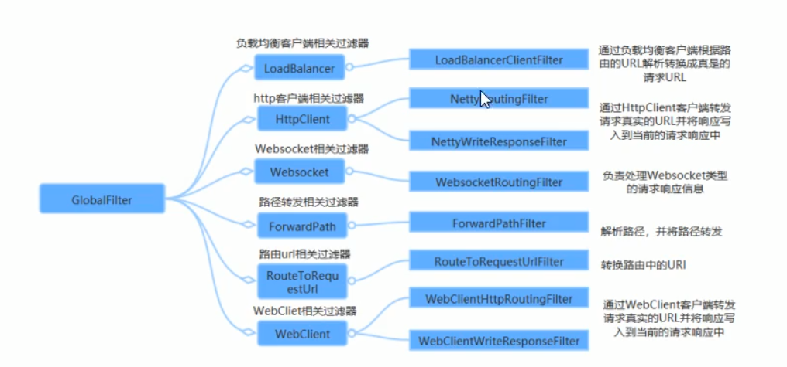

# 一、网关

我们需要一个微服网关，介于客户端与服务器这间的中间层，所有的外部请求都会经过微服务网关。客户端只需要与网关交互，只知道一个网关地址即可，这样简化了开发还有以下优点：

- 易于监控
- 易于认证
- 减少了客户端与各个微服务之间的交互次数

微服务网关也叫API网关，是系统对外的唯一入口。API网关封了系统内部架构，为每个客户端提供一个定制API。API网关方式的核心要点是，所有客户端和消费端都要通过统一的网关微服务，在网关层处理所有非业务功能，通常，网关也提供REST/HTTP的访问API。服务端通过API-GW注册和管理服务。

API网关可以实现的功能：

- 身份认证
- 监控
- 缓存
- 负载均衡
- 请求分片
- 静态响应

**常见的API网关实现方式**

|类型|描述|
|---|---|
|Kong|基于Nginx+Lua开发，性能高，稳定，有多个可用插件，开箱即用。只支持http协议，二次开发困难|
|zuul|Netfix开源，功能丰富，使用Java开发，易于二次开发；需要运行在web容器中，如Tomcat。问题：缺乏管控，无法动态配置；依赖组件较多；处理Http请求依赖是Web容器，性能不如Nginx|
|Treafik|Go语言开发；轻量易用；提供大多数功能：服务路由，负载均衡等；提供webUI。问题：进不进制文件部署，二次开发难度大；UI更多是监控，缺乏配置、管理功能力|
|Spring Cloud Gateway|Spring Cloud提供的网关服务|
|Nginx + lua|使用Nginx的反向代理和负载均衡可以实现对api服务器负载均衡及高可用。问题：自注册的问题和网关本身的扩展性|

## 1、nginx网关

利用反向代码实现

```nginx
location /api-product {
	proxy_pass http://127.0.0.1:9001;
}

location /api-order {
	proxy_pass http://127.0.0.1:9002;
}
```

## 2、Zuul网关

### 1）Zuul网关的介绍

zuul是Netfix开源的微服网关，它可以和Eureak、Ribbon、Hystrix等组件配置使用，Zuul组件的核心是一系列的过滤器，这些过滤器可以完成以下功能

- 动态路由：动态将请求路由到不同后端集群
- 压力测试：慢慢增加指向集群的流量，了解性能
- 负载分配：为每一种负载类型分配对应容量，弃用超出限定值的请求
- 静态响应处理：边缘位置进行响应，避免转发到内部集群
- 身份谁和安全：识别每一个资源的验证要求，并拒绝那些不符的请求。
- Spring Cloud的Zuul进行了整全增强。

Zuul的缺点：

- 同步阻塞式的访问，不利于大并发 (本质上上Servlet)
- 不支持 WebSocket

### 2）搭建zuul网关服务器

#### （1）创建工程导入依赖

```xml
<dependency>
            <groupId>org.springframework.cloud</groupId>
            <artifactId>spring-cloud-starter-netflix-zuul</artifactId>
        </dependency>
```

#### （2）配置启动类，开启网关服务器功能

```java
@SpringBootApplication
/**
 * 开启 zuul 网关功能
 */
@EnableZuulProxy
public class ZuulApplication {
    public static void main(String[] args) {
        SpringApplication.run(ZuulApplication.class, args);
    }
}

```

#### （3）配置文件 & 路由配置

```yaml
server:
  port: 8080
spring:
  application:
    name: api-zuul-server  # 服务名称
    
zuul:
  routes:
    product-service:
      path: /product-service/**  # 配置映射路由
      url: http://127.0.0.1:9001 # 映射路由实际对应的微服务url地址
```

路由：根据请求的URL，将不同的请求转发到不同的服务中

访问`http://localhost:8080/product-service/product/1`，相当于通过反向代理访问 `http://127.0.0.1:9001/product/1`

### 3）简化路由配置

#### （1）添加eureka依赖

```xml
<!-- 这一步之前做过了 -->
<dependency>
            <groupId>org.springframework.cloud</groupId>
            <artifactId>spring-cloud-starter-netflix-eureka-client</artifactId>
        </dependency>
```

#### （2）开启eureka的客户端服务

在启动类上加入：`@EnableDiscoveryClient // 也可以使用@EnableEurekaClient`即可

#### （3）在zuul网关服务中配置eureka中配置eureka的注册中心相关信息，及配置路由信息

```yaml
server:
  port: 8080
spring:
  application:
    name: api-zuul-server

eureka:
  client:
    service-url:
      defaultZone: http://localhost:10000/eureka/
  instance:
    prefer-ip-address: true
    instance-id: ${spring.cloud.client.ip-address}:${server.port}
    lease-expiration-duration-in-seconds: 30
    lease-renewal-interval-in-seconds: 5

zuul:
  routes:
    product-service:
      path: /product-service/**
      # url: http://localhost:9001
      serviceId: PRODUCT-SERVICE  # 配置转发的微服务的转发
```

#### （4）简化路由的配置

前提条件是当前服务加入到eureka中

如果我路由id 和 对应的微服务的 serviceId一致的话，可简化为：

```yaml
zuul:
  routes:
      product-service: /product-service/**
```

* 没有配置order-server的路由配置，但可以正常访问`http://localhost:8080/order-service/order/buy/1`，这个URL，因为不配置的话，使用默认 `order-service`服务名称作为url前缀

### 4）过滤器

Zuul的过滤器和Servlet里的Filter是不一样的。


Zuul中过滤器总有4种

| 过滤器类型 | 描述                                                         |
| ---------- | ------------------------------------------------------------ |
| PRE        | 请求转发到服务之前执行的过滤器                               |
| ROUTING    | 在路由请求时执行的过滤器；用于构建发送给微服务的请求，并使用Apache,HttpClient或Netflix Ribbon请求微服务 |
| POST       | 执行微服务返回值之后执行的过滤器；可用来响应添加标准HTTP Header、收集统计信息和指标、将响应从微服务发送给客户端等 |
| ERROR      | 在其它阶段发生错误时执行的过滤器                             |

Zuul提供了自定义过滤器十分简单，只需编写一个类实现`ZuulFilter`接口即可

```java
/**
 * ZuulFilter Demo
 */
@Component  // 加入到容器中
public class LoginFilter extends ZuulFilter {
    /**
     * 用于定义过滤器类型,有以下4种类型
     * @return pre, routing, post ,error
     */
    @Override
    public String filterType() {
        return "pre";  // pre 类型的过滤器
    }

    /**
     * 用于指定过滤器的执行顺序
     *      - 返回值越少，执行顺序越高
     * @return
     */
    @Override
    public int filterOrder() {
        return 0;
    }

    /**
     * 当前过滤器是否生效
     *      true: 使用这个过滤器
     *      false: 不使用这个过滤器
     * @return
     */
    @Override
    public boolean shouldFilter() {
        return true;
    }

    /**
     * 执行过滤器的业务逻辑
     *
     * 在Zuul 网关中，通过RequestContext的上下文，可以获取request对象
     *
     * @return
     * @throws ZuulException
     */
    @Override
    public Object run() throws ZuulException {
        // 获取 zuul 提供的上下文件对象
        RequestContext ctx = RequestContext.getCurrentContext();
        // 得到request
        String token = ctx.getRequest().getParameter("access-token");
        if(token == null)
        {
            // 如果token==null,拦截请求，返回认证失败
            ctx.setSendZuulResponse(false);
            ctx.setResponseStatusCode(HttpStatus.SC_UNAUTHORIZED);
        }
        return null;  // 如果返回 null，就能后续执行
    }
}

```

- Zuul的过滤器是不需要要配置的，只要`shouldFilter`方法返回`true`，就会在请求的过程中自动运行。

## 3、Spring Cloud Gateway 网关

Spring Cloud Gateway是Spring官方基于Spring5.0，Spring Boot 2.0 和 Project Reactor等技术开发的网关，旨在为微服务提供一种简单而有效的统一API路由管理方式，统一访问接口。Spring Cloud Gateway作为Spring Cloud生态系统中的网关，目标是替代Netflix ZUUL，其不仅提供统一的路由方式，并且基于Filter链的方式提供了网关的基本功能，例如：安全，监控/埋点，限流等。它是基于Nttey的响应式模式。

Spring Cloud Gateway是Zuul的性能上的1.6倍。

### 1）路由配置

#### （1）搭建环境

创建模块工程`api_gateway_server`

注意，spring cloud gateway和spring-boot-starter-web包冲突，解决方案：

- 删除父工程里的`spring-boot-starter-web`包
- 在基本需要引入`spring-boot-starter-web`包的工程里添加此包
- `api_gateway_server`不需要引入`spring-boot-starter-web`

```xml
<dependency>
    <groupId>org.springframework.cloud</groupId>
    <artifactId>spring-cloud-starter-gateway</artifactId>
</dependency>
```

#### （2）配置启动类

```java
// 就是一个配置的 spring boot工程
@SpringBootApplication
public class GatewayServerApplication {
    public static void main(String[] args) {
        SpringApplication.run(GatewayServerApplication.class, args);
    }
}
```

#### （3）编写配置文件

```yaml
server:
  port: 8080
spring:
  application:
    name: api-gateway-server
  # 配置 Spring Cloud Gateway的路由
  cloud:
    gateway:
      routes:
      # 配置路由：路由ID，路由到微服务的uri，断言(路由跳转的判断条件)
      - id: product-service  # id
        uri: http://localhost:9001  # 目标微服的请求地址
        predicates:  # 断言，只能配置可以访问的路径
        - Path=/product/**  # 路由条件，pat:路由匹配条件
```

- 启动后访问 http://localhost:8080/product/1可以正常访问product-service服务

### 2）路由规则（断言）

spring cloud gateway里的断言条件

| 条件       | 描述                              |
| ---------- | --------------------------------- |
| datetime   | 请求时间校验条件谓语              |
| Cookie     | 请求Cookie校验条件谓语            |
| Header     | 请求Header检验条件谓语            |
| Host       | 请求Host检验条件谓语              |
| Method     | 请求Method检验条件谓语            |
| Path       | (推荐使用)， 请求Path检验条件谓语 |
| Queryparam | 请求查询参数校验谓语              |
| RemoteAddr | 请求远程地址校验条件谓语          |

**示例：**

```yaml
spring:
  cloud:
    gateway:
      routes:
      - id: product-service  # id
        uri: http://localhost:9001  # uri
        predicates: 
        - After=xxxx  # 在某个时间点之后匹配路由
        
spring:
  cloud:
    gateway:
      routes:
      - id: product-service  # id
        uri: http://localhost:9001  # uri
        predicates: 
        - After=xxxx  # 在某个时间点之后共匹配路由

spring:
  cloud:
    gateway:
      routes:
      - id: product-service  # id
        uri: http://localhost:9001  # uri
        predicates: 
        - Between=xxxx  # 在某个时间点之间匹配路由
        
spring:
  cloud:
    gateway:
      routes:
      - id: product-service  # id
        uri: http://localhost:9001  # uri
        predicates: 
        # 匹配给定名称(chocolate)和正则表达式(ch.p)
        - Cookie=chocolate, ch.p  # 满足cookie中包含某些值的时候匹配
        
spring:
  cloud:
    gateway:
      routes:
      - id: product-service  # id
        uri: http://localhost:9001  # uri
        predicates: 
        - Header=X-Request-Id, \d+  # 请求头匹配，参数是正则
        
spring:
  cloud:
    gateway:
      routes:
      - id: product-service  # id
        uri: http://localhost:9001  # uri
        predicates: 
        - Method=GET  # 请求方法匹配
        
spring:
  cloud:
    gateway:
      routes:
      - id: product-service  # id
        uri: http://localhost:9001  # uri
        predicates: 
        - Query=baz # Query=foo,ba. # 请求参数匹配
        
spring:
  cloud:
    gateway:
      routes:
      - id: product-service  # id
        uri: http://localhost:9001  # uri
        predicates: 
        - RemoteAddr=192.168.23.15/24  # 请求远程地址
```

### 3）动态路由(面向服务的路由)

```
server:
  port: 8080
spring:
  application:
    name: api-gateway-server
  # 配置 Spring Cloud Gateway的路由
  cloud:
    gateway:
      routes:
      # 配置路由：路由ID，路由到微服务的uri，断言(路由跳转的判断条件)
      - id: product-service  # id
        uri: lb://product-service  # lb:// 根据微服名称从注册中心中拉取服务请求路径
        predicates:  # 断言，只能配置可以访问的路径
        # - Path=/product/**  # 之前怎么访问的，就怎么配置，
          - Path=/product-service/** # 请求转发到 http://.../product/1
        filters: # 配置路由过滤器 http://.../product-service/product/1
        - RewritePath=/product-service/(?<segment>.*), /$\{segment} # 在yml中$的正则要写 $\
        # 配置自动根据微服务的路由名称进行转发
      discovery:
        locator:
          enabled: true  # 开启根据服务名称自动转化
          lower-case-service-id: true # 微服务名称以小写方式请求

# 配置eureka
eureka:
  instance:
    prefer-ip-address: true
  client:
    service-url:
      defaultZone: http://localhost:10000/eureka/
```

访问：http://localhost:8080/order-service/order/buy/1

### 4）过滤器

Spring Cloud GateWay的Filter的生命周期不像Zuul那么丰富，它只有两个：“pre”和"post"：

- Pre 在请求被路由之前调用
- Post 在路由到微服务之后执行

从作用范围可分为两种

- GatewayFilter: 应用到单个路由或者一个分给的路由上
- GlobalFilter：应用到所有路由上

#### （1）系统自带的GatewayFilter过滤器

| 过滤器工厂           | 作用                                                         | 参数                                                         |
| -------------------- | ------------------------------------------------------------ | ------------------------------------------------------------ |
| AddRequestHeader     | 为原始请求添加Header                                         | Header的名称                                                 |
| AddRequestParameter  | 为原始请求添加请求参数                                       | 参数名称及值                                                 |
| AddResponseHeader    | 为原始响应添加Header                                         | Header的名称及值                                             |
| DedupeResponseHeader | 剔除响应头中重复的值                                         | 去重Header名称及去重策略                                     |
| Hystrix              | 为路由中引入Hystrix的断路器保护                              | hystrixCommand的名称                                         |
| PrefixPath           | 为原始请注路径添前缀                                         | 前缀路径                                                     |
| PreserveHostHeader   | 为请求添加中一个preserveHeader=true的属性，路由过滤器会检查属性以决定是否要发送原始的Host | 无                                                           |
| RequestRateLimiter   | 用于对请求限流，限流算法令牌桶                               | kyeResolver, rateLimiter, statusCode, denyEmptyKey, cmptyKeyStatus |
| RedirctTo            | 将原始请求重定向到指定的URL                                  | http状态码及重定向的url                                      |
| Retry                | 针对不同的响应进行重试                                       | retries,statuses,methods,series                              |
|RequestSize|设置允许接收最大请求包的大小。如果请求包大小超过设置的值，则返回413 Payload Too Large|请求包大小，单位为字节，默认值5M|
| ModifyRequestBody    | 在转发请求之前原始请求体内容                                 | 修改后的请求体内容                                           |
|ModifyResponseBody|修改原始响应的内容|修改后的响应体内容|

每个过滤器工厂都对应一个实现类，并且这些类的名称必须以`GatewayFilterFactory`结尾，这是Spring Cloud Gateway的一个约定，例如AddRequestHeader对应的实现类为`AddRequestHeaderGatewayFilterFactory`。对于这些过滤器的使用方式可以参数

#### （2）全局过滤器(GlobalFilter)

是程序员使用最多的过滤器，使用方法只需要实现`GlobalFilter`接口即可，Spring Cloud Gateway也定义了一系统的全局过滤器对事个路由转发进行处理，如下：



Spring Cloud Gateway是Gateway网关组成的一个重要部分

定义一个全局过滤器：

```java
/**
 * 自定义一个全局过滤器
 *      - 实现 GlobalFilter, Ordered 接口
 */
@Component
public class LoginFilter implements GlobalFilter, Ordered {
    /**
     * 执行过滤器中的业务逻辑
     * -ServerWebExchange 相当于请求的上下文对象
     */
    @Override
    public Mono<Void> filter(ServerWebExchange exchange, GatewayFilterChain chain) {
        System.out.println("执行了自定义的全局过滤器");
        // 获取请求参数
        String token = exchange.getRequest().getQueryParams().getFirst("token");
        if(token == null ){
            // 认证失败
            System.out.println("没有登录");
            exchange.getResponse().setStatusCode(HttpStatus.UNAUTHORIZED); // 带上向应码
            return exchange.getResponse().setComplete(); // 请求结束
        }
        return chain.filter(exchange); // 继续向下执行
    }

    /**
     * 指定过滤器的执行顺序，返回值越小，执行优先级越高
     * @return
     */
    @Override
    public int getOrder() {
        return 0;
    }
}
```

访问：http://localhost:8080/product-service/product/1?token=1，带上token请求参数才可以请求。

### 5）网关限流

#### （1）常见的限流算法

##### 【1】计数器

计数器限流算法是最简单的一种限流方式。本质是通过维护一个单位时间内的计数器，每次请求计数+1，当单位时间内计数器累加到大于设定阈值，之后的请求都被拒绝，直到单位时间已经过去，再将计数器重置为0。

缺点：流量的限制不平滑

##### 【2】漏桶算法

参考百度百科：[漏桶算法](https://baike.baidu.com/item/%E6%BC%8F%E6%A1%B6%E7%AE%97%E6%B3%95)

漏桶算法可以很好地限制容量池的大小，从而防止流量暴增。漏桶可以看作是一个带有常量服务时间的单服务队列，如果漏溢出，那么数据包会被丢弃。在网络中，漏桶算法可以控制常量服务端口的流量输出速率，平滑网络上的突发流量整形，从而网络提供一个稳定的流量。

为了控制好流量，漏桶算法关注的是两个变量：一个是漏桶大小，一个是频率大小。

##### 【3】令牌桶算法

参考百度百科：[令牌桶算法](https://baike.baidu.com/item/令牌桶算法/6597000?fr=aladdin)

令牌桶算法是对漏桶算法的一种改进，桶算法够限制请求调用的速率，而令牌桶处能够限制调用的平均速率的同时还允许一定程度的突发调用。

### 6）网关限流

#### （1）基于网页的Filter的方式限流

SpringCloudGateway官方提供了基于令牌的限流支持，基于其内置的过滤工厂`RequesstRateLimiterGatewayFactory`实现。在过滤器工厂中是通过Redis和lua脚本结合的方法进行流量控制。

##### 【1】导入redis依赖，并开启Redis

```xml
<!-- 监控依赖 -->
        <dependency>
            <groupId>org.springframework.boot</groupId>
            <artifactId>spring-boot-starter-actuator</artifactId>
        </dependency>
        <!--redis的依赖-->
        <dependency>
            <groupId>org.springframework.boot</groupId>
            <artifactId>spring-boot-starter-data-redis-reactive</artifactId>
        </dependency>
```

##### 【2】修改网关中的application.yml的配置

RequestRateLimiter过滤器是spring cloud gateway提供的

```yaml
server:
  port: 8080
spring:
  application:
    name: api-gateway-server
  redis:
    host: localhost
    port: 6379
    database: 0
  cloud:
    gateway:
      routes:
      - id: product-service  # id
        uri: lb://product-service
        predicates:
          - Path=/product-service/** # 请求转发到 http://.../product/1
        filters:
        - name: RequestRateLimiter
          args:
          	# 使用SpEL从容器中获取pathKeyResolver对象，需要自定义这个对象
            key-resolver: '#{@pathKeyResolver}'
            # 向令牌桶上填充的率
            redis-rate-limiter.replenishRate: 1
            # 令牌的上限
            redis-rate-limiter.burstCapacity: 3
        - RewritePath=/product-service/(?<segment>.*), /$\{segment}
      # 配置自动根据微服务的路由名称进行转发
      discovery:
        locator:
          enabled: true  # 开启根据服务名称自动转化
          lower-case-service-id: true # 微服务名称以小写方式请求

# 配置eureka
eureka:
  instance:
    prefer-ip-address: true
  client:
    service-url:
      defaultZone: http://localhost:10000/eureka/
```

##### 【3】配置redis key的解析器：KeySesolver

```java
 /**
     * 基于请求路径的限流规则
     * @return
     */
    @Bean
    public org.springframework.cloud.gateway.filter.ratelimit.KeyResolver pathKeyResolver() {
        return new org.springframework.cloud.gateway.filter.ratelimit.KeyResolver() {
            @Override
            public Mono<String> resolve(ServerWebExchange exchange) {
                return Mono.just(exchange.getRequest().getPath().toString());
            }
        };
    }
```

#### （2）基于sentinel的方式限流

##### 【1】引入依赖

```xml
<dependency>
    <groupId>com.alibaba.csp</groupId>
    <artifactId>sentinel-spring-cloud-gateway-adapter</artifactId>
    <version>1.6.3</version>
</dependency>
```

##### 【2】配置类

```java
@Configuration
public class GatewayConfiguration {

	private final List<ViewResolver> viewResolvers;

	private final ServerCodecConfigurer serverCodecConfigurer;

	public GatewayConfiguration(ObjectProvider<List<ViewResolver>> viewResolversProvider,
	                            ServerCodecConfigurer serverCodecConfigurer) {
		this.viewResolvers = viewResolversProvider.getIfAvailable(Collections::emptyList);
		this.serverCodecConfigurer = serverCodecConfigurer;
	}

	/**
	 * 配置限流的异常处理器:SentinelGatewayBlockExceptionHandler
	 */
	@Bean
	@Order(Ordered.HIGHEST_PRECEDENCE)
	public SentinelGatewayBlockExceptionHandler sentinelGatewayBlockExceptionHandler() {
		return new SentinelGatewayBlockExceptionHandler(viewResolvers, serverCodecConfigurer);
	}

	/**
	 * 配置限流过滤器
	 */
	@Bean
	@Order(Ordered.HIGHEST_PRECEDENCE)
	public GlobalFilter sentinelGatewayFilter() {
		return new SentinelGatewayFilter();
	}

	/**
	 * 配置初始化的限流参数
	 */
	@PostConstruct
	public void initGatewayRules() {
		Set<GatewayFlowRule> rules = new HashSet<>();
//		rules.add(
//			new GatewayFlowRule("order-service") //资源名称
//					.setCount(1) // 限流阈值
//					.setIntervalSec(1) // 统计时间窗口，单位是秒，默认是 1 秒
//		);
//		rules.add(new GatewayFlowRule("order-service")
//				.setCount(1)
//				.setIntervalSec(1)
//				.setParamItem(new GatewayParamFlowItem()
//						.setParseStrategy(SentinelGatewayConstants.PARAM_PARSE_STRATEGY_URL_PARAM).setFieldName("id")
//				)
//		);
		rules.add(new GatewayFlowRule("product_api")
				.setCount(1)
				.setIntervalSec(1)
		);
		rules.add(new GatewayFlowRule("order_api")
				.setCount(1)
				.setIntervalSec(1)
		);
		GatewayRuleManager.loadRules(rules);
	}

	@PostConstruct
	public void initBlockHandlers() {
		BlockRequestHandler blockRequestHandler = new BlockRequestHandler() {
			public Mono<ServerResponse> handleRequest(ServerWebExchange serverWebExchange, Throwable throwable) {
				Map map = new HashMap<>();
				map.put("code", 001);
				map.put("message", "对不起,接口限流了");
				return ServerResponse.status(HttpStatus.OK).
						contentType(MediaType.APPLICATION_JSON_UTF8).
						body(BodyInserters.fromObject(map));
			}
		};
		GatewayCallbackManager.setBlockHandler(blockRequestHandler);
	}

	@PostConstruct
	private void initCustomizedApis() {
		Set<ApiDefinition> definitions = new HashSet<>();
		ApiDefinition api1 = new ApiDefinition("product_api")
				.setPredicateItems(new HashSet<ApiPredicateItem>() {{
					add(new ApiPathPredicateItem().setPattern("/product-service/product/**").
							setMatchStrategy(SentinelGatewayConstants.URL_MATCH_STRATEGY_PREFIX));
				}});
		ApiDefinition api2 = new ApiDefinition("order_api")
				.setPredicateItems(new HashSet<ApiPredicateItem>() {{
					add(new ApiPathPredicateItem().setPattern("/order-service/order"));
				}});
		definitions.add(api1);
		definitions.add(api2);
		GatewayApiDefinitionManager.loadApiDefinitions(definitions);
	}
}
```

