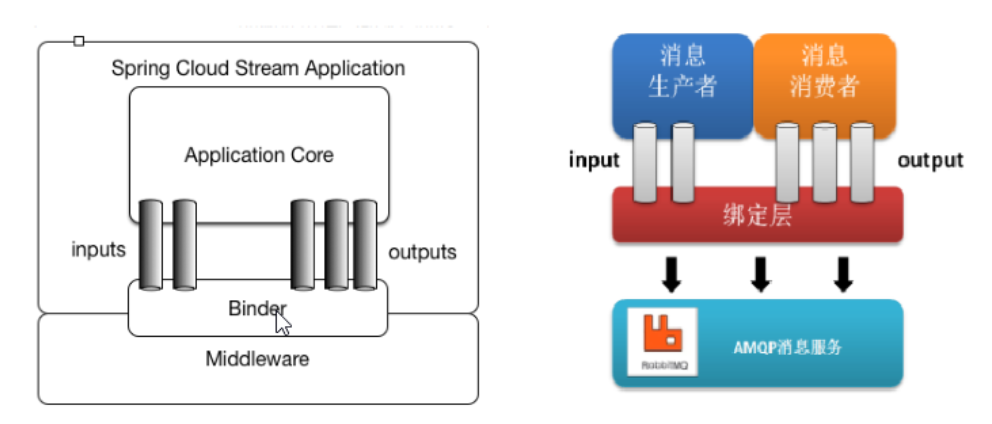
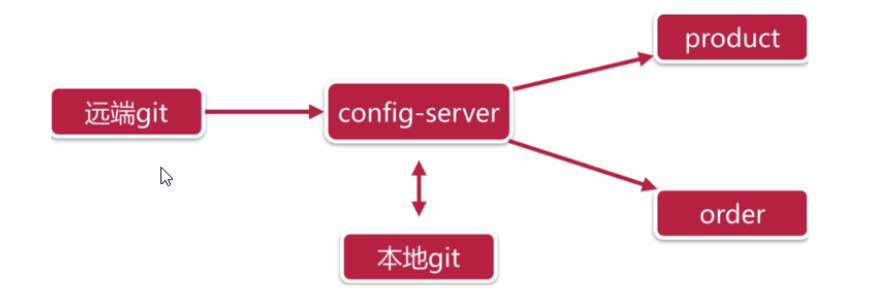
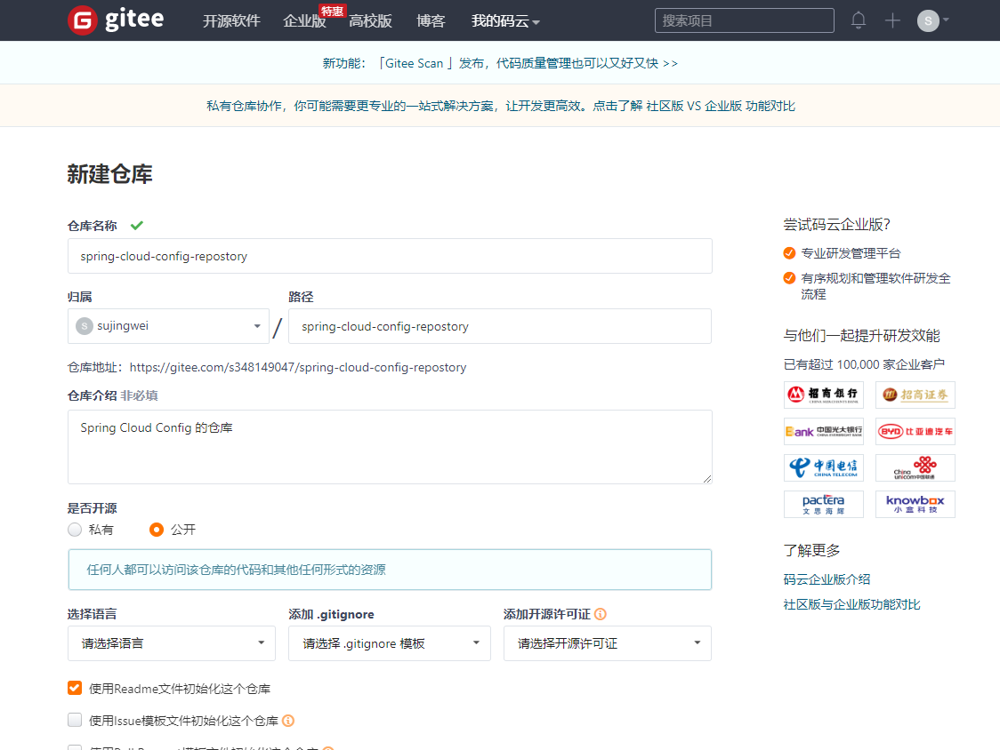
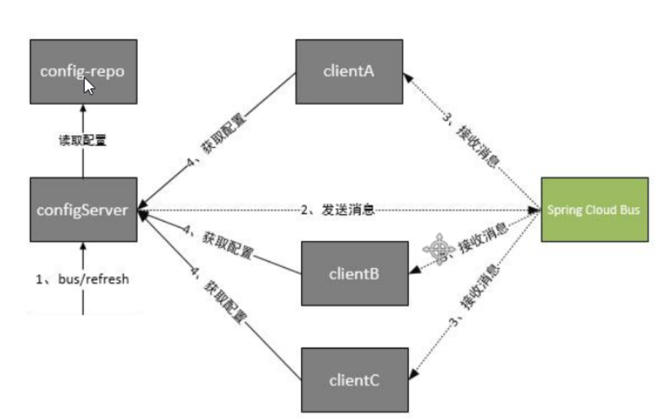
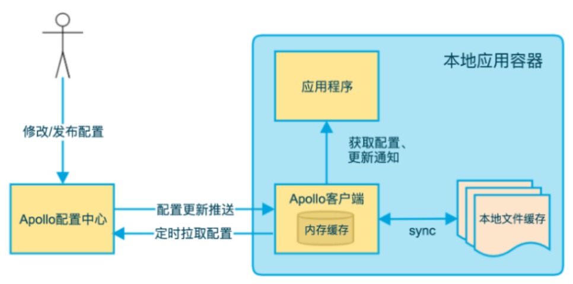

# 一、Spring Cloud Stream

​	消息中间件主要解决应用解耦，异步消息，流量水削锋等问题，实现高性能，高可用，可伸缩和最终一致性架构。不同的中间件其实现方式，内部结构是不一样的。如常见的`RabbitMQ`和`Kafka`，于由这两个消息中间件的架构上的不同，像`RabbitMQ`有`exchange`，`Kafka`有`Topic`，`partitions`分区，这些中间件的差异性导致我们实际项目开发给我们造成了一定的困扰，我们如果用两个消息队列的其中一种，后面的业务需要，我想往另外一种消息队列进行迁移，这时候无疑就是一个灾难性的，一大堆东西都要重新推到重新做，因为它跟我们系统耦合了，这时候spring cloud stream给我们提供了一种解耦的方式。

Spring Cloud Stream由一个中间件中立的核组成。应用通过`Spring Cloud Stream`插入的**input**（相当于消费者consumer，它是从队列中接收消息的）和**output**（相当于生产者product，它是从队列中发送消息的。）通道与外界交流。通道通过指定中间件的Binder实现外部代理连接。业务开发者不再关注具体消息中间件，只需关注Binder对应用程序提供抽象概念来使用消息中间件实现业务即可。

- 绑定器

> 可以理解为Spring Cloud Stream帮我们实现的多种中间件产品工具（`RabbitMQ`， `Kafka`），绑定器的代码由Spring Cloud实现。

- input & output

> **output** 生产者的通道；**input** 消费者的通道



支持各种binder实现

| RabbitMQ         |
| ---------------- |
| Kafka            |
| Amazon Kinsis    |
| Google PubSub    |
| Solace PubSub    |
| Azure Event Hubs |

**发布订阅模型**

在**spring Cloud Stream中的消息通信遵循了发布-订阅模式**，当一条消息被投递到消息中间件之后，它会通过共享Topic主题进行广播，消息消费者在订阅的主题中收到它触发自身业务逻辑处理。这里所提到的Topic主题是Spring Cloud Stream中的一个抽象概念，用来代表发布共享消息给消费者的地方，在不同的消息中间件中，Topic可能对应着不同的概念，比如：在RabbitMQ中它对应了Exchange，而在Kakfa中对应了Kafka的Topic。

## 1、入门案例

### 1）引入依赖

```xml
<!-- 生产者和消费者的依赖是一样的 -->
<dependency>
            <groupId>org.springframework.cloud</groupId>
            <artifactId>spring-cloud-stream</artifactId>
        </dependency>
        <dependency>
            <groupId>org.springframework.cloud</groupId>
            <artifactId>spring-cloud-starter-stream-rabbit</artifactId>
        </dependency>
        <dependency>
            <groupId>org.springframework.cloud</groupId>
            <artifactId>spring-cloud-stream-binder-rabbit</artifactId>
        </dependency>
```

### 2）生产者

#### （1）配置文件

```yaml
server:
  port: 7001
spring:
  application:
    name: stream-publish
  rabbitmq:
    addresses: 127.0.0.1
    username: user_mnr
    password: 123
    virtual-host: /vhost_mnr
  cloud:
    stream:
      bindings:
        output:
          # 指定消息发送的目的地，相当于RabbitMQ的交换机(exchange)，或kafka的topic
          destination: itcast-default
      # 配置绑定器
      binders:
        defaultRabbit:
          type: rabbit  # 默认绑定器为rabbit
```

#### （2）启动类

```java
/**
 * 入门案例 - 生产者
 *      1、引入依赖
 *      2、配置application.yml文件
 *      3、发送消息的话，定义一个通道接口，通过接口中内置的message channel
 *          spring cloud stream中内置接口:Source
 *      4、@EnableBinding: 绑定对应通道
 *      5、通过MessageChangel发送消息
 */
@SpringBootApplication
@EnableBinding(org.springframework.cloud.stream.messaging.Source.class)
public class PublishServiceApplication implements CommandLineRunner {
    /**
     * CommandLineRunner是SpringBoot在启动时执行的任务
     *      - 它会在启动的时候自动调用 run 方法
     */
    @Autowired
    private MessageChannel output;

    @Override
    public void run(String... args) throws Exception {
        // 发送消息
        output.send(MessageBuilder.withPayload("Hello World").build());
    }
    
    public static void main(String[] args) {
        SpringApplication.run(PublishServiceApplication.class);
    }
}
```

### 3）消费者

#### （1）配置文件

```yaml
server:
  port: 7002
spring:
  application:
    name: stream-consumer
  rabbitmq:
    addresses: 127.0.0.1
    username: user_mnr
    password: 123
    virtual-host: /vhost_mnr
  cloud:
    stream:
      bindings:
        input:  # 生产者和消费者唯一不同的地方就是这里，生产者是 output
          # 指定消息发送的目的地，相当于RabbitMQ的交换机(exchange)，或kafka的topic
          destination: itcast-default
      binders:
        defaultRabbit:
          type: rabbit
```

#### （2）消费者

```java
/**
 * 入门案例-消费者
 * 1、引入依赖
 * 2、配置application.yml文件
 * 3、需要配置一个通道的接口
 * 内置获取消息通道接口 sink
 * 4、绑定道道
 * 5、配置一个监听方法：当程序从中间件获取数据之后，执行的业务逻辑方法
 * 需要监听方法上配置@StreamListener
 */
@SpringBootApplication
@EnableBinding(Sink.class)  // 如果你要监听消息，需要在监听类上加入这个注解
public class ConsumerServiceApplication {
    /**
     * 监听binding中的消息
     */
    @StreamListener(Sink.INPUT)
    public void input(String message) {
        System.out.println("获取到消息：" + message);
    }

    public static void main(String[] args) {
        SpringApplication.run(ConsumerServiceApplication.class, args);
    }
}
```

## 2、自定义消息通道

### 1）定义一个消息通道类

```java
/**
 * 自定义的消息通道
 *      - 可以定义多个，也可以定义多组通道
 */
public interface MyPublish {
    /**
     * 消息生产者的配置
     */
    String MYOUTPUT = "myoutput";
    @Output("myoutput")
    MessageChannel myoutput();

    /**
     * 消息消费者的配置
     */
    String MYINPUT = "myinput";
    @Input("myinput")
    SubscribableChannel myinput();
}
```

### 2）生产者及消费者配置

**生产者：**

```yaml
server:
  port: 7001
spring:
  application:
    name: stream-publish
  rabbitmq:
    addresses: 127.0.0.1
    username: user_mnr
    password: 123
    virtual-host: /vhost_mnr
  cloud:
    stream:
      bindings:
        output:
          # 指定消息发送的目的地，相当于RabbitMQ的交换机(exchange)，或kafka的topic
          destination: itcast-default
        # TODO 这里是自定义的通道
        myoutput:
          destination: itcast-custom-output
      # 配置绑定器
      binders:
        defaultRabbit:
          type: rabbit  # 默认绑定器为rabbit
```

**消费者：**

```yaml
server:
  port: 7002
spring:
  application:
    name: stream-consumer
  rabbitmq:
    addresses: 127.0.0.1
    username: user_mnr
    password: 123
    virtual-host: /vhost_mnr
  cloud:
    stream:
      bindings:
        input:
          # 指定消息发送的目的地，相当于RabbitMQ的交换机(exchange)，或kafka的topic
          destination: itcast-default
        # TODO 使用自定义的通道接收
        myinput:
          destination: itcast-custom-output
      binders:
        defaultRabbit:
          type: rabbit
```

## 3、消息分组

​	如果多个消费者同时绑定了同一个交换机，那么生产者在生产消息的时候，多个消息都都会同时取得消息。有时候希望只有一个消费者可以消费消息，那么就可以在绑定通道下加入`group`来指定消息的组名。这样，那怕消费者绑定的exchange名称是一样的，都只有一个消费者能消费消息。

```yaml
spring:
  cloud:
    stream:
      bindings:
      	# 如果不使用自定义的通道，那么就使用默认的 input 通道接收消息
        # 使用自定义的通道接收
        myinput:
          destination: itcast-custom-output
          group: group1 # todo 设置消息的组名称(同名中的多个消息者，只会有一个去消费消息)
```

- 多个消费者的group值是一样的

## 3、消息分区

​	在一引起场景中，同一个特征的数据被同一个实例消费，比如同一个id传感器监测数据必须被同一个实例统计计算分析，否则可能无法获取全部数据。又比如异步任务，首次请求启动task，二次请求取消task，此场景就必须保证两次请求至同一实例。

- 直白的说就是组里有多个消费者，但内容一样的消费只会给到其中一个消费者消费

### 1）生产者配置

```yaml
spring:
  cloud:
    stream:
      bindings:
        # 这里是自定义的通道
        myoutput:
          destination: itcast-custom-output
          producer:
            # todo 分区关键字，可以对象中的id
            partition-key-expression: payload
            # todo 分区大小，对应消费者
            partition-count: 2
      # 配置绑定器
      binders:
        defaultRabbit:
          type: rabbit  # 默认绑定器为rabbit
```

### 2）消费者配置

```yaml
spring:
  cloud:
    stream:
      bindings:
        myinput:
          destination: itcast-custom-output
          group: group1 # 设置消息的组名称(同名中的多个消息者，只会有一个去消费消息)
          consumer:
            partitioned: true # todo 开启消费者分区支持
      binders:
        defaultRabbit:
          type: rabbit
      instance-count: 2  # todo 消费者总数
      instance-index: 0  # todo 当前消费者索引
      # instance-index: 1  # 另一个消费者配置为 1 
```


# 二、配置中心

对于传统单体应用而言，常使用配置文件来管理所有配置，比如`Spring Boot`的`application.yml`文件，但是对于在微服务架构中全部手动修改的话很麻烦而且不易维护。微服务的配置管理一般有以下需求：

- 集中配置管理，一个微服架构中可能有成千个微服务，所以集中配置管理是很重要的。
- 不同环境不同配置，比如数据源配置在不同环境(开发，生产，测试)中是不同的
- 运行期间可动态调整。例如，可根据各个微服务的负载情况，动态调整数据源连接池大小等
- 配置修改后可以自动更新。如配置内容发生变化，服务务可以自动更新配置

综上所述对于微服务架构而言，一套统一的，通用的管理配置机制是不可缺少的重要部分。常见的做法就是通过配置服务器进行管理。常见的配置中心：

| 环境                | 描述                                                         |
| ------------------- | ------------------------------------------------------------ |
| Spring Cloud Config | 为分布式系统中的外部配置提供服务和客户端支持                 |
| Apollo(阿波罗)      | 是携程框架部门研发的分布式配置中心，能够集化管理不同环境，不同集群的配置，配置修改后能够实时推送到应用端，并具备规范的权限、流程治理等特性，适用于微服务配置管理场景 |
| Disconf             | 百度开发的，专注各种[分布式系统配置管理]的[通用组件]和[通用平台]，提供统一的[配置服务]包括百度、滴滴出行、银联、网易、拉勾网、苏宁易购、顺丰科技等知名互联网公司正在使用！ |

## 1、配置中心Spring Cloud Config

`Spring Cloud Config`项目是一个解决分布式系统配置管理方案。它包含了`Client`和`Server`两个部分，`Server`提供配置文件的存储，以接口的形式将配置文件的内容提供出去，`Client`通过接口获取数据、并依据此数据初始化自己的应用。



从上图可得知，Server端从git(或svn)中得到配置信息，并传给各个微服务。

### 1）入门案例

#### （1）使用码云创建仓库

创建的名称为： `spring-cloud-config-repostory`



准备`product-dev.yml`及`product-pro.yml`两份配置文件，并上传到仓库中：

```yml
server:
  port: 9001  # product-pro.yml这个值为：9002
spring:
  application:
    name: product-service
  datasource:
    driver-class-name: com.mysql.jdbc.Driver
    url: jdbc:mysql://localhost:3306/spring_cloud_demo?useSSL=false&characterEncoding=utf8
    username: root
    password: root
  jpa:
    database: mysql
    show-sql: true
    open-in-view: true
name: itcast-dev   # product-pro.yml这个值为：itcast-pro
eureka:
  instance:
    prefer-ip-address: true
    instance-id: ${spring.cloud.client.ip-address}:${server.port}
    lease-renewal-interval-in-seconds: 5
    lease-expiration-duration-in-seconds: 30
  client:
    service-url:
      defaultZone: http://localhost:10000/eureka/
```

#### （2）创建config_server工程并导入依赖

```xml
 <dependency>
    <groupId>org.springframework.cloud</groupId>
    <artifactId>spring-cloud-config-server</artifactId>
</dependency>
```

#### （3）启动类

```java
@SpringBootApplication
@EnableConfigServer  // 激活 config
public class ConfigServerApplication {
    public static void main(String[] args) {
        SpringApplication.run(ConfigServerApplication.class, args);
    }
}
```

#### （4）配置文件

```yaml
server:
  port: 20000
spring:
  application:
    name: config-server
  cloud:
    config:
      server:
        git:
          # 指定git的仓库地址
          uri: https://gitee.com/s348149047/spring-cloud-config-repostory.git
```

#### （5）启动config_server

访问：`http://localhost:20000/product-dev.yml`显示出上传到码云的`product-dev.yml`文件的信息:

```yaml
# 在浏览器中打印出以下配置
eureka:
  client:
    service-url:
      defaultZone: http://localhost:10000/eureka/
  instance:
    instance-id: ${spring.cloud.client.ip-address}:9001
    lease-expiration-duration-in-seconds: 30
    lease-renewal-interval-in-seconds: 5
    prefer-ip-address: true
name: itcast-dev
server:
  port: 9001
spring:
  application:
    name: product-service
  datasource:
    driver-class-name: com.mysql.jdbc.Driver
    password: root
    url: jdbc:mysql://localhost:3306/spring_cloud_demo?useSSL=false&characterEncoding=utf8
    username: root
  jpa:
    database: mysql
    open-in-view: true
    show-sql: true
```

看到上面的信息，表未config_server已开发完成。Config Server 已经和 git 有了联系。

#### （6）其他微服务也加入依赖，并删除application.yml配置文件

```xml
<dependency>
    <groupId>org.springframework.cloud</groupId>
    <artifactId>spring-cloud-starter-config</artifactId>
</dependency>
```

`http://localhost:20000/product-dev.yml`可以正常访问的时候，表示已经可以从远程服务(config_server)中得到配置信息了，本地的`application.yml`配置文件就可以删除。

#### （7）创建bootstrap.yml配置文件

```yml
spring:
  cloud:
    config:
      name: product # 应用名称，需要对应git配置文件中的前缀
      profile: dev # 开发环境，如果要更改为测试环境，就改为: pro
      label: master # git中的分支
      # config_server服务的请求地址
      uri: http://localhost:20000
```

#### （8）启动微服务并访问

访问：`http://localhost:9001/product/test`

```sh
# 浏览器输出：
itcast-dev  # 这个值其实就是git仓库中配置文件的name值
```

注：product-dev.yml及product-pro.yml配置略有不同，访问的结果应参考git仓库中的配置

完。

### 2）手动刷新配置

当服务务启动的时候，从config_server获取配置信息，缓存到本地。如果git仓库的配置更新了，要**手动重启动当前微服务**，新的配置才会生效。

>  为了避免每次更新配置，都需要重启服务，可以使用**手动刷新配置**

#### （1）引入依赖

**微服务product_service中：**

```xml
<!-- 健康端点检查 -->
<dependency>
    <groupId>org.springframework.boot</groupId>
    <artifactId>spring-boot-starter-actuator</artifactId>
</dependency>
```

#### （2）在需要动态刷新配置信息的类上加入注解

**微服务product_service中：**

```java
@RestController
@RequestMapping("/product")
@RefreshScope // 开启动态刷新
public class ProductController {
    @Autowired
    private ProductService productService;

    @Value("${name}")  // 这个属性会被动态刷新
    private String name;

    @RequestMapping(value = "/test", method = RequestMethod.GET)
    public String test(){
        return name;
    }
    ......
```

#### （3）配置动态刷新的端点

**微服务product_service中：**

```yml
spring:
  cloud:
    config:
      name: product # 应用名称，需要对应git配置文件中的前缀
      profile: pro # 开发环境
      label: master # git中的分支
      # config_server服务的请求地址
      uri: http://localhost:20000

# 开启动态刷新的请求路径端点
management:
  endpoints:
    web:
      exposure:
        include: refresh  # 开发一个端点 refresh
```

#### （4）访问端点更新配置

`POST http://localhost:9002/actuator/refresh`，这样就可以更新到当前服务的配置信息：

```json
[
    "config.client.version",
    "name"
]
```

重新访问一下:`http://localhost:9002/product/test`，发现配置信息已经被更新。

### 3）配置服务高可用

`config_server`服务也可以注册到`eureka`注册中心中，那么其它微服务就可以从`eureka`注册中心中取得配置信息。

#### （1）config_server添加eureka依赖，并配置到eureka服务中

```xml
<dependency>
    <groupId>org.springframework.cloud</groupId>
    <artifactId>spring-cloud-starter-netflix-eureka-client</artifactId>
</dependency>
```

**application.yml**

```yaml
eureka:
  client:
    service-url:
      defaultZone: http://localhost:10000/eureka/
  instance:
    prefer-ip-address: true
    instance-id: ${spring.cloud.client.ip-address}:${server.port}
```

这个注解`@EnableEurekaClient`这以不用加

#### （2）通过注册中心获取config_server配置

**product_service - bootstrap.yml的配置如下:**

```yaml
spring:
  cloud:
    config:
      name: product # 应用名称，需要对应git配置文件中的前缀
      profile: pro # 开发环境
      label: master # git中的分支
      # config_server服务的请求地址
      # uri: http://localhost:20000  # 注掉这一行
      discovery:
        enabled: true  # 开启服务发现
        service-id: config-server  # 需要发新的配置服务的id


# 开启动态刷新的请求路径端点
management:
  endpoints:
    web:
      exposure:
        include: refresh

# 配置 eureka 注册中心，但由于我们使用的是远程的配置，所以在这里的配置是不会生效的
# 须然没有生效，但是可以作为引用被调用
eureka:
  client:
    service-url:
      defaultZone: http://localhost:10000/eureka/
  instance:
    prefer-ip-address: true
    instance-id: ${spring.cloud.client.ip-address}:${server.port}
```

重启应用后，可以正常读取到远程的配置信息并启动

### 4）spring cloud Config：结合消息总线bus动态修改配置文件信息

​	在微服务架构中，通常会使用轻量级的消息代理来构建一个共用的消息主题来连接各个微服务实例，它广播的消息会被所有在注册中心的微服务实例监听和消费，也称为**消息总线**。

Spring Cloud中也有解决方案`Srping Cloud Bus`将分布式的节点用轻量的消息代理连接起来，可以很容易搭建消息总线，配置`Spring Cloud Config`实现服务配置信息动态更新。



根据此图我们可以看出利用spring cloud bus做配置更新的步骤：

- 提交代码触发post请求bus/refresh
- server端接收到请求并发送给spring cloud bus
- spring cloud bus接收到消息并通知给其它客户端
- 其它客户端接收到通知，请求Server端获取最新配置
- 全部客户端均获取到最新的配置

#### （1）config_server引入依赖并配置

**config_server服务依赖**

```xml
 <dependencies>
        <dependency>
            <groupId>org.springframework.cloud</groupId>
            <artifactId>spring-cloud-starter-netflix-eureka-client</artifactId>
        </dependency>
        <dependency>
            <groupId>org.springframework.cloud</groupId>
            <artifactId>spring-cloud-config-server</artifactId>
        </dependency>
        <dependency>
            <groupId>org.springframework.cloud</groupId>
            <artifactId>spring-cloud-starter-config</artifactId>
        </dependency>
        <!-- 健康端点检查 -->
        <dependency>
            <groupId>org.springframework.boot</groupId>
            <artifactId>spring-boot-starter-actuator</artifactId>
        </dependency>
        <!--spring cloud bus 消息总线-->
        <dependency>
            <groupId>org.springframework.cloud</groupId>
            <artifactId>spring-cloud-bus</artifactId>
        </dependency>
        <!-- spring cloud stream 配置 -->
        <dependency>
            <groupId>org.springframework.cloud</groupId>
            <artifactId>spring-cloud-stream-binder-rabbit</artifactId>
        </dependency>
    </dependencies>
```

**config_server: application.yml**

```yml
server:
  port: 20000
spring:
  application:
    name: config-server
  cloud:
    config:
      server:
        git:
          uri: https://gitee.com/s348149047/spring-cloud-config-repostory.git
  # 配置rabbitMQ
  rabbitmq:
    host: 127.0.0.1
    port: 5672
    username: user_mnr
    password: 123
# 加入eureka注册中心
eureka:
                   client:
                     service-url:
                       defaultZone: http://localhost:10000/eureka/
                   instance:
                     prefer-ip-address: true
                     instance-id: ${spring.cloud.client.ip-address}:${server.port}
# 配置暴露端点
management:
  endpoints:
    web:
      exposure:
        include: bus-refresh
```

#### （2）product_service服务引入依赖并配置

因为我要使得RabbitMQ，但application.yml文件已经删除，所以我们要更新**git远程仓库中的配置文件**

```yaml
server:
  port: 9002
spring:
  application:
    name: product-service
  datasource:
    driver-class-name: com.mysql.jdbc.Driver
    url: jdbc:mysql://localhost:3306/spring_cloud_demo?useSSL=false&characterEncoding=utf8
    username: root
    password: root
  jpa:
    database: mysql
    show-sql: true
    open-in-view: true
  rabbitmq:
    host: 127.0.0.1
    port: 5672
    username: user_mnr
    password: 123
name: itcast-pro-a11
eureka:
  instance:
    prefer-ip-address: true
    instance-id: ${spring.cloud.client.ip-address}:${server.port}
    lease-renewal-interval-in-seconds: 5
    lease-expiration-duration-in-seconds: 30
  client:
    service-url:
      defaultZone: http://localhost:10000/eureka/
```

## 2、配置中心Apollo（推荐使用）

​	Apollo(阿波罗)是携程框架部门研发的分布式配置中心，能够集中化管理应用不同环境，不同集群的配置，配置修改后能够实时推送到应用端，并且具备规范的权限、流程治理等特性，适用于微服务配置管理场景。服端基于Spring Boot和Spring Cloud开发，打包后可以直接运行，不需要额外安装tomcat等应用容器 。



Apollo使用长连接的socker，这样就可以实时地更新配置数据，客户端(应用)获取到数据后会保存到内存和本地文件中。断开连接后还可以使用。

### 1）运行Apollo服务端环境要求

jdk1.8 + , mysql 5.6.5+, linux

