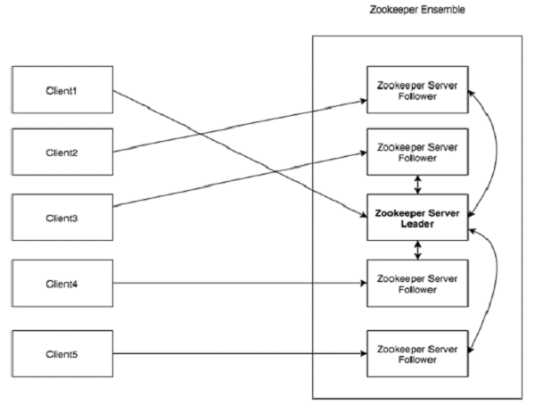

# 一、Zookeeper概述

## 1、什么是Apache Zookeeper？

Apache Zookeeper是由集群使用的一种服务，用于在自身之间协调，并通过稳健的同步技术维护共享数据。Zookeeper本身是一个分布式应用程序，为写入分布式应用程序提供服务。Zookeeper提供以下常见服务：

- **命名服务** - 按名称标识集群中节点。类似于DNS，但仅对于节点
- **配置管理** - 加入节点的最近和最新系统配置信息
- **集群管理** - 实时地在集群和节点状态中加入/离开节点
- **选举算法** - 选举一个节点作为协调目的的Leader
- **锁定和同步服务** - 在修改数据同时锁定数据。以机制可帮助你在连接其他分布式应用程序（如Apache HBase）时进行自动故障恢复
- **高度可靠的数据注册表** - 即使在一个或几个节点关闭时也可以获得数据

## 2、Zookeeper的好处

以下是使用Zookeeper的好处

- 简单的分布式协调过程
- 同步 - 服务器进程之间的相互排斥和协作。些过程有助于Apache Hbase进行配置管理
- 有序的消息
- 序列化 - 根据特定规则对数据进行编码。确保应用程序运行一致。这种方法可以MapReduce中用来协调队列以执行运行的线程。
- 可靠性
- 原子性- 数据转移完全成功或完全失败，但没有事务是部分的。

# 二、Zookeeper 基础

在深入了解ZooKeeper的运作之前，让我们来看看ZooKeeper的基本概念。我们将在本章中讨论以下主题：

## 1、Architecture（架构）

看看下面的图表。它描述了Zookeeper的“客户端-服务器架构”:

作为ZooKeeper架构的一部分的每个组件在下表中进行了说明

| 部分     | 描述                                                         |
| -------- | ------------------------------------------------------------ |
| Client   | 客户端，我们的分布式应用集群中的一个节点，从服务器访问信息。对于特定的时候间隔，每个客户端向服务器发送消息经使服务器知道客户端是活跃的。类似地，当客户端连接时，服务器发送确认码。如果连接的服务器没有响应，客户端会自动将消息重定向到另一个服务器 |
| Server   | 服务器，我们的Zookeeper总体中的一个节点，为客户端提供所有服务。向客户端发送确认码以告知服务器是活跃的 |
| Ensemble | Zookeeper服务器组。形成ensemble所需要的最小节点数为3         |
| Leader   | 服务器节点，如果任何连接的节点失败，侧执行自动恢复。Leader在服务启动时被选举 |
| Follower | 跟随Leader指令的服务器节点                                   |

## 2、Hierarchical namespace（层次命名空间）

下图描述了用于内存表示的Zookeeper文件系统的树结构。Zookeeper节点称为为**znode**。每个znode由一个名称标识，并用路径(/)序列分隔。

- 在图中，首先有一个“/”分隔的zoode。在根目录下，你有两个逻辑命名空间**config**和**workers**。
- **config**命名空间用于集中式配置管理，**workers**命名空间用于命名。
- 在config命名空间下，每个znode最多可以存储1M的数据。这与UNIX文件系统相似，除了znode也可以存储数据。这种结构的主要目的是存储同步数据并描述znode的元数据。此结构称为**Zookeeper数据模型**。

Zookeeper数据模型中的每个znode都维护着一个stat结构。一个stat仅提供一个znode**元数据**。它由<u>版本号，操作控制列表(ACL)，时间戳和数据长度</u>组成。

- **版本号** - 每个znode都有版本号，这意味着每当znode相关联的数据发生变化时，其对应的版本号也会增加。当多个zookeeper客户端尝试在同一znode上执行操作时，版本号的使用就很重要
- **操作控制列表(ACL)**  - ACL基本上是访问znode的谁机制。它管理所有znode读取和写入操作
- **时间戳** -时间戳表示创建和修改znode所经过的时间。它通常经毫秒为单位。Zookeeper从“事务ID”(zxid)标识znode的每个更改。Zxid是唯一的，并且为每个事务保留时间，以便你可以轻松地确定从一个请求到另一个请求所经过的时间。
- **数据长度** - 存储在znode中的数据总量是数据长度。你最多可以存储1Ｍ的数据。

### Znode的类型

`create [-s] [-e] path data acl`

znode被分为持久节点(persistent)，临时节点(ephemeral)和顺序节点(sequential)

- **持久节点** - `create NodeName value`即使在创建该特定的znode的客户端断开连接后,持久节点仍然存在。默认情况下,除非另有说明,否则所有znode都是持久的。
- **临时节点** - `create -e NodeName value`客户端活跃时，临时节点就是有效的。当客户端与Zookeeper集合断开连接时，临时节点会自动删除，因此，只有临时节点不允许有子节点。如果临时节点被删除，则一个合适点节点将填充其位置。临时节点在Leader选举中起着重要作用
- **顺序节点** - `create -s NodeName value`顺序节点可以是**持久的**或**临时的**。当一个新的znode被创建一个为顺序节点时，Zookeeper通过将位数的序号附加到原始名称来设置znode的路径。例如，如果将具有路径`/myapp`的znode创建为顺序节点，则Zookeeper将路径更改为`/myapp0000000001`，并将下一个序号设置为`0000000002`。如果两个顺序节点是同时创建的，那么Zookeeper不会对每个znode使用相同的数字。顺序节点锁定和同步起重要作用。
  - **顺序持久节点** - 客户端与zookeeper断开连接后，该节点依旧存在，只是Zookeeper给该节点名称进行顺序编号，顺序编号有小到大。
  - **顺序临时节点** - 客户端与zookeeper断开连接后，该节点被删除，只是Zookeeper给该节点名称进行顺序编号，顺序编号有小到大。

## 3、Session（会话）

会话对于zookeeper的操作非常重要。会话中的请求按FIFO顺序执行。一旦客户端连接到服务器，将建立会话并赂客户端分配**会话ID**。

客户端以特定的时间发送**心跳**经保持会话有效。如果Zookeeper集合在超过服务器开启时指定的期间(会话超时)都没有从客户端接收到心跳，则它会判断 客户端死机。

会话超时通常以毫秒为单位。当会话由于任何原因结束时，在该会话期间创建的临时节点也会被删除。

## 4、Watches（监视）

监视是一种简单的机制，使客户端收到关于Zookeeper集合中的更改的通知。客户端可以在读取特定的znode是设置Watches。Watches会向注册的客户端发送任何znode（客户端注册表）更改通知。

Znode更改是与znode相关的数据的修改或znode的子项中更改。只触发一次watches。如果客户端想要再次通知，则必须通过另一个读取操作来完成。当连接会话过期时，客户端将与服务断开连接，相关的watches也将被删除。

# 三、Zookeeper工作流

一旦Zookeeper集合启动，它将等待客户端连接。客户端将连接到Zookeeper集合中的一个节点。它可以是Leader或Follower节点。一旦客户端被连接。节点将特定客户端分配会话ID并赂该客户端发送确认。如果客户端没有收到确认，它将尝试连接Zookeeper集合中的另一个节点。一旦连接到节点，客户端将以有规律的间隔向节点发送心跳，确保连接不会丢失。

## ZooKeeper集合中的节点

让我们分析在Zookeeper集合中拥有不同数据的节点效果。

- 如果我们有单个节点，则当该节点故障时，Zookeeper集合将故障。它有助于“单点故障”，不建议在生产环境中使用。
- 如果我们有2个节点，而一个节点故障，我们没有占多数，因为两个中的一个不是多数。
- 如果我们有3个节点，而一个节点故障，那么我们有大多数，因此，这是最低要求。Zookeeper集合在实际生产环境中必须至少有3个节点。
- 如果我们有4个节点，而两个节点故障，它将再次故障。类似于有3个节点，额外点不用于任何目的，因此，最好 添加奇数的节点，例如：3，5，7

我们知道写入过程经Zookeeper集合中的读过程要贵，因为所有节点都需要在数据库中写入相同的数据。因此，对于 平衡的环境拥有较少数量（例如：3，5，7）的节点比拥有大量的节点要好。

下图描述了Zookeeper工作流，后面的表说明了它的不同组件。

| 组件                              | 描述                                                         |
| --------------------------------- | ------------------------------------------------------------ |
| 写入(write)                       | 写入过程由leader节点处理。leader将写入请求转发到所有znode，并等待znode的回复。如果一半的znode回复，则写入过程完成 |
| 读取(read)                        | 读取由特定连接znode在内部执行，因此不需要与集群进行交互      |
| 复制数据库存(replicated database) | 它用于在zookeeper中存储数据。每个znode都有自己的数据库，每个znode在一致性的帮助下每次都有相同的数据。 |
| Leader                            | Leader是负责处理写请求的Znode                                |
| Follower                          | Follower客户端接收写入请求，并将它们转发到Leader znode。     |
| 请求处理器(request processor)     | 只存在于leader节点。它管理来自[follower]()节点的写入请求     |
| 原子广播(atomic broadcasts)       | 负责广播从Leader节点到Follower节点的变化                     |

# 四、Zookeeper Leader选举

让我们分析如何在Zookeeper集合中选举leader节点。考虑一个集群中有N个节点。Leader选举的过程如下：

- 所有节点创建具有相同路径`/app/leader_election/guid_的顺序`、临时节点。
- Zookeeper集合将附加10位序列号到路径，创建的znode将是`/app/leader_election/guid_0000000001`,`/app/leader_election/guid_0000000002`等。
- 对于给定的实例，在znode中创建小数字节点成为leader，而所有其他节点是Follower节点。
- 每个follower节点监视下一个具有最小数的znode。例如，创建`znode/app/leader_election/guid_0000000008`的节点将监视`znode/app/leader_election/guid_0000000007`，创建`znode/app/leader_election/guid_0000000007`的节点将监视`znode/app/leader_election/guid_0000000006`
- 如果leader关闭，则其相应的znode/app/leader_electionN会被删除。
- 一个在线follower节点将通过监视器获得关于leader移除的通知。
- 下一个在线follower节点将检查是否存在其他具有最小数字的znode。如果没有，那么它将承担leader的角色。否则，它找到创建具有最小数字的znode节点作为leader。

- 类似地，所有其他follower节点选举创建具有最小数字的znode的节点作为leader

leader选举是一个复杂的过程，但ZooKeeper服务使它非常简单。让我们在下一章中继续学习ZooKeeper安装，以用于开发目的