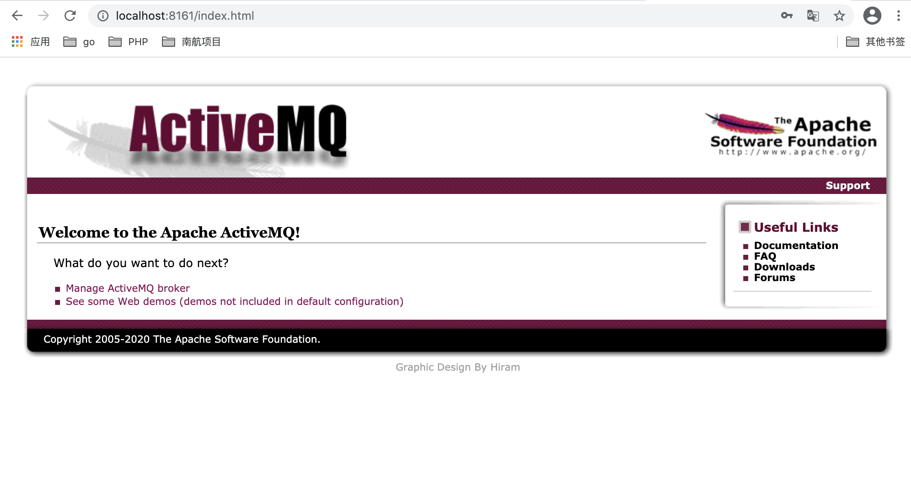

# ActiveMQ

​	ActiveMQ消息队列依赖于JMS(JAVA Message Service，java消息服务)API是一个消息服务的标准规范，允许应用程序组件基于JavaEE平台创建、发送、接收和读取消息。它使分布式通信耦合度更低，消息服务更加可靠以及异步性。

## 一、JMS消息模型

在JMS标准中，有两种消息模型:

- P2P(Point to Point)

- Publish/Subscribe(Pub/Sub)

### 1、P2P模式

1. p2p模式包含三个角色、消息队列(Queue)、发送者/生产者、接收者/消费者；

2. P2P的特点，每个消息只有一个消费者(Consumer)，消息一旦被消费，就会从队列中删除；
3. 发送者和接收者在时间上没有依赖性，不管消息有没有消费，都可以向队列中发消息；
4. 接收者在成功接收消息后需向队列应答成功
5. 如果希望每个消息都被成功处理的话，那么需要P2P模式

### 2、Pub/Sub模式

1. 包含三个角色，主题(Topic)、发布者(Publisher)、订阅者(Subscriber)，多个发布者将消息发送到Topic，系统将这些消息传送给多个订阅者；
2. 每个消息可以有多个消息者；
3. 发布者和订阅者之间有时间上的依赖性。针对某个主题(Topic)的订阅者，必须创建一个订阅者之后，才能消费发布的消息；也就是在发布消息的时候，订阅者还没有启动，那么将收不到消息。
4. 为了消费消息，订阅者必须保持运行状态；
5. JMS允许订阅者创建一个可持久化的订阅。这样，即使订阅者没有被激活(运行)，它也能接收到发布者的消息；
6. 如果希望发送的消息可以不被做任何处理、或者可以被一个或多个消费都处理，可以使用Pub/Sub模式。

### 3、消息消费

消息的消息有两种方式：

#### 1)、同步

订阅者或接收者通过receive方法来接收消息，receive方法在接收到信息之前(或超时之前)将一直阻塞。

#### 2)、异步

订阅者或接收者可以注册一个消息监听器，当消息到达之后，系统自动调用监听器的onMessage方法处理消息。

JNDI:Java命名和目录接口，是一种标准的Java命名系统接口。可以在网络上查找和访问服务。通过指定一个资源名称，该名称对应于数据库或命名服务中的一个记录，同时返回资源连接建立所必须的信息。

JNDI在JMS中起到查找和访问发送目标或消息来源的作用。

## 二、下载并运行ActiveMQ

下载地址：http://activemq.apache.org/

查看常用命令：

```
leyao@leyao-MacBook-Pro bin % ./activemq --help     
Tasks:
    browse                   - Display selected messages in a specified destination.
    bstat                    - Performs a predefined query that displays useful statistics regarding the specified broker
    consumer                 - Receives messages from the broker
    create                   - Creates a runnable broker instance in the specified path.
    decrypt                  - Decrypts given text
    dstat                    - Performs a predefined query that displays useful tabular statistics regarding the specified destination type
    encrypt                  - Encrypts given text
    export                   - Exports a stopped brokers data files to an archive file
    list                     - Lists all available brokers in the specified JMX context
    producer                 - Sends messages to the broker
    purge                    - Delete selected destination's messages that matches the message selector
    query                    - Display selected broker component's attributes and statistics.
    start                    - Creates and starts a broker using a configuration file, or a broker URI.
    stop                     - Stops a running broker specified by the broker name.
```

解压后进入bin目录运行：

```sh
./activemq start
```

运行后访问：http://localhost:8161/ 可以进入ActiveMQ的管理界面，用户名/密码 : admin/admin



## 三、使用第三方程序来操作ActiveMQ

需要配置一个用户名及密码给第三方程序使用，配置 `conf/activemq.xml`文件，在`<broker .../>` 标签里加入如下配置

```xml
<beans .....
       
	<broker xmlns="http://activemq.apache.org/schema/core" useJmx="false">

    <persistenceFactory>
      <journalPersistenceAdapterFactory journalLogFiles="5" dataDirectory="../data"/>
    </persistenceFactory>
  
    <transportConnectors>
      <transportConnector uri="tcp://localhost:61616"/>      
      <transportConnector uri="stomp://localhost:61613"/>
    </transportConnectors>
	
		<!--加入以下配置，第三方程序就可以通过下面的用户名及密码对activeMQ进行操作-->
    <plugins>
    	<plugin>
    		<users>
    			<authenticationUser
    				username="active-mq"
    				password="123456"
    				groups="users,admins" />
    		</users>
    	</plugin>
    </plugins>
        
  </broker>
</beans>
```

### 1、java操作队列模式


### 2、java操作Pub/Sub模式


