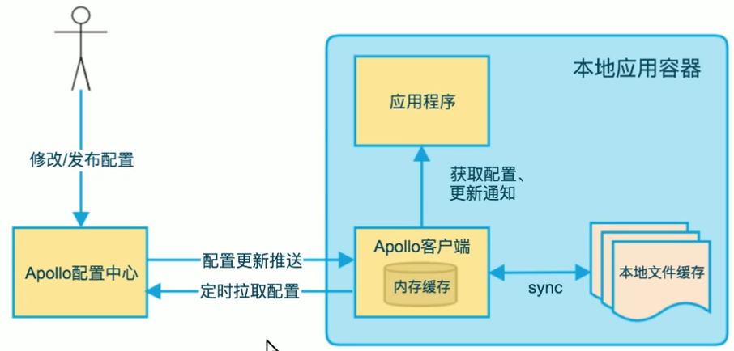

# Apollo分布式配置中心

Apollo从设计之初就立志成为一个有治理能力的配置发布平台，目前提供了以下的特性：

- **统一管理不同环境**
  - Apollo提供一个统一界面集中式管理不同的环境(environment)、集群(cluster)、命名空间(namespace)的配置
  - 同一份代码部署在不同的集群，可以有不同的配置，比如zookeeper的地址
  - 通过命名空间(name)可以方便地支持多个不同应用共享同一份配置，同时还允许应用对共享配置进行覆盖。
- **配置修改实时生效(热发布)**
  - 用户在Aopllo修改完配置并发布后，客户端能实时(1秒)收到最新的配置，并通知到应用程序
- **版本发布管理**
  - 所有配置发布都有版本概念
- **灰度发布**
  - 支持配置的灰度发布，比如点了发布后，只对部分应用实例生效，确认无误后就可以推给应用实例
- **权限管理、发布审核、操作审核**

# 一、环境搭建

