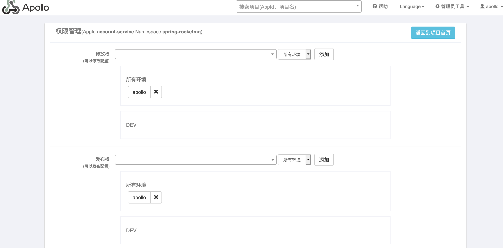
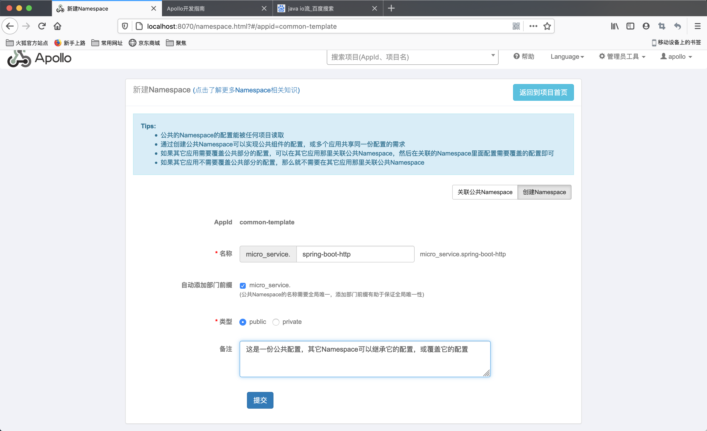

# Apollo分布式配置中心

Apollo从设计之初就立志成为一个有治理能力的配置发布平台，目前提供了以下的特性：

- **统一管理不同环境**
  - Apollo提供一个统一界面集中式管理不同的环境(environment)、集群(cluster)、命名空间(namespace)的配置
  - 同一份代码部署在不同的集群，可以有不同的配置，比如zookeeper的地址
  - 通过命名空间(name)可以方便地支持多个不同应用共享同一份配置，同时还允许应用对共享配置进行覆盖。
- **配置修改实时生效(热发布)**
  - 用户在Aopllo修改完配置并发布后，客户端能实时(1秒)收到最新的配置，并通知到应用程序
- **版本发布管理**
  - 所有配置发布都有版本概念
- **灰度发布**
  - 支持配置的灰度发布，比如点了发布后，只对部分应用实例生效，确认无误后就可以推给应用实例
- **权限管理、发布审核、操作审核**


# 一、环境搭建

安装，略。

运行：http://localhost:8070/

# 二、QuickStart

## 1、创建项目


点击<span style="color:blue;">[创建项目]</span>


## 2、发布配置

进入`apollo-quickstart`项目，在`application`里点击<span style="color:blue;">[新增配置]</span>->编写Key及Value


点击<span style="color:blue;">[提交]</span>


新创建的配置都是<span style="color:blue;">未发布</span>状态，需要通过点击<span style="color:blue">[发布]</span>，才能使用。

## 3、编写脚本，读取配置

创建QuickStart项目

### 1)、导入依赖

```xml
<dependency>
	<groupId>com.ctrip.framework.apollo</groupId>
	<artifactId>apollo-client</artifactId>
	<version>1.1.0</version>
</dependency>
<dependency>
	<groupId>org.slf4j</groupId>
	<artifactId>slf4j-simple</artifactId>
	<version>1.7.28</version>
</dependency>
```

### 2)、编写脚本获取配置

```java
public class GetConfigTest {
	public static void main(String[] args) {
		/** 基本用法 */
		// System.setProperty("app.id", "SampleApp");
		// System.setProperty("env", "DEV");
		// System.setProperty("dev_meta", "http://localhost:8080");
		com.ctrip.framework.apollo.Config config =
				com.ctrip.framework.apollo.ConfigService.getAppConfig();
			String someKey = "sms.enable";
			String value = config.getProperty(someKey, null);
			System.out.println(someKey + ": " + value);
	}
}
```

运行脚本：`Java -jar -Dapp.id=SampleApp -Denv=DEV -Ddev_meta=http//localhost:8080`

### 3)、监听配置

```java
public class GetConfigTest {
	public static void main(String[] args) {
		com.ctrip.framework.apollo.Config config =
				com.ctrip.framework.apollo.ConfigService.getAppConfig();
		// 添加监听器阻塞
    config.addChangeListener(new ConfigChangeListener() {
			@Override
			public void onChange(ConfigChangeEvent changeEvent) {
				System.out.println("Changes for namespace " + changeEvent.getNamespace());
				for (String key : changeEvent.changedKeys()) {
					ConfigChange change = changeEvent.getChange(key);
					System.out.println(
						String.format("Found change - key: %s, oldValue: %s, newValue: %s, changeType: %s", 
								change.getPropertyName(), 
								change.getOldValue(), 
								change.getNewValue(), 
								change.getChangeType())
							);
				}
			}
		});
		try {
      // 输入阻塞
			new BufferedReader(new InputStreamReader(System.in)).readLine();
		} catch (IOException e) {
			e.printStackTrace();
		}
	}
}
```

# 三、项目管理 

## 1、部门配置

在添加项目的时候，要求选择部门，部门的配置在`管理员工具`->`系统参数`，通过搜索`organizations`得到部门的配置参数如下图：


修改`Value`的值如下：

```json
[
  {"orgId":"TEST1","orgName":"样例部门1"},
  {"orgId":"TEST2","orgName":"样例部门2"},
  {"orgId":"micro_service","orgName":"微服务部门"}]
```

点击<span style="color:blue;">[提交]</span>，就会增加一个id为`micro_service`的`微服务部门`。

## 2、用户管理 

点击`管理员工具`->`用户管理`，输入需要增加的用户信息，如下图：


点击<span style="color:blue;">[提交]</span>

## 3、通过新建的部门信息及用户，创建新的项目

如图，点击提交，生成`account-service`项目


退出登录，使用`zhangsan/123`的帐号信息登录，只会看到``zhangsan`有关的项目


## 4、删除项目

`管理员工具`->`删除应用、集群、AppNamespace`，搜索应用的`AppId`，点击[删除应用]


# 四、配置管理

## 1、配置的增删改查及发布操作


配置的增删改查及发布操作相对简单，看上图就可以了。

## 2、Namespace操作

### 1)、添加Namespace(私有)

点击`添加Namespace` -> `创建Namespace`如图：

<span style="color:blue;">注意: 这里要选择私有"private"</span>


点击提交，进入“权限管理”页面



这个时候可不什么都不操作，点击<span style="color:blue;">[返回到项目首页]</span>，会看到当前项目中多了一个叫`spring-rocketmq`的`Namespace配置`


### 2)、读取Namespace下的配置

```java
public class GetConfigTest {
	public static void main(String[] args) throws IOException {
		com.ctrip.framework.apollo.Config config =
      	// 这里是读到默认命名空间的配置
				// com.ctrip.framework.apollo.ConfigService.getAppConfig();
      	// TODO 通过getConfig("xxx") 可以读取指定的Namespace下的配置
				com.ctrip.framework.apollo.ConfigService.getConfig("spring-rocketmq");
		
		config.addChangeListener(new ConfigChangeListener() {
			@Override
			public void onChange(ConfigChangeEvent changeEvent) {
				System.out.println("Changes for namespace " + changeEvent.getNamespace());
		        for (String key : changeEvent.changedKeys()) {
		            ConfigChange change = changeEvent.getChange(key);
		            System.out.println(String.format("Found change - key: %s, oldValue: %s, newValue: %s, changeType: %s", 
		            		change.getPropertyName(), 
		            		change.getOldValue(), 
		            		change.getNewValue(), 
		            		change.getChangeType()));
		        }
			}
		});
		new BufferedReader(new InputStreamReader(System.in)).readLine();
	}
}
```

## 3、公共配置

- 公共配置的作用是给其它配置给继承的

### 1)、创建公共Namesapce配置

我们要创建一个新的项目`common-template`，在里面创建公共配置的`public Namespace`：`spring-boot-http`。如图：



同样，点击提交后可以不用处理权限，跳转到项目管理页面。再给这份公共的Namespace添加配置并发布，如下：


### 2)、使用公共Namesapce配置-创建关联配置

- 需要创建关联配置才能继承公共配置

#### (1)、创建关联配置

选择`新建Namespace`->`关联公共Namespace`，在namespace选项中选择上一步创建的公共的namespace：`micro_service.spring-boot-http`


点击<span style="color:blue;">[提交]</span>，如图：


#### (2)、读取关联配置

```java
public class GetConfigTest {
	public static void main(String[] args) throws IOException {
		com.ctrip.framework.apollo.Config config =
				// 只需要要这里指定一个命名空间就可以使用了
				com.ctrip.framework.apollo.ConfigService.getConfig("micro_service.spring-boot-http");
		
		config.addChangeListener(new ConfigChangeListener() {
			@Override
			public void onChange(ConfigChangeEvent changeEvent) {
				System.out.println("Changes for namespace " + changeEvent.getNamespace());
		        for (String key : changeEvent.changedKeys()) {
		            ConfigChange change = changeEvent.getChange(key);
		            System.out.println(String.format("Found change - key: %s, oldValue: %s, newValue: %s, changeType: %s", 
		            		change.getPropertyName(), 
		            		change.getOldValue(), 
		            		change.getNewValue(), 
		            		change.getChangeType()));
		        }
			}
		});
		new BufferedReader(new InputStreamReader(System.in)).readLine();
	}
}
```

## 4、集群管理

> - 通过添加集群，可以使同一份程序在不同的集群（如不同的数据中心）使用不同的配置
> - 如果不同集群使用一样的配置，则没有必要创建集群
> - 假设有一服务，在全国不同的机房运行，不同机房的某连接配置不同，如广州机房，那就有必要创建集群

### 1)、添加集群

#### (1)、添加集群

点击<span style="color:blue;">[添加集群]</span>


创建完成，会包含原有(默认)的`application`及`spring-rocketmq`等私有配置的 `Namespace`，但里面一个配置项都没有，如图：


#### (2)、同步配置

点返回<span style="color:blue;">default集群</span>，点击<span style="color:blue;">[同步配置]</span>对配置进行同步操作：


新同步的配置，还需要执行<span style="color:blue;">[发布]</span>操作


#### (3)、关联公共配置

新创建的集群是没有关联配置的，需要重新手动关联，略。

### 2)、读取集群下的配置

在启动项中加入：-Dapollo.cluster=GuangZhou参数

```java
Java -jar -Dapp.id=account-service -Denv=DEV -Dapollo.cluster=GuangZhou -Ddev_meta=http//localhost:8080
```

# 五、SpringBoot集成Apollo

## 1、创建工项，并引入依赖

```xml
<dependencies>
		<dependency>
			<groupId>org.springframework.boot</groupId>
			<artifactId>spring-boot-starter</artifactId>
			<exclusions>
				<exclusion>
					<groupId>org.springframework.boot</groupId>
					<artifactId>spring-boot-starter-logging</artifactId>
				</exclusion>
			</exclusions>
		</dependency>
  
		<!-- 配置使用log4j2日志 -->
		<dependency>
			<groupId>org.springframework.boot</groupId>
			<artifactId>spring-boot-starter-log4j2</artifactId>
		</dependency>

		<dependency>
			<groupId>org.springframework.boot</groupId>
			<artifactId>spring-boot-starter-web</artifactId>
		</dependency>

		<dependency>
			<groupId>org.springframework.boot</groupId>
			<artifactId>spring-boot-configuration-processor</artifactId>
			<optional>true</optional>
		</dependency>
  
		<!-- 引入Apollo就可以了 -->
		<dependency>
			<groupId>com.ctrip.framework.apollo</groupId>
			<artifactId>apollo-client</artifactId>
			<version>1.1.0</version>
		</dependency>

</dependencies>
```

## 2、创建启动类

```java
@SpringBootApplication
@EnableApolloConfig // TODO 开启Apollo配置
public class ApolloApplication {
	public static void main(String[] args) {
		SpringApplication.run(ApolloApplication.class, args);
	}
}
```

## 3、创建application.properties配置文件

springboot的大部分配置都可以放在apollo配置中心上，这里只需要指定使用apollo的那个

```properties
server.port=63000

# apollo项目的AppId
app.id=account-service
# 调用默认的命名空间
apollo.bootstrap.enabled=true
# 调用其它命名空间
apollo.bootstrap.namespaces=application,spring-rocketmq,micro_service.spring-boot-http,spring-boot-druid

# TODO 其它的配置都放在apollo上了
```

## 4、Apollo Meta Server配置

之前是在启动参数的`-Ddev_meta=http://localhost:8080`上的，也可以放在`apollo-env.properties`文件中，

```properties
dev.meta=http://127.0.0.1:8080
# 其它环境没有的话可以不用写
fat.meta=http://apollo.fat.xxx.com
uat.meta=http://apollo.uat.xxx.com
pro.meta=http://apollo.xxx.com
```

## 5、定义控制器，读取Apollo里的配置

```java
@RestController
public class AccountController {
	@GetMapping("/")
	public String getDBConfig() {
		return "Apollo Demo";
	}
  /**
  * 在这里读取 apollo里配置的 spring.datasource.url的值
  * TODO，只其中一个命名空间里包含这个key，就会读取
  */
	@GetMapping("/db-url")
	public String getDBConfig(@Value("${spring.datasource.url}") String url) {
		return url;
	}
}
```

## 6、启动

需要修改SpringBoot的启动参数如下：

```sh
-Djava.security.egd=file:/dev/./urandom -Denv=DEV -Dapollo.cacheDir=/tmp/apollo-cache -Dapollo.cluster=DEFAULT
```

- env 当前环境
- apollo.cluster 使用的集群
- apollo.cacheDir 缓存目录

## 7、运行访问

访问：`http://localhost:63000/account-service/db-url`，请求的URI需要加上`/account-service`，因为在Apollo的其中一个命名空间里我配置了`server.servlet.context-path`的值是`/account-service`，也可以看出，SpringBoot，已经可以正确使用Apollo作为配置中心了。返回结果如下：


# 六、其它环境

会放在不同的服务器节点中，略。

# 七、灰度发布

假设集群中，某个服务开了10个节点，来实现负载均衡。通过灰度发布可以指定新更新的配置信息，作用于哪几个节点，如果这些节点在使用新的配置的时候，确定没有异常，可以把这些新的配置也推到其它节点上。

## 1、开始灰度发布

点击<span style="color:blue;">[灰度]</span> -> <span style="color:blue;">[新增灰度配置]</span>，创建`timeout=3000`的灰度配置


选择<span style="color:blue;">[灰度规则]</span> -> <span style="color:blue;">[新增规则]</span>，选择当前连接到Apollo的主机，可以选择多台


点击<span style="color:blue;">[灰度发布]</span>完成灰度发布操作，只时集群中选中的主机，就会更新到新的配置，其它服务不会更新新的配置。

## 2、全量发布

当确定新的配置没有问题的时候，可以使用全量发布，只需要点击<span style="color:blue;">[全量发布]</span>就可以了。

