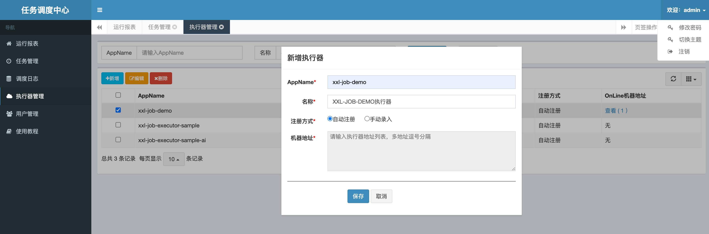
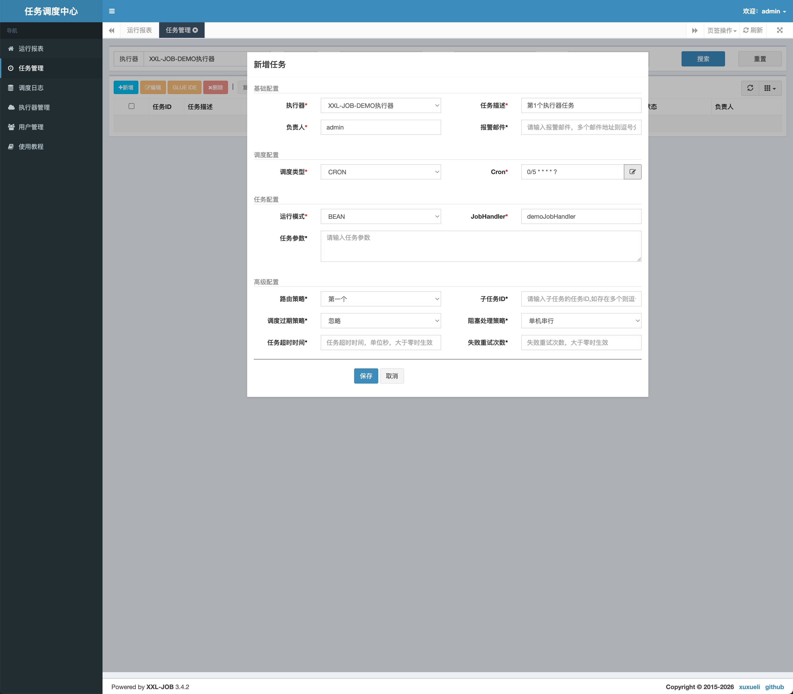
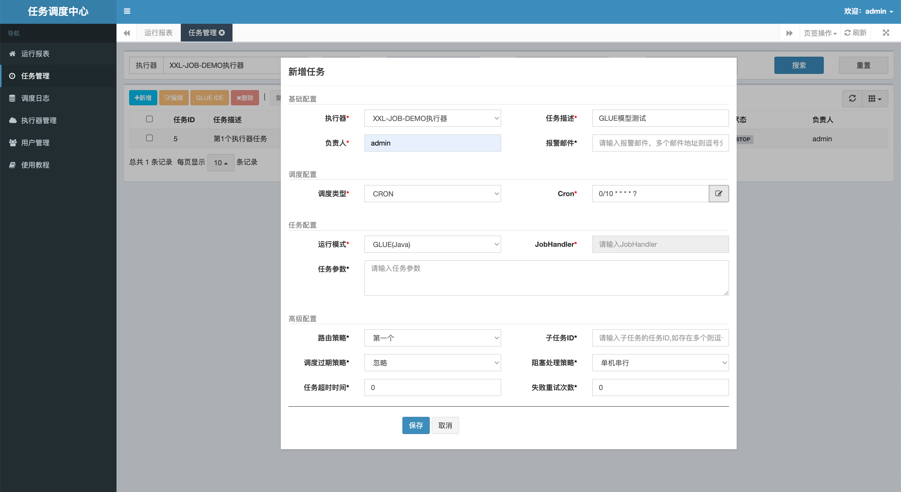
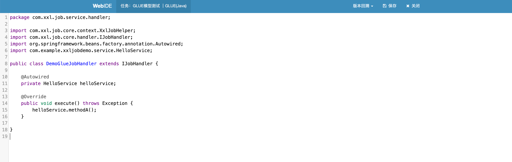
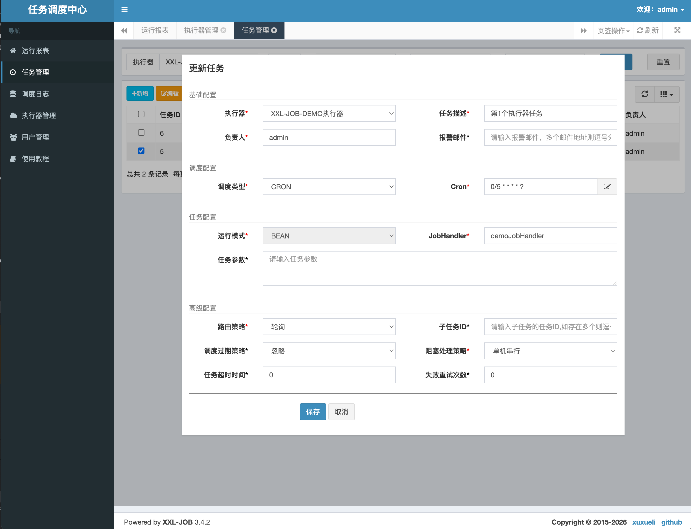
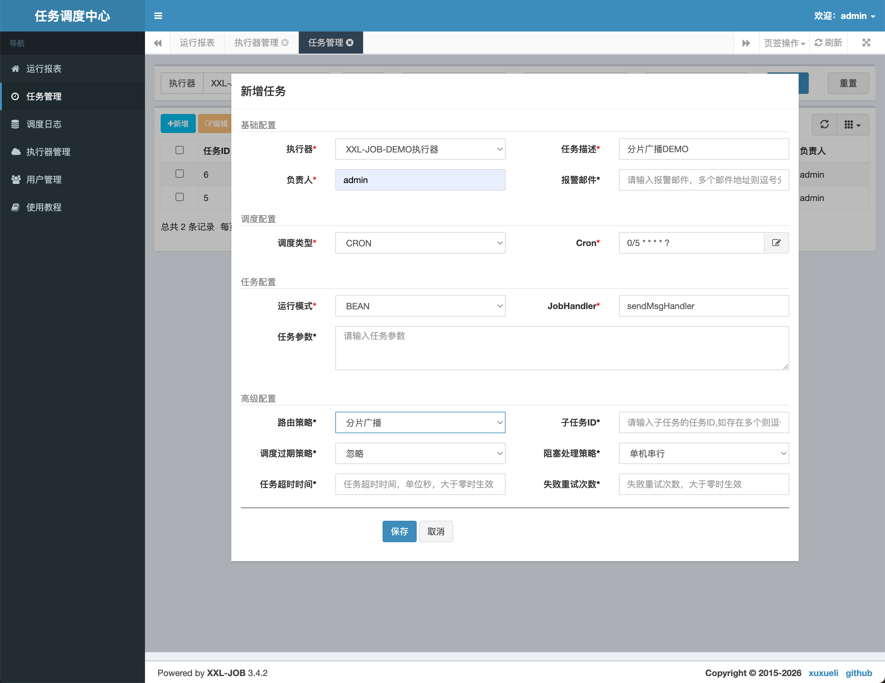

# XXL-JOB使用教程

## 第一章：运行 xxl-job-admin 服务

xxl-job-admin 是 XXL-JOB 的调度中心（服务端），负责管理调度任务，需要优先部署启动。

### 1. 修改配置文件

进入 `xxl-job-admin` 模块，编辑 `src/main/resources/application.properties` 配置文件：

```properties
### Web 服务端口（默认 8080，按需修改；这里改为 8210）
server.port=8210

### Spring Boot 数据源配置（修改为实际数据库连接信息）
spring.datasource.url=jdbc:mysql://127.0.0.1:3306/xxl_job?useUnicode=true&characterEncoding=UTF-8&autoReconnect=true&serverTimezone=Asia/Shanghai
spring.datasource.username=root
spring.datasource.password=your_password
spring.datasource.driver-class-name=com.mysql.cj.jdbc.Driver
```

> **主要修改项：**
> 
> - `server.port`：调度中心 Web 端口，根据实际情况调整。
> - `spring.datasource.*`：数据库连接地址、用户名、密码等信息。

### 2. 初始化数据库

连接 MySQL，执行 `data/db/xx.sql` 脚本，创建调度中心所需的库表：

- 创建数据库（如果尚未创建）：
  
  ```sql
  CREATE DATABASE IF NOT EXISTS xxl_job DEFAULT CHARACTER SET utf8mb4 COLLATE utf8mb4_unicode_ci;
  ```

- 执行表结构脚本：
  
  ```bash
  mysql -u root -p xxl_job < data/db/xx.sql
  ```

执行成功后，数据库中将生成以下核心表：`xxl_job_group`、`xxl_job_info`、`xxl_job_log` 等。

### 3. 打包与运行

#### 3.1 Maven 打包

在项目根目录下执行 Maven 打包命令：

```bash
mvn clean package -DskipTests
```

打包成功后，在 `xxl-job-admin/target/` 目录下会生成 `xxl-job-admin-3.4.2.jar`。

#### 3.2 启动服务

```bash
java -jar xxl-job-admin-3.4.2.jar
```

* src/main/resources/application.properties文件需要复制到xxl-job-admin-3.4.2.jar同一目录中

#### 3.3 访问调度中心

打开浏览器，访问调度中心 Web 界面：

```
http://localhost:8210/xxl-job-admin
```

> 默认登录账号：`admin` / 密码：`123456`

登录成功后即可进入 XXL-JOB 调度中心管理后台。

## 第二章：HelloWorld — 编写第一个定时任务

本章创建一个 Spring Boot 应用作为执行器客户端，接入 XXL-JOB 调度中心，实现一个最简单的定时任务。

### 1. 创建项目并引入依赖

创建 Spring Boot 项目，在 `pom.xml` 中添加 `xxl-job-core` 依赖：

```xml
<dependency>
    <groupId>com.xuxueli</groupId>
    <artifactId>xxl-job-core</artifactId>
    <version>3.4.2</version>
</dependency>
```

### 2. 创建配置文件 application.yml

在 `src/main/resources/` 下创建 `application.yml`：

```yaml
spring:
  application:
    name: xxl-job-demo        # 应用名称，也作为默认的执行器 AppName
server:
  port: 8088                  # 应用 Web 端口

# XXL-JOB 配置
xxl:
  job:
    # 调度中心配置
    admin:
      addresses: http://127.0.0.1:8210   # 调度中心地址，指向 xxl-job-admin 服务
    # 执行器配置
    executor:
      appname: ${spring.application.name}  # 执行器名称，引用应用名，需与调度中心新增执行器时一致
      ip:                                   # 执行器 IP，留空自动获取本机 IP
      port: 9998                            # 执行器端口，用于与调度中心通信
      logpath: ./log/applogs/xxl-job/jobhandler  # 任务执行日志存储路径
      logretentiondays: 30                  # 日志文件保留天数
    # 访问令牌
    accessToken: default_token              # 需与调度中心配置一致，默认为空
```

> **配置要点：**
> 
> - `xxl.job.admin.addresses`：调度中心部署地址，多个地址用逗号分隔。
> - `xxl.job.executor.appname`：执行器的唯一标识，调度中心依此识别执行器。
> - `xxl.job.executor.port`：执行器端口号，不能与 `server.port` 相同。
> - `xxl.job.accessToken`：安全令牌，两边不一致会导致通信失败。

### 3. 创建配置类 XxlJobConfig

创建 `config/XxlJobConfig.java`，将配置文件中的属性注入到 `XxlJobSpringExecutor`：

```java
package com.example.xxljobdemo.config;

import com.xxl.job.core.executor.impl.XxlJobSpringExecutor;
import org.springframework.beans.factory.annotation.Value;
import org.springframework.context.annotation.Bean;
import org.springframework.context.annotation.Configuration;

@Configuration
public class XxlJobConfig {

    @Value("${xxl.job.admin.addresses}")
    private String adminAddresses;

    @Value("${xxl.job.executor.appname}")
    private String appname;

    @Value("${xxl.job.executor.ip:}")
    private String ip;

    @Value("${xxl.job.executor.port}")
    private int port;

    @Value("${xxl.job.executor.logpath}")
    private String logPath;

    @Value("${xxl.job.executor.logretentiondays}")
    private int logRetentionDays;

    @Value("${xxl.job.accessToken}")
    private String accessToken;

    @Bean
    public XxlJobSpringExecutor xxlJobExecutor() {
        XxlJobSpringExecutor executor = new XxlJobSpringExecutor();
        executor.setAdminAddresses(adminAddresses);   // 调度中心地址
        executor.setAppname(appname);                 // 执行器名称
        executor.setIp(ip);                           // 本机 IP
        executor.setPort(port);                       // 通信端口
        executor.setAccessToken(accessToken);         // 访问令牌
        executor.setLogPath(logPath);                 // 日志路径
        executor.setLogRetentionDays(logRetentionDays); // 日志保留天数
        return executor;
    }
}
```

> **说明：**
> 
> - `@Configuration` 声明这是一个 Spring 配置类。
> - `@Value` 读取 `application.yml` 中 `xxl.job.*` 下的每一项配置。
> - `@Bean` 将 `XxlJobSpringExecutor` 注册到 Spring 容器，应用启动时自动连接调度中心。

### 4. 创建任务类 SimpleXxlJob

创建 `job/SimpleXxlJob.java`，编写具体的任务执行逻辑：

```java
package com.example.xxljobdemo.job;

import com.xxl.job.core.handler.annotation.XxlJob;
import org.springframework.stereotype.Component;

import java.util.Date;

@Component
public class SimpleXxlJob {

    @XxlJob("demoJobHandler")
    public void demoJobHandler() {
        System.out.println("执行定时任务，执行时间：" + new Date());
    }
}
```

> **说明：**
> 
> - `@Component` 将类交给 Spring 管理。
> - `@XxlJob("demoJobHandler")` 声明一个 JobHandler，`"demoJobHandler"` 就是任务名称，在调度中心配置任务时需要用到。

### 5. 调度中心：新增执行器

1. 登录调度中心 `http://localhost:8210（账号 `admin/123456`）
2. 进入 **执行器管理** → 点击 **新增**
3. 填写执行器信息：



| 字段      | 值                                   |
| ------- | ----------------------------------- |
| AppName | `xxl-job-demo`（与配置文件中 `appname` 一致） |
| 名称      | `XXL-JOB-DEMO执行器`                   |
| 注册方式    | **自动注册**                            |

4. 保存后，启动 Spring Boot 应用，执行器会自动注册上线（列表中显示机器地址 `ip:9998`）

### 6. 调度中心：新增任务并测试

#### 6.1 新建任务

进入 **任务管理** → 点击 **新增**，填写以下信息：



| 字段         | 值                 | 说明                  |
| ---------- | ----------------- | ------------------- |
| 执行器        | `XXL-JOB-DEMO执行器` | 选择上一步创建的执行器         |
| 任务描述       | `HelloWorld测试任务`  | 自定义描述               |
| 负责人        | `admin`           | 任务负责人               |
| 调度类型       | **CRON**          | 或选择固定速度/固定延迟        |
| Cron 表达式   | `0/5 * * * * ?`   | 每 5 秒执行一次           |
| JobHandler | `demoJobHandler`  | 与 `@XxlJob` 注解中的值一致 |
| 运行模式       | **BEAN**          | 使用 Java Bean 模式     |
| 路由策略       | 第一个               | 单个执行器无需路由           |
| 阻塞处理策略     | 单机串行              | 默认即可                |

#### 6.2 执行一次（手动测试）

任务创建后，在任务列表中找到该任务，点击 **操作** 列下的 **执行一次** 按钮。手动触发一次任务执行，在应用的日志中可以看到输出：

```
执行定时任务，执行时间：Sat Aug 02 17:30:00 CST 2026
```

同时在调度中心的 **调度日志** 中可以查看执行结果和耗时。

#### 6.3 启动任务

点击 **操作** 列下的 **启动** 按钮，任务状态变为 **RUNNING**，调度中心将按照 Cron 表达式（每 5 秒）自动调度执行。

> **至此，一个完整的 XXL-JOB 定时任务就跑通了！** 🎉

## 第三章：GLUE 模式 — 在线编辑任务代码

第二章使用的是 **BEAN 模式**，任务代码写在应用项目中，修改代码需要重新打包部署。XXL-JOB 提供了 **GLUE 模式**，支持在调度中心 Web 界面上直接编写和修改任务代码，无需重启应用即可生效，非常适合开发调试和快速迭代。

### 1. 创建 HelloService 类

GLUE 模式可以在调度中心编写的代码中，通过 `@Autowired` 注入执行器应用中的 Spring Bean。因此需要先在应用中创建好业务逻辑类。

创建 `service/HelloService.java`：

```java
package com.example.xxljobdemo.service;

import org.springframework.stereotype.Service;

@Service
public class HelloService {

    public void methodA() {
        System.out.println("HelloService.methodA 执行了");
    }

    public void methodB() {
        System.out.println("HelloService.methodB 执行了");
    }
}
```

> **说明：** `HelloService` 是一个普通的 Spring Service，会被 GLUE 代码中的 `@Autowired` 自动注入。

### 2. 调度中心：创建 GLUE 模式任务

登录调度中心 `http://localhost:8210/xxl-job-admin`，进入 **任务管理** → 点击 **新增**：

| 字段       | 值                 | 说明                     |
| -------- | ----------------- | ---------------------- |
| 执行器      | `XXL-JOB-DEMO执行器` | 选择已注册的执行器              |
| 任务描述     | `GLUE模式测试`        | 自定义描述                  |
| 负责人      | `admin`           | 任务负责人                  |
| 调度类型     | **CRON**          | Cron 定时调度              |
| Cron 表达式 | `0/10 * * * * ?`  | 每 10 秒执行一次             |
| 运行模式     | **GLUE(Java)**    | 👈 关键：选择 GLUE(Java) 模式 |



其他字段保持默认即可，点击保存。

### 3. GLUE IDE 在线编辑代码

在任务列表中找到刚创建的 **"GLUE模式测试"** 任务，点击 **操作** 列下的 **GLUE IDE** 按钮，进入在线代码编辑页面。写入以下代码：

```java
package com.xxl.job.service.handler;

import com.xxl.job.core.context.XxlJobHelper;
import com.xxl.job.core.handler.IJobHandler;
import org.springframework.beans.factory.annotation.Autowired;
import com.example.xxljobdemo.service.HelloService;

public class DemoGlueJobHandler extends IJobHandler {

    @Autowired
    private HelloService helloService;

    @Override
    public void execute() throws Exception {
        helloService.methodA();
    }

}
```

> **代码要点：**
> 
> - `package` 必须为 `com.xxl.job.service.handler`（GLUE 模式固定包名）。
> - 必须继承 `IJobHandler` 并实现 `execute()` 方法。
> - 可以通过 `@Autowired` 注入执行器应用中的任意 Spring Bean（如 `HelloService`）。



编写完成后点击下方的 **保存** 按钮。

### 4. 执行与启动

代码保存后，返回任务列表：

- 点击 **执行一次**：手动触发一次任务，应用端将输出 `HelloService.methodA 执行了`，可在 **调度日志** 中查看执行结果。
- 点击 **启动**：任务状态变为 **RUNNING**，调度中心将按 Cron 表达式每 30 秒自动调度 GLUE 代码。

### GLUE 模式 vs BEAN 模式对比

| 维度   | BEAN 模式             | GLUE 模式                     |
| ---- | ------------------- | --------------------------- |
| 代码位置 | 应用项目中（`@XxlJob` 注解） | 调度中心 Web 界面在线编辑             |
| 修改方式 | 需重新打包部署应用           | 在线保存即可生效                    |
| 适用场景 | 生产环境、稳定运行的定时任务      | 开发调试、快速迭代、临时任务              |
| 依赖注入 | 天然支持 Spring 依赖注入    | 通过 `@Autowired` 注入应用中的 Bean |
| 代码管理 | 纳入版本控制              | 存储在调度中心数据库                  |

> **建议：** 开发调试阶段可使用 GLUE 模式快速验证逻辑；验证通过后，将代码迁移到项目中使用 BEAN 模式，便于版本管理和持续部署。

## 第四章：高级配置 — 负载均衡

当应用部署多个实例时，XXL-JOB 支持多种路由策略来分配任务的执行节点。本章演示如何启动两个应用实例，通过"轮询"策略实现任务在多个节点之间轮流执行。

### 1. 启动第二个应用实例

在 IDEA 中复制一份启动配置，通过 JVM 参数覆盖端口号，避免与第一个实例冲突：

> 💡 **操作方式：** 在 IDEA 的 Run/Debug Configurations 中，复制已有的 `XxlJobDemoApplication` 启动配置，在 **VM options** 中添加以下参数：

```
-Dserver.port=8089 -Dxxl.job.executor.port=9999
```

| JVM 参数                    | 作用        | 实例 1（默认） | 实例 2 |
| ------------------------- | --------- | -------- | ---- |
| `-Dserver.port`           | 应用 Web 端口 | 8088     | 8089 |
| `-Dxxl.job.executor.port` | 执行器通信端口   | 9998     | 9999 |

> **注意：** 两个实例的 `server.port` 和执行器 `port` 都必须不同，否则会端口冲突导致启动失败。两个实例使用相同的 `appname`（`xxl-job-demo`），因此会注册到同一个执行器下。

启动第二个实例后，回到调度中心 → **执行器管理**，点击执行器详情，可以看到该执行器下注册了两个机器地址：

```
192.168.1.100:9998    ← 实例 1
192.168.1.100:9999    ← 实例 2
```

### 2. 修改路由策略为"轮询"



在 **任务管理** 中，找到之前的 `HelloWorld测试任务`，点击 **编辑**，将 **路由策略** 从"第一个"改为 **"轮询"**：

| 路由策略          | 说明                   |
| ------------- | -------------------- |
| 第一个           | 固定分配到第一个注册的机器        |
| 最后一个          | 固定分配到最后一个注册的机器       |
| **轮询**        | 👈 依次轮流分配到每个机器       |
| 随机            | 随机分配到任意一台机器          |
| 一致性 HASH      | 根据任务 ID 的 hash 值固定分配 |
| 最不经常使用 (LFU)  | 选择使用频率最低的机器          |
| 最近最久未使用 (LRU) | 选择最久未被使用的机器          |
| 故障转移          | 按顺序心跳检测，选择第一个存活的机器   |
| 忙碌转移          | 按顺序空闲检测，选择第一个空闲的机器   |
| 分片广播          | 同时广播到所有机器执行          |

### 3. 验证轮询效果

启动任务后，观察两个实例的控制台输出：

**实例 1（端口 8088）日志：**

```
执行定时任务，执行时间：Sat Aug 02 18:00:05 CST 2026    ← 第 1 次
执行定时任务，执行时间：Sat Aug 02 18:00:15 CST 2026    ← 第 3 次
```

**实例 2（端口 8089）日志：**

```
执行定时任务，执行时间：Sat Aug 02 18:00:10 CST 2026    ← 第 2 次
执行定时任务，执行时间：Sat Aug 02 18:00:20 CST 2026    ← 第 4 次
```

可以看到任务在两个实例之间交替执行，实现了负载均衡。

> **至此，你已经掌握了 XXL-JOB 的多实例部署与路由策略配置！** 🎉

## 第五章：高级配置 — 分片广播

**分片广播** 是 XXL-JOB 最强大的路由策略之一。与轮询（每次只选一台机器执行）不同，分片广播会**同时将任务下发到执行器下所有机器**，每台机器拿到自己的分片索引和分片总数，各自处理不同的数据分片，常用于大数据量的批处理场景。

### 1. 添加分片任务方法

在 `SimpleXxlJob` 类中新增 `sendMsgHandler` 方法，通过 `XxlJobHelper` 获取分片信息：

```java
@XxlJob("sendMsgHandler")
public void sendMsgHandler() {
    int shardIndex = XxlJobHelper.getShardIndex();   // 当前分片索引（从 0 开始）
    int shardTotal = XxlJobHelper.getShardTotal();   // 分片总数（= 机器数量）
    System.out.println("分片的总数：" + shardTotal + ", 分片的索引：" + shardIndex);
}
```

| API                            | 返回值   | 说明                  |
| ------------------------------ | ----- | ------------------- |
| `XxlJobHelper.getShardIndex()` | `int` | 当前机器分配到的分片序号，从 0 开始 |
| `XxlJobHelper.getShardTotal()` | `int` | 分片总数，等于执行器下注册的机器数量  |

> 修改代码后，重新打包并重启两个应用实例（端口 8088/9998 和 8089/9999）。

### 2. 调度中心：新增分片广播任务



进入 **任务管理** → 点击 **新增**，创建一个分片广播任务：

| 字段         | 值                 | 说明                |
| ---------- | ----------------- | ----------------- |
| 执行器        | `XXL-JOB-DEMO执行器` | 选择已注册两个机器的执行器     |
| 任务描述       | `分片广播测试`          | 自定义描述             |
| 负责人        | `admin`           | —                 |
| 调度类型       | **CRON**          | —                 |
| Cron 表达式   | `0/20 * * * * ?`  | 每 20 秒执行一次        |
| JobHandler | `sendMsgHandler`  | 与 `@XxlJob` 注解值一致 |
| 运行模式       | **BEAN**          | —                 |
| **路由策略**   | **分片广播**          | 👈 关键配置           |
| 阻塞处理策略     | 单机串行              | —                 |

### 3. 查看日志验证

点击 **启动** 后，每次调度触发时，两个实例会**同时收到任务**，控制台输出如下：

**实例 1（端口 8088）日志：**

```
分片的总数：2, 分片的索引：0
分片的总数：2, 分片的索引：0
```

**实例 2（端口 8089）日志：**

```
分片的总数：2, 分片的索引：1
分片的总数：2, 分片的索引：1
```

可以看到：

- 两个实例都收到了任务（不像轮询只发给其中一台）
- 实例 1 分片索引为 `0`，实例 2 分片索引为 `1`
- 分片总数 `2` = 执行器下注册的机器数量

### 分片广播 vs 轮询对比

| 维度      | 轮询       | 分片广播                        |
| ------- | -------- | --------------------------- |
| 下发方式    | 每次只选一台机器 | 同时发给所有机器                    |
| 执行次数/调度 | 1 次      | N 次（N = 机器数）                |
| 适用场景    | 负载均衡     | 批量数据处理、数据分片                 |
| 分片信息    | 无        | `shardIndex` + `shardTotal` |

### 分片广播典型应用：批量处理数据

```java
@XxlJob("batchProcessHandler")
public void batchProcessHandler() {
    int shardIndex = XxlJobHelper.getShardIndex();
    int shardTotal = XxlJobHelper.getShardTotal();

    // 假设有 10000 条数据待处理，按分片平分
    // 实例 0 处理 id: 1~5000，实例 1 处理 id: 5001~10000
    List<User> users = queryByShard(shardIndex, shardTotal);
    for (User user : users) {
        processUser(user);
    }
}
```

> **场景：** 10 万用户推送消息，部署 5 台机器，分片广播后每台处理 2 万条，5 倍并行效率提升。

> **至此，你已经掌握了分片广播的使用方式！** 🎉
