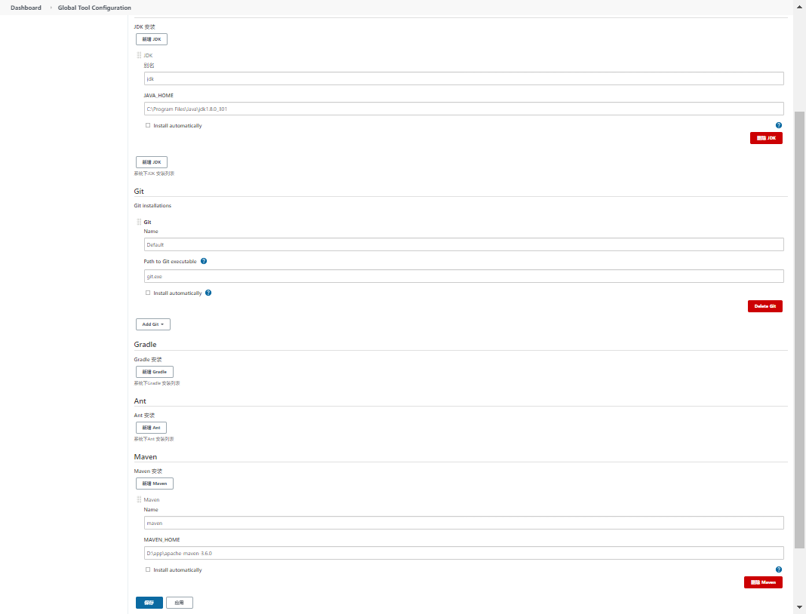

 

#  Jenkins使用

## 一、Jenkins使用前准备

### 1、安装

我使用的war包安装，直接放在tomcat工作目录中就可以了。

### 2、访问

1. 访问http://localhost:8080/jenkins/

2. 选择插件安装
3. 设置用户帐号及密码
4. 全局配置

#### 1）全局配置

> manage Jenkins > Group Tools Configuration (全局配置)



主要配置jdk、maven及和git

#### 2）安装常用插件

1. role-based-authorization stategy插件
2.   Credentials Binding 凭证管理工具
   1. Username with password: 用户名和密码
   2. SSH Username with private key: 使用SSH用户和密钥
3. Git插件
4. Email Extension发邮件的插件

## 二、使用role-based-authorization stategy插件管理插件

> 需要安装role-based-authorization stategy插件

### 第1步：

> Manage Jenkins -> Configurate Global Securite(全局安全配置) -> 授权策略

在“授权策略”栏目中选择`Role-Based Strategy`后点击"保存"。


### 第2步：

> Manage Jenkins -> Manage and Assign Roles 


- Manage Rooles这个界面用于配置和管理角色


- Global roles 全局角色
- Item roles 项目角色
- Node roles 节点角色

**分别增加3个角色：**


其中baserole为全局角色；node1,和node2为项目角色：

node1管理的项目名称前缀为:`testfan`开头

node2管理的项目名称前缀为:`mtx`开头

### 第3步：设置用户

#### 1) 新建用户

>  Manage Jenkins -> Manage User 

创建`lily`和`jack`两个用户

!

#### 2) 给用户分配角色

> Manage Jenkins -> Manage and Assign Roles -> Assign Roles

如图操作


### 第4步：新建项目测试权限

....


## 三、Jenkins结合Git

### 第1步：添加一个凭证


这个凭证我使用了gitee.com下的一个项目：`https://gitee.com/s348149047/jenkins_demo.git`；所用户名及密码我使用gitee下的帐号信息。

### 第2步：创建项目和Git关联

> 当前步骤只创建了项目，和关联了git上的项目，并没有做其它工作，如图


上图只配置了“描述”、GitHubt项目Url和git地址等信息。后保存

### 第3步：构建项目

点击“构建”或"build now"会在github/gitee上接取代码，查询构建日志：

```sh
Started by user SuJingWei
Running as SYSTEM
Building in workspace C:\Users\34814\.jenkins\workspace\jenkins_demo
The recommended git tool is: NONE
using credential b7d065dc-a729-4454-86c3-658d0758d38e
Cloning the remote Git repository
Cloning repository https://gitee.com/s348149047/jenkins_demo.git
 > git.exe init C:\Users\34814\.jenkins\workspace\jenkins_demo # timeout=10
Fetching upstream changes from https://gitee.com/s348149047/jenkins_demo.git
 > git.exe --version # timeout=10
 > git --version # 'git version 2.33.0.windows.2'
using GIT_ASKPASS to set credentials sjw gitee.com 用户凭证
 > git.exe fetch --tags --force --progress -- https://gitee.com/s348149047/jenkins_demo.git +refs/heads/*:refs/remotes/origin/* # timeout=10
 > git.exe config remote.origin.url https://gitee.com/s348149047/jenkins_demo.git # timeout=10
 > git.exe config --add remote.origin.fetch +refs/heads/*:refs/remotes/origin/* # timeout=10
Avoid second fetch
 > git.exe rev-parse "refs/remotes/origin/master^{commit}" # timeout=10
Checking out Revision f1c9ff5f4cb70afeccc3d842a0dad4d69b008af7 (refs/remotes/origin/master)
 > git.exe config core.sparsecheckout # timeout=10
 > git.exe checkout -f f1c9ff5f4cb70afeccc3d842a0dad4d69b008af7 # timeout=10
Commit message: "abc"
First time build. Skipping changelog.
Finished: SUCCESS
```

可以看到代码被拉取到`C:\Users\34814\.jenkins\workspace\jenkins_demo`目录下

### 第4步：自动构建

 通过上面步骤，已确认可以使用构建项目了。但是还没有办法实现自动构建。点击项目的“配置”在**构建触发器**中加入如下配置


上面配置表示每3分钟触发一下构建

注意：jenkens有个小BUG`H/1 * * * *`表示1小时执行1次构建；

- 实际构建时，推送代码才会执行

