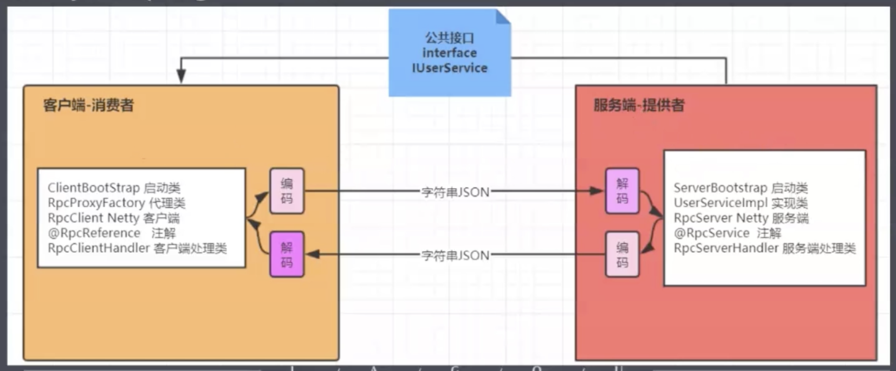

# Netty入门

Netty是一个开源的JBOSS的NIO框架，在NIO的基础上提供，高性能、高可靠性，高可用的网络IO框架

## 一、Netty整体设计

### 1、线程模型

#### （1）单线程模型

服务器端用一个线程通过多路复用搞掂所有的IO操作（包括连接，读，写等），编码简单，清晰明了，但是客户端连接数量较多，将无法支撑。

#### （2）线程池模型

服务器端采用一个线程池专门处理客户端连接请求，使用一个线程级负责IO操作，在绝大数据场景下，该模型能够满足使用。

#### （3）Netty模型

Netty抽象出两组线程池，BossGroup，专门负责接收客户端连接，WorkerGroup专门负责网络读写操作。NioEventLoop表示一个不断循环处理任务的线程，筱NioEventLoop都有一个selector，用于监听绑定在其上的socket网络通道。NioEventLoop内部采用串行化设计，从消息读取->处理->编码->发送，始终由IO线程NioEventLoop负责。

- 一个NioEventLoopGroup下包含多个NioEventLoop
- 每个NioEventLoop中包含有一个Selector，一个taskQueue
- 每个NioEventLoop的Selector上可以注册监听多个NioChannel
- 每个NioChannel只会绑定唯一的NioEventLoop上

### 2、异步模型

Netty的异步模型是建立在future和callback之上的。future，它的核心思想是：假设一个方法fun，计算过程可能非常耗时，等待fun返回显示不合适。那么可以在调用fun的时候，立即返回一个Future，后续可以通过Future去监控方法fun的处理过程。

在使用Netty进行编程时，拦截操作和转换出入站数据只需要你提供callback或利用future即可。这使得链式操作非常简单、高效，并有利于编写可重用的，通用的代码。

## 二、核心API

- **ChannelHandler**及其实现类
  - channelActive 通道就绪事件
  - channelRead 通道读取数据事件
  - channelReadComplete 数据读取完毕事件
  - exceptionCaugth 通道发生异常事件

- **Pipeline和ChannelPipeline**
  - ChannelPipeline是一个Headler的集合，负责处理和拦截inbound或者outbound的事件和操作，相当于一个贯穿Netty的链
    - addFirst(ChannelHandler ... handlers)，把一个业务处理类(handler)添加到链中的第一个位置
    - addLast(ChannelHandler ... handlers)，把一个业务处理类(handler)添加到链中的最后一个位置

- **ChannelHandlerContext** 这是事件处理器上下文对象，Pipeline链中的实际处理节点。每个节点ChannelHandlerContext中包含一个具体的事件处理器ChannelHandler，同时ChannelHandlerContext中也绑定了对应的pipeline和Channel的信息，方便对ChannelHandler进行调用。常用方法如下：
  - ChannelFuture close() 关闭通道
  - ChannelOutboundInvoker flush() 刷新
  - writeAndFlush(Object msg)，将数据写到ChannelPipeline中并刷新
- **ChannelOption** Netty在创建Channel实例后，一般都需要设置ChannelOption参数
  - ChannelOption.SO_BACKLOG 对应TCP/IP协议listen函数中的backlog参数，用来初始化服务器可连接队列大小。服务务端处理客户端连接请求是顺序处理的，所以同一时间只能处理一个客户端连接。多个客户端来的时候，服务端将不能处理客户端连接请求放在队列中等待处理，backlog参数指定了队列的大小。
  - ChannelOption.OS_KEEPALIVE，一直保持连接活动状态
- **ChannelFuture** 表示Channel中异步 I/O操作结果，在Netty中所有的I/O操作都是异步的，I/O的调用会直接返回，调用者并不能立刻获得结果，但是可以通过ChannelFuture为获取I/O操作的处理状态。常用方法如下：
  - channel(), 返回当前下正在进行I/O操作的通道
  - sync()，等待异步操作执行完毕
- **EventLoopGroup**（线程组）和其实现类NioEventLoopGroup，是一组EvntLoop的抽象，Netty为了更好的利用多核CPU资源，一般会有多个EventLoop同时工作，每个EventLoop维护着一个Selector实现。EventLoopGroup提供next接口，可以从组里按照一定规则 获取其中一个EventLoop来处理任务。在Netty服务端编程中，我们一般都需要提供两个EventLoopGroup，例如：BossEventLoop负责接收客户端连接并将SocketChannel交给WorkerEventLoopGroup来进行IO处理。

- **ServerBootstrap**和**Bootstrap**，ServerBootstrap是Netty中的服务器启动助手，通过它可以完成服务器端的各种配置；Bootstrap是Netty中的客户端启动助手，通过它可以完成客户端的启动配置。常用方法如下：
  - group(EventLoopGroup parentGroup,EventLoopGroup childGroup)，该方法用于服务器端，用来设置两个EventLoop
  - group(EventLoopGroup group)， 该方法用于客户端，用来设置一个EventLoop
  - channel(Class<? extends C> channelClass)，用来设置服务器端的通道实现。
  - option(ChannelOption<T> option, T value)用来给ServerChannel添加配置
  - childOption(ChannelOption<T> childOption, T value)，用来给接收到的通道添加配置。
  - childHandler(ChannelHandler childHandler)，该方法用来设置业务处理类(自定义的handler)
  - bind(int inetPort)，该方法用于服务器端，用来设置占用端口号
  - connect(String inetHost, int inetPort)，用于客户端，用来连接服务器端
- **Unpooled**类，这是Netty提供一个专门用来操作缓冲区的工具类，常用方法如下所示
  - copiedBuffer(CharSequence string, Charset charset)，通过给定的数据和字符编码返回ByteBuf对象（类似于的ByteBuffer对象）

## 三、入门案例

### 1、服务器端

**Handler业务处理类：**

```java
/**
 * 服务器端业务处理类
 */
public class NettyServerHandler extends ChannelInboundHandlerAdapter {
    /**
     * 读数据
     * @param ctx
     * @param msg
     * @throws Exception
     */
    @Override
    public void channelRead(ChannelHandlerContext ctx, Object msg) throws Exception {
        System.out.println("Server: " + ctx);
        ByteBuf buf = (ByteBuf) msg;
        System.out.println("客户端发来的消息：" + buf.toString(CharsetUtil.UTF_8));
    }

    /**
     * 读完数据
     * @param ctx
     * @throws Exception
     */
    @Override
    public void channelReadComplete(ChannelHandlerContext ctx) throws Exception {
        // 给客户端回复数据
        ctx.writeAndFlush(Unpooled.copiedBuffer("就是没有钱", CharsetUtil.UTF_8));
    }

    /**
     * 出现异常
     * @param ctx
     * @param t
     * @throws Exception
     */
    @Override
    public void exceptionCaught(ChannelHandlerContext ctx, Throwable t) throws Exception {
        ctx.close(); // 关闭通道，关闭上下文的时候就会关闭到通道
    }
}
```

**服务端入口类：** 

```java
/**
 * 基于Netty的服务器端
 */
public class NettyServer {
    public static void main(String[] args) throws InterruptedException {
        NioEventLoopGroup bossGroup = new NioEventLoopGroup();  // 接收客户端连接
        NioEventLoopGroup workerGroup = new NioEventLoopGroup();  // 处理网络请求
        // 创建服务器端启动服务助手
        ServerBootstrap b = new ServerBootstrap();
        // 设置两个线程组
        b.group(bossGroup, workerGroup)
                // Netty底层使用NioServerSocketChannel作为服务器端的实现
                .channel(NioServerSocketChannel.class)
                // 设置线程队列中等待个数
                .option(ChannelOption.SO_BACKLOG, 128)
                // 设置连接的活动状态
                .childOption(ChannelOption.SO_KEEPALIVE, true)
                // 创建一个通道初始化对象
                .childHandler(new ChannelInitializer<SocketChannel>() {
                    @Override
                    protected void initChannel(SocketChannel socketChannel) throws Exception {
                        // todo 往Pipeline链中添加自定义的业务处理类，可以加入多个处理类
                        socketChannel.pipeline().addLast(new NettyServerHandler());
                    }
                });
        System.out.println("...... Server is Ready ......");
        ChannelFuture cf = b.bind(9999).sync();// 绑定商品，非阻塞
        System.out.println("...... Server is Starting ......");
        // 关闭通道，关闭线程组
        cf.channel().closeFuture().sync(); // 异步关闭
        bossGroup.shutdownGracefully();    // 关闭线程组
        workerGroup.shutdownGracefully();  // 关闭线程组
    }
}
```

### 2、客户端

**Handler业务处理类：**

```java
/**
 * 客户端业务逻辑类
 */
public class NettyClientHandler extends ChannelInboundHandlerAdapter {
    /**
     * 通道就绪类
     * @param ctx
     * @throws Exception
     */
    @Override
    public void channelActive(ChannelHandlerContext ctx) throws Exception {
        System.out.println("Client: " + ctx);
        ctx.writeAndFlush(Unpooled.copiedBuffer("老板，还钱吧", CharsetUtil.UTF_8));
    }

    /**
     * 读数据
     * @param ctx
     * @param msg
     * @throws Exception
     */
    @Override
    public void channelRead(ChannelHandlerContext ctx, Object msg) throws Exception {
        ByteBuf buf = (ByteBuf) msg;
        System.out.println("服务器发来的消息： " + buf.toString(CharsetUtil.UTF_8));
    }
}
```

**客户端入口类：**

```java
/**
 * 基于Netty的客户端
 */
public class NettyClient {
    public static void main(String[] args) throws InterruptedException {
        NioEventLoopGroup group = new NioEventLoopGroup();
        Bootstrap b = new Bootstrap();
        b.group(group)
                // 设置客户端通道的实现类
                .channel(NioSocketChannel.class)
                .handler(new ChannelInitializer<SocketChannel>() {
                    @Override
                    protected void initChannel(SocketChannel socketChannel) throws Exception {
                        // todo往pipline链中添加自定义的handler自定义处理类
                        socketChannel.pipeline().addLast(new NettyClientHandler());
                    }
                });
        System.out.println("......Client is Ready......");
        ChannelFuture future = b.connect("127.0.0.1", 9999).sync();
        System.out.println("......Client is Starting......");
        // 关闭连接
        future.channel().closeFuture().sync();
        group.shutdownGracefully();
    }
}
```

## 四、聊天室案例

基于SpringBoot工程

### 1、Handler WebSocket 业务处理类

```java
@Component
@ChannelHandler.Sharable
public class ChatHandler extends SimpleChannelInboundHandler<TextWebSocketFrame> {

    @Autowired
    @Qualifier("channels")
    private ChannelGroup channels;

    /**
     * 广播方法
     *
     * @param ctx
     * @param msg
     * @throws Exception
     */
    @Override
    protected void channelRead0(ChannelHandlerContext ctx, TextWebSocketFrame msg) throws Exception {
        String content = msg.text();
        for (Channel channel : channels) {
            if(channel != ctx.channel()){
                channel.writeAndFlush(new TextWebSocketFrame(ctx.channel().remoteAddress().toString().substring(1) + " Say > "+ content));
            }else{
                channel.writeAndFlush(new TextWebSocketFrame("My Say > " + content));
            }
        }
    }


    @Override
    public void channelActive(ChannelHandlerContext ctx) throws Exception {
        channels.add(ctx.channel());
        for (Channel channel : channels) {
            if (ctx.channel() != channel)
                channel.writeAndFlush(new TextWebSocketFrame(ctx.channel().remoteAddress().toString().substring(1) + " > 进入聊天室"));
        }
    }

    @Override
    public void channelInactive(ChannelHandlerContext ctx) throws Exception {
        channels.remove(ctx.channel());
        for (Channel channel : channels) {
            if (ctx.channel() != channel)
                channel.writeAndFlush(new TextWebSocketFrame(ctx.channel().remoteAddress().toString().substring(1) + " > 退出聊天室"));
        }
    }
}
```

### 2、WebSocket服务器

```java
// 是一个配置类
@Configuration
public class ChatServer {

    @Autowired
    private ChatHandler chatHandler;

    @Bean(destroyMethod = "shutdownGracefully")
    public NioEventLoopGroup bossGroup(){
        return new NioEventLoopGroup();
    }

    @Bean(destroyMethod = "shutdownGracefully")
    public NioEventLoopGroup workerGroup(){
        return new NioEventLoopGroup();
    }

    @Bean(name = "channels")
    public ChannelGroup channels(){
        return new DefaultChannelGroup(GlobalEventExecutor.INSTANCE);
    }

    @Bean(name = "bootstrap")
    public ServerBootstrap bootstrap(){
        ServerBootstrap b = new ServerBootstrap();
        b.group(bossGroup(), workerGroup())
                .channel(NioServerSocketChannel.class)
                .childHandler(new ChannelInitializer<SocketChannel>() {
                    @Override
                    protected void initChannel(SocketChannel socketChannel) throws Exception {
                        socketChannel.pipeline().addLast(new HttpServerCodec());
                        socketChannel.pipeline().addLast(new ChunkedWriteHandler());
                        socketChannel.pipeline().addLast(new HttpObjectAggregator(65536));
                        socketChannel.pipeline().addLast(new WebSocketServerProtocolHandler("/websocket"));
                        socketChannel.pipeline().addLast(chatHandler);
                    }
                })
                .option(ChannelOption.SO_BACKLOG, 100)
                .childOption(ChannelOption.SO_KEEPALIVE, true);
        return b;
    }
}
```

### 3、Netty启动工具类

```java
@Component
public class ChatServerApplication {

    @Autowired
    @Qualifier("bootstrap")
    private ServerBootstrap bootstrap;

    private Channel channel;

    /**
     * 启动方法
     */
    public void start() {
        try {
            System.out.println("netty启动.绑定:8888端口...");
            channel = bootstrap.bind(8888).sync().channel().closeFuture().sync().channel();
        }catch (Exception e){
            e.printStackTrace();
        }
    }

    @PreDestroy
    public void close(){
        channel.close();
        channel.parent().close();
    }

}
```

### 4、SpringBoot启动类

```java
@SpringBootApplication
public class NettyChatApplication {
    public static void main(String[] args) {
        ConfigurableApplicationContext context = 
            SpringApplication.run(NettyChatApplication.class, args);
        // 启动webSocket服务
        context.getBean(ChatServerApplication.class).start();
    }
}
```

### 5、html5页面文件

```html
<!DOCTYPE html>
<html lang="en">
<head>
    <meta charset="UTF-8">
    <title>WebSocket Chat</title>
</head>
<body>
<script type="text/javascript">
    var socket;
    if(!window.WebSocket){
        window.WebSocket = window.MozWebSocket;
    }
    if(window.WebSocket){
        socket = new WebSocket("ws://localhost:8888/websocket");
        socket.onmessage = function (event) {
            var ta = document.getElementById('responseText');
            ta.value = ta.value + "\n" + event.data;
        }
        socket.onopen = function () {
            var ta = document.getElementById('responseText');
            ta.value = ta.value + "连接开启！";
        }
        socket.onclose = function () {
            var ta = document.getElementById('responseText');
            ta.value = ta.value + "连接关闭！";
        }
    }else{
        alert("浏览器不支持web socket");
    }

    function send() {
        if(!window.WebSocket){
            return;
        }
        if(socket.readyState == WebSocket.OPEN){
            var message = document.getElementById('message');
            socket.send(message.value);
            message.value = "";
        }else{
            alert("连接没有开启");
        }
    }
</script>

<form onsubmit="return false">
    <h3>SebSocket 聊天室：</h3>
    <textarea id="responseText" style="width: 600px; height: 200px;"></textarea>
    <br>
    <input type="text" id="message" name="message" value="Welcome to www.waylau.com">
    <input type="button" value="发送消息"  onclick="send();" />
    <input type="button" onclick="javascript:document.getElementById('responseText').value=''" value="清空聊天记录">
</form>
</body>
</html>
```

## 五、基于Netty实现的RPC

实现步骤：

1. 创建1个接口，定义抽象。用于消费者和提供者之间的约定；
2. 创建1个提供者，该类需要监听消费者的请求賆按照约定返回数据；
3. 创建1个消费者，该类需要透明的调用自己不存在的方法，内部需要使用Netty进行数据通信；
4. 提供者与消费者数据传输使用JSON字符串数据格式
5. 使用Netty集群Spring Boot环境实现



