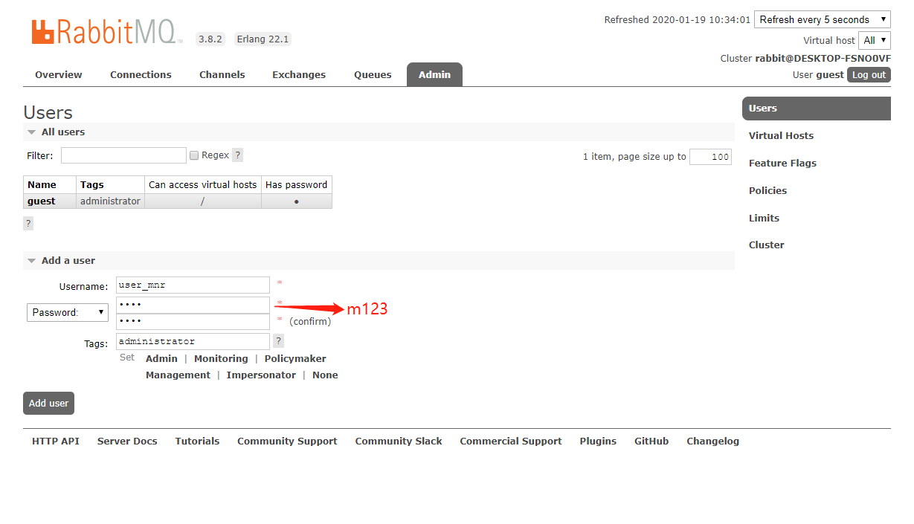
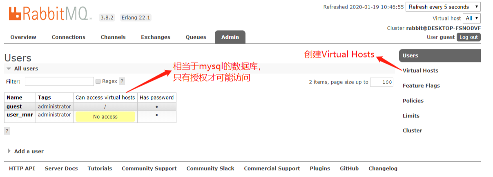
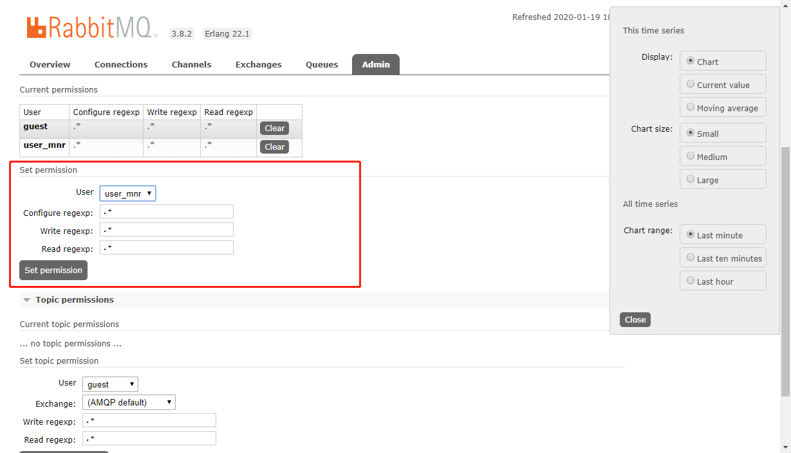
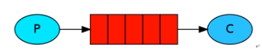
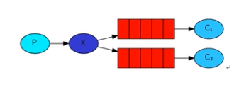
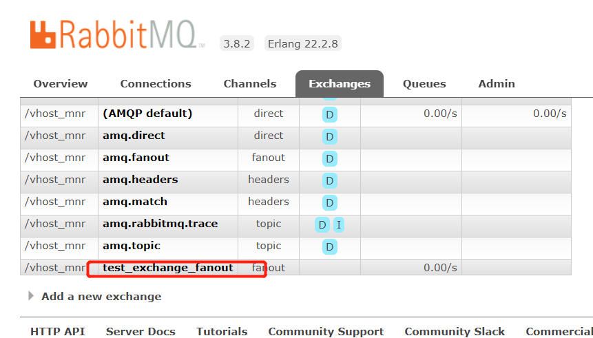
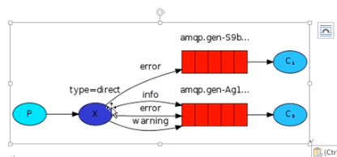
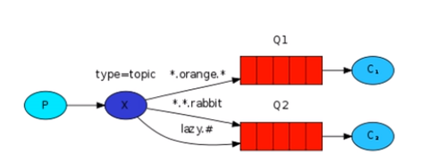

# RabbitMQ 基础入门

## 一、安装

### 1、基于windows安装

#### 1）安装Erlang

**官网**

```shell
https://www.erlang.org/
# 下载地址
http://erlang.org/download/otp_win64_22.1.exe
# 下一步，下一步
```

#### 2) 安装RabbitMQ

**官网**

```shell
https://www.rabbitmq.com/
```

#### 3）启动

```shell
../bin > rabbitmq-plugins enable rabbitmq_management
```

**打开浏览器**

```shell
localhost:15672
```

**windows系统如果无法开启**

> 把 <b>用户/AppData/Roaming/RabbitMQ/db</b>目录下的文件删除，再<span style="color:blue">重新安装RabbitMQ</span>

### 2、Unix安装

#### 1）yum源安装

##### (1)、安装EPEL源

```shell
yum update
yum install epel
```

##### (2)、安装Erlang

```shell
rpm -Uvh http://packages.erlang-solutions.com/erlang-solutions-1.0-1.noarch.rpm

yum -y install erlang
```

##### (3)、安装RabbitQM(CentOS7.XX)

```shell
wget http://www.rabbitmq.com/releases/rabbitmq-server/v3.6.1/rabbitmq-server-3.6.1-1.noarch.rpm

yum install rabbitmq-server-3.6.1-1.noarch.rpm
```

#### 2）用户配置

```shell
# 启动服务
systemctl start rabbitmq-server
# 查看服务
rabbitmqctl status
# 添加用户
rabbitmqctl add_user admin admin  # 用户名和密码都是"admin"
# 添加管理员权限
rabbitmqctl set_user_tags admin administrator
# 修改密码
rabbitmqctl add_user admin youpassword
# 设置权限
rabbitmqctl set_permissions -p '/' admin '.*' '.*' '.*'
```

#### 3）启动WEB管理

```shell
# 删除guest,可以不删除 #
rabbitmqctl delete_user guest

# 启动Web服务 #
# 编辑rabbitmq.config文件
vi /etc/rabbitmq/rabbitmq.config
# 输出以下内容
[{rabbit, [{loopback_users, []}]}].
# 重启rabbitmq服务
systemctl restart rabbitmq-server
# 启动web服务
rabbitmq-plugins enable rabbitmq_management

# 访问 #
http://localhost:15672
```

### 3、用户管理界面

登录地址：`http://localhost:15672`

用户名/密码：`guest/guest`

#### 1）创建用户



#### (1) Virtual Hosts

相当于mysql中的数据库，只有授权后才可以访问



**添加** 

Virtual Hosts通常以`/`开头


**对用户进行授权**

点击`user_mnr`（刚创建的Virtual Hosts）进入管理页面



## 二、基本使用

引入依赖

```xml
<dependencies>
        <dependency>
            <groupId>com.rabbitmq</groupId>
            <artifactId>amqp-client</artifactId>
            <version>4.0.2</version>
        </dependency>

        <dependency>
            <groupId>org.slf4j</groupId>
            <artifactId>slf4j-log4j12</artifactId>
            <version>1.7.5</version>
        </dependency>

        <dependency>
            <groupId>log4j</groupId>
            <artifactId>log4j</artifactId>
            <version>1.2.17</version>
        </dependency>

        <dependency>
            <groupId>junit</groupId>
            <artifactId>junit</artifactId>
            <version>4.11</version>
        </dependency>
    </dependencies>
```

### 1、简单队列 Simple Queue



缺点：耦合性高，生产者和消费者一一对应，如果想要有多个消费者，就不行了；队列名称变更时，消费者也要变更。

#### 1）生产者

```java
/**
 * 生产者
 */
public class Send {
    // 队列名称
    private static final String QUEUE_NAME = "test_simple_queue";

    public static void main(String[] args) throws IOException, TimeoutException {
        // 连接rabbitMQ
        com.rabbitmq.client.Connection connection = 
            ConnectionUtil.getConnection();
        // 创建通道
        com.rabbitmq.client.Channel channel = 
            connection.createChannel();
        // 创建队列声明
        channel.queueDeclare(QUEUE_NAME, false, false, false, null);

        String msg = "hello simple!";
        // 发送消息
        channel.basicPublish("", QUEUE_NAME, null, msg.getBytes());

        channel.close();
        connection.close();
    }
}
```

#### 2）消费者

```java
/**
 * 消费者
 */
public class Recv {
    // 队列名称
    private static final String QUEUE_NAME = "test_simple_queue";

    public static void main(String[] args) throws IOException, TimeoutException {
        // 连接rabbitMQ
        com.rabbitmq.client.Connection connection = 
            ConnectionUtil.getConnection();
        // 创建通道
        com.rabbitmq.client.Channel channel = 
            connection.createChannel();
        // 创建队列声明
        channel.queueDeclare(QUEUE_NAME, false, false, false, null);
        // 监听队列消息，线程阻塞
        channel.basicConsume(QUEUE_NAME, true, new DefaultConsumer(channel){
            @Override
            public void handleDelivery(String consumerTag, 
                                       Envelope envelope, 
                                       AMQP.BasicProperties properties, 
                                       byte[] body) throws IOException 
            {
                // super.handleDelivery(consumerTag, envelope, properties, body);
                String msgString = new String(body, "utf-8");
                System.out.println(msgString);
            }
        });
    }
}
```

### 2、工作模式 Work Queue


注意：**消费者1**和**消费者2**处理的消息是一样多，消费者1处理的是**耦数**，消费者2处理的是**奇数**，这种方式也叫：<span style="color:blue;">轮询分发(round-robin)</span>

和**轮询分发**不一样的是**公平分发**——谁有空就谁多消费队列中的消息

#### 1) 轮询分发

##### (1）生产者

- 和**Simple Queue模式**一样

```java
/**
 * 生产者
 *                      |--- C1
 * P ------ QUEUE ------|--- C2
 *                      |--- C3
 */
public class Send {
    // 队列名称
    private static final String QUEUE_WORK = "test_work_queue";

    public static void main(String[] args) 
    throws IOException, TimeoutException, InterruptedException 
    {
        Connection connection = ConnectionUtil.getConnection();
        Channel channel = connection.createChannel();
        channel.queueDeclare(QUEUE_WORK, false, false, false, null);
        for (int i = 0; i < 50; i++) {  // 发50条
            String msg = "hello " + i;
            channel.basicPublish("", QUEUE_WORK, null, msg.getBytes());
            System.out.println("send: " + msg);
            Thread.sleep(i * 20);
        }
        channel.close();
        connection.close();
    }
}
```

##### (2）消费者

- 和**Simple Queue模式**一样

**C1 消费者 1**

```java
/**
 * 消费者 1
 */
public class Recv1 {
    private static final String QUEUE_WORK = "test_work_queue";
    public static void main(String[] args) throws IOException, TimeoutException {
        Connection connection = ConnectionUtil.getConnection();
        Channel channel = connection.createChannel();
        // 声明队列
        channel.queueDeclare(QUEUE_WORK, false, false, false, null);

        boolean autoAck = true;

        // 监听队列
        channel.basicConsume(QUEUE_WORK, autoAck, new DefaultConsumer(channel){
            @Override
            public void handleDelivery(String consumerTag, Envelope envelope, AMQP.BasicProperties properties, byte[] body) throws IOException {
                //super.handleDelivery(consumerTag, envelope, properties, body);
                String msg = new String(body, "UTF-8");
                System.out.println("[1] Recv msg:" + msg);
                try {
                    Thread.sleep(2000);  // TODO 2 秒
                } catch (InterruptedException e) {
                    e.printStackTrace();
                }
            }
        });
    }
}
```

**C2 消费者 2**

```java
// 监听队列
        channel.basicConsume(QUEUE_WORK, autoAck, new DefaultConsumer(channel){
            @Override
            public void handleDelivery(String consumerTag, Envelope envelope, AMQP.BasicProperties properties, byte[] body) throws IOException {
                //super.handleDelivery(consumerTag, envelope, properties, body);
                String msg = new String(body, "UTF-8");
                System.out.println("[2] Recv msg:" + msg);
                try {
                    Thread.sleep(1000);  // TODO 1 秒，只有这里和c1不一样
                } catch (InterruptedException e) {
                    e.printStackTrace();
                }
            }
        });
```

#### 2) 公平分发（重点）

##### (1）生产者

* 和轮询分发的生产者一样

##### (2）消费者

```java
/**
 * 消费者 1
 */
public class Recv1 {
    private static final String QUEUE_WORK = "test_work_queue";
    public static void main(String[] args) throws IOException, TimeoutException {
        Connection connection = ConnectionUtil.getConnection();
        final Channel channel = connection.createChannel();
        // 声明队列
        channel.queueDeclare(QUEUE_WORK, false, false, false, null);
        channel.basicQos(1); // TODO 每次只能接收一个消息
        boolean autoAck = false; // TODO 关闭消息自动确认(应答)

        // 监听队列
        channel.basicConsume(QUEUE_WORK, autoAck, new DefaultConsumer(channel){
            @Override
            public void handleDelivery(String consumerTag, Envelope envelope, AMQP.BasicProperties properties, byte[] body) throws IOException {
                String msg = new String(body, "UTF-8");
                System.out.println("[1] Recv msg:" + msg);
                try {
                    Thread.sleep(2000);
                } catch (InterruptedException e) {
                    e.printStackTrace();
                }finally {
                    channel.basicAck(envelope.getDeliveryTag(), false); // TODO 手动应答，应答后才台接下一个消息
                }
            }
        });
    }
}
```

##### autoAck知识点

`boolean autoAck = false; // 手动模式`，如果有一个消费者挂掉，就会交付给其他消费者，RabbitMQ支持消息应答，消费者发送一个消息应答给RabbitMQ这个消息我已经处理完成，你可以删除这个了。然后RabbitMQ就会删除内存中的消息。

- 如果RabbitMQ宕机，那么消息就会丢失。

**消息的持久化**

```java
// 把第二个参数改为: true 就可以
channel.queueDeclare(QUEUE_WORK, true, false, false, null);
```

**注意**：<u>RabbitMQ不允许对已存在的队列，进行重新定义</u>。需要要重新定义已存在的队列，只能先将其删除。

### 3、订阅模式 Queue



- 一个生产者，多个消费者
- 每一个消费者都有自己的队列
- 生产者没有直接把消息发送到队列，<u>而是发到交换机</u>，转发器exchange
- 每个<u>队列都要绑定到交换机</u>上
- 生产者发的消息经过交换机到达队列，就能实现一个消息被多个消费者消费
- 只有消费者才会有队列

#### 1) 生产者 publish

```java
public class Send {

    private static final String EXCHANGE_NAME = "test_exchange_fanout";

    public static void main(String[] args) throws IOException, TimeoutException 	{
        Connection connection = ConnectionRabbitMQUtils.getConnection();
        Channel channel = connection.createChannel();
        // todo 声明交换机，不再想向队列里发数据了
        // fanout 不处理路由键，只需要要绑定到交换机就可以转发到绑定交换机的队列上
        channel.exchangeDeclare(EXCHANGE_NAME, "fanout");

        // 发送消息
        String msg = "hello ps";
        // 指定要发送到那个交换机上
        channel.basicPublish(EXCHANGE_NAME, "", null, msg.getBytes()); 

        channel.close();
        connection.close();
    }
}

```

**注意**：这个时候会在交换机里看到 test_exchange_fanout，但是没有消息。因为交换机没有存储的能力（RabbitMQ只有队列有存储消息的能力）。



#### 2) 消费者 subscribe

- 接收消息的方式参考工作模式之公平分发

- 消费者1 和 消费者2要绑定的队列名称是不一样的，要绑定的交换机名称是一样的

##### (1) 消费者 1

```java
public class Recv1 {

    /**
     * 交换机名称
     */
    private static final String EXCHANGE_NAME = "test_exchange_fanout";

    /**
     * 队列名称
     */
    private static final String QUEUE_NAME = "test_queue_fanout_email";

    public static void main(String[] args) throws IOException, TimeoutException {
        Connection connection = ConnectionRabbitMQUtils.getConnection();
        final Channel channel = connection.createChannel();

        // 声明队列
        channel.queueDeclare(QUEUE_NAME, false, false, false, null);
        // 绑定队列到交换机上
        channel.queueBind(QUEUE_NAME, EXCHANGE_NAME, "");
        // 保证一次只消费一个消息
        channel.basicQos(1);

        // 第二参数：false-关闭自动应答
        channel.basicConsume(QUEUE_NAME, false, new DefaultConsumer(channel){
            @Override
            public void handleDelivery(String consumerTag, Envelope envelope, AMQP.BasicProperties properties, byte[] body) throws IOException {
                super.handleDelivery(consumerTag, envelope, properties, body);
                String msg = new String(body, "UTF-8");
                System.out.println("[1] - " + msg);
                try {
                    Thread.sleep(2000);
                } catch (InterruptedException e) {
                    e.printStackTrace();
                } finally {
                  channel.basicAck(envelope.getDeliveryTag(), false);
                }
            }
        });
    }
}

```

##### (1) 消费者 2

```java
public class Recv2 {

    /**
     * 交换机名称
     */
    private static final String EXCHANGE_NAME = "test_exchange_fanout";

    /**
     * 队列名称
     */
    private static final String QUEUE_NAME = "test_queue_fanout_sms";

    public static void main(String[] args) throws IOException, TimeoutException {
        Connection connection = ConnectionRabbitMQUtils.getConnection();
        final Channel channel = connection.createChannel();

        // 声明队列
        channel.queueDeclare(QUEUE_NAME, false, false, false, null);
        // 绑定队列到交换机上
        channel.queueBind(QUEUE_NAME, EXCHANGE_NAME, "");
        // 保证一次只消费一个消息
        channel.basicQos(1);

        // 第二参数：false-关闭自动应答
        channel.basicConsume(QUEUE_NAME, false, new DefaultConsumer(channel){
            @Override
            public void handleDelivery(String consumerTag, Envelope envelope, AMQP.BasicProperties properties, byte[] body) throws IOException {
                super.handleDelivery(consumerTag, envelope, properties, body);
                String msg = new String(body, "UTF-8");
                System.out.println("[2] - " + msg);
                try {
                    Thread.sleep(2000);
                } catch (InterruptedException e) {
                    e.printStackTrace();
                } finally {
                  channel.basicAck(envelope.getDeliveryTag(), false);
                }
            }
        });
    }
}
```


### 4、路由模式

发布者，`channel.exchangeDeclare(EXCHANGE_NAME, "fanout");`绑定到交换机上。第二个参数取值如下：

|        |                                                  |
| ------ | ------------------------------------------------ |
| fanout | 不处理路由键，只要和交换机绑定的队列都会收到消息 |
| direct | 路由模式                                         |
|        |                                                  |
|        |                                                  |

路由模式图片：



会路由到相匹配的 route key 的队列上，可以带上多个 route key，消费再在绑定交换机和队列的时候指定route key的值，可以通过多次绑定，来指定接收的路由。

#### 1）生产者 publish

```java
public class Send {
    public static final String EXCHANGE_NAME = "test_exchange_direct";
    public static void main(String[] args) throws IOException, TimeoutException {
        Connection connection = ConnectionRabbitMQUtils.getConnection();
        Channel channel = connection.createChannel();
        // 路由模式
        channel.exchangeDeclare(EXCHANGE_NAME, "direct");

        String msg = "hello direct";
        String routeKey = "info";  // 指定发送的route key
        channel.basicPublish(EXCHANGE_NAME, routeKey, null, msg.getBytes());

        channel.close();
        connection.close();
    }
}
```

#### 2）消费者 subscribe

##### （1）消费者 1

##### （2）消费者 2

```java
public class Recv2 {
    public static final String EXCHANGE_NAME = "test_exchange_direct";
    private static final String QUEUE_NAME = "test_queue_direct_2";

    public static void main(String[] args) throws IOException, TimeoutException {
        Connection connection = ConnectionRabbitMQUtils.getConnection();
        final Channel channel = connection.createChannel();
        // 声明队列
        channel.queueDeclare(QUEUE_NAME, false, false, false, null);
        channel.basicQos(1); // 每次只操作 1 个消息
        // todo 绑定的交换机上，并指定三个route key，那么就可以接收 route key 是这三个的消息
        channel.queueBind(QUEUE_NAME, EXCHANGE_NAME, "error");
        channel.queueBind(QUEUE_NAME, EXCHANGE_NAME, "info");
        channel.queueBind(QUEUE_NAME, EXCHANGE_NAME, "warning");

        channel.basicConsume(QUEUE_NAME, false, new DefaultConsumer(channel){
            @Override
            public void handleDelivery(String consumerTag, Envelope envelope, AMQP.BasicProperties properties, byte[] body) throws IOException {
                super.handleDelivery(consumerTag, envelope, properties, body);
                String msg = new String(body, "UTF-8");
                System.out.println("{2} - " + msg);
                try {
                    Thread.sleep(2000);
                } catch (InterruptedException e) {
                    e.printStackTrace();
                } finally {
                    channel.basicAck(envelope.getDeliveryTag(), false);
                }
            }
        });
    }
}
```

### 5、主题模式



将路由键和某模式匹配

* \# （井号）：可以匹配多个单词（或者零个）
* \* （星号）：可以（只能）匹配一个单词

```sh
# 如
Goods.#
```

#### 1）生产者

```java
public class Send {
    private static final String EXCHANGE_NAME = "test_exchange_topic";
    public static void main(String[] args) throws IOException, TimeoutException {
        Connection connection = ConnectionRabbitMQUtils.getConnection();
        Channel channel = connection.createChannel();
        // todo 指定交换机及 topic 模式
        channel.exchangeDeclare(EXCHANGE_NAME, "topic");

        // 发送， goods.add 为 route key
        String msg = "商品....";
        channel.basicPublish(EXCHANGE_NAME, "goods.add", null, msg.getBytes());

        channel.close();
        connection.close();
    }
}
```

#### 2）消费者

#### （1） 消费者 1

```java
public class Recv1 {
    private static final String EXCHANGE_NAME = "test_exchange_topic";
    private static final String QUEUE_NAME = "test_queue_topic_1";

    public static void main(String[] args) throws IOException, TimeoutException {
        Connection connection = ConnectionRabbitMQUtils.getConnection();
        final Channel channel = connection.createChannel();
        // 指定队列
        channel.queueDeclare(QUEUE_NAME, false, false, false, null);
        // 绑定队列到交互机上，并且 goods.add 写死
        channel.queueBind(QUEUE_NAME, EXCHANGE_NAME, "goods.add");

        channel.basicConsume(QUEUE_NAME, false, new DefaultConsumer(channel) {
            @Override
            public void handleDelivery(String consumerTag, Envelope envelope, AMQP.BasicProperties properties, byte[] body) throws IOException {
                super.handleDelivery(consumerTag, envelope, properties, body);
                String msg = new String(body, "UTF-8");
                System.out.println("(1) - " + msg);
                try {
                    Thread.sleep(2000);
                } catch (InterruptedException e) {
                    e.printStackTrace();
                } finally {
                    channel.basicAck(envelope.getDeliveryTag(), false);
                }
            }
        });
    }
}
```

#### （2）消费者 2

```java
public class Recv2 {
    private static final String EXCHANGE_NAME = "test_exchange_topic";
    private static final String QUEUE_NAME = "test_queue_topic_2";

    public static void main(String[] args) throws IOException, TimeoutException {
        Connection connection = ConnectionRabbitMQUtils.getConnection();
        final Channel channel = connection.createChannel();
        // 指定队列
        channel.queueDeclare(QUEUE_NAME, false, false, false, null);
        // 绑定队列到交互机上，并且 goods.add 写死
        channel.queueBind(QUEUE_NAME, EXCHANGE_NAME, "goods.#");

        channel.basicConsume(QUEUE_NAME, false, new DefaultConsumer(channel) {
            @Override
            public void handleDelivery(String consumerTag, Envelope envelope, AMQP.BasicProperties properties, byte[] body) throws IOException {
                super.handleDelivery(consumerTag, envelope, properties, body);
                String msg = new String(body, "UTF-8");
                System.out.println("(2) - " + msg);
                try {
                    Thread.sleep(2000);
                } catch (InterruptedException e) {
                    e.printStackTrace();
                } finally {
                    channel.basicAck(envelope.getDeliveryTag(), false);
                }
            }
        });
    }
}
```

### 6、RPC模式

略。