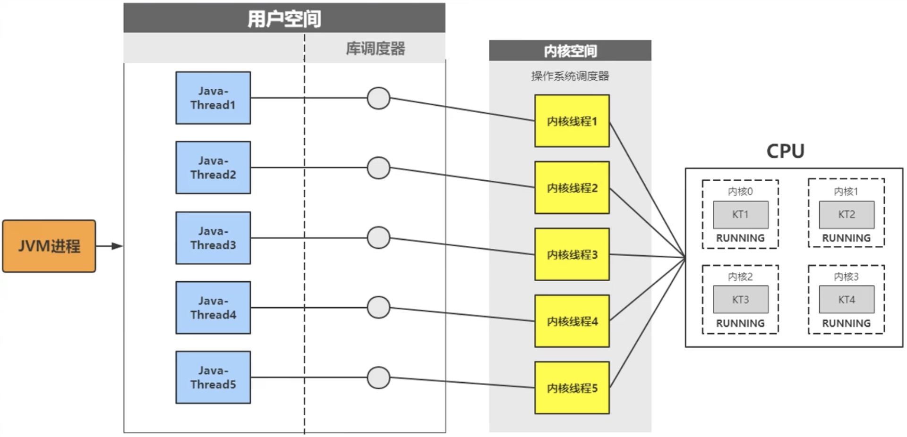

# 亿级流量电商网站微服务架构详解

## 一、Java线程理解

### 1、线程与进程

线程是调度系统资源的最少单元。线程是调度CPU的最少单元，也叫轻量级进程(Light Weight Process)，在一个进程里可以创建多个线程，每个线程都拥有各自的计数器、堆栈和局部变量等属性，并能够访问共享的内存变量。 

### 2、Java线程的类型

#### 1) 用户线程(ULT)

<u>在用户程序中实现的线程，不依赖操作系统核心</u>，应用进程利用线程库提供创建、同步、调度管理线程的函数来控制用户线程。<b style="color:deeppink;">不需要用户态/核心切换，速度快</b>。操作系统内核不知道多线程的存在，因此一个线程阻塞将使得整个进程阻塞。

#### 2) 内核线程(KLT)

- jvm使用的是内核线程

<u>线程所有管理由操作操作系统内核完成，内核保存线程的状态和上下文信息</u>，线程阻塞不会引起进程阻塞。<b style="color:deeppink;">在多处理器系统上内核可以分派属性于同一进程的多个线程在多个处理器上运行</b>。线程的创建、调度和管理由内核完成，相对ULT要慢，但比进程的创建和管理操作要快。

当用户创建线程的时候，OS会分配(p_thread相关资源)

#### 3) 线程资源调度

java线程创建是依赖于系统内核，通过JVM调用系统库创建内核线程，内核线程与Java-Thread是1:1的映射关系。



## 二、线程池

每创建一个线程，jvm都会调用os的“库调度器”，再调用"内核空间"，才能使用CPU资源。会影响性能。线程池的使用可以先生成线程，再进行调度。

线程是一种稀有资源，它的创建销毁是一个相对偏重且销耗资源的操作，而java线程依赖于内核心线程，其线程的创建需要进行<b style="color:deeppink;">操作系统状态切换</b>，为避免资源过度消耗，需要设法<b style="color:deeppink;">重用线程</b>，执行多个任务。线程池就是一个线程的缓存，负责对线程进行统一分配、调优与监控。

### 1、什么时候使用线程池?

- 单个任务处理时间短
- 需要处理的任务数量大

### 2、线程池

```java
public class TheadDemo {
    public static void main(String[] args) {
        ThreadPoolExecutor pool = new ThreadPoolExecutor(2, 2, // 核心线程数及最大线程数
                60, // 最大空闲时间，空闲时间超过
                TimeUnit.SECONDS,  // 最大空闲时间的单位
                /*
                    如果有线程向下面队列取数据，而队列为空，就会阻塞，
                    阻塞到上面参数设置的超时时间，就会放弃当前线程。
                 */
                new ArrayBlockingQueue<Runnable>(5), // 用于存储任务的队列(阻塞),并指定队列大小
                // 可以在这里重写拒绝队列，让拒绝的任务重新入队
                Executors.defaultThreadFactory());
        for (int i=0;i<7;i++){
            pool.execute(new Task(i));
        }
    }

    public static class Task implements Runnable {
        private int nov;
        public Task(int i) {
            this.nov = i;
        }
        @Override
        public void run() {
            System.out.println("执行当前任务的线程是：" + Thread.currentThread().getName());
            try {
                Thread.sleep(2000);
            } catch (InterruptedException e) {
                e.printStackTrace();
            }
            System.out.println("我是任务：" + nov + "我在执行...");
        }
    }
}
```

**队列的类型**

- ArrayBlockingQueue 有界队列

- LinkedBlickingQueue 无界队列，但最大值为 Integer.MAX，其实也是有值的

### 3、关闭线程后，提交的任务是否会执行？

* ThreadPoolExecutor.shutdown() 关闭任务前，提交到线程池中的任务还会执行
* ThreadPoolExecutor.shutdownNow() 所有的线程都会关闭

