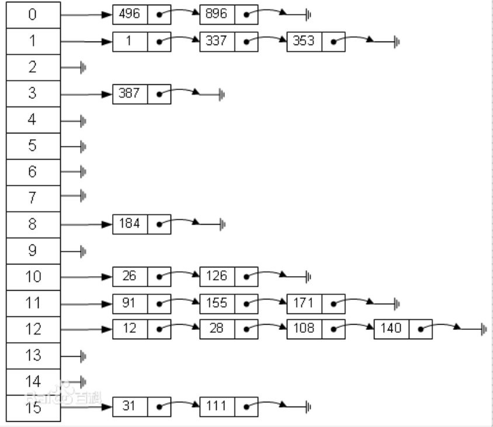
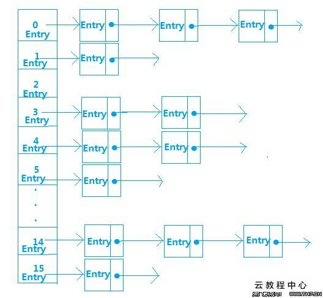

# HashMap原理分析

## 一、HashMap的数据结构

数据结构中有数组和链表来实现对数据的存储，但这两者基本上是两个极端。

### 1、数组

数组存储区间是连续的，占用内存严重，故空间复杂的很大。但数组的二分查找时间复杂度小；**数组**的特点是：寻址容易，插入和删除困难；

### 2、链表

链表存储区间离散，占用内存比较宽松，故空间复杂度很小，，达O（N）；**链表**的特点是：寻址困难，插入和删除容易。

### 3、哈希表

那么我们能不能综合两者的特点，做出一种寻址容易，插入、删除也容易的结构？<b style="color:deeppink;">哈希表(Hash table)</b>就是既满足了数据的查找方便，同时不占用太多的内容空间，使用也十分方便。

<u>哈希表有多种实现方式</u>，接下来解释最常用的一种方式——<b style="color:deeppink;">拉链法</b>，我们可以理解为“**链表的数组**”，如图:



从上图我们可以发现哈希表是由**数组+链表**组成的，一个长度为16的数组中，每个元素存储的是一个链表的结点。那么这些元素是按照什么样的规则存储到数组中？一般情况是通过`hash(key)%len`获取，也就是元素的key的哈希值的数组长度取模得到。比如上述哈希表中，`12%16=12`，`28%16=12`，`108%16=12`，`140%16=12`。所以12、28、108、140都存储在数组下标为12的位置。

HashMap其实也是一个线性的数组实现的，所以可以理解为其存储数据的容器就是一个线性数组。这可能让我们很不解，一个线性数组怎么实现按键值对来存储数据呢？



首先HashMap里面实现一个静态内部类`Entry`，其重要的属性有`key`、`value`、`next`，从属性key，value我们可以很明显的看出`Entry`就是HashMap键值对实现的一个基础bean，我们上面说到HashMap的基础就是一个线性数组，这个数组就是`Entry[]`，Map里面的内容都保存在`Entry[]`里。

```java
/**
* The table, resized as neccssary. Length MUST Always be a power of tow.
*/
transient Entry[] table;
```

## 二、HashMap的存取实现

既然是线性数组，为什么能随机存取？这里HashMap用了一个小算法，大致是这样实现：

**存值:**

```java
int hash = key.hashCode();  // 一定是int 类型
int index = hash % Entry[].length;
Entry[index] = value;
```

**取值:**

```java
int hash = key.hashCode();
int index = hash % Entry[].length;
return Entry[index]
```

### 1、put

> 疑问：如果两个key通过`hash % Entry[].length`得到的index相同，会不会覆盖？

这里HashMap里面用到链式数据结构的一个概念。上面我们提到过Entry类里有一个next属性，作用是指向下一个Entry。打个比方， 第一个键值对A进来，通过计算其key的hash得到的index=0，记做:Entry[0] = A。一会后又进来一个键值对B，通过计算其index也等于0，现在怎么办？HashMap会这样做:*B.next = A*,Entry[0] = B,如果又进来C,index也等于0,那么*C.next = B*,Entry[0] = C；这样我们发现index=0的地方其实存取了A,B,C三个键值对,他们通过next这个属性链接在一起。所以疑问不用担心。**也就是说数组中存储的是最后插入的元素**。到这里为止，HashMap的大致实现，我们应该已经清楚。

```java
public V put(K key, V value) {
  if (key == null) {
    return putForNullKey(value);
  }
  int hash = hash(key.hashCode());
  int index = indexFor(hash, table.length);
  // 遍历链表
  for (Entry<K, V> c = table[i]; c != null; c = c.next) {
    Object k;
    // 如果key在链表中已存在，则替换为新value
    if (c.hash == hash && ((k = c.key) == key || key.equals(k))) {
      V oldValue = c.value;
      c.value = value;
      c.recordAccess(this);
      return oldValue;
    }
  }
  modCount++;
  addEntry(hash, key, value, index);
  return null;
}


private void addEntry(int hash, K key, V value, int bucketIndex) {
  Entry<K, V> e = table[bucketIndex];
  // 参数 e 是Entry.next
  table[bucketIndex] = new Entry<K, V>(hash, key, value, e);
  // 如果size超过threshold，则扩充table大小。再散列
  if (size++ >= threshold) {
    resize(2 * table.length);
  }
}
```

当然HashMap里面也包含一些优化方面的实现，这里也说一下。比如：Entry[]的长度一定后，随着map里面数据的越来越长，这样同一个index的链就会很长，会不会影响性能？HashMap里面设置一个因子，随着map的size越来越大，Entry[]会以一定的规则加长长度。

### 2、get

```java
 public V get(Object key) {
        if (key == null)
            return getForNullKey();
        int hash = hash(key.hashCode());
        //先定位到数组元素，再遍历该元素处的链表
        for (Entry<K,V> e = table[indexFor(hash, table.length)];
             e != null;
             e = e.next) {
            Object k;
            if (e.hash == hash && ((k = e.key) == key || key.equals(k)))
                return e.value;
        }
        return null;
}
```

### 3、确定数组index：hashcode % table.length取模

HashMap存取时，都需要计算当前key应该对应Entry[]数组哪个元素，即计算数组下标；算法如下：

```java
/**
* Returns index for hash code h.
*/
static int indexFor(int h, int length) {
    return h & (length-1);
}
```

按位取并，作用上相当于取模mod或者取余%。

## 三、解决hash冲突的办法

 

1. 开放定址法（线性探测再散列，二次探测再散列，伪随机探测再散列） 
2. 再哈希法 
3. <b style="color:deeppink;">链地址法</b> 
4. 建立一个公共溢出区 

Java中hashmap的解决办法就是采用的链地址法。

## 四、再散列rehash过程

当哈希表的容量超过默认容量时，必须调整table的大小。当容量已经达到最大可能值时，那么该方法就将容量调整到Integer.MAX_VALUE返回，这时，需要创建一张新表，将原表的映射到新表中。

```java
 /**
     * Rehashes the contents of this map into a new array with a
     * larger capacity.  This method is called automatically when the
     * number of keys in this map reaches its threshold.
     *
     * If current capacity is MAXIMUM_CAPACITY, this method does not
     * resize the map, but sets threshold to Integer.MAX_VALUE.
     * This has the effect of preventing future calls.
     *
     * @param newCapacity the new capacity, MUST be a power of two;
     *        must be greater than current capacity unless current
     *        capacity is MAXIMUM_CAPACITY (in which case value
     *        is irrelevant).
     */
    void resize(int newCapacity) {
        Entry[] oldTable = table;
        int oldCapacity = oldTable.length;
        if (oldCapacity == MAXIMUM_CAPACITY) {
            threshold = Integer.MAX_VALUE;
            return;
        }
        Entry[] newTable = new Entry[newCapacity];
        transfer(newTable);
        table = newTable;
        threshold = (int)(newCapacity * loadFactor);
    }

 

    /**
     * Transfers all entries from current table to newTable.
     */
    void transfer(Entry[] newTable) {
        Entry[] src = table;
        int newCapacity = newTable.length;
        for (int j = 0; j < src.length; j++) {
            Entry<K,V> e = src[j];
            if (e != null) {
                src[j] = null;
                do {
                    Entry<K,V> next = e.next;
                    //重新计算index
                    int i = indexFor(e.hash, newCapacity);
                    e.next = newTable[i];
                    newTable[i] = e;
                    e = next;
                } while (e != null);
            }
        }
    }
```

